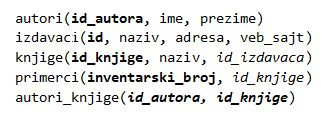

Примери релационих база података
================================

Као што сам назив каже, централна тема и фокус овог предмета су релационе базе података, па ће се у свим лекцијама и примерима у овом курсу детаљно објашњавати њихова организација, коришћење упита за добијање тражених информација и прављење извештаја. Подразумева се да свако ко приступи овом курсу има неко основно знање из програмирања, и у овом курсу се неће детаљно објашњавати декларација променљивих, изрази, наредбе, гранања и циклуси. Знање из програмирања усвојено кроз друге курсеве ће се применити да би се креирали програми који користе базе података. Приликом креирања ових програма, најважније је правилно формирање команди упитног језика SQL, којима се приступа бази и које су угњеждене у програм.

Важно је да се сви планирани концепти усвоје у практичном раду на неколико различитих база података. Кроз практичан рад се најбоље разуме потреба да се креирају базе података и где се оне све користе. Примери који следе у материјалима илуструју ситуације из живота у којима се ради са великим количинама података.

Кроз део базе података за библиотеку која је као пример дата у материјалима за трећи разред поновиће се основни принципи организације података који се чувају, начин на који се подаци распоређују у различите табеле и разлози зашто се то ради. Нагласићемо неопходност да се смањи непотребно чувања истог податка на више места, на пример, нећемо све податке о издавачу (назив, адреса, телефон, веб-сајт...) чувати уз податке о сваком примерку сваке књиге тог издавача коју имамо у библиотеци. Не само да би тиме непотребно оптеретили меморију, већ може да дође до грешке, посебно у ситуацијама када треба да се подаци измене, а имамо их сачуване на много места. Како су подаци распоређени у више табела, посебна пажња мора да се посвети повезивању табела системом страних и примарних кључева.

Следи списак табела које чине овај део базе података у којем се чувају подаци о свим књигама у библиотеци. Претпоставка је да библиотека све примерке једне књиге увек набавља од истог издавача. Примарни кључеви су истакнути болд, а страни италик.

Поред ове базе података, биће креиране и следеће базе:

- комплетна база података за библиотеку са 10 табела,
- база података за евиденцију издатих возачких дозвола, 
- база података за продајни салон аутомобила,
- база података за колекцију филмова (део базе неке онлајн платформе за пуштање филмова).

У материјалима се налазе и већ креирани дијаграми ентитета и веза за још три базе података који су дати као основа за задатке за самосталан рад:

- база података за продавницу (део о производима, произвођачима, категоријама и ценама),
- база података за компанију за продају дигиталних композиција, 
- база података за домаће задатке. 

**Материјали не морају да се читају редом**. Могуће је, на пример, узети део базе података у којем се чувају подаци о свим књигама у библиотеци који има пет табела. Када се заврши анализа саме базе и прођу сви примери упита над њом у оквиру првог поглавља „Релационе базе података“, могу да се прескоче примери осталих база и да се пређе на примере са истом базом у другом поглављу „Писање програма унутар СУБП-а“, а затим одмах и на примере са истом базом у трећем поглављу „Писање програма у програмском језику вишег нивоа“. Након тога је могуће на исти начин урадити и примере са базом података за евиденцију издатих возачких дозвола и базу података за колекцију филмова. 
