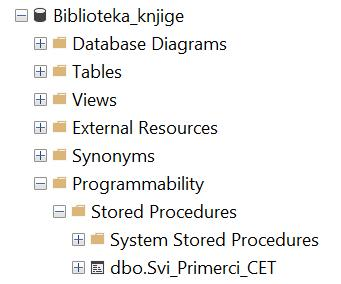

Практичан и пројектни рад
=========================

На крају курса се налази пројектни задатак. Први део пројектног задатка подразумева пројектовање базе, тј. да се на основу сценарија креира дијаграм ентитета и веза (ЕРД) са пратећом документацијом. На основу креираног модела је потребно направити базу података. Други део пројектног задатка подразумева да се направи рачунарски програм који користи креирану базу података. У програму је потребно обезбедити разноврсне анализе и обраде података употребом различитих могућности упита SELECT.

Опис овог пројектног задатка одговара корацима које морамо да урадимо кад год разматрамо и решавамо сложенији проблем разбијајући га на мање потпроблеме. У складу са тим су организовани и комплетни материјали овог курса и сви примери практичног рада од почетних лекција надаље. 

Сваки пут када имамо потребу да креирамо програм који ради са подацима, морамо процес решавања да започнемо пажљивим пројектовањем, а затим и креирањем базе података. 

Након што имамо базу података, следи креирање програма, а то је процес који раздвајамо на два дела: 
- анализа података писањем упита SELECT или формирање неке друге команде језика SQL,
- писање програма који користи креирану базу у који је укључен претходно формиран упит SELECT или више команди језика SQL. 

Узмимо, на пример, да библиотека жели да провери колико има примерака књига чији је издавач СЕТ да би размотрили да ли да набављају још књига овог издавача. За сваки примерак је пожељно да се види и која је књига у питању да би се размотрило могуће додатно набављање и појединих наслова овог издавача који се већ налазе у библиотеци. Потребно је креирати одговарајући рачунарски програм. 

На основу овог захтева долазимо прво до следећег задатка. Написати упит којим се приказују инвентарски бројеви и називи књига издавача чији је назив CET. Изменити заглавља колона у приказу резултата тако да буду редом „Primerak“ и „Naziv knjige“. 

Када се детаљно анализирају потребни подаци и из којих табела их узимамо, добијамо решење, тј. упит SELECT. 

::

    SELECT inventarski_broj "Primerak", knjige.naziv "Naziv knjige"
    FROM primerci JOIN knjige ON (primerci.id_knjige=knjige.id_knjige)
    JOIN izdavaci ON (knjige.id_izdavaca=izdavaci.id)
    WHERE izdavaci.naziv = 'CET'

Следећи корак подразумева да ово решење, тј. написани упит, укључимо у програм, на пример у процедуру.

::

    
    CREATE PROCEDURE Svi_Primerci_CET
    AS
        SELECT inventarski_broj "Primerak", knjige.naziv "Naziv knjige"
        FROM primerci JOIN knjige ON (primerci.id_knjige=knjige.id_knjige)
        JOIN izdavaci ON (knjige.id_izdavaca=izdavaci.id)
        WHERE izdavaci.naziv = 'CET';

Процедура остаје запамћена у бази података. 

По потреби може да се једноставно позове. 

::
    
    EXEC Svi_Primerci_CET;