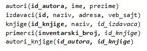

Основно о организацији наставе и учења
======================================

Централна тема и фокус предмета Базе података за четврти разред гимназија за ученике са посебним способностима за рачунарство и информатику су релационе базе података, у складу са наведеним циљем.
	
Циљ учења База података је стицање основних знања о техникама пројектовања, програмирања и коришћења база података као одговора на пословну потребу за информационим системима. 

Гимназија за ученике са посебним способностима за рачунарство и информатику има више предмета који се баве програмирањем:

- Програмирање у првом, другом и трећем разреду (три једногодишња предмета),
- Објектно-оријенисано програмирање (једногодишњи предмет),
- Веб-програмирање (једногодишњи предмет).

У оквиру предмета Базе податка у четвртом разреду, који није доминантно предмет из групе програмерских предмета, треба урадити повезивање са наученим градивом из набројаних предмета који се баве програмирањем.

Приликом остваривања  наставе и учења, важно је да се у виду имају специфичне предметне компетенције. Специфичне компетенције обухватају способност ученика да:

- упозна концепт база података, њихову организацију, коришћење упита за добијање тражених информација из база, прављење извештаја и дистрибуцију података.
- овлада вештином и техникама пројектовања база података као одговора на пословну потребу за информационим системима.
- ефикасно користи програмирање и рад са базама података за решавање различитих проблема у даљем образовању, професионалном раду и свакодневном животу.

Приликом планирања наставе и учења током целе школске године, важно је имати у виду да се ученици припремају за рад на пројектном задатку. Опис пројектног задатка јасно дефинише кораке које ученик треба да савлада, а сам захтев је подељен на два дела. 

Организација корака и захтева у пројектном задатку одговара следећим исходима из програма наставе и учења. Ученик ће бити у стању да  да:

- разматра и решава сложенији проблем разбијајући га на мање потпроблеме;
- конструише решење сложенијег проблема креирањем базе података и рачунарског програма.

**Први део пројектног задатка се односи на креирање базе података.**

.. suggestionnote::

    Овај први део је веома важан и подразумева да се на основу сценарија креира дијаграм ентитета и веза (ЕРД) са пратећом документацијом. Превести креирани дијаграм у релациони модел, креирањем одговарајућих табела. Коришћењем наредбе CREATE TABLE потребно је креирати све табеле дате базе. Сваку креирану табелу попунити са 10 редова. 

Кроз рад на првом делу пројектног задатка развијају се способности ученика да разуме организацију релационих база података. Да би се дошло до тога, потребно је да кроз наставу и учење током целе године и пре самосталног рада на пројектном задатку, ученик види што више примера различитих база података, да разуме како су подаци које иначе виђамо заједно распоређени у више различитих табела и како су они повезани системом примарних и страних кључева. 

Узмимо, на пример, корице неког примерка књиге. На тим корицама видимо назив књиге, као и основне податке о ауторима и издавачу. Сви ови подаци се у бази података чувају у четири табеле: *knjige, autori, izdavaci и primerci*. Ове табеле су повезане. У табели *primerci* имамо страни кључ *id_knjige* тако да тачно знамо за сваки примерак која је то књига. То је пример везе један-према-више. Табеле *knjige* и *autori* су повезане везом више-према-више, па морамо да имамо још једну целу табелу *autori_knjige* у којој се чувају комбинације кључева *id_autora* и *id_knjige* по којима знамо који аутор је написао коју књигу.   

Процес којим се од описа реалног пословања, на пример библиотеке, и података који су потребни за то пословање долази до распоређивања података у различите целине, назива се пројектовање базе података. Резултат пројектовања је дијаграм ентитета и веза (ЕРД) са пратећом документацијом.

Ученици су већ једном прошли теме неопходне за израду овог дела пројекта у оквиру истоименог предмета у трећем разреду. Током четвртог разреда, сваки пут када добију задатак да креирају програм, први корак је управо да пројектују и креирају базу података којој ће тај програм приступати.

.. infonote::

    ВАЖНО: Поглавље „Релационе базе података“ се управо бави пројектовањем и креирањем базе података. У програму наставе и учења је наглашено да је важно да се кроз практичан рад прође све од пословног захтева до креирања конкретне базе података, па треба планирати да кораке пројектовања и креирања базе података ученици прођу неколико пута током четвртог разреда. 
    
У материјалима је приказано више база података на којима ученици могу да прођу све кораке од пословног захтева до креирања конкретне базе.

Следи списак табела које чине овај део базе података у којем се чувају подаци о свим књигама у библиотеци. Претпоставка је да библиотека све примерке једне књиге увек набавља од истог издавача. Примарни кључеви су истакнути болд, а страни италик.

Поред ове базе података, биће креиране и следеће базе:

- комплетна база података за библиотеку са 10 табела,
- база података за евиденцију издатих возачких дозвола, 
- база података за продајни салон аутомобила,
- база података за колекцију филмова (део базе неке онлајн платформе за пуштање филмова),
- база података за школске пројекте.

У материјалима се налазе и већ креирани дијаграми ентитета и веза за још три базе података који су дати као основа за задатке за самосталан рад:

- база података за продавницу (део о производима, произвођачима, категоријама и ценама),
- база података за компанију за продају дигиталних композиција,
- база података за домаће задатке. 

**Други део пројектног задатка се односи на креирање рачунарског програма.**

.. suggestionnote::

    Потребно је да се направи рачунарски програм који користи креирану базу података. Обезбедити разноврсне анализе и обраде података употребом различитих могућности упита SELECT.

Приликом планирања наставе и учења, да би се ученици припремили за овај део пројектног задатка, узети у обзир следеће исходе. По завршетку разреда ученик ће бити у стању  да:
- објасни како се користе команде упитног језика SQL унутар програмског кода писаног другим програмским језиком,
- креира у изабраном окружењу рачунарски програм који издваја податке из једне или више табела креиране базе података употребом угњежденог упита SELECT,
- креира у изабраном окружењу једноставан рачунарски програм који извршава основне анализе и обраду података употребом различитих могућности упита SELECT.

Да би се постигли ови планирани исходи из програма наставе и учења, ученик на првом месту мора да зна да напише упит SELECT. То је централни део програма. Да би ученик знао да напише упит, мора да разуме концепт релационе базе, како су подаци распоређени по табелама и како се табеле повезују. 

У програму наставе и учења пише да је важно да ученици виде примере из живота у којима се ради са великим количинама података (нпр. библиотека, видеотека, продавница, банка, пошта, школа, спортски клуб...). Треба да се са ученицима прођу добри примери који имају везе са реалним захтевима. 

Следе примери неких ситуација за које ученици могу да препознају да су базе података заиста потребне у реалном животу, и како на основу њих ми креирамо задатак који се решава писањем упита SELECT. Само за први је илустративно креиран и најједноставнији програм, док се креирани програми за остале задатке налазе у материјалима курса. 

**Пример 1.** Библиотека жели да провери колико има примерака књига чији је издавач СЕТ да би размотрили да ли да набављају још књига овог издавача. За сваки примерак је пожељно да се види и која је књига у питању да би се размотрило могуће додатно набављање и појединих наслова овог издавача који се већ налазе у библиотеци. Потребно је креирати рачунарски програм. 

На основу овог захтева, долазимо прво до следећег задатка. 

*Задатак*: Написати упит којим се приказују инвентарски бројеви и називи књига издавача чији је назив CET. Изменити заглавља колона у приказу резултата тако да буду редом „Primerak“ и „Naziv knjige“. 

Када се детаљно анализирају потребни подаци и из којих табела их узимамо, добијамо решење, тј. упит SELECT. 

::

    SELECT inventarski_broj "Primerak", knjige.naziv "Naziv knjige"
    FROM primerci JOIN knjige ON (primerci.id_knjige=knjige.id_knjige)
    JOIN izdavaci ON (knjige.id_izdavaca=izdavaci.id) WHERE izdavaci.naziv = 'CET'

Следећи корак подразумева да ово решење, тј. написани упит, укључимо у програм, на пример у процедуру.

::

    CREATE PROCEDURE Svi_Primerci_CET
    AS
        SELECT inventarski_broj "Primerak", knjige.naziv "Naziv knjige"
        FROM primerci JOIN knjige ON (primerci.id_knjige=knjige.id_knjige)
        JOIN izdavaci ON (knjige.id_izdavaca=izdavaci.id) WHERE izdavaci.naziv = 'CET';

Процедура остаје запамћена у бази података. По потреби може да се једноставно позове. 

::

    EXEC Svi_Primerci_CET;

**Пример 2.** Библиотека жели да допуни своју базу података и унесе адресе и веб-сајтове за све издавачке куће са којима сарађује, па је важно да се провери који им подаци недостају да би знали које издавачке куће да контактирају да би набавили потребне податке. 

*Задатак:* Написати упит којим се приказују називи издавача за које немамо унету адресу или адресу веб-сајта.  

::
    
    
    SELECT naziv FROM izdavaci
    WHERE adresa IS NULL OR veb_sajt IS NULL

**Пример 3.** Члан је дошао у библиотеку и жели да узме неку књигу из рачунарства. Не зна тачан назив књиге која му треба, па пита библиотекара које све књиге имају на тему рачунарства.  

*Задатак:* Написати упит којим се приказују називи књига који у називу садрже реч „racunarstvo“. 

::

    SELECT naziv FROM knjige
    WHERE naziv LIKE 'Racunarstvo%' OR naziv LIKE '%racunarstvo%'

**Пример 4.** Књига са називом „Veb-programirenje“ је много тражена и библиотека жели да набави још примерака те књиге. Да би библиотека послала наруџбеницу, потребни су јој подаци о издавачу.  

*Задатак:* Написати упит којим се приказују назив, адреса и адреса веб-сајта издавача књиге са називом „Veb-programirenje“.  

::

    SELECT adresa, veb_sajt
    FROM knjige JOIN izdavaci ON (knjige.id_izdavaca=izdavaci.id)
    WHERE knjige.naziv = 'Veb programiranje'

**Пример 5.** Библиотека размишља да набави још примерака књига награђиваног аутора Марка Видојковића. Да би донели одлуку о новим набавкама, прво је потребно да провере стање са примерцима књига које већ имају од овог писца. 

*Задатак:* Написати упит којим се приказује број примерака сваке књиге аутора Марка Видојковића.

::

    SELECT COUNT(inventarski_broj), naziv
    FROM primerci JOIN knjige ON (primerci.id_knjige=knjige.id_knjige)
    JOIN autori_knjige ON (autori_knjige.id_knjige=knjige.id_knjige)
    JOIN autori ON (autori_knjige.id_autora=autori.id_autora)
    WHERE ime = 'Marko' AND prezime = 'Vidojkovic'
    GROUP BY naziv

ТИМСКИ РАД УЧЕНИКА
------------------

Тема „Пројектни задатак“ подразумева:

- Фазе пројектног задатка од израде плана до представљања решења.
- Израда пројектног задатка.
- Вредновање резултата пројектног задатка.

Ученик ће бити у стању  да:	

- тимски и уз помоћ наставника дефинише проблем за чије решење се користи програм и база података,
- тимски развије и прикаже идејно решење проблема,
- тимски развије план рада и начин праћења успешности реализације плана,
- креира базу података и програм за дефинисан проблем,
- креира, уређује и структурира садржаје током рада на пројекту,
- пише документацију,
- креира презентацију и презентује решење пројектног рада,
- вреднује своју улогу при изради пројектног задатка и активности за које је био задужен.

Припрема за пројектни рад може да се састоји од неколико мањих практичних задатака различите тежине:

1. Практично креирати базу података и програм користећи корак-по-корак упутство са комплетним решењем и објашњењима. У материјалима је дат пример са базом података за школске пројекте. 
2. Практично креирати базу података на основу већ датог дијаграма ентитета и веза (ЕРД) који има или 2 ентитета повезана везом један-према-више или највише 4 ентитета, а затим кнаписати и програм. 
3. Практично креирати базу података на основу већ датог дијаграма ентитета и веза (ЕРД), а затим написати и програм. 
4. На основу јасно датог описа малог пословања, креирати дијаграм ентитета и веза (ЕРД) који има или 2 ентитета повезана везом један-према-више или највише 4 ентитета, практично креирати базу података на основу тог дијаграма, а затим написати и програм. 

Први практичан задатак обавезно сваки ученик треба да уради појединачно. Други, трећи или четврти практични задатак може да се ради тимски, као припрема за коначни пројектни задатак. 

ТЕМА „ПРОГРАМИРАЊЕ И БАЗЕ ПОДАТАКА“
------------------------------------

Према програму наставе и учења, тема предмета Базе података у четвртом разреду је писање програма који у себи имају команде упитног језика SQL и обрађују податке из базе података (на један од два описана начина):

- писање програма унутар система за управљање базама података (процедуре, функције, тригери, курсори),
- писање програма у неком програмском језику вишег нивоа (Java, C#...) који има угњеждене команде упитног језика SQL.

Материјали који следе покривају оба начина, и то у различитим алатима. Поред различитих алата, курс приказује и два различита начина приступа процесу учења:

1. Учење оријентисано ка постављеним проблемима – Приступа се проблемима које треба да решимо, а онда сваки обрађујемо на различите начине. Проблеми су уређени по неким логичним целинама, али не и по тежини решења. За сваки проблем тражимо најбоље решење за њега. Овај начин је доминантан у првој половини курса где се користе технологије компаније Microsoft. 
2. Учење оријентисано ка сложености наредбе – Уводи се једна по једна наредба и одређена сложеност решења, па се решавају сви проблеми који могу на тај начин да се реше. Овај начин је заступљен у другој половини курса где се користе технологије компаније Oracle. 

Различити приступи нису у вези са изабраним алатима, већ је идеја да се кроз курс покрије приступ процесу учења на различите начине. Може и други приступ да се ради у првоизабраном алату, и обрнуто. 

Материјала у оквиру курса има више него што је потребно за организацију наставе и учења током четвртог разреда, тако да може да се пробере приступ у раду, неки алат може детаљније да се обради, а неки да се не ради уопште, а могу и ученици од свега да виде понешто. Програм наставе и учења оставља много слободе наставнику да организује како жели да ради са ученицима. 

Неколико могућих предлога за организацију теме Програмирање и базе података са планираних 75 часова. 

1. Релационе базе података (20 часова) и Писање програма унутар СУБП-а (55 часова) – Microsoft SQL Server Management Studio.
2. Релационе базе података (20 часова), Писање програма унутар СУБП-а (25 часова) и Писање програма у неком програмском језику вишег нивоа (30 часова) – технологије компаније Microsoft.
3. Релационе базе података (20 часова) и Писање програма у неком програмском језику вишег нивоа (55 часова) – технологије компаније Microsoft.
4. Релационе базе података (20 часова), Писање програма унутар СУБП-а (20 часова) и Писање програма у неком програмском језику вишег нивоа (20 часова) – технологије компаније Microsoft, Друга софтверска решења – систем за управљање базама података Oracle (15 часова).
5. Релационе базе података (20 часова) и Друга софтверска решења – систем за управљање базама података Oracle (55 часова).

ТЕМА „ДРУГЕ АКТУЕЛНЕ ТЕХНОЛОГИЈЕ“
----------------------------------

Часови посвећени теми „Друге актуелне технологије“ могу да се организују на више начина, а овде следе два предлога. 

**Први предлог: истраживачки рад**

Ученик ће бити у стању  да:	

- кроз истраживачки рад се упозна са актуелним технологијама у области рада са подацима.

У материјалима су дати неки предлози за читање. 

На Петљи постоји курс „Примене савременог рачунарства за 4. разред гимназије – природни смер“ и у оквиру њега део „Обрада великих количина података“:

https://petlja.org/kurs/7193/5/6581

Поред тога постоје још два објављена курса који се односе на рад са подацима.

Курс „Анализа (отворених) података“:

https://petlja.org/biblioteka/r/kursevi/jupyterRadneSveske_srb

Курс „Буди Data Driven – анализа и визуелизација података“:

https://petlja.org/kurs/6173

У оквиру теме „Друге актуелне технологије“ ученици самостално могу да прођу један од предложених курсева. 

Може да се организује и да се одељење подели на три дела и да свака група ученика прође по један од курсева, а онда на часовима да презентују остатку одељења чиме су се бавили и шта су научили. 

**Други предлог: друга софтверска решења**
 
У овом случају је могуће неке часове који су оквирно планирани за тему „Програмирање и базе података“ представити као увод и припрему за овај део школске године. 

Ученик ће бити у стању  да:

- наброји још нека софтверска решења за креирање база података и рачунарских програма,
- укратко опише како се креирају база података и рачунарски програм у неком другом софтверском решењу.

Уколико су се ученици у оквиру теме „Програмирање и базе података“ упознали и са алатима компаније *Microsoft* и са алатима компаније *Oracle*, током ових часова могу да направе осврт на сличности и разлике. 

Ако су ученици радили само са алатима компаније *Microsoft*, могу да се самостално упознају и практично пробају онлајн окружење *Oracle APEX.*

У материјалима су дати и други предлози са самосталан практичан рад. Ученици појединачно или у тимовима могу мало да истраже и креирање веб-апликација које је описано у курсевима на Петљи:

- Базе података, рачунарске мреже и серверско веб-програмирање за четврти разред гимназије природног смера; 
- Веб-програмирање за четврти разред гимназија за ученике са посебним способностима за рачунарство и информатику.
