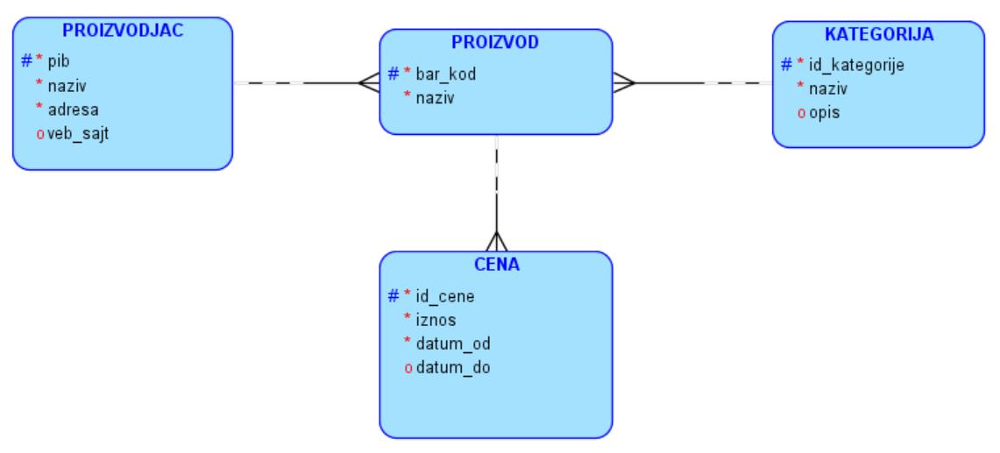
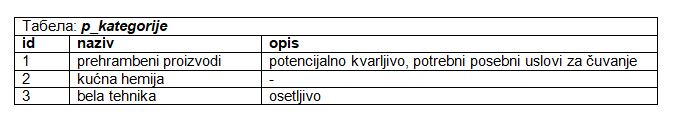
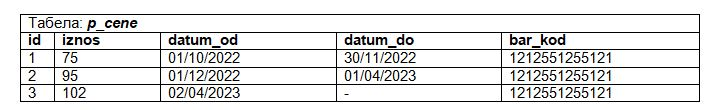

База података за продавницу у СУБП-у *Oracle Apex* - пројектни рад
===================================================================

.. suggestionnote::

    Пројектни задатак се састоји од три веће целине:

    1.	Креирати базу података за продавницу на основу датог модела и унети податке. 
    2.	Написати PL/SQL програме који су решења датих задатака. 
    3.	Креирати апликацију помоћу алата *App Builder*. 

Приликом рада на било ком делу пројекта, погледајте претходно решене примере и лекције. 

Команде за креирање базе података и програми се пишу у едитору у оквиру онлајн окружења *Oracle APEX*, а покрећу се кликом на дугме **Run**:

- https://apex.oracle.com/en/ (обавезно логовање на креирани налог)
- SQL Workshop
- SQL Commands

**ПРОДАВНИЦА**: Сваки произвођач има назив, адресу седишта и веб-сајт. Произвођачи су правна лица којима је додељен ПИБ. Произвођач производи више различитих производа. Сваки производ има свој јединствени бар-код и назив.  Производи су подељени у категорије: прехрамбени производи, кућна хемија, бела техника... Један производ је током времена мењао цену. Тако је, на пример, хлеб са бар-кодом 1212551255121 од 1. октобра 2022. године до 30. новембра 2022. године имао цену 75 динара, а од 1. децембра 2022. године до 1. априла 2023. године 95 динара, док од 2. априла 2023. године до данас има цену 102 динара. 

.. infonote::

    НАПОМЕНА: Препоручљиво је да се у сваки назив табеле на почетак дода *p_* да би ове табеле биле груписане на списку свих табела које имамо на онлајн налогу *Oracle APEX*. Тако су предложени називи табела базе података за продавницу *p_proizvodjaci*, *p_kategorije*, *p_proizvodi* и *p_cene*. 

Део података може да се види у следећим табелама. Пронаћи податке о неким произвођачима и производима и унети податке о њима, као и о променама цена.

КРЕИРАТИ PL/SQL ПРОГРАМЕ
------------------------

Користити по потреби SELECT INTO, курсор, курсор са параметром. Уколико задатак може да се реши са SELECT INTO, решити га на тај начин, а не употребом курсора. У бар једном решењу користити експлицитни начин рада са курсором, и у бар једном решењу користити циклус FOR. Где има смисла, написати функцију или процедуру, као и програме у којима се позивају. Задаци нису уређени ни на који начин.

.. questionnote::

    1. Приказати називе производа који припадају категорији „prehrambeni proizvodi“.

.. questionnote::

    2. Приказати назив производа, назив произвођача, назив категорије и тренутну цену сваког производа. Уколико је тренутна цена већа од 10.000 динара, написати да производ спада у скупе производе.  

.. questionnote::

    3. Приказати категорију производа чији се назив уноси са тастатуре. 

.. questionnote::

    4. Приказати све производе произвођача чији се назив уноси са тастатуре. 

.. questionnote::

    5. Приказати за сваког произвођача све његове производе.  

.. questionnote::

    6. Приказати све производе чија је цена између 20.000 и 30.000 динара. 

.. questionnote::

    7. Приказати све производе чија је цена у датом интервалу који се уноси са тастатуре.  

.. questionnote::

    8. Приказати износ највеће цене која тренутно постоји.  

.. questionnote::

    9. Приказати производ чија је тренутна цена највећа од тренутних цена свих производа. Напомена: Могуће је да више производа има исти износ цене. 

.. questionnote::

    10. Приказати све цене које је производ имао, уређено у опадајућем низу по датумима, за производ чији се назив уноси са тастатуре. 

.. questionnote::

    11. Приказати све производе, и за сваки производ списак свих цена које је имао, за произвођача чији се назив уноси са тастатуре. 

.. questionnote::

    12. Приказати за сваког произвођача све његове производе, и за сваки производ списак свих цена које је имао. 

.. questionnote::

    13. Приказати за сваког произвођача број његових производа. Уколико нема производа тог произвођача, написати поруку да треба набавити производе тог произвођача. 

.. questionnote::

    14. Приказати предлоге нових цена. Уколико је производ јефтинији од 1000 динара, планирано је увећање од 10%, а од 5% ако је скупљи. 

.. questionnote::

    15. Приказати за сваку категорију најјефтинији производ те категорије. 
