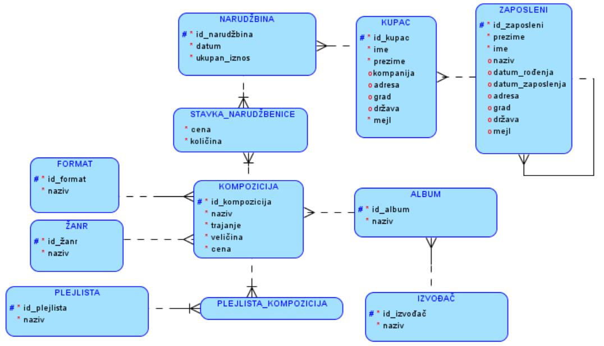
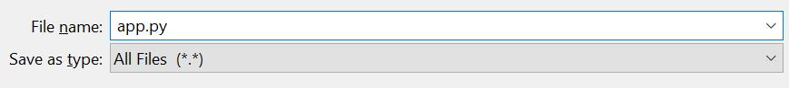
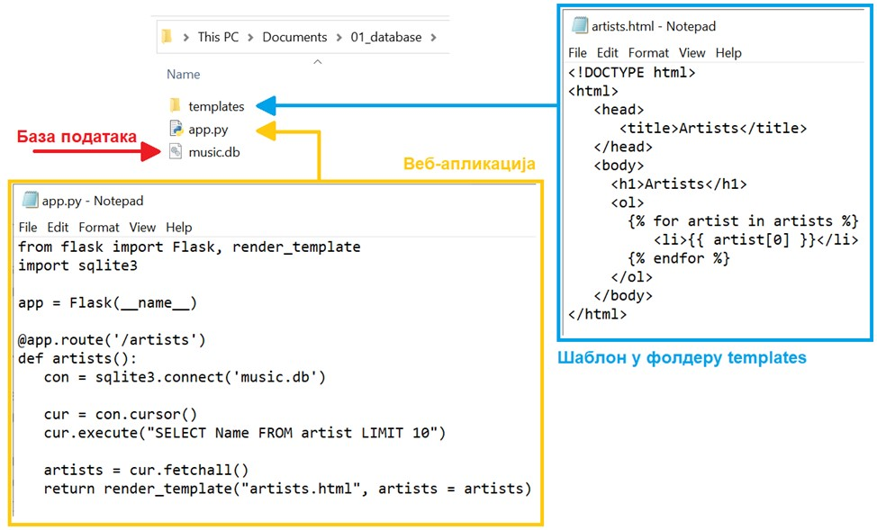
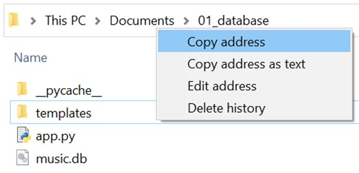
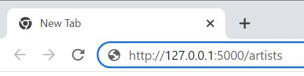
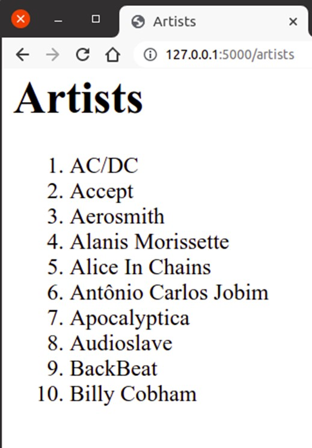

Предлог за практичан рад
=========================

.. suggestionnote::

    Сигурно користиш неку веб-платформу за слушање музике или продају песама. Да ли ти је некада „искочила“ препорука за нову песму, a да je то било баш оно што се и теби потом допало? Није у питању случајност. Сваки од ових система проучава велике количине података – прати навике корисника и анализира, на пример, које је још песме слушао неко ко је слушао све што и ти пратиш, и онда ти препоручи баш оно што ће ти се свидети.

    Најбољи начин да се упознају друге актуелне технологије је кроз практичан рад. Можеш да покушаш да креираш програм у којем се за једног корисника платформе за продају песама приказује списак свих песама које су купили други чланови платформе који су купили бар једну исту песму као и он. 

    Програм може да буде веб-апликација креирана употребом  `библиотеке Flask <https://flask.palletsprojects.com/>`_, библиотеке програмског језика Пајтон (). 

Сваки пут када треба да креирамо програм који ради са подацима, процес решавања морамо да разбијемо на два дела:

- пажљиво пројектовање, а затим и креирање базе података, као и анализа података употребом различитих могућности упита SELECT,
- креирање програма који користи креирану базу у који је укључена претходно урађена анализа података употребом различитих могућности упита SELECT. 

У оквиру курса Базе података за четврти разред гимназија за ученике са посебним способностима за рачунарство и информатику је детаљно описано како се добија дијаграм ентитета и веза за `базу података компаније за продају музичких композиција <https://petlja.org/kurs/7963/7/6693>`_ (углавном песама).

На следећој слици може да се види комплетан дијаграм ентитета и веза који је основа за креирање базе података која ће имати 11 табела. 

У поглављу „Продаја дигиталних композиција – база“ у оквиру истог курса постоји много задатака који се решавају писањем упита SELECT, који могу да се уграде у веб-странице веб-апликације. 

- `Задаци – пројекција и селекција <https://petlja.org/kurs/7963/14/6735>`_
- `Задаци – спајање табела <https://petlja.org/kurs/7963/14/6736>`_
- `Задаци – групне функције и једна табела <https://petlja.org/kurs/7963/14/6737>`_
- `Задаци – групне функције и спајање табела <https://petlja.org/kurs/7963/14/6738>`_

Детаљно објашњење како се креирају веб-апликације употребом библиотеке *Flask* може да се нађе у оквиру курса Базе података, рачунарске мреже и серверско веб-програмирање за четврти разред гимназије природног смера. 

- `Серверско веб-програмирање <https://petlja.org/kurs/4654/19/6537>`_
- `Библиотека Flask – основни појмови <https://petlja.org/kurs/4654/20/6541>`_
- `Библиотека Flask – повезивање са базом података <https://petlja.org/kurs/4654/21/6552>`_

Укратко, као илустрацију, приказаћемо пример једноставне веб-апликације која се повезује на базу података компаније за продају музичких композиција. Имајте у виду да, када правите овакве веб-апликације, не морате да пишете комплетан програмски код од почетка. Препоручена пракса је да узмете већ припремљене примере програмског кода и да га прилагодите.

Свака иоле сложенија веб-апликација укључује неколико различитих фајлова, па је логична конвенција да се све оне чувају унутар једног фолдера намењеног тој веб-апликацији. За први пример веб-апликације која се повезује на базу података направићемо фолдер под именом *01_database* и у њему ћемо креирати фајл *app.py* са програмским кодом. 

У исти фолдер треба да ставимо и базу података. У овом примеру користимо базу података компаније за продају музичких композиција, коју можете да преузмете овде:

`music.db <https://petljamediastorage.blob.core.windows.net/root/Media/Default/Kursevi/OnlineNastava/kurs-gim-cetvrti-prirodni-inf/_static/db/music.zip>`_

Веб-апликација је заправо HTML страница па је неопходно да креирамо шаблон *templates/artists.html* који ће служити да се у HTML листи прикажу подаци из низа artists који формира наш *Flask* програм. 

::

    <!DOCTYPE html>
    <html>
        <head>
            <title>Artists</title>
        </head>
        <body>
            <h1>Artists</h1>
            <ol>
            
                <li>{{ artist[0] }}</li>
            
            </ol>
        </body>
    </html>

Следи комплетан програмски код *app.py* који се повезује на базу и извршава упит SELECT којим се приказују називи првих 10 извођача. 

::

    import sqlite3
    from flask import Flask, render_template

    app = Flask(__name__)

    @app.route('/artists')
    def artists():
    con = sqlite3.connect('music.db')
    
    cur = con.cursor()
    cur.execute("SELECT Name FROM artist LIMIT 10")
    
    artists = cur.fetchall()
    return render_template("artists.html", artists = artists)

Фајлове са програмским кодом попут овог можете да креирате у било ком едитору текста као што је *Notepad*. Када чувате фајл, потребно је да:

- изаберете All Files под Save as type,
- наведете назив фајла са екстензијом .py, тачније app.py.

Следећа слика илуструје фолдер у којем се налази наша веб-апликација. 

Да бисмо имали тачну путању до фајла која нам је неопходна да покренемо програм, можемо да употребимо опцију *Copy adress* када урадимо десни клик мишем у прозору *File Explorer*. 

Након тога у командној линији се постављамо у директоријум у коме смо креирали датотеку *app.py* тако што напишемо:

::

    cd naziv_fajla_sa_putanjom

После покретања *Flask* апликације командом *flask run*, апликацији можемо приступити из прегледача веба.

У адресну линију прегледача, на пример прегледача Chrome, унети адресу http://127.0.0.1:5000/artists, како је приказано на следећој слици.

На следећој слици је приказан изглед апликације. 

