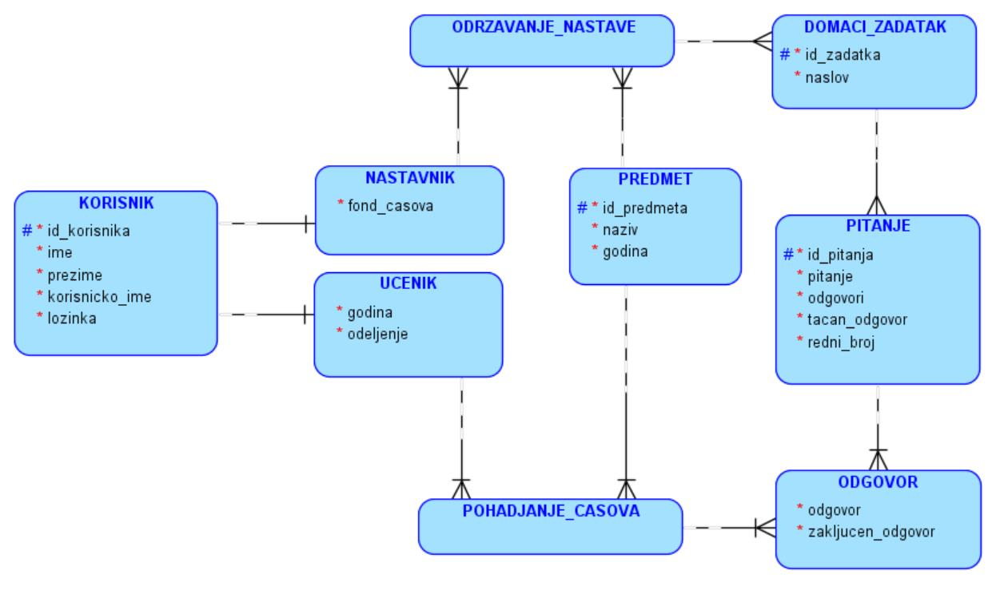

Веб-програмирање
================

.. suggestionnote::

    У четвртом разреду гимназија за ученике са посебним способностима за рачунарство и информатику постоји предмет посвећен веб-програмирању и део курса који је посвећен овом предмету обрађује креирање серверске веб-апликације за управљање домаћим задацима. Ово је још један предлог за практичан рад и истраживање других актуелних технологија.

Комплетан пример креирања веб-апликације се налази у материјалима курса Веб програмирање за четврти разред гимназија за ученике са посебним способностима за рачунарство и информатику.

**https://petlja.org/kurs/XXXXXXXXXXXXXXXXX (УНЕТИ АДРЕСУ КАДА БУДЕ ПОЗНАТА)**

Технологије које се користе за креирање серверске веб-апликације за управљање домаћим задацима су:

- програмски језик Пајтон,
- библиотека *Flask*,
- систем за управљање базама података *MySQL*,
- драјвер *mysql-connector-python*.

На следећој слици може да се види комплетан дијаграм ентитета и веза који је основа за креирање базе података која ће се користити у серверској веб-апликацији. 

Следи планирани списак функционалности веб-апликације за управљање домаћим задацима.

Наставник може да се региструје.

::

    INSERT INTO korisnici (ime, prezime, korisnicko_ime, lozinka) VALUES (?, ?, ?, ?);
    INSERT INTO nastavnici VALUES (?, ?);

Ученик може да се региструје.

::

    INSERT INTO korisnici (ime, prezime, korisnicko_ime, lozinka) VALUES (?, ?, ?, ?);
    INSERT INTO ucenici VALUES (?, ?, ?);

Наставник може да види све предмете.

::

    SELECT * FROM predmeti;

Наставник може да одабере предмет којем ће се прикључити да изводи наставу.

::

    INSERT INTO odrzavanje_nastave VALUES (?, ?);

Наставник може да дода нови предмет.

::

    INSERT INTO predmeti (naziv, godina) VALUES (?, ?);

Наставник може да види све ученике.

::

    SELECT * FROM ucenici;

Наставник може да одабере ученика којег ће прикључити неком предмету да похађа наставу, али само на предметима који су у години коју ученик похађа.

::

    SELECT * FROM predmeti p 
    WHERE godina = ? AND 
    NOT EXISTS (SELECT * FROM pohadjanje_casova 
    WHERE id_ucenika = ? AND id_predmeta = p.id_predmeta);

Наставник може да дода нови домаћи задатак за предмет који предаје. Приликом додавања новог домаћег задатка, наводе се и питања која су део домаћег задатка.

::

    INSERT INTO domaci_zadaci (id_predmeta, id_nastavnika, naslov) VALUES (?, ?, ?);
    --Sledeca naredba se ponavlja za svako pitanje:
    INSERT INTO pitanja (id_zadatka, pitanje, odgovori, tacan_odgovor, redni_broj) 
    VALUES (?, ?, ?, ?, ?);

Наставник може да обрише домаћи задатак за предмет који предаје.

::

    --Kaskadno se brisu pitanja i odgovori
    DELETE FROM domaci_zadaci WHERE id_zadatka = ?; 

    Ученик може да види предмете које похађа.

    SELECT * FROM pohadjanje_casova pc JOIN predmeti p 
    ON pc.id_predmeta = p.id_predmeta;

Ученик може да види домаће задатке за неки предмет који похађа.

::

    SELECT * FROM domaci_zadaci 
    WHERE id_predmeta = ? AND 
    EXISTS (SELECT * FROM pohadjanje_casova 
    WHERE id_ucenika = ? AND id_predmeta = ?);

Ученик може да види питања у домаћем задатку за неки предмет који похађа.

::

    SELECT * FROM pitanja 
    WHERE id_zadatka = ? AND 
    EXISTS (SELECT * FROM pohadjanje_casova pc JOIN domaci_zadaci dz 
    ON pc.id_predmeta = dz.id_predmeta 
    WHERE id_ucenika = ? AND pc.id_predmeta = ? AND id_zadatka = ?);

Ученик може да одговори на питање на домаћем задатку за неки предмет који похађа, све док одговор на питање није закључен.

::

    INSERT INTO odgovori VALUES (?, ?, ?, ?, ‘N’);

Ученик може да мења одговор на питање на домаћем задатку за неки предмет који похађа, све док одговор на питање није закључен.

::

    UPDATE odgovori 
    SET odgovor = ? 
    WHERE id_pitanja = ? AND id_ucenika = ? AND 
    id_predmeta = ? AND zakljucen_odgovor = ‘N’;

Ученик може да закључи одговор на питање.

::

    UPDATE odgovori 
    SET zakljucen_odgovor = ‘D’ 
    WHERE id_pitanja = ? AND id_ucenika = ? AND 
    id_predmeta = ? AND zakljucen_odgovor = ‘N’;

Наставник може да види одговоре ученика на домаћем задатку за неки предмет који предаје.

::

    SELECT * FROM odgovori 
    WHERE id_predmeta = ? AND 
    id_pitanja IN (SELECT id_pitanja FROM pitanja WHERE id_zadatka = ?) AND 
    EXISTS (SELECT * FROM odrzavanje_nastave 
    WHERE id_nastavnika = ? AND id_predmeta = ?) 
    ORDER BY id_ucenika;
