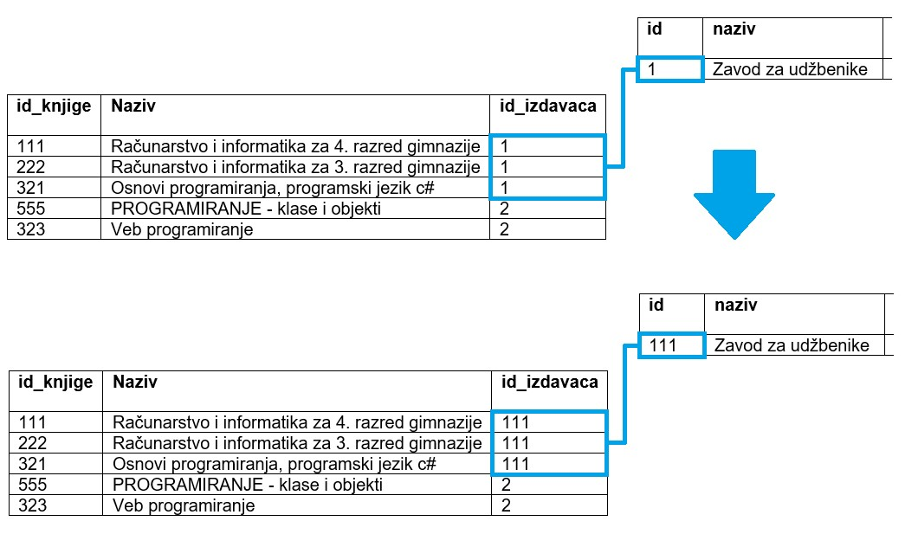
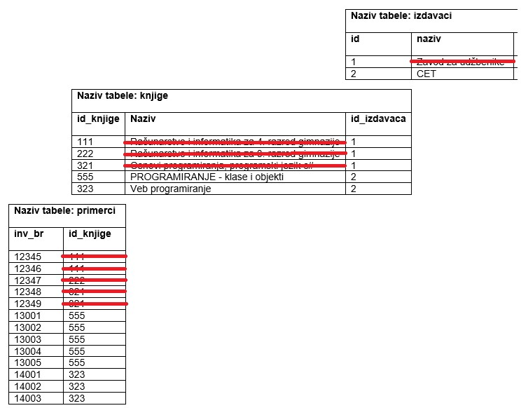

Команде језика SQL
==================

.. suggestionnote::

    Видели смо команду за креирање табеле и команду за унос података у табеле које су нам неопходне у процесу креирања базе података. Језик SQL, међутим, има много других команди, па ћемо приказати још неке од њих. 

Када су табеле креиране, командом **ALTER TABLE** могуће је извршити одређене измене у структури уколико је то потребно. Уколико смо, на пример, приметили да смо креирали табелу, али је тип података једне колоне погрешан, можемо да изменимо табелу на следећи начин наводећи нови тип поред имена колоне која већ постоји. 

::

    ALTER TABLE autori
    MODIFY (ime VARCHAR(30))

Измена је могућа уколико је табела празна или уколико подаци који се у њој налазе одговарају овом новом типу. 

Можемо да правимо и друге измене постојеће табеле. На пример, да додамо колону:

::

    ALTER TABLE autori
    ADD (mejl_adresa VARCHAR(70))

Цела табела се из базе података уклања командом **DROP TABLE**. Ова команда и брише комплетан садржај, тј. све податке из табеле, и уклања табелу као објекат из базе. 

::

    DROPT TABLE autori

Унети подаци могу да се ажурирају командом **UPDATE**. 

На пример, издавачка кућа са идентификационим бројем 2 је преселила своје седиште и нова адреса је Скадарска 45. Постоји само један издавач са овим идентификационим бројем, па ће се измена догодити у једном реду. 

::

    UPDATE izdavaci
    SET adresa = 'Skadarska 45, Beograd'
    WHERE id = 2

Можемо да променимо и више од једног податка у једном реду користећи једну команду. Следећом командом мењамо и адресу и адресу веб-сајта издавача са идентификационим бројем 2.

::

    UPDATE izdavaci
    SET adresa = 'Skadarska 45, Beograd' AND veb_adresa = 'https://cet.rs/o-nama/'
    WHERE id = 2

Једном командом могу да се измене подаци у више редова, a може да се користи и нека формула. На пример, неопходно је додати идентификациони број издавача, број 2, на крај сваког инвентарског броја свих примерака књиге са идентификационим бројем 555.

Наредба којом се то постиже је следећа:

::

    UPDATE primerci
    SET inventarski_broj = inventarski_broj*10+2
    WHERE id_knjige = 555

Код ажурирања података је важно и да знамо да ли постоје нека ограничења дефинисана приликом креирања табеле. 

Приликом креирања страног кључа у оквиру команде CREATE TABLE, могуће је додати неку од опција за ажурирање UPDATE и брисање DELETE:

- CASCADE
- NO ACTION
- SET NULL 
- SET DEFAULT

Прве две опције увек можемо да размотримо и применимо по потреби. Друге две опције подразумевају да вредности страног кључа могу да буду NULL, или да је дефинисана подразумевана вредност. Уколико ово није случај, те опције нису на располагању.

Погледајмо допуњену команду за креирање табеле са подацима о књигама. 

::

    CREATE TABLE knjige
    ( id_knjige INT PRIMARY KEY, 
    naziv VARCHAR(50) NOT NULL, 
    id_izdavaca INT NOT NULL,
    FOREIGN KEY (id_izdavaca) REFERENCES izdavaci(id) 
    ON UPDATE CASCADE ON DELETE NO ACTION )

Каскадна опција можда није најбоље решење за брисање зато што би брисање једног реда у једној табели потенцијално обрисало податке из више редова више различитих табела, па тиме можда и значајан део целе базе. Узмимо, на пример, да желимо да обришемо једног издавача. Уколико је укључена каскадна опција, то би значило да би брисање тог једног реда узроковало брисање свих књига тог издавача, а затим брисање свих примерака тих књига. Боље решење би било да се такво брисање не дозволи, у овом случају да се не дозволи брисање података о издавачу чије књиге имамо у библиотеци. Када брисање не успе, било би добро урадити неко архивирање података о књигама, и примерцима књига издавача којег желимо да обришемо. Затим урадити брисање обрнутим редоследом који је увек дозвољен, а то би подразумевало прво брисање свих примерака, затим свих књига тог издавача, а на крају и самог издавача. 

Наравно да може да се догоди да се установи да би друге опције биле боље решење након детаљне анализе захтева пословања. Можда нам не треба архива свих података о издавачу којег желимо да обришемо, па има смисла да укључимо каскадно брисање и тиме уштедимо време тако што нећемо морати све пешке да бришемо. Такође је могуће да не желимо да дозволимо измену вредности примарног кључа било које табеле. Следи измењена команда у складу са овим што је управо описано. 

Узмимо, на пример, да је страни кључ у табели *knjige* креиран тако да је дозвољено каскадно ажурирање.  

::

    FOREIGN KEY (id_izdavaca) REFERENCES izdavaci(id) 
    ON UPDATE CASCADE ON DELETE NO ACTION

Уколико желимо да променимо вредност идентификационог броја неког издавача, на пример, Завода за уџбенике, потребно је да напишемо следећу команду која ће се успешно извршити. 

::

    UPDATE izdavaci SET id = 111 
    WHERE id = 1 

Nакон што се измени вредност примарног кључа у табели *izdavaci*, измениће се и одговарајуће вредности у колони која је страни кључ у табели *knjige*. 

Међутим, написана команда се неће успешно извршити уколико је страни кључ у табели *knjige* креиран на другачији начин, односно ако се спречава акција приликом покушаја ажурирања. 

:: 

    FOREIGN KEY (id_izdavaca) REFERENCES izdavaci(id) 
    ON UPDATE NO ACTION ON DELETE CASCADE 

Подаци се бришу из табеле командом **DELETE FROM**.  

На пример, запослени са идентификационим бројем 5 не ради више у библиотеци па је потребно да обришемо податке о њему. 

::

    DELETE FROM zaposleni
    WHERE id = 5

Код брисања података је важно и да знамо да ли постоје нека ограничења дефинисана приликом креирања табеле. 

Узмимо, на пример, да је страни кључ у табели *knjige* креиран на следећи начин. 

::

    FOREIGN KEY (id_izdavaca) REFERENCES izdavaci(id) 
    ON UPDATE CASCADE ON DELETE NO ACTION

Како је на овај начин забрањено брисање реда из табеле *izdavaci* уколико постоји нека књига тог издавача, следећа команда се неће извршити. 

::

    DELETE FROM izdavaci
    WHERE id = 1

Међутим, написана команда ће сe успешно извршити уколико је страни кључ у табели *knjige* креиран на другачији начин, односно ако се дозвољава каскадно брисање. 

::

    FOREIGN KEY (id_izdavaca) REFERENCES izdavaci(id) 
    ON UPDATE NO ACTION ON DELETE CASCADE 

У том случају ће се обрисати и издавач, и све његове књиге, и сви примерци свих његових књига

Уколико изоставимо WHERE део команде, команда ће обрисати све податке из табеле. 

::

    DELETE knjige
    