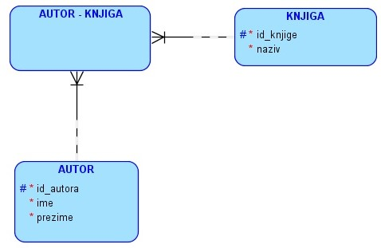
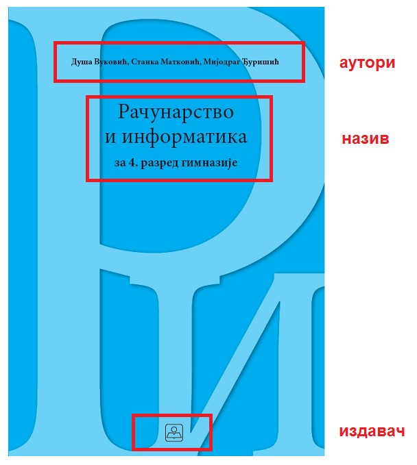
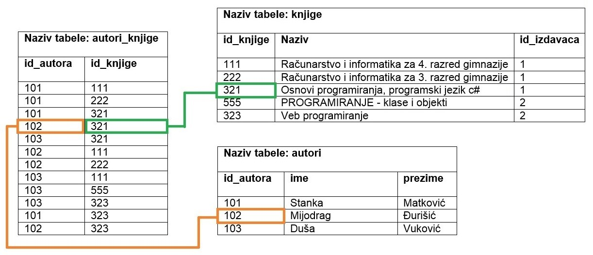
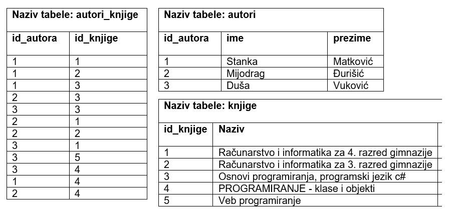
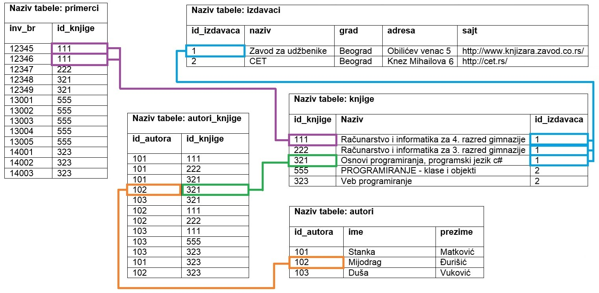

ВЕЗА ВИШЕ ПРЕМА ВИШЕ
====================

.. suggestionnote::

    Многобројне животне ситуације не могу да се опишу везама један-према-више или један-према-један које смо до сада детаљније објаснили. На пример, један аутор је сигурно написао више књига, а једну књигу, посебно ако је реч о некој стручној књизи или уџбенику, вероватно је написала група аутора. Овакве ситуације захтевају посебну пажњу у релационим базама података.  

Веза више-према-више се веома често среће у животу и одговара многим ситуацијама у оквиру разних пословања. Ако као књиге посматрамо школске уџбенике или стручне књиге, приметићемо да свака књига има више аутора, а аутори најчешће током свог рада напишу више књига.  

Овакву везу је немогуће реализовати у релационој бази података, па се на моделу уклања и уместо ње се поставља нови ентитет. Уколико нема бољег решења, назив новог ентитета може да буде комбинација назива почетна два ентитета повезана везом више-према-више.

Кратке цртице којима су везе прецртане имају значење да везе учествују у примарном јединственом идентификатору новог ентитета. Тако је примарни јединствени идентификатор новог ентитета који је дошао на место везе типа М:М, ентитета АUTOR-KNJIGA, заправо сложен и представља комбинацију примарних јединствених идентификатора ентитета АUTOR и KNJIGA: (*id_knjige*, *id_autora*).

Описани део модела се у релационој бази приказује како је илустровано на следећој слици. Сетимо се да књига има издавача, па се у табели knjige налази и страни кључ *id_izdavaca*. 

.. image:: ../../_images/slika_105c.jpg
    :width: 600
    :align: center

Већ смо креирали табеле *knjige* и *autori* следећим командама.

::

    CREATE TABLE knjige
    ( id_knjige INT PRIMARY KEY, 
    naziv VARCHAR(50) NOT NULL, 
    id_izdavaca INT NOT NULL REFERENCES izdavaci(id) )

    CREATE TABLE autori
    ( id_autora INT PRIMARY KEY, 
    ime VARCHAR(15) NOT NULL, 
    prezime VARCHAR(15) NOT NULL )

Следи програмски код за креирање табеле *autori_knjige*. У овој табели је потребно да имамо две колоне. Свака од њих је страни кључ, а заједно чине сложен примарни кључ. Колона *id_autora* је страни кључ, који показује на примарни кључ, колону *id_autora*, табеле *autori*. Колона *id_knjige* је страни кључ, који показује на примарни кључ, колону *id_knjige*, табеле *knjige*. Није довољно само предвидети ову додатну колону која представља везу ка другој табели, већ је изузетно важно уз њу дефинисати и да је та колона страни кључ тако што се наведе реч REFERENCES и одговарајућа референца. На тај начин се обезбеђују додатне провере приликом рада са подацима у бази. Тако, на пример, неће бити могуће да се унесе ред са идентификационим бројевима који не постоје у одговарајућим табелама са подацима о књигама и ауторима – непостојећи идентификациони број аутора или непостојећи идентификациони број књиге. 

Када табела има сложен примарни кључ, он мора посебно да се дефинише након списка свих колона.

::

    CREATE TABLE autori_knjige
    (id_autora INT REFERENCES autori(id_autora),
    id_knjige INT REFERENCES knjige(id_knjige), 
    PRIMARY KEY (id_autora, id_knjige) )

Погледајмо поново корице следеће књиге. На тим корицама видимо назив књиге, као и основне податке о ауторима и издавачу. Већ смо видели како се унесе подаци о овој књизи и издавачу у релациону базу података. Сада је потребно да додамо ауторе и да повежемо ауторе са књигом. 

Унећемо прво податке о ауторима ове књиге у табелу где се чувају подаци о свим ауторима.

::

    INSERT INTO autori
    VALUES (101, 'Stanka', 'Matkovic')

    INSERT INTO autori
    VALUES (102, 'Mijodrag', 'Djurisic')

    INSERT INTO autori
    VALUES (103, 'Dusa', 'Vukovic')

Већ смо раније унели податке о овој књизи у релациону базу и можемо да видимо да је 111 идентификациони број ове књиге.  

::

    INSERT INTO knjige 
    VALUES (111, 'Racunarstvo i informatika za 4. razred gimnazije', 1)

Како књига има три аутора, потребно је додати три реда у табелу *autori_knjige*, сваки ред представља једну комбинацију аутора и књиге.

Један од аутора је Станка Матковић, чији је идентификациони број у бази 101, па се податак о томе да је она један од аутора књиге коју посматрамо уноси као комбинација њеног идентификационог броја и идентификационог броја књиге. 

::

    INSERT INTO autori_knjige
    VALUES (101, 111)

Исто се уради и за преостала два аутора, чији су идентификациони бројеви 102 и 103. 

::

    INSERT INTO autori_knjige
    VALUES (102, 111)

    INSERT INTO autori_knjige
    VALUES (103, 111)

Уколико је један од ових аутора написао још неку књигу, додаће се још један ред са одговарајућим паром идентификационих бројева у табелу. На пример, Мијодраг Ђуришић, чији је идентификациони број 102, један је од аутора књиге „Основи програмирања, програмски језик с#“ са идентификационим бројем 321, па се следећом командом уноси тај податак у базу. 

::

    INSERT INTO autori_knjige
    VALUES (102, 321)

На следећој слици је приказано како би табеле *autori*, knjige и *autori_knjige*, повезане кључевима и попуњене подацима, изгледале у релационој бази података. Обележено је у боји управо оно што смо додали последњом командом.

.. infonote::
    
    Напомена: Овај модел је исправан уколико се узме у обзир претпоставка да библиотека чува уџбенике. Уколико се у библиотеци налазе само романи, онда је веза ентитета AUTOR и KNJIGA могла да буде један-према-више (роман има тачно једног аутора). 

На свим илустрацијама до сада се користе другачији скупови вредности за примарне кључеве у различитим табелама да би се илустрације лакше пратиле и разумеле. Међутим, чест је случај да се вредности у колонама које су примарни кључеви попуњавају бројевима редом 1, 2, 3, 4, и тако даље, па би приказана ситуација са претходне слике могла да изгледа и другачије, а са истим значењем. Важно је и у том случају да посматрамо и повезујемо вредности одговарајућих колона. 

Сви до сада описани кораци у пројектовању, када се обједине, доводе до следећег логичког модела на основу којег се прави мала релациона база података у којој чувамо податке о књигама које се налазе у библиотеци. 

.. image:: ../../_images/slika_105g.jpg
    :width: 600
    :align: center

Следи пример како би биле попуњене ове табеле. Табеле су попуњене са по неколико редова (укупно 13 примерака 5 различитих књига). Права библиотека би имала много више унетих податка. Такође, база података библиотеке мора да има још неколико табела у којима би се чували подаци о члановима и изнајмљивању књига, тј. о позајмицама. 

На слици су различитим бојама означени неки примери веза међу подацима који се налазе у различитим табелама да би се илустровало како то повезивање функционише. Плавом бојом су обележене три књиге истог издавача са идентификационим бројем 1. Љубичастом бојом су приказана два примерка књиге са идентификационим бројем 111. А зеленом и наранџастом је обележено како је у бази сачуван податак о томе да је Мијодраг Ђуришић један од аутора књиге „Основи програмирања, програмски језик с#“. 

