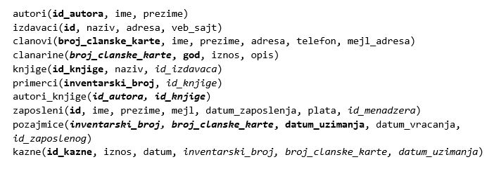

Упит SELECT са спајањем табела - нерешени задаци
================================================

Решити следеће задатке писањем упита SELECT. Приликом решавања нерешених задатака погледајте претходно решене примере који узимају податке из исте базе. 

Упити се пишу и покрећу када се кликне *New Query* након што се покрене систем *SQL Server* и кликне на креирану базу *Biblioteka* у прозору *Object Explorer*. Фајл са упитима *SQLQuery1.sql* може, а и не мора да се сачува.

Након што се унесе једна команда, кликне се на дугме **Execute**. Уколико се у простору за писање команди налази више њих, потребно је обележити ону коју желимо да покренемо. Ако имате више база података, обавезно проверите да ли је поред овог дугмета назив базе у којој желите да вршите упите.

Сви SELECT упити који следе имају и **пројекцију и селекцију** и обрађују податке из базе података библиотеке. Следи списак свих табела са колонама. Примарни кључеви су истакнути болд, а страни италик. 

.. infonote::

    **НАПОМЕНА**: Решења ових задатака се могу пронаћи у лекцији посвећеној спајању табела у упиту SELECT у оквиру материјала за предмет „Базе података“ у трећем разреду гимназије за ученике са посебним способностима за рачунарство и информатику. Лекција се налази на следећој адреси:

    https://petlja.org/kurs/7963/12/6723 

.. questionnote::

    1. Написати упит којим се, уз презиме члана, приказују износ и година плаћене чланарине.

.. questionnote::

    2. Написати упит којим се, уз презиме и имејл адресу члана, приказују износ и година плаћене чланарине, али само за чланове који имају имејл адресу. Податке приказати уређене абецедно по презимену.

.. questionnote::

    3. Написати упит којим се приказују назив књиге и назив њеног издавача.

.. questionnote::

    4. Написати упит којим се приказују презиме запосленог и презиме његовог менаџера.

.. questionnote::

    5. Написати упит којим се приказују име и презиме члана, датум позајмице, инвентарски број примерка и идентификациони број књиге за све позајмице током месеца маја 2019. године.

.. questionnote::

    6. Написати упит којим се приказују подаци о тренутно издатим књигама (текуће позајмице): име и презиме члана, датум позајмице, инвентарски број примерка и идентификациони број књиге.

.. questionnote::

    7. Написати упит којим се приказују подаци о свим позајмицама: име и презиме члана, датум позајмице, инвентарски број узетог примерка и назив књиге.

.. questionnote::

    8. Написати упит којим се приказују назив књиге и име аутора. Резултат уредити по називу књиге.

.. questionnote::

    9. Написати упит којим се приказују називи књиге чији је један од аутора Мијодраг Ђуришић.

.. questionnote::

    10. Написати упит којим се приказују називи књига које је из библиотеке узимао члан са бројем чланске карте 22, али без понављања. Дакле, уколико је члан током година колико је члан библиотеке узимао исту књигу неколико пута, назив те књиге треба да се прикаже само једном.

.. questionnote::

    11. Написати упит којим се приказују имена чланова и имена аутора чије су књиге читали, без понављања (исти члан је могао да чита неколико књига истог аутора).

.. questionnote::

    12. Написати упит којим се приказују називи издавача и називи њихових књига. Приказати и издаваче чијих књига нема у библиотеци.

.. questionnote::

    13. Написати упит којим се приказују називи издавача и називи њихових књига. Приказати и издаваче чијих књига нема у библиотеци. Уредити списак абецедно по називу издавача.
