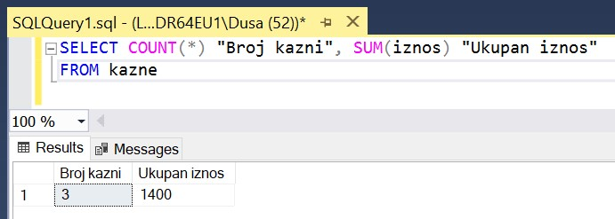
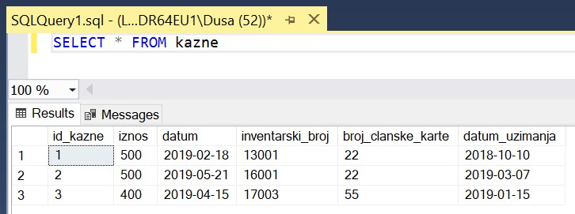
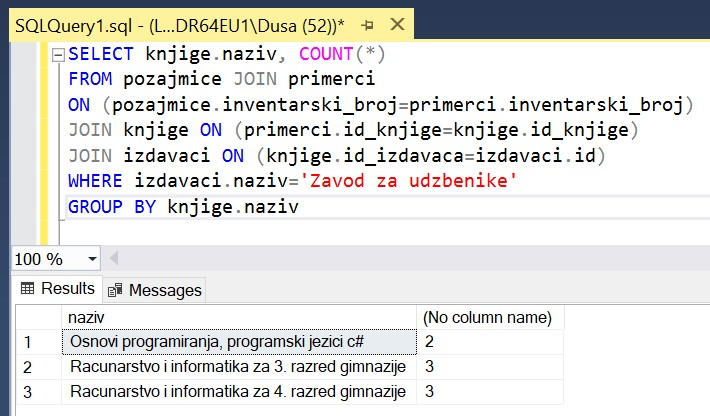

Упит SELECT са групним функцијама и подупитима
==============================================

.. suggestionnote::

    У упитима се често користе групне функције и подупити па ће њима бити посвећена посебна пажња. За разлику од примера који су раније приказани на делу базе података за библиотеку, у примерима који сада следе може да буде потребно и спајање табела, тј. неки од примера су такви да се подаци узимају из по две или више повезаних табела. 

    Приказани примери могу да буду садржани, у виду угњеждених упита, у програмима помоћу којих приступамо бази података. Касније у материјалима ћемо неке од њих и употребити унутар програмског кода писаног другим програмским језиком. 

Сви приказани задаци су у вези са табелама које чине базу података за библиотеку. Следи списак свих табела са колонама. Примарни кључеви су истакнути болд, а страни италик. 

.. image:: ../../_images/slika_122d.jpg
    :width: 800
    :align: center

Упити се пишу и покрећу када се кликне *New Query *након што се покрене систем *SQL Server* и кликне на креирану базу *Biblioteka* у прозору *Object Explorer*. Фајл са упитима *SQLQuery1.sql* може, а и не мора да се сачува.

Након што се унесе једна команда, кликне се на дугме **Execute**. Уколико се у простору за писање команди налази више њих, потребно је обележити ону коју желимо да покренемо. Ако имате више база података, обавезно проверите да ли је поред овог дугмета назив базе у којој желите да вршите упите.

.. image:: ../../_images/slika_122c.jpg
    :width: 400
    :align: center

.. infonote::

    НАПОМЕНА: Решења ових задатака се могу пронаћи у лекцијама посвећеним пројекцији и селекцији у упиту SELECT из једне табеле у оквиру материјала за предмет „Базе података“ у трећем разреду гимназије за ученике са посебним способностима за рачунарство и информатику. Лекције се налазе на следећим адресама:

    https://petlja.org/kurs/7963/11/6714
    https://petlja.org/kurs/7963/11/6717

.. questionnote::

    1. Разматра се могућност да се уведу одређена ограничења члановима библиотеке који нередовно враћају књиге. Једна од мера би можда била да се њима не издају ретке књиге које су често тражене, а драстичнија мера би могла да подразумева и укидање чланства. Да би се на добар начин донела одлука, библиотека је одлучила да пажљиво проучи списак чланова који касне са враћањем књига и због тога плаћају казне да би се видело колико има таквих чланова и да ли има неких међу њима који се баш истичу. 

**Задатак 1:** Написати упит којим се приказује број до сада плаћених казни и укупан износ. 

:: 

    SELECT COUNT(*) "Broj kazni", SUM(iznos) "Ukupan iznos"
    FROM kazne

На следећој слици можемо да видимо резултат овог упита. 

Нови називи колона у приказу резултата нису неопходни, па следи основни облик овог упита. 

::

    SELECT COUNT(*), SUM(iznos)
    FROM kazne

Када анализирамо садржај целе табеле, можемо да уочимо да имамо плаћене три казне до сада и да је укупан износ добијен сабирањем вредности из колоне *iznos*. 

**Задатак 2:** Написати упит којим се пребројавају чланови који су до сада каснили са враћањем књига и због тога плаћали казне. 

::

    SELECT COUNT(DISTINCT broj_clanske_karte)
    FROM kazne

Као што смо могли да видимо у колони *broj_clanske_karte* на слици у претходном задатку на којој је приказан комплетан садржај табеле *kazne*, исти члан може да плати неколико казни, па је важно да се елиминишу дупли прикази. Реч DISTINCT се увек користи уз неки конкретан податак, а никад уз звездицу.  

**Задатак 3:** Написати упит којим се приказују имена и презимена чланова, уз број плаћених казни. Списак уредити по члановима.

::

    SELECT ime, prezime, COUNT(*)
    FROM kazne JOIN clanovi
    ON (kazne.broj_clanske_karte=clanovi.broj_clanske_karte)
    GROUP BY ime, prezime
    ORDER BY ime, prezime

**Задатак 4:** Написати упит којим се приказују имена и презимена чланова, уз број плаћених казни, који имају више од једне плаћене казне. Списак уредити по члановима.

::

    SELECT ime, prezime, COUNT(*)
    FROM kazne JOIN clanovi
    ON (kazne.broj_clanske_karte=clanovi.broj_clanske_karte)
    GROUP BY ime, prezime
    HAVING COUNT(*)>1
    ORDER BY ime, prezime

**Задатак 5:** Написати упит који враћа име и презиме члана који је платио највећи износ казне до сада. 

Под претпоставком да висина износа казне зависи од броја дана колико се каснило са враћањем књиге, решење овог упита може да издвоји члана или чланове са неодговорним понашањем. 

::

    SELECT DISTINCT ime, prezime
    FROM kazne JOIN clanovi
    ON (kazne.broj_clanske_karte=clanovi.broj_clanske_karte)
    WHERE iznos = (SELECT MAX(iznos) FROM kazne)

.. questionnote::

    2. У току месеца маја је акција и библиотека поклања по једну књигу својим верним члановима који тог месеца дођу да позајме књиге. Тренутно је у библиотеку дошла Милица Зорановић и библиотекар жели да провери како изгледа њена историја чланства, тј. да ли је већ дужи низ година члан библиотеке. 

**Задатак:** Написати упит којим се приказује број година када је Оливера Стошић била члан библиотеке, тј. за које је платила чланарину.  

::

    SELECT COUNT(god)
    FROM clanovi JOIN clanarine
    ON (clanovi.broj_clanske_karte=clanarine.broj_clanske_karte)
    WHERE ime='Olivera' AND prezime='Stosic'

У овом примеру можемо да употребимо и звездицу, па следећи упит има исти резултат.

::

    SELECT COUNT(*)
    FROM clanovi JOIN clanarine
    ON (clanovi.broj_clanske_karte=clanarine.broj_clanske_karte)
    WHERE ime='Olivera' AND prezime='Stosic'

.. questionnote::

    3. Библиотека разматра да наручи још књига Завода за уџбенике. Да би донели ту одлуку, потребно је да се види колико су књиге овог издавача тражене. 

**Задатак 1:** Написати упит којим се приказује укупан број позајмице књига чији је издавач Завод за уџбенике. 

::

    SELECT COUNT(*)
    FROM pozajmice JOIN primerci 
    ON (pozajmice.inventarski_broj=primerci.inventarski_broj)
    JOIN knjige ON (primerci.id_knjige=knjige.id_knjige)
    JOIN izdavaci ON (knjige.id_izdavaca=izdavaci.id)
    WHERE izdavaci.naziv='Zavod za udzbenike'

**Задатак 2:** Написати упит којим се приказује број позајмица сваке књиге чији је издавач Завод за уџбенике. 

::

    SELECT knjige.naziv, COUNT(*)
 FROM pozajmice JOIN primerci 
 ON (pozajmice.inventarski_broj=primerci.inventarski_broj)
 JOIN knjige ON (primerci.id_knjige=knjige.id_knjige)
 JOIN izdavaci ON (knjige.id_izdavaca=izdavaci.id)
 WHERE izdavaci.naziv='Zavod za udzbenike'
 GROUP BY knjige.naziv

Овај извештај нам даје више података од претходног, зато што имамо јасан преглед и које књиге ове издавачке куће су тражене. 

**Задатак 3:** Написати упит којим се приказује за сваког издавача укупан број позајмица његових књига. 

::

    SELECT izdavaci.naziv, COUNT(*)
    ROM pozajmice JOIN primerci 
    ON (pozajmice.inventarski_broj=primerci.inventarski_broj)
    JOIN knjige ON (primerci.id_knjige=knjige.id_knjige)
    JOIN izdavaci ON (knjige.id_izdavaca=izdavaci.id)
    GROUP BY izdavaci.naziv

Резултат овог упита можемо да употребимо тако да видимо како стоји потражња књига Завода за уџбенике у односу на књиге других издавача. 

**Задатак 4:** Написати упит којим се приказују издавачке куће чије се књиге често позајмљују из библиотеке, тј. чији је број позајмица већи од 3.  

::

    SELECT izdavaci.naziv, COUNT(*)
    FROM pozajmice JOIN primerci 
    ON (pozajmice.inventarski_broj=primerci.inventarski_broj)
    JOIN knjige ON (primerci.id_knjige=knjige.id_knjige)
    JOIN izdavaci ON (knjige.id_izdavaca=izdavaci.id)
    GROUP BY izdavaci.naziv
    HAVING COUNT(*)>3

.. questionnote::

    4. Тренутно се размишља о корекцији износа за чланарине и корекцији попуста у ситуацијама где се остварује попуст на чланарину. Да би се донела добра одлука, потребно је проучити како се кретао износ просечне чланарине до сада. 

**Задатак 1:** Написати упит којим се приказује просечна висина чланарине. 

::

    SELECT AVG(iznos) FROM clanarine

**Задатак 2:** Написати упит којим се приказује просечна висина чланарине за сваку годину. 

::

    SELECT god, AVG(iznos)
    FROM clanarine
    GROUP BY god

.. questionnote::

    5. Наредног месеца ће бити повећање плата запослених у библиотеци за све оне којима је плата тренутно мања од просечне плате свих запослених. Потребан је списак особа које очекује повећање да би се обавиле административне припреме.  

**Задатак:** Написати упит којим се приказују подаци о запосленима који зарађују мање од просека.

Подупит враћа просечну плату. 

::

    SELECT AVG(plata) FROM zaposleni

Вредност коју враћа овај упит користи спољни упит да издвоји запослене чија је плата мања од тог износа. 

::

    SELECT * FROM zaposleni
    WHERE plata < (SELECT AVG(plata) FROM zaposleni)

.. questionnote::

    6. Члан библиотеке је питао за препоруку. Интересује га која је књига и од које издавачке куће тражена најскорије. 

**Задатак:** Написати упит којим се приказује назив издавача и назив књиге која је издата током последње, тј. најновије позајмице. 

Подупит враћа датум најскорије позајмице. 

::

    SELECT MAX(datum_uzimanja) FROM pozajmice

Вредност коју враћа овај упит користи спољни упит да издвоји позајмице које су се десиле баш тог дана. 

::

    SELECT knjige.naziv "Knjiga", izdavaci.naziv "Izdavac"
    FROM pozajmice JOIN primerci ON (pozajmice.inventarski_broj=primerci.inventarski_broj)
    JOIN knjige ON (primerci.id_knjige=knjige.id_knjige)
    JOIN izdavaci ON (knjige.id_izdavaca=izdavaci.id)
    WHERE datum_uzimanja = (SELECT MAX(datum_uzimanja) FROM pozajmice)

.. questionnote::

    7. Члан библиотеке Милица Зорановић је дошла у библиотеку и пита за препоруку књиге. Библиотекарка је одлучила да извуче списак књига које су читали други чланови библиотеке који су читали бар неку од књига које је читала и Милица, тј. неки избор књига других чланова библиотеке чији се укус бар делимично поклапа са Миличиним. Милица онда може да изабере неки од наслова који јој се допадне са тог списка. 

**Задатак 1:** Написати упит којим се приказују, без понављања, чланови библиотеке који су прочитали бар једну књигу коју је прочитала и Милица Зорановић. 

::

    SELECT DISTINCT ime+' '+prezime
    ROM clanovi JOIN pozajmice ON (pozajmice.broj_clanske_karte=clanovi.broj_clanske_karte)
    JOIN primerci ON (pozajmice.inventarski_broj=primerci.inventarski_broj)
    WHERE id_knjige =ANY (
    SELECT id_knjige
    FROM clanovi JOIN pozajmice ON (pozajmice.broj_clanske_karte=clanovi.broj_clanske_karte)
    JOIN primerci ON (pozajmice.inventarski_broj=primerci.inventarski_broj)
    WHERE ime='Milica' AND prezime='Zoranovic' )
    AND ime!='Milica' AND prezime!='Zoranovic'

Уместо оператора =ANY је могао да се употреби оператор IN. 

**Задатак 2:** Написати упит којим се приказује, без понављања, списак свих књига које су читали чланови библиотеке који су прочитали бар једну књигу коју је прочитала и Милица Зорановић. 

::

    SELECT DISTINCT knjige.naziv 
    FROM clanovi JOIN pozajmice 
    ON (pozajmice.broj_clanske_karte=clanovi.broj_clanske_karte)
    JOIN primerci ON (pozajmice.inventarski_broj=primerci.inventarski_broj)
    JOIN knjige ON (primerci.id_knjige=knjige.id_knjige)
    WHERE ime+' '+prezime IN ( SELECT DISTINCT ime+' '+prezime
    FROM clanovi JOIN pozajmice 
    ON (pozajmice.broj_clanske_karte=clanovi.broj_clanske_karte)
    JOIN primerci ON (pozajmice.inventarski_broj=primerci.inventarski_broj)
    WHERE id_knjige =ANY (
    SELECT id_knjige
    FROM clanovi JOIN pozajmice 
    ON (pozajmice.broj_clanske_karte=clanovi.broj_clanske_karte)
    JOIN primerci ON (pozajmice.inventarski_broj=primerci.inventarski_broj)
    WHERE ime='Milica' AND prezime='Zoranovic' )
    AND ime!='Milica' AND prezime!='Zoranovic')
