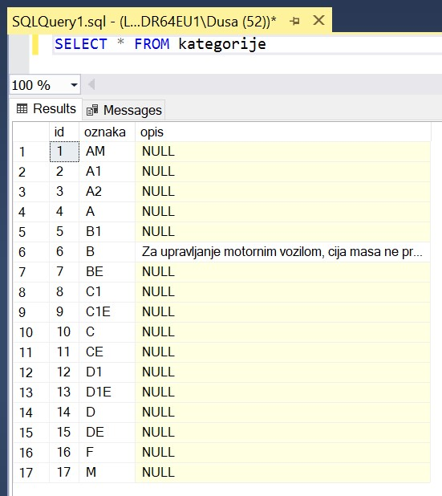

Дијаграм и унети подаци
=======================

Након што је креирана комплетна база података, можемо да креирамо њен дијаграм. Кликнути десни тастер миша над *Database Diagrams* под базом података за евиденцију издатих возачких дозвола и изабрати *New Database Diagram*. 

У наредном кораку додати све табеле. 

Према потреби зумирати или одаљити слику и испремештати табеле. Добијени дијаграм је приказан на следећој слици. 

Дијаграм може да се сачува. 

Након чувања може да се пронађе у прозору *Object Explorer* и да се поново отвори. Уколико се не прикаже одмах, потребно је урадити *Refresh*. 

Покретањем једноставних упита можемо да видимо како изгледају попуњене табеле. 

