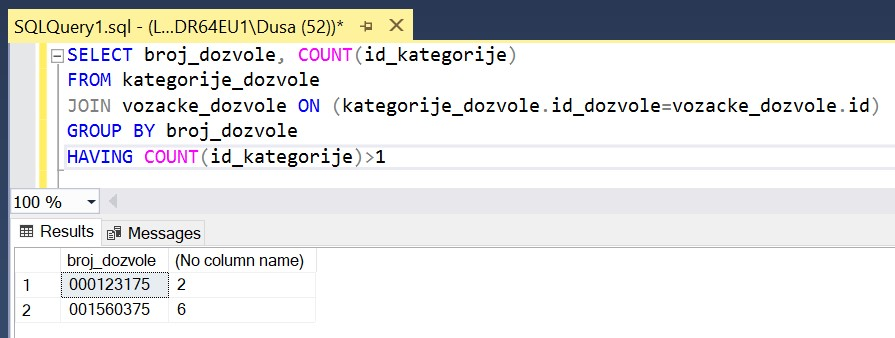

Упит SELECT - задаци
====================

.. suggestionnote::

    Следе примери проблема који се решавају писањем упита SELECT у оквиру базе података за евиденцију издатих возачких дозвола. Неки примери се односе на упите из једне табеле, у некима имамо и спајање табела, а у некима имамо и групне функције и подупите. 

    Приказани примери могу да буду садржани, у виду угњеждених упита, у програмима помоћу којих приступамо бази података. Касније у материјалима ћемо неке од њих и употребити унутар програмског кода писаног другим програмским језиком. 

Сви SELECT упити који следе обрађују податке из базе података за евиденцију издатих возачких дозвола. Следи списак свих табела са колонама. Примарни кључеви су истакнути болд, а страни италик. 

Упити се пишу и покрећу када се кликне *New Query* након што се покрене систем *SQL Server* и кликне на креирану базу *Izdate_dozvole* у прозору *Object Explorer*. Фајл са упитима *SQLQuery1.sql* може, а и не мора да се сачува.

Након што се унесе једна команда, кликне се на дугме **Execute**. Уколико се у простору за писање команди налази више њих, потребно је обележити ону коју желимо да покренемо. Ако имате више база података, обавезно проверите да ли је поред овог дугмета назив базе у којој желите да вршите упите. 

.. image:: ../../_images/slika_133b.jpg
    :width: 350
    :align: center

.. questionnote::

    1. Написати упит који приказује име и презиме особе чији је број возачке дозволе 000123175.

:: 

    SELECT ime, prezime
    FROM vozacke_dozvole 
    WHERE broj_dozvole='000123175'

.. questionnote::

    2. Написати упит којим се приказују подаци о возачким дозволама које обухватају категорију са ознаком В, као и датум када су је стекли.   

::

    SELECT broj_dozvole, prezime, ime, datum_izdavanja, 
    datum_prestanka, datum_sticanja
    FROM vozacke_dozvole 
    JOIN kategorije_dozvole ON (kategorije_dozvole.id_dozvole=vozacke_dozvole.id)
    JOIN kategorije ON (kategorije_dozvole.id_kategorije=kategorije.id)
    WHERE oznaka='B'

У упиту могу да се користе скраћени називи за табеле, што упит чини краћим. 

::

    SELECT vd.broj_dozvole, vd.prezime, vd.ime, vd.datum_izdavanja, 
    vd.datum_prestanka, kd.datum_sticanja
    FROM vozacke_dozvole vd
    JOIN kategorije_dozvole kd ON (kd.id_dozvole=vd.id)
    JOIN kategorije k ON (kd.id_kategorije=k.id)
    WHERE k.oznaka='B'

.. questionnote::

    3. Написати упит којим се приказују подаци о свим категоријама на дозволи са бројем 001560375. 

::

    SELECT oznaka 
    FROM vozacke_dozvole JOIN kategorije_dozvole
    ON (kategorije_dozvole.id_dozvole=vozacke_dozvole.id)
    JOIN kategorije ON (kategorije_dozvole.id_kategorije=kategorije.id)
    WHERE broj_dozvole='001560375'

У упиту могу да се користе скраћени називи за табеле, што упит чини краћим. 

::

    SELECT oznaka
    FROM vozacke_dozvole vd JOIN kategorije_dozvole kd
    ON (kd.id_dozvole=vd.id)
    JOIN kategorije k ON (kd.id_kategorije=k.id)
    WHERE broj_dozvole='001560375'

.. questionnote::

    4. Написати упит којим се приказују све категорије које су стечене пре 1. јануара 2020. године. Приказати поред ознаке категорије, име и презиме особе и датум стицања категорије. Резултат уредити по ознаци категорије. 

::

    SELECT oznaka, ime, prezime, datum_sticanja
    FROM kategorije JOIN kategorije_dozvole
    ON (kategorije_dozvole.id_kategorije=kategorije.id)
    JOIN vozacke_dozvole ON (kategorije_dozvole.id_dozvole=vozacke_dozvole.id)
    WHERE datum_sticanja<'2020-01-01'
    ORDER BY oznaka

.. questionnote::

    5. Написати упит којим се приказује списак различитих категорија (ознака) за које имамо издате возачке дозволе у Београду.

::

    SELECT DISTINCT oznaka
    FROM kategorije JOIN kategorije_dozvole
    ON (kategorije_dozvole.id_kategorije=kategorije.id)
    JOIN vozacke_dozvole ON (kategorije_dozvole.id_dozvole=vozacke_dozvole.id)
    JOIN gradovi ON (vozacke_dozvole.id_grada=gradovi.id)
    WHERE gradovi.naziv='BEOGRAD'

.. questionnote::

    6. Написати упит којим се приказује број различитих категорија (ознака) за које имамо издате возачке дозволе у Београду.

::

    SELECT COUNT(oznaka)
    FROM kategorije JOIN kategorije_dozvole
    ON (kategorije_dozvole.id_kategorije=kategorije.id)
    JOIN vozacke_dozvole ON (kategorije_dozvole.id_dozvole=vozacke_dozvole.id)
    JOIN gradovi ON (vozacke_dozvole.id_grada=gradovi.id)
    WHERE gradovi.naziv='BEOGRAD'

Према подацима које смо видели на слици у претходном задатку, овај упит треба да врати број 7.

.. questionnote::

    7. Написати упит којим се за сваку возачку дозволу приказује број категорија које покрива. 

У овом решењу није потребно да спајамо и табелу у којој се чувају подаци о категоријама. Довољно је да пребројимо *id_kategorije* у табели *kategorije_dozvole*. 

::

    SELECT broj_dozvole, COUNT(id_kategorije)
    FROM kategorije_dozvole
    JOIN vozacke_dozvole ON (kategorije_dozvole.id_dozvole=vozacke_dozvole.id)
    GROUP BY broj_dozvole

На следећој слици можемо да видимо како су пребројане категорије за сваку дозволу. 

.. questionnote::

    8. Написати упит којим се приказују возачке дозволе које покривају више категорија. 

Решење овог задатка се добија надоградњом претходног. За сваку дозволу морамо да избројимо категорије које покрива, а онда да проберемо оне где је тај број већи од 1. 

::

    SELECT broj_dozvole, COUNT(id_kategorije)
    FROM kategorije_dozvole
    JOIN vozacke_dozvole ON (kategorije_dozvole.id_dozvole=vozacke_dozvole.id)
    GROUP BY broj_dozvole
    HAVING COUNT(id_kategorije)>1

.. questionnote::

    9. Написати упит којим се добијају подаци о особи или особама које су стекле категорију В пре Бранислава Зорановића. 

Подупит треба да врати датум када је Бранислав Зорановић стекао дозволу за категорију В. 

::

    SELECT broj_dozvole, ime, prezime
    FROM vozacke_dozvole JOIN kategorije_dozvole
    ON (kategorije_dozvole.id_dozvole=vozacke_dozvole.id)
    JOIN kategorije ON (kategorije_dozvole.id_kategorije=kategorije.id)
    WHERE oznaka='B' AND datum_sticanja < (SELECT datum_sticanja
        FROM vozacke_dozvole JOIN kategorije_dozvole
        ON (kategorije_dozvole.id_dozvole=vozacke_dozvole.id)
        JOIN kategorije ON (kategorije_dozvole.id_kategorije=kategorije.id)
        WHERE oznaka='B' AND ime='Branislav' AND prezime='Zoranovic')

Када би постојале две особе са именом и презименом Бранислав Зораноић овај упит не би био коректан зато што би подупит вратио више вредности. Једно од могућих проширења је да се користи <ALL пре подупита. 