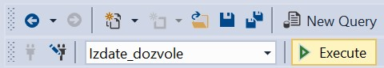

Упит SELECT - нерешени задаци
=============================

Решити следеће задатке писањем упита SELECT. Приликом решавања нерешених задатака погледајте претходно решене примере који узимају податке из исте базе. 

Упити се пишу и покрећу када се кликне *New Query* након што се покрене систем *SQL Server* и кликне на креирану базу *Izdate_dozvole* у прозору *Object Explorer*. Фајл са упитима *SQLQuery1.sql* може, а и не мора да се сачува.

Након што се унесе једна команда, кликне се на дугме **Execute**. Уколико се у простору за писање команди налази више њих, потребно је обележити ону коју желимо да покренемо. Ако имате више база података, обавезно проверите да ли је поред овог дугмета назив базе у којој желите да вршите упите. 

ви SELECT упити који следе обрађују податке из базе података за евиденцију издатих возачких дозвола. Следи списак свих табела са колонама. Примарни кључеви су истакнути болд, а страни италик. 

.. image:: ../../_images/slika_133a.jpg
    :width: 780
    :align: center

.. questionnote::

    1. Написати упит којим се приказује датум до када важи и број возачке дозволе Јанка Мировића. 

.. questionnote::

    2. Написати упит којим се приказују подаци о свим категоријама на дозволи са бројем 001560375.   

.. questionnote::

    3. Написати упит којим се приказују све дозволе које ће важити и после 1. јуна 2024. године. 

.. questionnote::

    4. Додати податке о бар још једној возачкој дозволи која је издата у неком другом граду.  

.. questionnote::

    5. Написати упит којим се приказује списак различитих градова у којима имамо издате возачке дозволе категорије AM. 

.. questionnote::

    6. Написати упит којим се приказује број различитих градова у којима имамо издате возачке дозволе категорије AM.

.. questionnote::

    7. Написати упит којим се за сваку категорију приказује број издатих дозвола. 

.. questionnote::

    8. Написати упит којим се добијају подаци о особи или особама којима дозвола важи дуже од тренутно издате дозволе Браниславу Зорановићу.

.. questionnote::

    9. Написати упит којим се приказују све категорије за које није унет опис. 
    Напомена: Упит поново покренути након уноса описа за неколико категорија. 

.. questionnote::

    10. Пронаћи опис за још бар једну категорију и додати тај податак у базу. 
    Напомена: Како подаци о категоријама већ постоје у бази, потребно је ажурирати одређени ред. Следи пример.

    ::

        UPDATE kategorije
        SET opis='mopedi, laki tricikli i laki cetvorocikli'
        WHERE oznaka='AM'   
