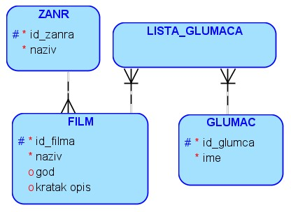
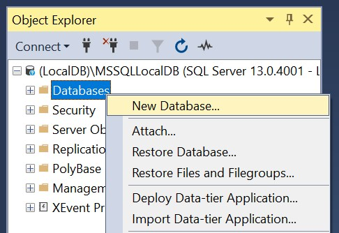
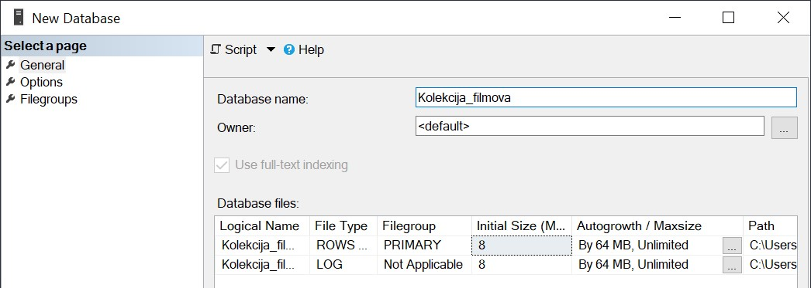
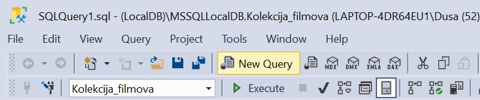
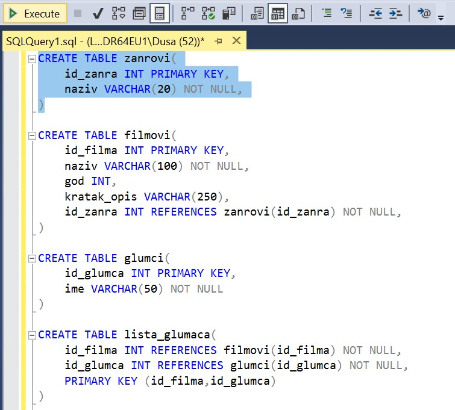

База података за филмове - креирање базе
========================================

.. suggestionnote::

    Следи још један практичан задатак инспирисан стварним примером из живота у којем се ради са великим количинама података. Креираћемо базу података за евиденцију филмова. Овај мали пример може да се посматра као део базе података неке онлајн платформе за пуштање филмова.

    Приказани пример базе података за колекцију филмова ћемо касније употребити тако што ћемо креирати програме у којима ћемо јој приступати. 

На следећој слици је приказан модел базе података у којој чувамо основне податке о филмовима, жанровима и глумцима. Ради једноставности базе података, име и презиме глумца чувамо у једном пољу. Иако је могуће да два глумца имају исто име и презиме, глумци често узимају уметничка имена, баш да би били јединствени, па ћемо из тог разлога у задацима сматрати да је врло вероватно да је име глумца јединствено. Исто тако ћемо у задацима претпоставити да је име филма врло вероватно јединствено. Ово нећемо поставити као ограничења приликом креирања табела управо из разлога што, изузетно ретко, може да се догоди да се два филма зову исто, као и да два глумца имају исто име и презиме.  

У филму „Indiana Jones“ из 1981. године глуми Harrison Ford. У филму „Hunger Games“ из 2012. године глуми Jennifer Lawrence. У филмовима „Star Wars: Episode IV“, „Star Wars: Episode V“ и „Star Wars: Episode VI“ глуме Harrison Ford и Carrie Fisher. Филм „Indiana Jones“ је „avantura“, док су остали „fantastika“.

Креирати базу података за библиотеку употребом алата **SQL Server Management Studio**. 

Кликнути десни тастер миша над **Databases** у прозору *Object Explorer* и изабрати *New Database...*

Унети назив нове базе података и кликнути дугме OK. 

Новокреирана база података се појавила на списку у прозору *Object Explorer*. Кликнути дугме *New Query* испод главног падајућег менија. 

Прво извршити све **CREATE TABLE команде**, једну по једну.

.. infonote::

    **Редослед је битан!** Пре креирања табеле која има страни кључ неопходно је креирати табелу на коју она показује. 

Све команде могу да се истовремено прекопирају, али се свака појединачно прво означи мишем и за сваку означену команду се кликне *Execute*, као што је приказано на следећој слици. 

После сваке успешно извршене команде појави се одговарајућа порука.

.. image:: ../../_images/slika_141f.jpg
    :width: 350
    :align: center

Након што се свака команда изврши, све табеле ће остати сачуване у бази података за даљу употребу. Фајл *SQLQuery1.sql* може, а и не мора да се сачува.

Следе све CREATE TABLE команде за табеле базе података за библиотеку. 

::

    CREATE TABLE zanrovi(
    id_zanra INT PRIMARY KEY,
    naziv VARCHAR(20) NOT NULL
    )

    CREATE TABLE filmovi(
    id_filma INT PRIMARY KEY,
    naziv VARCHAR(100) NOT NULL,
    god INT,
    kratak_opis VARCHAR(250),
    id_zanra INT REFERENCES zanrovi(id_zanra) NOT NULL
    )

    CREATE TABLE glumci(
    id_glumca INT PRIMARY KEY,
    ime VARCHAR(50) NOT NULL
    )   

    CREATE TABLE lista_glumaca(
    id_filma INT REFERENCES filmovi(id_filma) NOT NULL,
    id_glumca INT REFERENCES glumci(id_glumca) NOT NULL,
    PRIMARY KEY (id_filma,id_glumca)
    )

Након што су све табеле креиране, појављују се на списку у прозору *Object Explorer*. Ако се не виде, потребно је кликнути *Refresh*. 

Уколико је прозор за писање команди угашен, кликнути поново дугме *New Query* испод главног падајућег менија. Све команде могу да се истовремено прекопирају, али се свака појединачно прво означи мишем и за сваку означену команду се кликне *Execute*. 

Након што се свака команда изврши, сви подаци ће остати сачувани у бази података за даљу употребу. Фајл *SQLQuery1.sql* може, а и не мора да се сачува.

Извршити све **INSERT INTO** команде, једну по једну. Када редом уносимо податке у све колоне, можемо да изоставимо списак назива колона.

.. infonote::

    **Редослед је битан!**

::

    INSERT INTO zanrovi
    VALUES (1, 'fantastika')

    INSERT INTO zanrovi
    VALUES (2, 'avantura')

    INSERT INTO filmovi
    VALUES (1, 'Indiana Jones', 1981, null, 2)

    INSERT INTO filmovi
    VALUES (2, 'Hunger Games', 2012, null, 1)

    INSERT INTO filmovi
    VALUES (3, 'Star Wars: Episode IV', null, null, 1)

    INSERT INTO filmovi
    VALUES (4, 'Star Wars: Episode V', null, null, 1)

    INSERT INTO filmovi
    VALUES (5, 'Star Wars: Episode VI', null, null, 1)

    INSERT INTO glumci
    VALUES (1,'Harrison Ford')

    INSERT INTO glumci
    VALUES (2,'Jennifer Lawrence')

    INSERT INTO glumci
    VALUES (3,'Carrie Fisher')

    INSERT INTO lista_glumaca
    VALUES (1, 1)

    INSERT INTO lista_glumaca
    VALUES (2, 2)

    INSERT INTO lista_glumaca
    VALUES (3, 1)

    INSERT INTO lista_glumaca
    VALUES (3, 3)

    INSERT INTO lista_glumaca
    VALUES (4, 1)

    INSERT INTO lista_glumaca
    VALUES (4, 3)

    INSERT INTO lista_glumaca
    VALUES (5, 1)   

    INSERT INTO lista_glumaca
    VALUES (5, 3)

