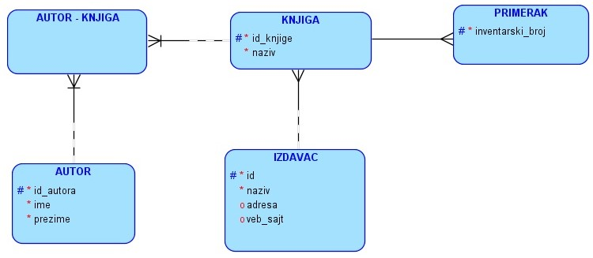
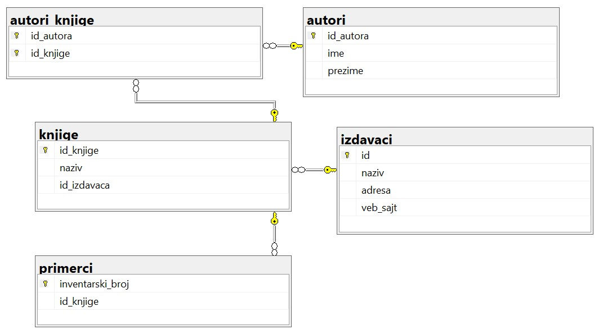
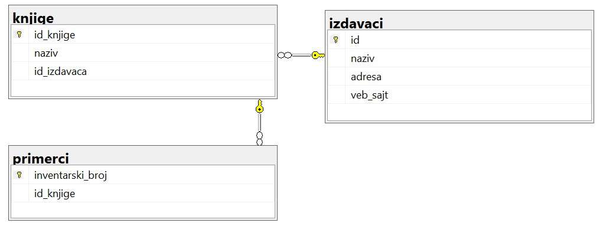
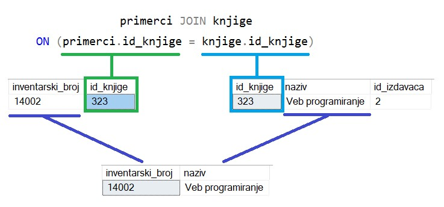
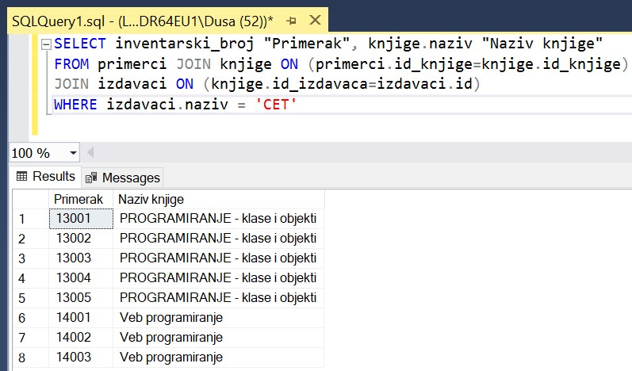
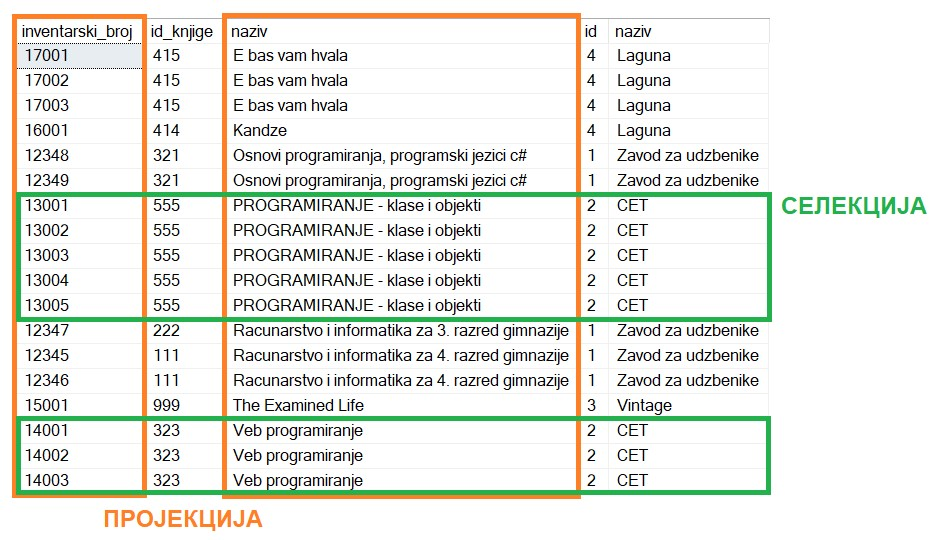

Добијање информација из података - упит SELECT
==============================================

.. suggestionnote::

    Људи су одувек имали потребу да гомилају велике количине података. Размисли само колико података има у папирном облику у разним архивама. Оно што разликује системе за управљање базама података од других начина чувања података је могућност да брзо и поуздано дођемо до корисних информације на основу велике количине сачуваних података. 

    Уколико, на пример, имамо базу података за библиотеку, могло би да нам буде значајно да видимо колико књига имамо од неког популарног аутора или колико примерака имамо неке награђене књиге, па уколико је тај број мали, библиотека може да наручи додатне примерке тражених књига. 

    Ово је само један мали пример корисних информација које можемо да добијемо из базe. Упит SELECT је управо команда језика SQL којом ефикасно из великих количина сачуваних података добијамо информације. У овом уводу имамо кратак приказ пројекције, селекције и спајања табела, док ће сви ови могући елементи упита SELECT бити постепено разрађени и објашњени у пар наредних лекција. 

    Приказани примери могу да буду садржани, у виду угњеждених упита, у програмима помоћу којих приступамо бази података. Касније у материјалима ћемо многе од њих и употребити унутар програмског кода писаног другим програмским језиком. 

Вратимо се на пример са делом базе података за библиотеку у којем се складиште подаци о свим примерцима књига које се налазе у библиотеци.

На следећој слици је приказан дијаграм креиране базе података према овом моделу. 

Следи списак свих табела са колонама. Примарни кључеви су истакнути болд, а страни италик. 

.. image:: ../../_images/slika_111c.jpg
    :width: 450  
    :align: center

Можемо да погледамо део садржаја ових табела. На слици видимо по неколико редова (укупно 13 примерака 5 различитих књига). У овим табелама које су већ креиране у претходним лекцијама има још редова, а права библиотека би имала много више унетих податка. Такође, база података библиотеке мора да има још неколико табела у којима би се чували подаци о члановима и изнајмљивању књига, тј. о позајмицама. 

На слици су бојама означени неки примери веза међу подацима који се налазе у различитим табелама да би се илустровало како то повезивање функционише. Плавом бојом су обележене три књиге истог издавача са идентификационим бројем 1. Љубичастом бојом су приказана два примерка књиге са идентификационим бројем 111. А зеленом и наранџастом је обележено како је у бази сачуван податак о томе да је Мијодраг Ђуришић један од аутора књиге „Основи програмирања, програмски језик с#“. 

.. image:: ../../_images/slika_111d.jpg
    :width: 800
    :align: center

Након што се креира база података, у њу се уносе подаци, а на основу свих унетих података се добијају разне корисне и неопходне информације. Те информације се активно користе у пословању које користи базу података. Већину ових информација би било немогуће добити, или би било тешко брзо добити, без рачунара и база података на њима. Команда језика SQL којом добијамо информације је **упит SELECT**.

Упит SELECT има најмање два дела, такозване клаузулe, SELECT део и FROM део. Најједноставније што можемо да напишемо након резервисане речи SELECT је звездица са значењем да су нам потребни подаци из свих колона. Након речи FROM наводимо бар једну табелу из које упит треба да узме податке. 

::

    SELECT * FROM izdavaci

Језик SQL није осетљив на велика и мала слова, тако да све можемо да пишемо великим словима, или малим, или комбиновано. Ипак, неке речи пишемо великим словима, а неке малим, ради боље читљивости команди. 

Упити се пишу и покрећу када се кликне *New Query* након што се покрене систем *SQL Server* и кликне на креирану базу *Biblioteka_knjige* у прозору *Object Explorer*. Фајл са упитима *SQLQuery1.sql* може, а и не мора да се сачува.

Након што се унесе једна команда, кликне се на дугме **Execute**. Уколико се у простору за писање команди налази више њих, потребно је обележити ону коју желимо да покренемо. Уколико имате више база података, обавезно проверите да ли је поред овог дугмета назив базе у којој желите да вршите упите. 

Упити најчешће у себи имају: 

- пројекцију – избор само неких података за приказ, тј. податке из само одређених колона,
- селекцију – избор само неких редова из табеле по одређеном услову претраге, 
- спајање табела – тражени подаци се налазе у различитим табелама и треба да их повежемо.

Узмимо, на пример, да библиотека жели да провери колико има примерака књига чији је издавач СЕТ да би размотрили да ли да набављају још књига овог издавача. За сваки примерак је пожељно да се види и која је књига у питању да би се размотрило могуће додатно набављање и појединих наслова овог издавача који се већ налазе у библиотеци.  

На основу овог захтева долазимо до следећег задатка. 

**Задатак**: Написати упит којим се приказују инвентарски бројеви и назив књига издавача чији је назив CET. Изменити заглавља колона у приказу резултата тако да буду редом „*Primerak*“ и „*Naziv knjige*“. 

Анализираћемо поступак како формирамо решење, тј. упит SELECT.

Након речи SELECT у упиту набрајамо податке који су нам потребни и додајемо између наводника нова заглавља колона у приказу резултата. 

Подаци који су нам потребни: инвентарски број примерка, назив књиге и назив издавача се налазе у три различите табеле. 

У делу FROM упита је потребно ове табеле спојити по вредностима комбинација: страни кључ и одговарајући примарни кључ, тј. примарни кључ на који страни кључ показује. За идентификациони број књиге једног примерка треба у табели knjige да пронађемо која је то књига. 

Када спајамо три табеле, спојимо две па онда додамо спајање треће. Након што повежемо примерке и књиге, на исти начин за књигу треба да у табели *izdavaci* погледамо ко је њен издавач.

Када две табеле имају по колону са истим називом, тада је неопходно да испред назива колоне додамо назив табеле. У осталим ситуацијама не морамо да пишемо назив табеле. Тако је довољно да напишемо само назив колоне *inventarski_broj* зато што је јасно да је то колона из табеле *primerci*, док за идентификациони број књиге морамо да пишемо *primerci.id_knjige* или *knjige.id_knjige* јер су то две колоне у различитим табелама. 

Услов селекције, а то је услов да се издвоје само примерци књига издавача чији је назив CET, додајемо у WHERE део упита. 

Следи цео упит. 

::

    SELECT inventarski_broj "Primerak", knjige.naziv "Naziv knjige"
    FROM primerci JOIN knjige ON (primerci.id_knjige=knjige.id_knjige)
    JOIN izdavaci ON (knjige.id_izdavaca=izdavaci.id)
    WHERE izdavaci.naziv = 'CET'

У овом упиту је прво дошло до спајања три табеле, а затим су издвојени подаци из колона *inventarski_broj* и *knjiga.naziv*, и подаци из оних редова који одговарају постављеним условима. 

Када добијемо резултат упита, подаци нису уређени на одређени начин. Уколико желимо уређене податке, на крај упита мора да се дода део ORDER BY. Подразумевано је растуће сортирање. 

Следећа модификација упита враћа исти списак, али је тај списак уређен по називу књиге, а ако имамо више примерака исте књиге, ти примерци ће бити уређени по инвентарском броју. 

::

    SELECT inventarski_broj "Primerak", knjige.naziv "Naziv knjige"
    FROM primerci JOIN knjige ON (primerci.id_knjige=knjige.id_knjige)
    JOIN izdavaci ON (knjige.id_izdavaca=izdavaci.id)
    WHERE izdavaci.naziv = 'CET'
    ORDER BY knjige.naziv, inventarski_broj
