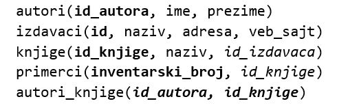
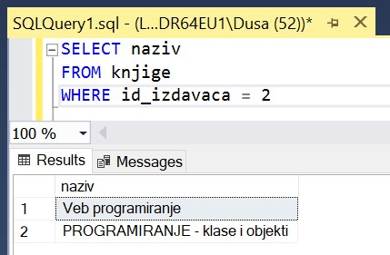
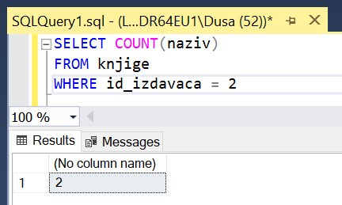
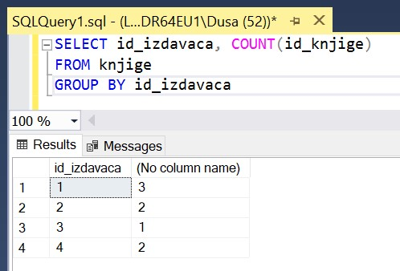
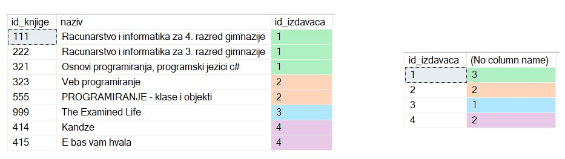
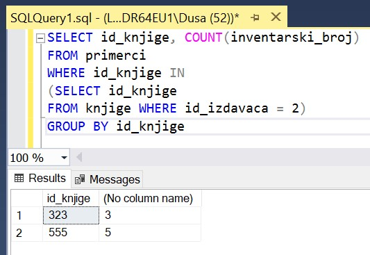
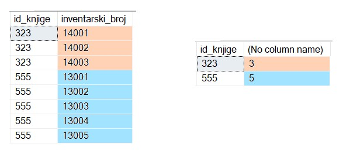

Добијање информација из података - упит SELECT са групним фукнцијама и подупитима - задаци
==========================================================================================

.. suggestionnote::

    У упитима се често користе групне функције и подупити, па ће њима бити посвећена посебна пажња. У примерима који следе нема спајања табела, тј. подаци се узимају из по једне табеле. 

    Приказани примери могу да буду садржани, у виду угњеждених упита, у програмима помоћу којих приступамо бази података. Касније у материјалима ћемо неке од њих и употребити унутар програмског кода писаног другим програмским језиком. 

Сви приказани задаци у вези са табелама које чине део базе података за библиотеку. Следи списак свих табела са колонама. Примарни кључеви су истакнути болд, а страни италик. 

Упити се пишу и покрећу када се кликне *New Query* након што се покрене систем *SQL Server* и кликне на креирану базу *Biblioteka_knjige* у прозору *Object Explorer*. Фајл са упитима *SQLQuery1.sql* може, а и не мора да се сачува.

Након што се унесе једна команда, кликне се на дугме **Execute**. Уколико се у простору за писање команди налази више њих, потребно је обележити ону коју желимо да покренемо. Ако имате више база података, обавезно проверите да ли је поред овог дугмета назив базе у којој желите да вршите упите. 

.. image:: ../../_images/slika_114b.jpg
    :width: 400
    :align: center

Књиге издавача СЕТ са идентификационим бројем 2 су веома тражене и библиотека жели да провери да ли има довољно наслова овог издавача у понуди.

.. infonote::

   НАПОМЕНА: На основу овог захтева има смисла формулисати неколико различитих задатка.

.. questionnote::

    **Задатак 1:** Написати упит којим се приказују називи књига издавача са идентификационим бројем 2

::

    SELECT naziv
    FROM knjige
    WHERE id_izdavaca = 2

Овакав пример упита смо већ анализирали и он спада у једноставније упите из једне табеле. Можемо да приметимо у резултату да постоје две књиге овог издавача: „Veb-programiranje“ и „PROGRAMIRANJE – klase i objekti“.

.. questionnote::

    **Задатак 2:** Написати упит којим се приказује број књига издавача са идентификационим бројем 2. 

У овом решењу ћемо употребити групну функцију. **Групне функције** враћају један резултат за више редова. Поред функције COUNT, која пребројава редове, неке од најчешће коришћених групних функција су: MIN, MAX, SUM и AVG. Функција за рачунање суме SUM и функција за рачунање просека AVG раде само са бројевима. Функције MIN и MAX раде са свим типовима података чије вредности могу да се упоређују. 

::

    SELECT COUNT(naziv)
    FROM knjige
    WHERE id_izdavaca = 2

Као што смо у претходној верзији задатка видели када смо покренули упит без позива групне функције, 
постоје две књиге овог издавача: „Veb-programiranje“ и „PROGRAMIRANJE – klase i objekti“.

Могла је и да се употреби звездица (*) са истим резултатом. Када употребимо звездицу, пребројавање се обавља по колони која је примарни кључ у табели и враћа број редова. 

::

    SELECT COUNT(*)
    FROM knjige
    WHERE id_izdavaca = 2

.. questionnote::

    **Задатак 3:** Написати упит којим се за сваког издавача приказује број књига.

Када се реши овај упит, може да се види и број књига издавача са идентификационим бројем 2, али и да се тај број упореди са бројем књига које имамо од других издавача. Том анализом можемо већ да проценимо да ли имамо одговарајуће већи број књига траженог издавача и у којој мери тај број можемо да повећамо. 

Када је потребно да се пребројавање изврши по групама редова, у овом случају да за сваког издавача пребројимо редове у којима се налазе његове књиге, неопходно је да додамо део GROUP BY.

::

    SELECT id_izdavaca, COUNT(id_knjige)
    FROM knjige
    GROUP BY id_izdavaca

На следећој слици можемо да видимо списак свих књига и како су наслови пребројани у групама по идентификационом броју издавача. 

Уколико желимо да после резултата рачунања групне функције урадимо неку селекцију, неопходно је да додамо део HAVING. У овом случају би имало смисла да препознамо оне издавача за које имамо мање од три наслова. Након додавања дела HAVING, била би приказана три издавача од укупно четири. 

::

    SELECT id_izdavaca, COUNT(id_knjige)
    FROM knjige
    GROUP BY id_izdavaca
    HAVING COUNT(id_knjige) < 3

.. questionnote::

    **Задатак 4:** Написати упит којим се приказују инвентарски бројеви књига издавача са идентификационим бројем 2. 

::

    SELECT inventarski_broj
    FROM primerci
    WHERE id_knjige IN 
    (SELECT id_knjige 
    FROM knjige WHERE id_izdavaca = 2)

У табели *primerci* имамо идентификациони број књиге, али је неопходно да издвојимо само оне књиге које је објавио изабрани издавач. Податак о издавачу се налази у табели *knjige*. Проблем можемо да решимо употребом подупита. **Подупит** је упит које се налази као део другог упита и том другом, тј. спољном упиту, даје вредност која је неопходна за претрагу. 

У нашем примеру подупит издваја списак књига издавача са идентификационим бројем 2. 

:: 

    SELECT id_knjige 
    FROM knjige WHERE id_izdavaca = 2

Спољни упит узима тај списак и помоћу оператора IN проверава да ли је појединачни примерак управо примерак неке од књига на овом списку. 

Овај задатак може да се реши и помоћу спајања табела што ће бити приказано у неким од примера који следе. 

.. questionnote::

    **Задатак 5:** Написати упит којим се приказује број примерака за сваку књигу издавача са идентификационим бројем 2. 

::

    SELECT id_knjige, COUNT(inventarski_broj)
    FROM primerci
    WHERE id_knjige IN 
    (SELECT id_knjige 
    FROM knjige WHERE id_izdavaca = 2)
    GROUP BY id_knjige

Да бисмо боље разумели како се овај упит извршио, можемо да погледамо мало упит из претходног задатка у којем се уз инвентарски број примерка приказује и идентификациони број књиге. 

::

    SELECT id_knjige, inventarski_broj
    FROM primerci
    WHERE id_knjige IN 
    (SELECT id_knjige 
    FROM knjige WHERE id_izdavaca = 2)
    ORDER BY id_knjige

На следећој слици је илустровано како се извршило пребројавање примерака за сваку књигу. 

Овај задатак може да се реши и помоћу спајања табела, што ће бити приказано у неким од примера који следе. 

