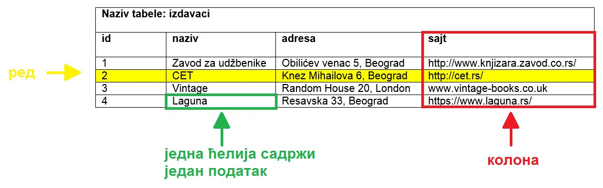
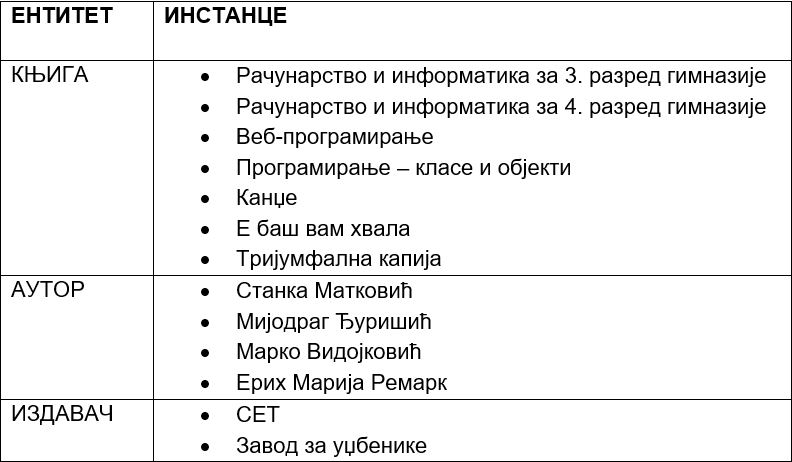
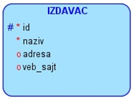
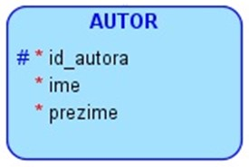

Релационе базе података
=======================

.. suggestionnote::
    У данашње време се свуда срећемо са великим количинама података, посебно када користимо информационе технологије.
    Подаци долазе у најразличитијим форматима. Могу да буду текстуални подаци, бројеви, слике, звучни записи, 
    видео-записи итд. Подаци се организују и чувају у базама података. База података је појам који користимо да у рачунарству
    назовемо систем који најчешће има велики број корисника, а служи за ефикасно и сигурно чување и обраду података. 

    Базе података користимо преко програма, тј. апликација за рачунаре и мобилне уређаје, 
    па је важно да видимо како се креирају такви програми. Програми које ћемо креирати обрађују податке из 
    база података па је за њихово креирања неопходно да се темељно разумеју концепт релационе базе и језик SQL, а посебно упит SELECT.

    У оквиру предмета „Базе података“ у трећем разреду гимназије за ученике са посебним способностима за 
    рачунарство и информатику си се већ упознао са релационим базама података, од пројектовања до рада 
    са готовом базом који подразумева претраживање и обраду података.

    Комплетан материјал за предмет у трећем разреду се налази на следећој адреси:
    https://petlja.org/kurs/7963

    Кроз први део материјала који су пред тобом направићемо осврт на најважније из трећег разреда:

    - упознаћемо се са потребом креирања база података и са примерима база података који се виђају свакодневно;
    - дефинисаћемо појам релационе базе података и система за управљање базама података; 
    - обрдићемо детаљно неколико практичних примера од којих је сваки инспирисан стварним примерима из живота у којима се ради са великим количинама података: 
    - база података за библиотеку, 
    - база података за евиденцију издатих возачких дозвола,
    - база података за колекцију филмова,
    - база података за компанију за продају дигиталних композиција.

    Како је главна тема предмета у четвртом разреду писање програма који у себи имају команде упитног језика SQL, 
    примере приказане у овом делу материјала ћемо касније проширити тако што ћемо креирати програме у којима ћемо их употребити. 

Посредно, преко апликација за рачунаре и мобилне уређаје, као и путем веб-сајтова, можете да видите и користите податке који се чувају у базама података. Базу података у данашње време има већина веб-сајтова, као и свака пошта, банка, дом здравља, библиотека у које уђете. На пример, следећи системи имају базе података:

- онлајн продаја (подаци: називи производа, произвођачи, цене...),
- веб-сајт аеродрома (подаци: ознаке летова, дестинације, долазна и одлазна времена...),
- онлајн банка (подаци: лични подаци клијента банке, стање на рачуну, списак новчаних уплата и исплата...),
- друштвене мреже (подаци: лични подаци корисника, корисничка имена, фотографије, постови, листе пријатеља...),
- дом здравља (подаци: бројеви картона и лични подаци пацијената, датуми и извештаји са прегледа, датуми и описи болести, преписани лекови...),
- електронски дневник (подаци: лични подаци ученика, лични подаци наставника, називи школских предмета, датуми и времена одржаних часова, садржаји одржаних часова, изостанци ученика, датуми и вредности добијених оцена...),
- итд...

Узмимо, на пример, **библиотеку**. У библиотеци се налази велики број књига и за сваку књигу имамо више података који је описују: назив, аутор, издавачка кућа, година издања... Од сваке књиге можемо да имамо један, али можемо да имамо и више примерака. Сваки примерак у библиотеци је обележен инвентарским бројем. Члановима библиотеке издајемо примерке књига које траже и водимо рачуна о томе када су узели књигу, и да ли су је вратили у року. Члан библиотеке се постаје након учлањења, процеса који подразумева да се оставе лични подаци као што су: име, презиме, адреса, број телефона, број личне карте... Као што може да се види, рад библиотеке подразумева рад са подацима, и то са подацима о књигама, члановима, издавањем књига. Сви ови подаци су се обрађивали и пре постанка рачунара, ручним путем и на папиру. У данашње време свака библиотека је дигитализовала своје пословање, има рачунаре и има базу података и апликацију помоћу које користи ту базу.

.. infonote::
    НАПОМЕНА: Иако је ћирилично писмо сада већ широко присутно у информационо-комуникационим технологијама, није га могуће баш свуда користити без потешкоћа. Дешава се да пошаљете имејл са ћириличним словима, а да особа која га је примила види само кукице и друге чудне знакове. Или  можете да погледате шта се дешава ако прекопирате линк који је на ћирилици. Из тог разлога, у свим примерима табела и података ће се користити латинична слова. Поред тога, називи табела и колона, зато што се користе у наредбама програмског језика, пишу се словима енглеске абецеде, тј. такозваном шишаном латиницом. Њима одговарају називи ентитета и атрибута у фази пројектовања, па се и они често, мада не мора увек, пишу такође шишаном латиницом. Да би се избегли могући проблеми са нашим словима, ћириличним и латиничним, чак и за податке у бази ће се у овим материјалима користити шишана латиница.

Анализирајмо део базе података за библиотеку у којем се складиште подаци о свим примерцима књига које се налазе у библиотеци.

Основна јединица за организацију и чување података у релационој бази података је **табела**. Управо због тога што су подаци организовани у табелама, а у математици релацију представљамо табелом, следи назив **релационе базе података**. 

У релационој бази података ће се, на пример, сви подаци о издавачима чувати у табели izdavaci. Табела се састоји од редова и колона. У једном реду се чувају подаци о једном издавачу. Конкретно, СЕТ је назив једне издавачке куће, и сви подаци о том издавачу се налазе у једном реду. Једна колона садржи једну врсту податка, на пример, у једној колони се чувају само адресе веб-сајтова издавача. Једна ћелија (пресек реда и колоне) садржи један податак.

У пракси нам углавном за сваку табелу треба једна колона преко које можемо једнозначно да одређујемо поједине редове у табели. Та колона се назива **примарни кључ** и најчешће у називу те колоне стоји *id* (идентификациони број). На претходној слици можемо да видимо, на пример, да је 2 идентификациони број издавачке куће СЕТ.

Приликом пројектовања, када креирамо логички модел који је пројекат на основу којег се креира база, треба да предвидимо **ентитет** за сваку табелу коју ћемо имати у релационој бази података. Називи ентитета су увек именице у једнини. **Атрибути** тог ентитета ће бити колоне табеле у бази. 

Сваки ентитет има више **инстанци**. Свакој инстанци ће одговарати један ред у табели у релационој бази података. 

Неки ентитети су јаки. На примеру књига, јаки ентитети су IZDAVAC и AUTOR. Они постоје независно, за разлику од књиге коју је неко морао да напише и неко морао да објави, па је то слаб ентитет (не постоји независно). 

Атрибути се обележавају једним од три симбола:

- тарабица – примарни јединствени идентификатор који ће да буде примарни кључ PRIMARY KEY у табели (подразумева да мора да буде попуњен и да мора да има јединствену вредност),
- звездица – обавезно мора да се унесе, одговара ограничењу NOT NULL у табели, 
- кружић – опционо, овај податак може, али не мора да се унесе у базу. 

.. learnmorenote::
    ВАЖНО: Готово увек се уводи вештачки идентификациони број као примарни кључ. То су неки бројеви који се појављују само у бази и немају значај ван ње. Ретки изузетак су неке ситуације када можемо неки број који се користи ван базе података да употребимо за примарни кључ. На пример, број чланске карте члана библиотеке који пише на чланској карти, или инвентарски број примерка књиге који пише на првој страни примерка. Никад примарни кључ не сме да буде текстуални податак, као што је назив државе или назив издавача. То би довело до тога да исти податак чувамо на много места у бази, и тамо где је примарни и тамо где је страни кључ, па би тиме направили простор за непотребно гомилање, отежано ажурирање (промени се назив, а онда на много места мора да се измени у бази) и већу могућност грешке.

Посебан језик за рад са релационим базама података базама података је **језик SQL** (енг. *Structured Query Language*). Језик није осетљив на велика и мала слова, али ипак понешто пишемо великим, а понешто малим словима, да би код био читљивији.

Следи програмски код за креирање табеле *izdavaci*. Док су називи ентитета увек именице у једнини, називи табела су именице у множини. За сваку колону табеле коју креирамо треба да наведемо назив и тип податка. Поред тога наводимо и неко од ограничење по потреби (PRIMARY KEY, NOT NULL, UNIQUE). Неки од најчешћих типова података су: INT, за целе бројеве, и VARCHAR, за текстуалне податке. 

::

    CREATE TABLE izdavaci
    ( id INT PRIMARY KEY, 
    naziv VARCHAR(40) NOT NULL UNIQUE, 
    adresa VARCHAR(50), 
    veb_sajt VARCHAR(50) UNIQUE)

Податке о једном издавачу уносимо у базу података командом INSERT INTO. 

::
    
    INSERT INTO izdavaci
    VALUES (2, 'CET', 'Knez Mihailova 6, Beograd', 'http://cet.rs/')

Уколико, међутим, хоћемо да унесемо податке у другачијем редоследу, или хоћемо да изоставио податак који можемо да изоставимо (колона нема NOT NULL   ограничење), морамо да наведемо одговарајући списак колона. Следе примери.

::

    INSERT INTO izdavaci(id, naziv, veb_sajt, adresa)
    VALUES (2, 'CET', 'http://cet.rs/', 'Knez Mihailova 6, Beograd')

    INSERT INTO izdavaci(id, naziv, adresa)
    VALUES (2, 'CET', 'Knez Mihailova 6, Beograd')

У случају последње наведене команде, поље *veb_sajt* ће остати празно, тј. биће *null*. Исти резултат може да се постигне и експлицитним уносом вредности *null* у одговарајуће поље. 

::

    INSERT INTO izdavaci
    VALUES (2, 'CET', 'Knez Mihailova 6, Beograd', null)

Следеће две команде се **неће** успешно извршити. 

#. Већ постоји издавачка кућа са идентификационим бројем 2 (вредности примарног кључа морају да буду јединствене).

::

    INSERT INTO izdavaci
    VALUES (2, 'Vintage', 'Random House 20, London', 'www.vintage-books.co.uk')

2. Вредности морају да се унесу у колоне које су примарни кључ или имају NOT NULL ограничење.  

::

    INSERT INTO izdavaci
    VALUES (null, null, 'Random House 20, London', 'www.vintage-books.co.uk')

Следећи јак ентитет је AUTOR. 

Име и презиме се најчешће чувају као два податка у две колоне. По потреби увек можемо да их спојимо приликом приказа, али се претрага често обавља по имену или по презимену. Када би се увек име и презиме састојали од тачно по једне речи, могли би да их чувамо заједно па по потреби да их раздвојимо. Међутим, има ситуација када то није могуће. Погледајте следећа два примера:

- Уна Јована Вајић – две речи чине име, 
- Теодор фон Бург – две речи чине презиме. 

Следи програмски код за креирање табеле *autori*. 

::

    CREATE TABLE autori
    ( id_autora INT PRIMARY KEY, 
    ime VARCHAR(15) NOT NULL, 
    prezime VARCHAR(15) NOT NULL )

Податке о једном аутору уносимо у базу података наредбом INSERT INTO. 

::

    INSERT INTO autori
    VALUES (105, 'Marko', 'Vidojkovic')

.. infonote::
    НАПОМЕНА: У правој великој бази података би се чувало много више података и о издавачима и о ауторима, али овај пример је мањег обима прилагођен времену које имамо на располагању у настави.  

