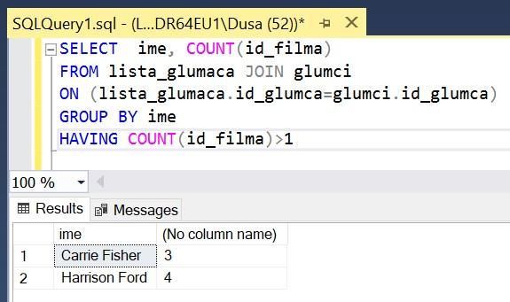

Упит SELECT
===========

.. suggestionnote::

    Ево неколико примера задатака који се решавају писањем упита SELECT у оквиру базе података за колекцију филмова, која може да се посматра као део базе података неке онлајн платформе за пуштање филмова. Након ових решених следи већа група нерешених задатака..

    Приказани примери могу да буду садржани, у виду угњеждених упита, у програмима помоћу којих приступамо бази података. Касније у материјалима ћемо неке од њих и употребити унутар програмског кода писаног другим програмским језиком. 

Сви SELECT упити који следе обрађују податке из базе података за колекцију филмова. Следи списак свих табела са колонама. Примарни кључеви су истакнути болд, а страни италик. 

.. image:: ../../_images/slika_143a.jpg
    :width: 780
    :align: center

Упити се пишу и покрећу када се кликне *New Query* након што се покрене систем *SQL Server* и кликне на креирану базу *Kolekcija_filmova* у прозору *Object Explorer*. Фајл са упитима *SQLQuery1.sql* може, а и не мора да се сачува.

Након што се унесе једна команда, кликне се на дугме **Execute**. Уколико се у простору за писање команди налази више њих, потребно је обележити ону коју желимо да покренемо. Ако имате више база података, обавезно проверите да ли је поред овог дугмета назив базе у којој желите да вршите упите. 

.. image:: ../../_images/slika_143b.jpg
    :width: 350
    :align: center

.. questionnote::

    1. Написати упит којим се приказује година када је снимљен филм са називом „Indiana Jones“.

::

    SELECT god FROM filmovi
    WHERE naziv='Indiana Jones'

.. questionnote::

    2. Написати упит којим се приказују називи свих филмова који спадају у жанр „fantastika“. 

::

    SELECT filmovi.naziv 
    FROM filmovi JOIN zanrovi ON (filmovi.id_zanra=zanrovi.id_zanra)
    WHERE zanrovi.naziv='fantastika'

.. questionnote::

    3. Написати упит којим се приказују називи филмова у којима глуми Harrison Ford. Списак уредити абецедно по називу филма.   

::

    SELECT  naziv 
    FROM filmovi JOIN lista_glumaca 
    ON (lista_glumaca.id_filma=filmovi.id_filma)
    JOIN glumci ON (lista_glumaca.id_glumca=glumci.id_glumca) 
    WHERE ime='Harrison Ford' ORDER BY naziv

.. questionnote::

    4. Написати упит којим се приказује број филмова у којима глуми Harrison Ford.

::

    SELECT COUNT(naziv) 
    FROM filmovi JOIN lista_glumaca 
    ON (lista_glumaca.id_filma=filmovi.id_filma)
    JOIN glumci ON (lista_glumaca.id_glumca=glumci.id_glumca) 
    WHERE ime='Harrison Ford'

.. questionnote::

    5. Написати упит којим се приказује за сваког глумца број филмова у којима глуми.

Решење можемо да добијемо малом надоградњом претходног.

::

    SELECT ime, COUNT(naziv) 
    FROM filmovi JOIN lista_glumaca 
    ON (lista_glumaca.id_filma=filmovi.id_filma)
    JOIN glumci ON (lista_glumaca.id_glumca=glumci.id_glumca) 
    GROUP BY ime

Међутим, како нам нису потребни називи филмова, не морамо да укључимо табелу *filmovi*, већ је довољно да спојимо две табеле. 

.. questionnote::

    6. Написати упит којим се приказују само глумци који глуме у више филмова које имамо у колекцији.

::

    SELECT ime, COUNT(id_filma) 
    FROM lista_glumaca JOIN glumci 
    ON (lista_glumaca.id_glumca=glumci.id_glumca) 
    GROUP BY ime
    HAVING COUNT(id_filma)>1

.. questionnote::

    7. Написати упит којим се приказују различити жанрови у којима је глумио Harrison Ford. 

Како до жанра долазимо на основу филмова у којима је глумио, може да се деси да је глумио у неколико филмова истог жанра, па је неопходно употребити реч DISTINCT приликом пребројавања. 

::

    SELECT COUNT(DISTINCT id_zanra) 
    FROM filmovi JOIN lista_glumaca 
    ON (lista_glumaca.id_filma=filmovi.id_filma)
    JOIN glumci ON (lista_glumaca.id_glumca=glumci.id_glumca) 
    WHERE ime='Harrison Ford'

.. questionnote::

    8. Написати упит којим се приказују глумци који су глумили у бар једном филму заједно са глумцем који се зове Harrison Ford. 

Подупит враћа списак филмова у којима глуми Harrison Ford, а спољни упит приказује оне глумце који глуме у бар једном од тих филмова.

::

    SELECT  DISTINCT ime 
    FROM lista_glumaca JOIN glumci 
    ON (lista_glumaca.id_glumca=glumci.id_glumca) 
    WHERE id_filma IN (SELECT id_filma 
        FROM lista_glumaca JOIN glumci 
        ON (lista_glumaca.id_glumca=glumci.id_glumca) 
        WHERE ime='Harrison Ford'
    )
    AND ime!='Harrison Ford'

Уместо оператора IN смо могли да користимо =ANY.