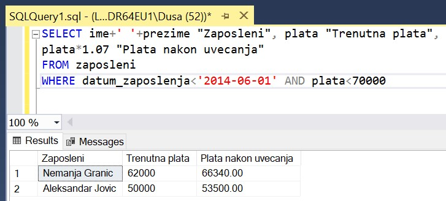
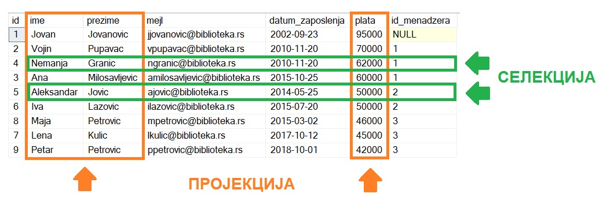

База података за библиотеку - упит SELECT из једне табеле
==========================================================

.. suggestionnote::

    Након што се креира база података, у њу се уносе подаци, а на основу свих унетих података се добијају разне корисне и неопходне информације. Те информације се активно користе у пословању које користи базу података. Већину ових информација би било немогуће добити, или би било тешко добити брзо, без рачунара и база података на њима. 

    Следе примери реалних проблема у вези са радом библиотеке који се решавају писањем упита SELECT. У примерима нема спајања табела. 

    Приказани примери могу да буду садржани, у виду угњеждених упита, у програмима помоћу којих приступамо бази података. Касније у материјалима ћемо неке од њих и употребити унутар програмског кода писаног другим програмским језиком. 

Упит из једне табеле најчешће у себи има и пројекцију и селекцију, тј. постоји и избор података које желимо да прикажемо и из којих колона су нам потребни подаци у складу са задатим условом претраге. 

Узмимо, на пример, да библиотека жели да награди повишицом од 7% оне запослене који раде дуго, тј. запослили су се пре 1. јуна 2014. године, а у овом тренутку зарађују мање од 70.000 динара. 

Потребно је написати и покренути упит којим се издвајају запослени који су се запослили пре 1. јуна 2014. године, а у овом тренутку зарађују мање од 70.000 динара. Корисно је и да видимо тренутну плату, као и износ плате након повишице од 7%. Име и презиме запосленог има смисла да се прикаже у једној колони. 

На основу ове анализе долазимо до следећег задатка. 

Написати упит којим се приказују имена и презимена чланова библиотеке који су се запослили пре 1. јуна 2014. године, а у овом тренутку зарађују мање од 70.000. Име и презиме приказати спојено са једним размаком између у једној колони. Приказати и тренутну плату и износ плате након повећања од 7%. Изменити заглавља колона у приказу резултата тако да буду редом „Zaposleni“, „Trenutna plata“  и „Plata nakon uvecanja“. 

::

    SELECT ime+' '+prezime "Zaposleni", plata "Trenutna plata", plata*1.07 "Plata nakon uvecanja"
    FROM zaposleni
    WHERE datum_zaposlenja<'2014-06-01' AND plata<70000

У овом упиту су издвојени подаци из колона *ime*, *prezime* и *plata*, и подаци из оних редова који одговарају постављеним условима. 

Упити се пишу и покрећу када се кликне *New Query *након што се покрене систем *SQL Server* и кликне на креирану базу *Biblioteka* у прозору *Object Explorer*. Фајл са упитима *SQLQuery1.sql* може, а и не мора да се сачува.

Након што се унесе једна команда, кликне се на дугме **Execute**. Уколико се у простору за писање команди налази више њих, потребно је обележити ону коју желимо да покренемо. Ако имате више база података, обавезно проверите да ли је поред овог дугмета назив базе у којој желите да вршите упите.

.. image:: ../../_images/slika_122c.jpg
    :width: 400
    :align: center

Примери упита SELECT који следе имају најчешће и пројекцију и селекцију, и обрађују податке из базе података библиотеке. Следи списак свих табела са колонама. Примарни кључеви су истакнути болд, а страни италик. 

.. image:: ../../_images/slika_122d.jpg
    :width: 800
    :align: center

.. questionnote::

    1. Библиотека планира да умањи износ за плаћање казне за оне који плате казну у најкраћем року. Пре него што обавести чланове библиотеке о новом правилу, важно је да се на подацима који постоје у бази података уради провера и да се испита како би се умањење одразило на појединачне случајеве, и како би се одразило на прилив новца од наплаћивања казни. 

**Задатак:** Написати упит којим се приказују број чланске карте члана коме је издата казна, датум плаћања казне, износ казне и како би изгледао износ казне умањен за 15%. 

Упит има само пројекцију. 

::

    SELECT broj_clanske_karte, datum, iznos, iznos*0.85
    FROM kazne

.. questionnote::

    2. Поштени проналазач је изгубљену чланску карту са бројем 11 донео у библиотеку. Да би могли да је врате члану, потребне су његове контакт информације. 

**Задатак:** Написати упит којим се приказују сви подаци о члану са бројем чланске карте 11.

Упит има само селекцију.

::

    SELECT * FROM clanovi
    WHERE broj_clanske_karte=11

.. questionnote::

    3. Члан Оливера Стошић је дошла у библиотеку након што је изгубила чланску карту. Библиотека треба да јој изда дупликат па је потребно да се провери који је био број њене чланске карте. 

**Задатак:** Написати упит којим се приказује број чланске карте Оливере Стошић.

::

    SELECT broj_clanske_karte FROM clanovi
    WHERE ime='Olivera' AND prezime='Stosic'

Када се претрага обавља према неком датом текстуалном податку, да не би била осетљива на велика и мала слова, често се користе функције UPPER и LOWER, које текст пребацују у велика, односно мала слова, па је могуће написати један од следећа два упита.

::

    SELECT broj_clanske_karte FROM clanovi
    WHERE UPPER(ime)='OLIVERA' AND UPPER(prezime)='STOSIC'

    SELECT broj_clanske_karte FROM clanovi
    WHERE LOWER(ime)='olivera' AND LOWER(prezime)='stosic'

.. questionnote::

    4. Ради лакше комуникације, библиотека је одлучила да креира посебне имејл адресе за све чланове. 

**Задатак:** Написати упит којим се приказују новоформиране имејл адресе свих чланова. Имејл адреса се формира од прва два слова имена, прва три слова презимена и наставка @*biblioteka23.rs* за све чланове. Цела имејл адреса се састоји од малих слова. 

::

    SELECT LOWER(SUBSTRING(ime, 1, 2)+SUBSTRING(prezime, 1, 3))+'@biblioteka23.rs' "Mejl   adrese"
    FROM clanovi

Функција SUBSTRING издваја део текста, а као параметри се наводе позиција од које се креће, а затим број знакова. На пример, SUBSTRING(ime,1,1) узима од прве позиције један знак, SUBSTRING(ime,1,4) узима од прве позиције 4 знака, а SUBSTRING(ime,3,2) узима од треће позиције 2 знака.

.. questionnote::

    . Још нису креиране нове имејл адресе за све чланове библиотеке, а у плану је да се имејлом пошаље неко важно обавештење. Потребно је прво проверити да ли имамо имејл адресе свих чланова. 

**Задатак:** Написати упит којим се приказују подаци о члановима: број чланске карте, презиме и имејл адреса. Уколико члан нема унету имејл адресу, приказати „Nema mejl adresu“.  

::

    SELECT broj_clanske_karte, prezime, ISNULL(mejl_adresa, 'Nema mejl adresu')
    FROM clanovi

Како поља у колони *mejl_adresa* могу да остану празна, да би се приказала јасна порука на месту поља у којем нема податка, користи се функција ISNULL.  

.. questionnote::

    6. Библиотеци је потребан извештај о свим примерцима књига који су тренутно издати. На почетку извештаја је важно да се прикажу књиге које су дуже време код чланова библиотеке.  

**Задатак:** Написати упит којим се приказују инвентарски бројеви примерака књига који су тренутно издати и датуми узимања из библиотеке. Списак уредити по датуму узимања.  

::

    SELECT inventarski_broj, datum_uzimanja FROM pozajmice
    WHERE datum_vracanja IS NULL
    ORDER BY datum_uzimanja

.. questionnote::

    7. Члан библиотеке са својом чланском картом, чији је број 33, дошао је да позајми неке књиге. Пре него што му библиотека изда нове књиге, потребно је да се провери да ли члан тренутно држи неке књиге код себе. 

**Задатак:** Написати упит којим се приказују датуми узимања и инвентарски бројеви књига које се тренутно налазе код члана са бројем чланске карте 33. 

::

    SELECT datum_uzimanja, inventarski_broj
    FROM pozajmice
    WHERE broj_clanske_karte=33 AND datum_vracanja IS NULL

.. questionnote::

    8. Библиотека жели да понуди посебне погодности код плаћања чланарине и резервације књига за чланове који често позајмљују књиге и који књиге враћају у року. У библиотеку је дошао члан са бројем чланске карте 11 и библиотекар жели да провери да ли овај члан испуњава услов да добије погодности. Приликом одлучивања посматрају се, на првом месту, скорије активности члана, тј. скорије позајмице.  

**Задатак**: Написати упит којим се приказују све позајмице члана са бројем чланске карте 11. Приказати инвентарски број, датум узимања и датум враћања сортиран према датуму узимања тако да прво буду приказане скорије позајмице. Уколико члан има више позајмица истог дана, сортирати по датуму враћања. Уколико су књиге позајмљене истог дана и враћене истог дана, сортирати по инвентарском броју.  

::

    SELECT inventarski_broj, datum_uzimanja, datum_vracanja
    FROM pozajmice
    WHERE broj_clanske_karte=11
    ORDER BY datum_uzimanja DESC, datum_vracanja DESC, inventarski_broj

.. questionnote::

    9. Приликом подношења извештаја о свим својим активностима, библиотеци је потребно и да анализира из којих све разлога су чланови библиотеке имали неке попусте или друге специфичне ситуације приликом плаћања чланарина. Део извештаја се посебно концентрише на 2017. и 2018. годину зато што су тих година донете веће измене у пословању библиотеке. 

**Задатак:** Написати упит којим се приказују година, износ и опис за све чланарине плаћене 2017. и 2018. године које имају унет опис.  

::

    SELECT god, iznos, opis
    FROM clanarine
    WHERE opis IS NOT NULL AND god IN (2017,2018)

.. questionnote::

    10. Библиотека је набавила нове књиге аутора који је написао књигу која има само један примерак у библиотеци са инвентарским бројем 15001 и планира да обавести све чланове који су ову књигу читали о томе да сада имају прилику да прочитају још дела истог аутора

**Задатак:** Написати упит којим се приказују бројеви чланских карата свих чланова који су позајмљивали примерак књиге са инвентарским бројем 15001. Како је неки члан могао да више пута у различитим тренуцима позајми ову исту књигу, обезбедити да се елиминише дуплирање података приликом приказа.

::

    SELECT DISTINCT broj_clanske_karte 
    FROM pozajmice 
    WHERE inventarski_broj=15001

.. questionnote::

    11. За могуће повећање плате се разматрају запослени који раде у тиму чији менаџер има идентификациони број 3. Плата би била увећана само онима који имају нижу плату, и то у опсегу од 45.000 динара до 50.000 динара.

**Задатак:** Написати упит којим се приказују име и презиме запослених који зарађују између 45.000 и 50.000, укључујући и те износе, а њихов менаџер има идентификациони број 3. 

::
    
    SELECT ime, prezime FROM zaposleni
    WHERE id_menadzera = 3 AND plata>=45000 AND plata<=50000

У упиту може да се употреби оператор BETWEEN.

::

    SELECT ime, prezime FROM zaposleni
    WHERE id_menadzera = 3 AND plata BETWEEN 45000 AND 50000

.. questionnote::

    12. Библиотека прати и анализира понашање чланова и као један од извештаја проучава све позајмице по месецима. За то ће бити потребни извештаји за сваки месец, на пример, извештај о свим позајмицама током априла 2019. године. 

**Задатак:** Написати упит којим се приказују инвентарски бројеви примерака књига, датум узимања и датум враћања за све позајмице током априла 2019. године. 

::

    SELECT inventarski_broj, datum_uzimanja, datum_vracanja
    FROM pozajmice
    WHERE datum_uzimanja>='2019-04-01' AND datum_uzimanja<='2019-04-30'

