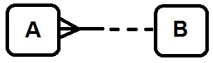
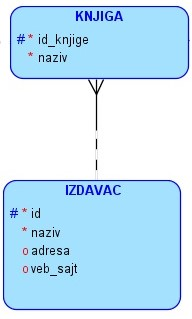
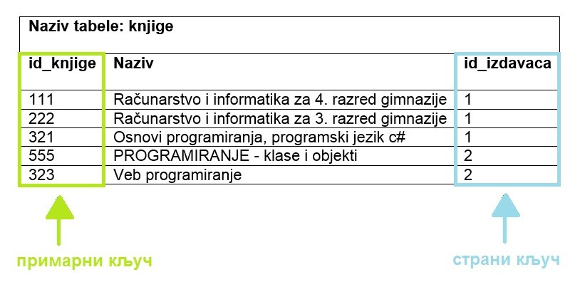
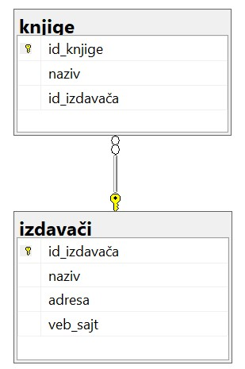
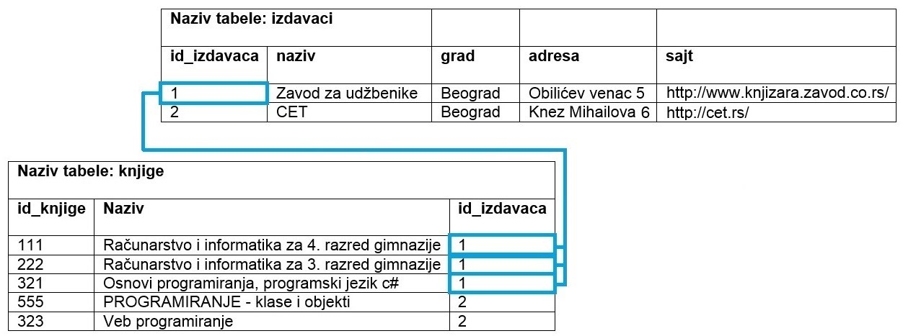
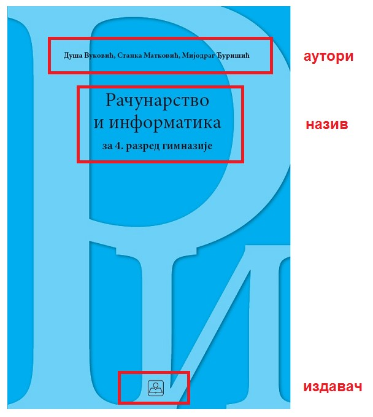
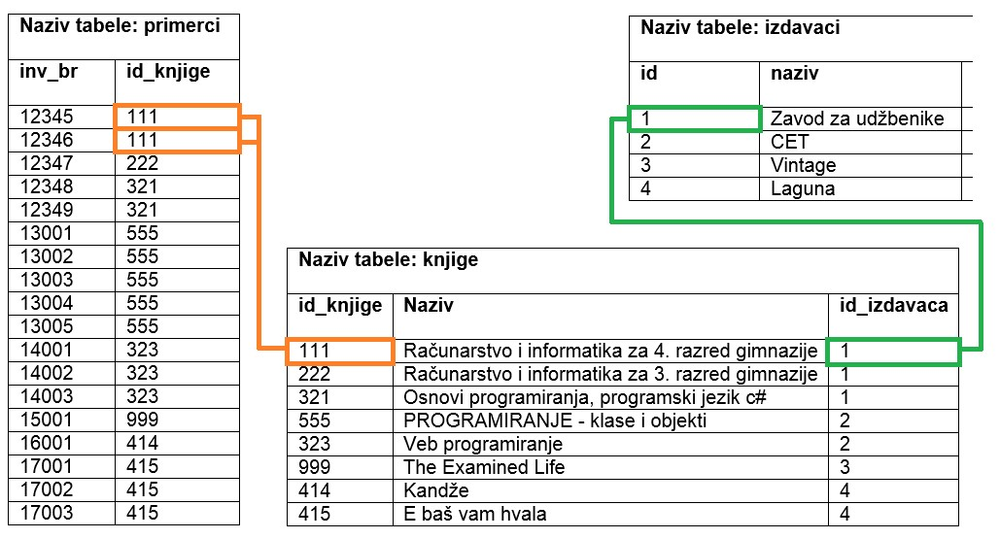
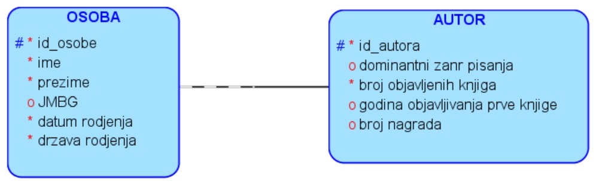
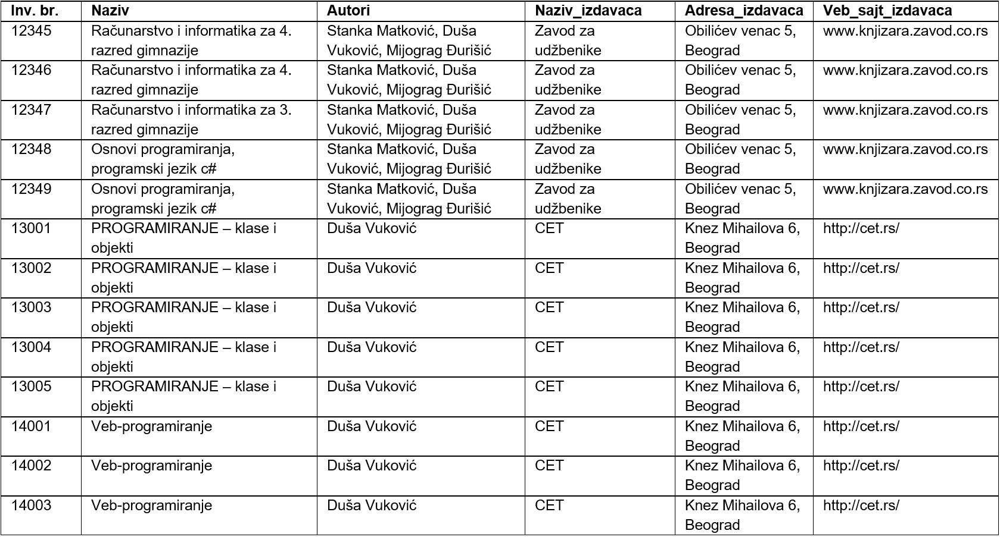

Веза један према више
=====================

.. suggestionnote::

    Подаци који се у животу виде заједно на једном месту, у бази података се чувају у различитим табелама. Уколико погледаш корице неке књиге, највероватније ћеш на њима видети назив књиге, као и основне податке о аутору или ауторима, и издавачу. Ови подаци се у бази података чувају у неколико различитих табела: knjige, autori и izdavaci. Неопходно је и веома важно да имамо механизам на основу којег можемо да видимо како су подаци у једној табели, на пример подаци о једној конкретној књизи, повезани са одговарајућим подацима у другим табелама, тако да можемо да видимо ко је аутор те књиге и ко је издавач те исте књиге.

У фази пројектовања, након што се уоче ентитети и наброје њихови атрибути, потребно је да се ентитети повежу. Свака **веза** спаја два различита ентитета или, искључиво у случају рекурзивне везе, ентитет сам са собом. Везе препознајемо у опису пословања као глаголе: аутор је *написао књигу*, издавачка кућа је *издала књигу*, и тако даље.

Свака веза има: назив, опционалност и кардиналност. Назив је глагол који препознајемо у опису пословања

Опционалност нам говори да ли нека инстанца мора, или може, да буде у вези са инстанцом другог ентитета. Примери:

- књигу мора да напише неки аутор (обавезна веза); 
- члан може, али не мора, да позајми неку књигу (опциона веза);
- књигу мора да објави неки издавач (обавезна веза). 

Некад нам опционална веза служи и за то да можемо у одређеном редоследу да уносимо податке у базу. На пример, наравно да је аутор написао бар једну књигу, али ћемо ставити да аутор може, а не мора, да напише књигу (опциона веза), само зато да бисмо у базу одвојено прво унели податке о аутору, а затим податке о његовим књигама. Обавезна веза би нас условила да уз податке о аутору морамо да унесемо и податке о једној његовој књизи, а онда тај процес уноса не би био баш јасан и чист. Из овог разлога су опционе везе чешће на моделу. 

Кардиналност нам говори да ли је једна инстанца једног ентитета у вези са једном или са више инстанци другог ентитета. Примери:

- аутор је написао више књига (више),
- одређени примерак књиге је издао тачно један издавач (један),
- један издавач је издао више књига (више).

Према крадиналности везе се деле на:

- један-према-један, 1:1
- један-према-више, 1:М
- више-према-више, М:М

Најчешћа веза у релационим базама података је веза **један-према-више, 1:М**. Као ознака за више може да се користи слово М (енг. *Many*), или слово N (слово које користимо за обележавање скупа природних бројева) или ознака за бесконачно. 

Ову везу могу да опишу две реченице:

#. Сваки А мора да буде у вези да тачно једним В. 
#. Сваки В може, а не мора да буде у вези са једним или више А. 

Погледајмо пример издавача и књига. Под условом да библиотека све примерке једне књиге набавља од истог издавача, веза између књиге и издавача је један-према-више. Један издавач је објавио више књига, а једну књигу је објавио тачно један издавач. 

На следећој слици можемо да видимо како изгледа одговарајући део логичког модела који добијамо у фази пројектовања. 

Ову везу могу да опишу следеће две реченице:

#. Сваку књигу мора да објави тачно један издавач. 
#. Сваки издавач може, а не мора, да објави једну или више књига. 

Веза један-према-више се у релационој бази података имплементира тако што додамо још једну колону у табелу која се налази на краку више у вези. У приказаном примеру, табела *knjige* је табела на краку више у вези. Дакле, уз податке о свакој књизи се чува и идентификациони број издавача тако да се зна који издавач је објавио коју књигу. Књига има тачно једног издавача па ово има смисла. За разлику од тога, издавач има много књига и није могуће да уз податке о издавачу чувамо и идентификационе бројеве свих књига које је објавио. 

Ова посебна колона се зове **страни кључ** и служи да се табеле повежу. Помоћу вредности у овој колони видимо како су подаци у једној табели, на пример књиге, повезани са подацима у другој табели, на пример са издавачима. На следећој слици може да се види да је, на пример, 2 вредност шифре издавача (вредност страног кључа, *id_izdavaca*) за књигу „Веб-програмирање“. Већ смо видели да је у табели у којој се налазе подаци о издавачима, СЕТ издавач са шифром 2 (вредност примарног кључа те табеле, *id*). На тај начин може за сваку књигу да се повеже која издавачка кућа ју је објавила. Вредности које се налазе у колони која је страни кључ увек одговарају вредностима које се налазе у колони која је примарни кључ друге табеле. 

Описани део модела се у релационој бази приказује како је илустровано на следећој слици.

На следећој слици је приказано како би ове табеле, повезане кључевима и попуњене подацима, изгледале у бази података. Јасно се види да један издавач може да објави више књига.

Већ смо креирали табелу *izdavaci* следећом командом.

::

    CREATE TABLE izdavaci
    ( id INT PRIMARY KEY, 
    naziv VARCHAR(40) NOT NULL UNIQUE, 
    adresa VARCHAR(50), 
    veb_sajt VARCHAR(50) UNIQUE)

Следи програмски код за креирање табеле *knjige*. У овој табели је потребно да имамо додатну колону *id_izdavaca* и да за њу нагласимо да је страни кључ који показује на примарни кључ, колону *id*, табеле *izdavaci*. Поред дефиниције колоне која је страни кључ неопходно је додати реч **REFERENCES**, а након ње назив табеле и колоне на коју страни кључ показује. Није довољно само предвидети ову додатну колону која представља везу ка другој табели, већ је изузетно важно уз њу дефинисати и да је та колона страни кључ тако што се наведе реч REFERENCES и одговарајућа референца. На тај начин се обезбеђују додатне провере приликом рада са подацима у бази. Тако, на пример, неће бити могуће да се унесе књига са идентификационим бројем издавача који не постоји у табели *izdavaci*. 

У примеру који следи се примарни и страни кључ не зову исто. 

::

    CREATE TABLE knjige
    ( id_knjige INT PRIMARY KEY, 
    naziv VARCHAR(50) NOT NULL, 
    id_izdavaca INT NOT NULL REFERENCES izdavaci(id) )

Приказано је како се страни кључ дефинише уз дефиницију колоне. Могуће је дефинисати и страни кључ након списка свих колона. У том случају је обавезно користити и кључне речи FOREIGN KEY, након којих се у загради наведе назив колоне која је страни кључ, а затим обавезан део са кључном речју REFERENCES.

::

    CREATE TABLE knjige
    ( id_knjige INT PRIMARY KEY, 
    naziv VARCHAR(50) NOT NULL, 
    id_izdavaca INT NOT NULL,
    FOREIGN KEY (id_izdavaca) REFERENCES izdavaci(id) )

Погледајмо сада, на пример, корице једног примерка књиге. На тим корицама видимо назив књиге, као и основне податке о ауторима и издавачу. 

Унећемо податке о овој књизи и њеном издавачу у две креиране табеле. 

::

    INSERT INTO izdavaci
    VALUES (1, 'Zavod za udzbenike', 'Obilicev venac 5, Beograd',
    'http://www.knjizara.zavod.co.rs/')

    INSERT INTO knjige 
    VALUES (111, 'Racunarstvo i informatika za 4. razred gimnazije', 1)

У другој команди може да се види да смо унели 1 као вредност шифре издавача (вредност страног кључа, *id_izdavaca*) за књигу „Рачунарство и информатика за 4. разред гимназије“, што одговара вредности примарног кључа издавача са називом „Завод за уџбенике“ у табели у којој се налазе подаци о издавачима.

Погледаћемо још један пример везе један-према-више. У библиотеци најчешће имамо више примерака исте књиге и те појединачне примерке издајемо члановима. Сваки примерак има свој инвентарски број.

У тебели *primerci* је потребно да предвидимо колону *id_knjige* која ће бити страни кључ и која ће показивати на примарни кључ табеле *knjige*. У овом примеру се примарни и страни кључ зову исто. 

Следи команда којом се креира табела *primerci*.

::

    CREATE TABLE primerci
    ( inventarski_broj INT PRIMARY KEY, 
    id_knjige INT NOT NULL REFERENCES knjige(id_knjige) )

Следеће две команде додају два примерка књиге „Рачунарство и информатика за 4. разред гимназије“ која има идентификациони број 111 у базу података. Инвентарски бројеви ових примерака су 12345 и 12346. 

::

    INSERT INTO primerci 
    VALUES (12345, 111)

    INSERT INTO primerci 
    VALUES (12346, 111)

На следећој слици је приказано како би ове табеле, повезане кључевима, изгледале у бази података. У боји су означени управо подаци о којима је до сада било речи. Примерци са инвентарским бројевима 12345 и 12346 су примерци исте књиге са идентификационим бројем 111. У табели *knjige* се види да је књига са идентификацијом 111: „Рачунарство и информатика за 4. разред гимназије“, а вредност страног кључа који садржи идентификацију њеног издавача: 1. У табели *izdavaci* се види да је издавач са идентификацијом 1: „Завод за уџбенике“.

Споменућемо кратко и везу **један-према-један** која се ретко појављује. Следи пример у којем издвајамо податке о личности аутора у један ентитет, а податке о његовом професионалном учинку у други (особа и улога). Ова веза се такође у релационој бази података имплементира тако што додамо још једну колону у једну од две табеле. Има смисла додати колону у ону табелу која одговара слабијем ентитету. По природи ствари, ентитет OSOBA је јачи од ентитета AUTOR који само описује професионални учинак особе на пољу писања књига, па ће се у табелу *autori* додати страни кључ *id_osobe*. Разлика у односу на везу један-према-више је та што, у случају везе један-према-један, страни кључ мора да има и ограничење UNIQUE. 

.. infonote::

    **ВАЖНО:** Оваква организација података по табелама у релационој бази података и њихово међусобно повезивање су неопходни да би се подаци ефикасно претраживали и да би се што више смањио простор за грешку. 

Можете у примеру који следи да видите како би непрегледно и са пуно непотребног понављања изгледало да све податке о сваком примерку чувамо на истом месту. Кад год имамо исти податак записан на много места, може да се деси да на неком месту дође до грешке. Поред тога, ово решење би било готово немогуће проширити када би требало још да додамо податке о свим позајмицама ових књига (сваки примерак је сигурно имао много издања кроз време).  

