Креирање базе на други начин
============================

.. suggestionnote::

    Сваки систем за управљање базама података нуди и једноставно за употребу графичко окружење за креирање табела и рад са подацима. Треба имати у виду да се, чак и када овако креирате табеле и радите са подацима, у позадини извршавају одговарајуће SQL команде.

Након што се креира база података, могуће је креирати табеле и на следећи начин. Кликнути десни тастер миша над *Tables*, а затим изабрати *New/Table...*

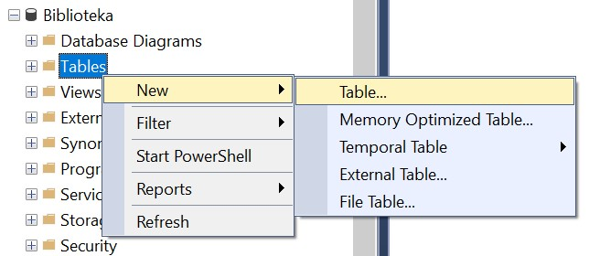

Појављује се простор за дефинисање колона које ће нова табела имати. 

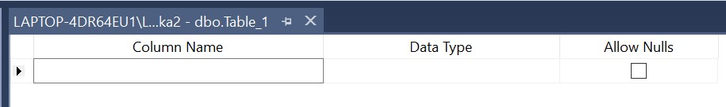

Потребно је унети назив колоне, изабрати тип података и одлучити да ли је дозвољено да у тој колони постоје вредности NULL. Креираћемо табелу са подацима о ауторима. 

Тип података може да се изабере са падајућег менија који се појави када се кликне стрелица надоле под *Data Type*. 

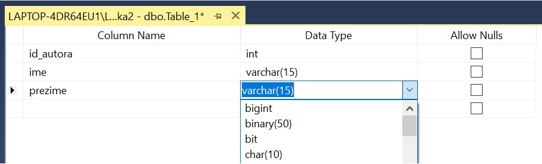

Над колоном која треба да буде примарни кључ се кликне десни тастер миша и изабере се опција *Set Primary Key*. 

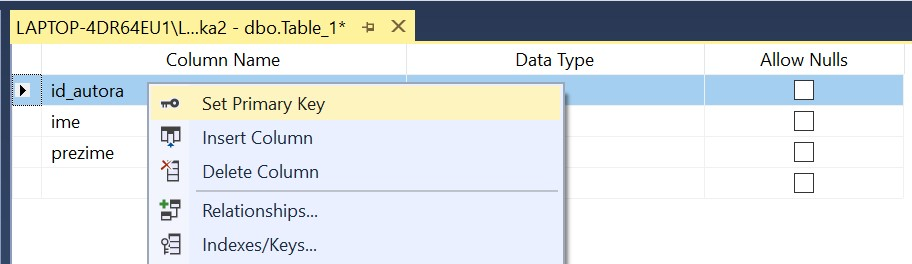

На следећој слици је приказана ситуација након дефинисања свих колона.

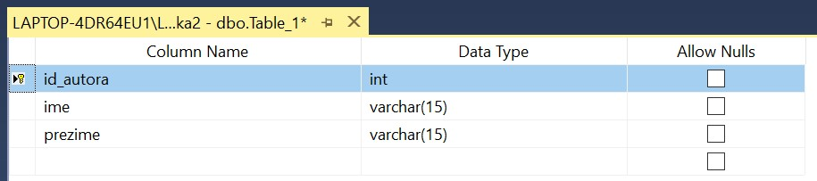

Табелу је потребно сачувати. Кликнути десни тастер миша над активном картицом и изабрати опцију *Save Table_1*. Кликнути дугме OK након после уноса назива табеле. 

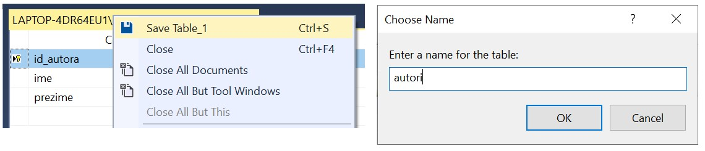

Након што је табела креирана, појављује се на списку у прозору *Object Explorer*. Уколико се не види, потребно је кликнути *Refresh*. Подаци се уносе након што се изабере опција *Edit Top 200 Rows* након десног клика над табелом.

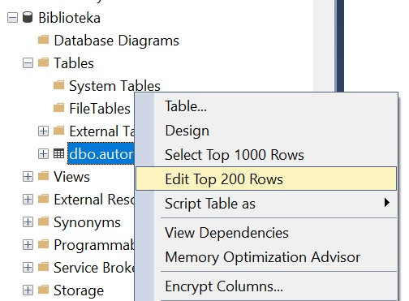

Уноси се један по један ред. Потребно је унети податке у све обавезне колоне, након чега може да се пређе на следећи ред. 

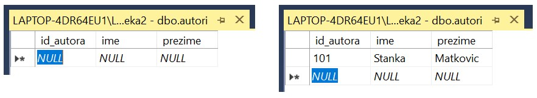

На следећој слици је приказан садржај табеле након уноса података. 

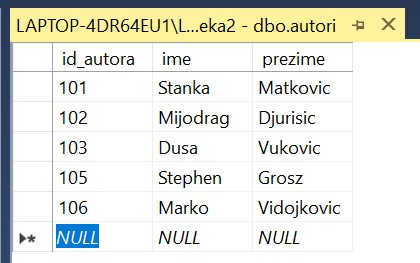
    
Табела *knjige* има страни кључ. Додавање страног кључа подразумева неколико корака којима се приступа након што се табела креира, додају се све колоне и уради се чување табеле. Потребно је кликнути десни тастер миша над простором за креирање табеле и изабрати опцију *Relationships...*, а затим дугме *Add*. 

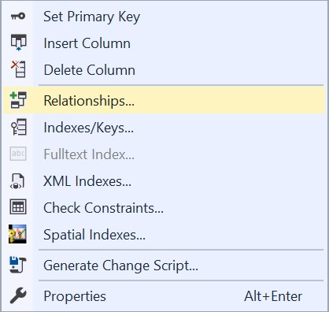

Кликнути на три тачке поред *Tables And Columns Specification*.

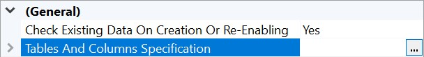

Десно поље *Foreign key table* је већ попуњено зато што се налазимо у табели *knjige*, а у левом пољу треба изабрати табелу *izdavaci* као *Primary key table*. Када се то уради, онда ће се аутоматски променити и назив везе *Relationship* name у *FK_knjige_izdavaci*. Испод назива табела је потребно изабрати и колоне које су страни кључ и одговарајући примарни кључ. У овом примеру, примарни кључ је колона *id* у табели *izdavaci*, а страни кључ је колона *id_izdavaca* у табели *knjige*. Када се ово све подеси, потребно је кликнути дугме *OK* и веза је креирана. 

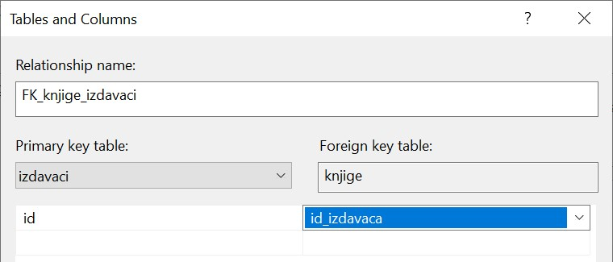