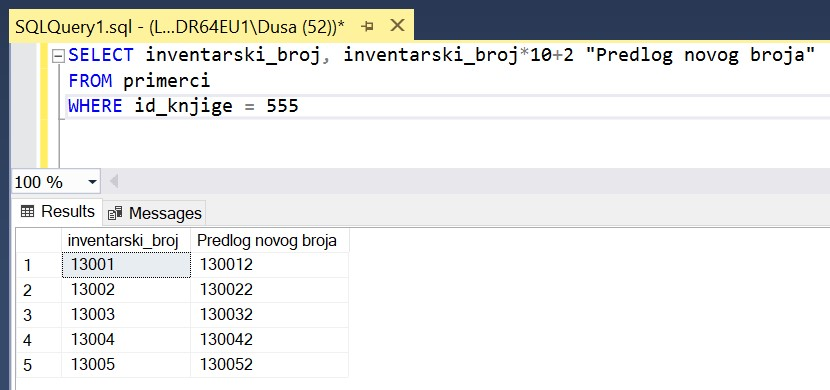

Упит SELECT из једне табеле - задаци
====================================

.. suggestionnote:: 

    Следе примери проблема који се решавају помоћу упита SELECT. Посебно ћемо обратити пажњу на реалне животне ситуације у којима нам је важно да брзо и поуздано обрадимо податке који су сачувани у бази, и како од тих ситуација формирамо конкретан задатак који се решава писањем упита.  

    Кроз урађене примере ћемо се потрудити да обновимо најважније неопходно да се пишу добри упити. Могућности упита SELECT су, наравно, много веће и кроз наредне лекције ћемо погледати још неке опције за претрагу и формирање резултата.

    У примерима који следе нема спајања табела, тј. подаци се узимају из по једне табеле. 

    Приказани примери могу да буду садржани, у виду угњеждених упита, у програмима помоћу којих приступамо бази података. Касније у материјалима ћемо неке од њих и употребити унутар програмског кода писаног другим програмским језиком. 

Сви приказани задаци су у вези са табелама које чине део базе података за библиотеку. Следи списак свих табела са колонама. Примарни кључеви су истакнути болд, а страни италик. 

Упити се пишу и покрећу када се кликне *New Query* након што се покрене систем SQL Server и кликне на креирану базу *Biblioteka_knjige* у прозору *Object Explorer*. Фајл са упитима *SQLQuery1.sql* може, а и не мора да се сачува.

Након што се унесе једна команда, кликне се на дугме **Execute**. Уколико се у простору за писање команди налази више њих, потребно је обележити ону коју желимо да покренемо. Ако имате више база података, обавезно проверите да ли је поред овог дугмета назив базе у којој желите да вршите упите. 

.. image:: ../../_images/slika_112b.jpg
    :width: 400
    :align: center

.. questionnote::

    1. Библиотеци је потребан списак свих аутора. Ради лакшег прегледања списка, важно је да списак буде уређен абецедно.

**Задатак**: Написати упит којим се приказују имена и презимена аутора, уређено абецедно по презимену, а ако имају исто презиме, по имену.

::
        
    SELECT ime, prezime
    FROM autori
    ORDER BY prezime, ime

Клаузула ORDER BY се увек додаје на крај упита. Уколико желимо да изменимо редослед сортирања, потребно је да додамо реч DESC, скраћено од енглеске речи DESCENDING, што значи опадајуће. Ову реч по потреби додајемо уз сваку колону у делу ORDER BY зато што се односи на појединачне колоне, а не на комбинацију колона. На тај начин, ако имамо неколико услова сортирања, појединачни могу да буду растући, а неки опадајући. 

У измењеном примеру који следи смо променили редослед сортирања и по презимену и по имену. 

::

    SELECT ime, prezime
    FROM autori
    ORDER BY prezime DESC, ime DESC

На следећој слици може да се види да су приказани исти подаци, али у другачијем редоследу. 

Упит можемо да изменимо тако да додамо нова заглавља у колоне у приказу резултата.

::

    SELECT ime "Ime autora", prezime "Prezime autora"
    FROM autori
    ORDER BY prezime, ime

Име и презиме можемо да прикажемо у једној колони користећи оператор конкатенације. 
::

    SELECT ime+' '+prezime "Ime i prezime autora"
    FROM autori
    ORDER BY prezime, ime

.. questionnote::

    2. Библиотека планира да набави још књига у издању издавачке куће СЕТ. Да би могли да пошаљу наруџбеницу, потребна им је адреса те издавачке куће.  

**Задатак**: Написати упит којим се приказује адреса издавачке куће са називом СЕТ. 

Када знамо тачан податак који тражимо, потребно је да употребимо оператор који врши поређење по једнакости (=).

.. questionnote::

    3. Члан је дошао у библиотеку и жели да узме неку књигу из рачунарства. Не зна тачан назив књиге која му треба, па пита библиотекара које све књиге имају на тему рачунарства.  

**Задатак**: Написати упит којим се приказују наслови књига који садрже реч *„racunarstvo“*.

.. infonote::

    НАПОМЕНА: Да би се избегли могући проблеми са нашим словима, ћириличним и латиничним, за податке у бази се свуда у овим материјалима користите слова енглеске абецеде, такозвана шишана латиница.

::

    SELECT naziv
    FROM knjige
    WHERE naziv LIKE 'Racunarstvo%' OR naziv LIKE '%racunarstvo%'

Када знамо само део текстуалног података који тражимо, потребно је да употребимо **оператор LIKE** и формирамо шаблон. Знак % у шаблону мења један, ниједан или више знакова, па га по потреби стављамо пре, после или пре и после дела текста који тражимо.  

.. questionnote::

    4. Библиотека жели да допуни своју базу података и унесе адресе и веб-сајтове за све издавачке куће са којима сарађује, па је важно да се провери који им подаци недостају да би знали које издавачке куће да контактирају да би набавили потребне податке. 

**Задатак**: Написати упит којим се приказују називи издавача за које немамо унету адресу или адресу веб-сајта.  

:: 

    SELECT naziv
    FROM izdavaci
    WHERE adresa IS NULL OR veb_sajt IS NULL

Овај упит има смисла зато што над овим колонама немамо ограничење NOT NULL, па може да се догоди да неки од ових података није унет. Овакав упит не би имао смисла за колоне које имају ограничење NOT NULL зато што у њима није могуће да имамо неко празно поље. 

У нашем узорку података имамо унете адресе и адресе веб-сајтова за све издаваче, па овај упит не враћа ниједан податак. 

Можемо у табелу да унесемо још једног издавача, али без адресе и адресе веб-сајта. 

::

    INSERT into izdavaci
    VALUES (5, 'Vulkan', null, null)

Након додавања овог издавача, уколико опет покренемо написани упит, он би вратио назив овог новог издавача за којег немамо унете адресу и адресу веб-сајта. У примерима који следе, овог издавача нема у табели. Уколико сте га додали, можете да га обришете тако што ћете извршити команду која следи. 

::

    DELETE FROM izdavaci
    WHERE id=5

.. infonote::

    Празно поље, тј. NULL поље, нема никакву вредност и посматра се као показивач на „ништа“, па су потребни посебни оператори IS NULL и IS NOT NULL да би се проверило да ли је поље празно или није. Није могуће користити оператор који пореди по једнакости (=).

.. questionnote::

    5. Потребно је да се измене инвентарски бројеви књига тако да садрже више цифара, што ће омогућити да се њима обележи већи број књига. Да би се задржао систем обележавања који већ постоји, основна идеја је да се постојећи инвентарски бројеви само мало измене. Један од предлога је да се на крај сваког примерка књиге неког издавача дода идентификациони број издавача. Пре него што се финално усвоји предлог и измене идентификациони бројеви постојећих књига, библиотека жели да на примеру једне књиге и њених примерака види како би та измена изгледала. За тај пример су узели књигу са идентификационим бројем 555, чији издавач има идентификациони број 2. 

**Задатак**: Написати упит којим се приказује како би изгледали нови идентификациони бројеви примерака књиге са идентификационим бројем 555 након што би се на крај сваког додао идентификациони број издавача, број 2.

::

    SELECT inventarski_broj, inventarski_broj*10+2 "Predlog novog broja"
    FROM primerci 
    WHERE id_knjige = 555

Уместо назива колоне могу да се издвајају неки изрази над колонама, нпр. у овом случају аритметички израз. 

