Алат за пројектовање
====================

.. suggestionnote::

    Фаза пројектовања је веома важна. Током ове фазе се детаљно анализира пословни захтев. Приликом пројектовања треба да предвидимо ентитет за сваку табелу коју ћемо имати у релационој бази података. Називи ентитета су увек именице у једнини, док ће називи табела бити именице у множини. Атрибути ентитета ће бити колоне одговарајуће табеле у бази. Након што се уоче ентитети и наброје њихови атрибути, потребно је да се ентитети повежу. Резултат пројектовања је логички модел, пројекат на основу којег се креира релациона база података.

    Алат за пројектовање **Oracle SQL Developer Data Modeler** за потребе учења, а након прихватања услова употребе, може бесплатно да се преузме са следеће адресе:

    https://www.oracle.com/database/sqldeveloper/technologies/sql-data-modeler/

Помоћу алата за пројектовање *Oracle Data Modeler* ћемо креирати логички модел за део базе података за библиотеку у којем се складиште подаци о свим примерцима књига које се налазе у библиотеци.

Након покретања алата, кликнути десни тастер миша над ставком *Logical Model* и изабрати *Show*. 

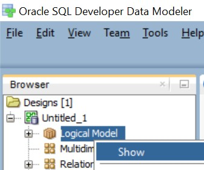

Креираћемо један по један ентитет. Можемо да почнемо од јаких ентитета. Нови ентитет додајемо помоћу дугмета *New Entity*, друго дугме са лева испод менија. 

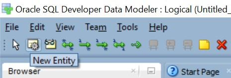

Када се на површину за цртање постави нови ентитет, појављује се дијалог у који можемо да унесемо назив ентитета и списак атрибута. Прво уносимо назив ентитета – *Name*. 

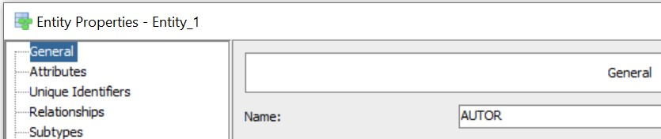

Атрибуте додајемо један по један након клика на зелени знак +. Уносимо назив атрибута – *Name*. Штриклирамо *Primary UID* за онај атрибут који је примарни јединствени идентификатор, а *Mandatory* за обавезне атрибуте. Означимо *Logical* као *Data Type* (испод назива атрибута) и за сваки атрибут изаберемо тип података.

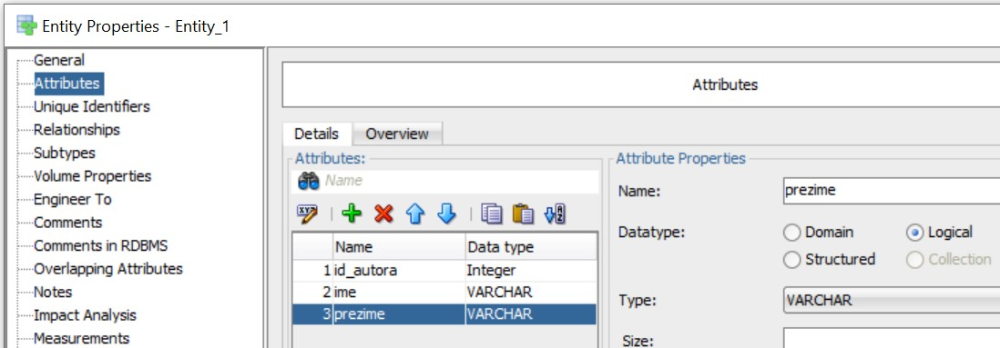

Када додамо све атрибуте, кликнемо на дугме OK и појавиће се ентитет.  

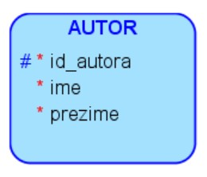

Додамо и следеће ентитете. Уколико смо видели да смо направили неку грешку на неком од ентитета, можемо да урадимо двоклик мишем на ентитет и да изменимо назив или атрибуте. Уколико желимо да обришемо ентитет који смо грешком направили, изаберемо *Delete Object* након што кликнемо десни тастер миша над ентитетом. 

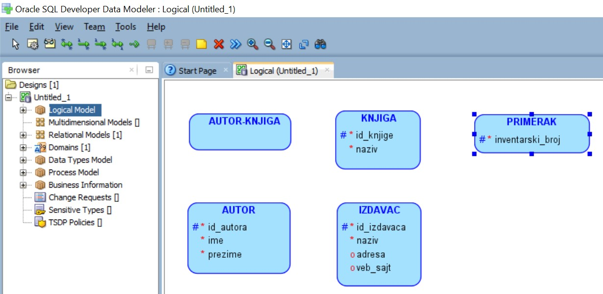

Када су додати сви ентитети, потребно је да их повежемо. Веза један-према-више се додаје тако што се изабере *New 1:N Relation*, једна од зелених стрелица испод менија, онда се прво кликне на ентитет који је на страни „један“, а затим на ентитет који је на страни „више“. На пример, прво се кликне на ентитет IZDAVAC, па онда на ентитет KNJIGA, зато што је један издавач објавио више књига. Понови се исти поступак и за ентитете KNJIGA и PRIMERAK. Од исте књиге имамо више примерака у библиотеци. 

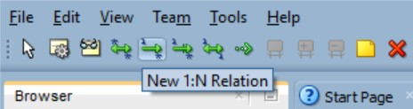

Повезани ентитети могу да се виде на следећој слици. Уколико смо нешто погрешили код везе, можемо да урадимо двоклик мишем над њом и да добијемо прозор са разним подешавањима. А можемо једноставно и да је обришемо и нацртамо нову. Брисање се ради тако што се изабере *Delete* када се кликне десни тастер миша над везом.  

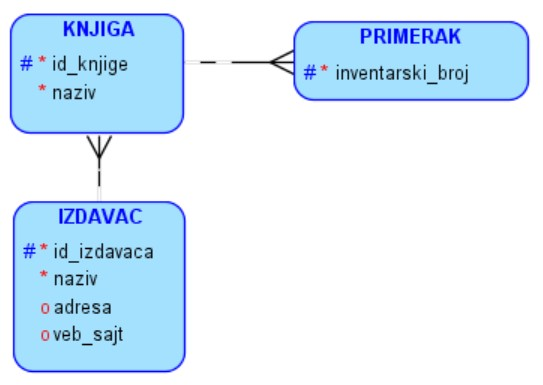

Ентитети AUTOR и AUTOR-KNJIGA, као и ентитети KNJIGA и AUTOR-KNJIGA су повезани везама један-према-више, које учествују као део примарног кључа табеле која ће одговарати ентитету AUTOR-KNJIGA, па се додају тако што се изабере *New 1:N Relation Identifying*.

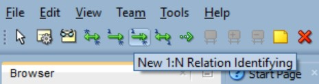

Коначни дијаграм је приказан на следећој слици. 

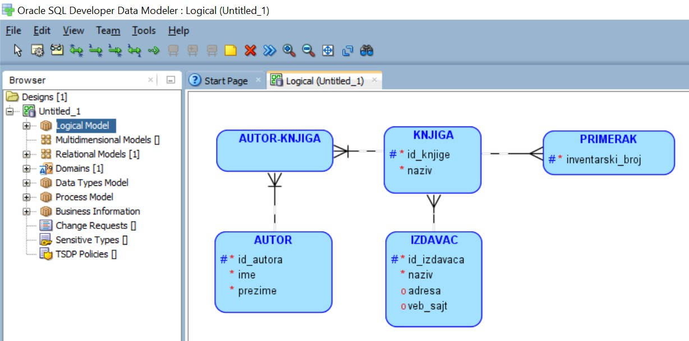

Можемо једноставно да добијемо релациони модел који подразумева дизајн табела као припрему за креирање релационе базе података, са списком свих колона, типова података и ограничења, укључујући стране кључеве. Кликнути десни тастер миша над ставком *Logical Model* и изабрати *Engineer to Relational Model*, а након тога кликнути на дугме *Engineer*.

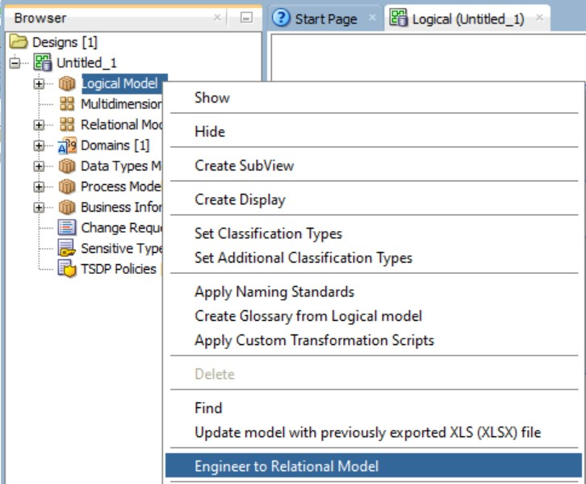

На следећој слици се види добијени релациони модел. По потреби повећати мишем правоугаонике и разместити их боље по целој површини. Обратити пажњу на слово *P* које се налази уз колоне које су примарни кључеви, као и *PK* у називима примарних кључева. Такође су и колоне које су страни кључеви обележене словом *F*, а *FK* се налази у називима страних кључева. 

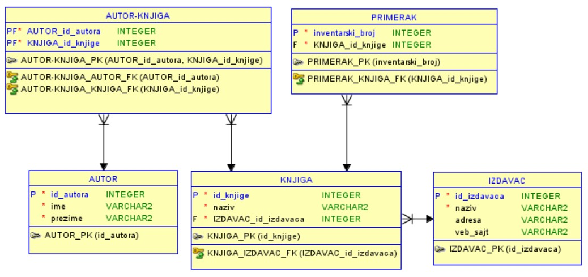