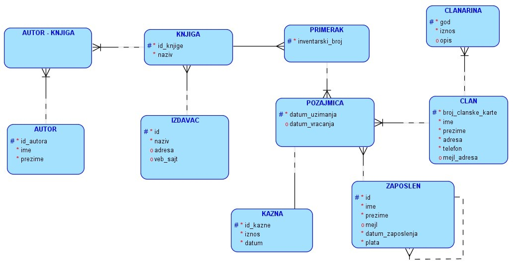
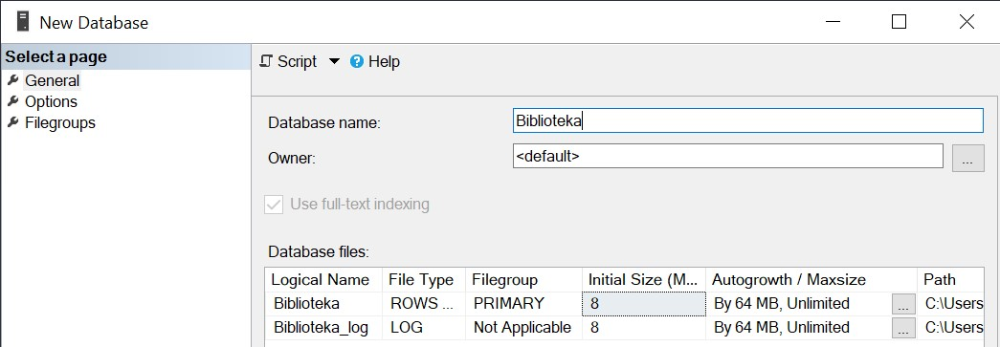
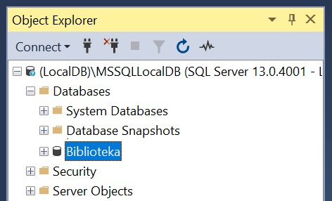
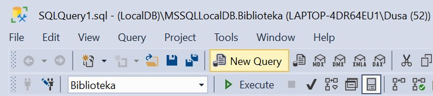
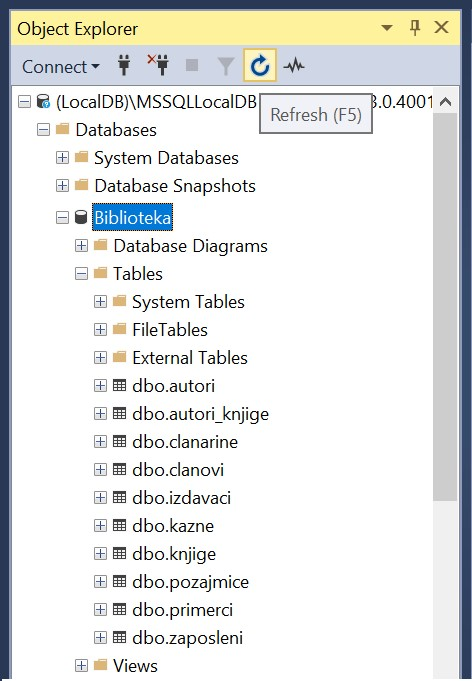
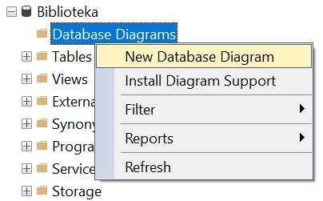
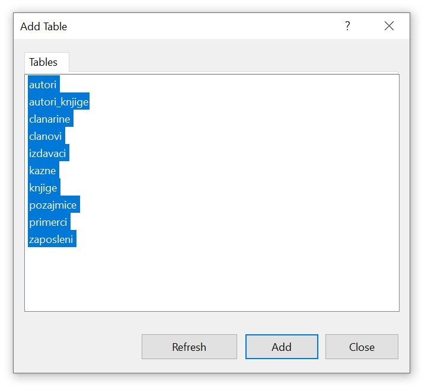
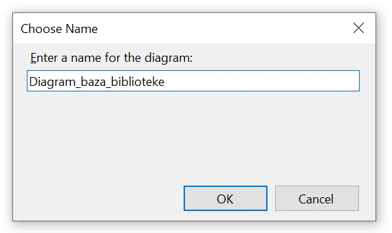
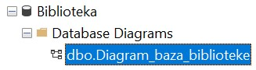

База података за библиотеку - практичан рад
===========================================

.. suggestionnote::

    До сада смо видели један део базе података за **библиотеку** у којем се складиште подаци о свим примерцима књига које се налазе у библиотеци. Комплетна база података има још неке табеле. Члановима библиотеке издајемо примерке књига које траже и водимо рачуна о томе када су узели књигу, и да ли су је вратили у року. Члан библиотеке се постаје након учлањења, процеса који подразумева да се оставе лични подаци као што су: име, презиме, адреса, број телефона, број личне карте... Уколико члан не врати књигу на време, потребно је да плати казну. За све позајмице су задужени библиотекари, тј. особе запослене у библиотеци. 

    Следи детаљно упутство како да се креира комплетна база података за библиотеку.  

    Приказани пример базе података за библиотеку ћемо касније употребити тако што ћемо креирати програме у којима ћемо јој приступати. 

На следећој слици је приказан модел на основу којег ћемо креирати релациону базу података библиотеке. 

.. infonote::

    **НАПОМЕНА**: Детаљни процес добијања овог модела је описан у оквиру материјала за предмет „Базе података“ у трећем разреду гимназије за ученике са посебним способностима за рачунарство и информатику, који се налази на следећој адреси:

    https://petlja.org/kurs/7963

Креирати базу података за библиотеку употребом алата **SQL Server Management Studio**. 

.. infonote::

    **НАПОМЕНА**: Уколико си у трећем разреду креирао базу података за библиотеку, вероватно је већ имаш на рачунару и није потребно да је поново креираш.

Кликнути десни тастер миша над **Databases** у прозору *Object Explorer* и изабрати *New Database...*

.. image:: ../../_images/slika_121b.jpg
    :width: 400
    :align: center

Унети назив нове базе података и кликнути дугме OK. 

Новокреирана база података се појавила на списку у прозору *Object Explorer*.

Кликнути дугме *New Query* испод главног падајућег менија. 

Прво извршити све **CREATE TABLE** команде, једну по једну.

.. infonote::

    **ВАЖНО: Редослед је битан!** Пре креирања табеле која има страни кључ неопходно је креирати табелу на коју она показује. 

Све команде могу да се истовремено прекопирају, али се свака појединачно прво означи мишем и за сваку означену команду се кликне *Execute*, као што је приказано на следећој слици. 

.. image:: ../../_images/slika_121f.jpg
    :width: 600
    :align: center

После сваке успешно извршене команде појави се одговарајућа порука.

.. image:: ../../_images/slika_121g.jpg
    :width: 400
    :align: center

Након што се свака команда изврши, све табеле ће остати сачуване у бази података за даљу употребу. Фајл *SQLQuery1.sql* може, а и не мора да се сачува.

Следе све CREATE TABLE команде за табеле базе података за библиотеку. 

::

    CREATE TABLE autori
    ( id_autora INT PRIMARY KEY, 
    ime VARCHAR(15) NOT NULL, 
    prezime VARCHAR(15) NOT NULL )

    CREATE TABLE izdavaci
    ( id INT PRIMARY KEY, 
    naziv VARCHAR(40) NOT NULL UNIQUE, 
    adresa VARCHAR(50), 
    veb_sajt VARCHAR(50) UNIQUE)

    CREATE TABLE clanovi
    ( broj_clanske_karte INT PRIMARY KEY, 
    ime VARCHAR(15) NOT NULL, 
    prezime VARCHAR(15) NOT NULL, 
    adresa VARCHAR(50) NOT NULL, 
    telefon VARCHAR(20) NOT NULL,
    mejl_adresa VARCHAR(50) )

    CREATE TABLE clanarine
    ( broj_clanske_karte INT REFERENCES clanovi(broj_clanske_karte), 
    god INT NOT NULL, 
    iznos INT NOT NULL, 
    opis VARCHAR(50), 
    PRIMARY KEY (broj_clanske_karte, god) )

    CREATE TABLE knjige
    ( id_knjige INT PRIMARY KEY, 
    naziv VARCHAR(50) NOT NULL, 
    id_izdavaca INT NOT NULL REFERENCES izdavaci(id) )

    CREATE TABLE primerci
    ( inventarski_broj INT PRIMARY KEY, 
    id_knjige INT NOT NULL REFERENCES knjige(id_knjige) )

    CREATE TABLE autori_knjige
    (id_autora INT REFERENCES autori(id_autora),
    id_knjige INT REFERENCES knjige(id_knjige), 
    PRIMARY KEY (id_autora, id_knjige) )

    CREATE TABLE zaposleni
    ( id INT PRIMARY KEY, 
    ime VARCHAR(15) NOT NULL, 
    prezime VARCHAR(15) NOT NULL,
    mejl VARCHAR(50),
    datum_zaposlenja DATE NOT NULL,
    plata INT NOT NULL,
    id_menadzera INT REFERENCES zaposleni(id) )

    CREATE TABLE pozajmice
    ( inventarski_broj INT REFERENCES primerci(inventarski_broj), 
    broj_clanske_karte INT REFERENCES clanovi(broj_clanske_karte), 
    datum_uzimanja DATE, 
    datum_vracanja DATE, 
    id_zaposlenog INT NOT NULL REFERENCES zaposleni(id),
    PRIMARY KEY (inventarski_broj, broj_clanske_karte, datum_uzimanja), 
    CHECK (datum_vracanja >= datum_uzimanja) )

    CREATE TABLE kazne
    ( id_kazne INT PRIMARY KEY,
    iznos INT NOT NULL,
    datum DATE NOT NULL,  
    inventarski_broj INT NOT NULL, 
    broj_clanske_karte INT NOT NULL, 
    datum_uzimanja DATE NOT NULL,
    FOREIGN KEY (inventarski_broj, broj_clanske_karte, datum_uzimanja) 
    REFERENCES pozajmice(inventarski_broj, broj_clanske_karte, datum_uzimanja) 
    UNIQUE (inventarski_broj, broj_clanske_karte, datum_uzimanja) )

Након што су све табеле креиране, појављују се на списку у прозору *Object Explorer*. Уколико се не виде, потребно је кликнути *Refresh*.

Уколико је прозор за писање команди угашен, кликнути поново дугме *New Query* испод главног падајућег менија. Све команде могу да се истовремено прекопирају, али се свака појединачно прво означи мишем и за сваку означену команду се кликне *Execute*. 

Након што се свака команда изврши, сви подаци ће остати сачувани у бази података за даљу употребу. Фајл *SQLQuery1.sql* може, а и не мора да се сачува.

Извршити све **INSERT** INTO команде, једну по једну.

.. infonote::

    **ВАЖНО: Редослед је битан!**

**Табела autori**

::

     INSERT INTO autori
    VALUES (101, 'Stanka', 'Matkovic')

    INSERT INTO autori
    VALUES (102, 'Mijodrag', 'Djurisic')

    INSERT INTO autori
    VALUES (103, 'Dusa', 'Vukovic')

    INSERT INTO autori
    VALUES (104, 'Stephen', 'Grosz')

    INSERT INTO autori
    VALUES (105, 'Marko', 'Vidojkovic')

**Табела izdavaci**

::

    
    INSERT INTO izdavaci
    VALUES (1, 'Zavod za udzbenike', 'Obilicev venac 5, Beograd', 'http://www.knjizara.zavod.co.rs/')

    INSERT INTO izdavaci
    VALUES (2, 'CET', 'Knez Mihailova 6, Beograd', 'http://cet.rs/')

    INSERT INTO izdavaci
    VALUES (3, 'Vintage', 'Random House 20, London', 'www.vintage-books.co.uk')

    INSERT INTO izdavaci
    VALUES (4, 'Laguna', 'Resavska 33, Beograd', 'https://www.laguna.rs/')

**Табела clanovi**

::

    INSERT INTO clanovi
    VALUES (11, 'Milica', 'Zoranovic', 'Dunavska 22, Beograd', '061-111-111', null)

    INSERT INTO clanovi
    VALUES (22, 'Slavica', 'Mastilovic', 'Borska 1, Beograd', '062-222-332', 'slavica@gmail.com')

    INSERT INTO clanovi
    VALUES (33, 'Olivera', 'Stosic', 'Kneza 121, Beograd', '062-987-432', 'olja@gmail.com')

    INSERT INTO clanovi
    VALUES (44, 'Vukman', 'Mastilovic', 'Beogradska 8, Beograd', '061-323-656', 'vukman@gmail.com')

    INSERT INTO clanovi
    VALUES (55, 'Marko', 'Markovic', 'Krunska 9, Beograd', '065-221-221', 'marko@gmail.com')

**Табела clanarine**

::

    INSERT INTO clanarine
    VALUES (11, 2018, 3000, null)

    INSERT INTO clanarine
    VALUES (11, 2019, 3100, null)

    INSERT INTO clanarine
    VALUES (22, 2019, 3100, null)

    INSERT INTO clanarine
    VALUES (33, 2017, 2400, null)

    INSERT INTO clanarine
    VALUES (33, 2018, 2500, 'Popust za trudnice')

    INSERT INTO clanarine
    VALUES (33, 2019, 3100, null)

    INSERT INTO clanarine
    VALUES (44, 2019, 2000, 'Popust za ucenike')

    INSERT INTO clanarine
    VALUES (55, 2019, 2000, 'Popust za ucenike')

**Табела knjige**

::

    INSERT INTO knjige 
    VALUES (111, 'Racunarstvo i informatika za 4. razred gimnazije', 1)

    INSERT INTO knjige 
    VALUES (222, 'Racunarstvo i informatika za 3. razred gimnazije', 1)

    INSERT INTO knjige 
    VALUES (321, 'Osnovi programiranja, programski jezici c#', 1)

    INSERT INTO knjige 
    VALUES (555, 'PROGRAMIRANJE - klase i objekti', 2)

    INSERT INTO knjige 
    VALUES (323, 'Veb programiranje', 2)

    INSERT INTO knjige 
    VALUES (999, 'The Examined Life', 3)

    INSERT INTO knjige 
    VALUES (414, 'Kandze', 4)

    INSERT INTO knjige 
    VALUES (415, 'E bas vam hvala', 4)

**Табела primerci**

::

    INSERT INTO primerci 
    VALUES (12345, 111)

    INSERT INTO primerci 
    VALUES (12346, 111)

    INSERT INTO primerci 
    VALUES (12347, 222)

    INSERT INTO primerci 
    VALUES (12348, 321)

    INSERT INTO primerci 
    VALUES (12349, 321)

    INSERT INTO primerci 
    VALUES (13001, 555)

    INSERT INTO primerci 
    VALUES (13002, 555)

    INSERT INTO primerci 
    VALUES (13003, 555)

    INSERT INTO primerci 
    VALUES (13004, 555)

    INSERT INTO primerci 
    VALUES (13005, 555)

    INSERT INTO primerci 
    VALUES (14001, 323)

    INSERT INTO primerci 
    VALUES (14002, 323)

    INSERT INTO primerci 
    VALUES (14003, 323)

    INSERT INTO primerci 
    VALUES (15001, 999)

    INSERT INTO primerci 
    VALUES (16001, 414)

    INSERT INTO primerci 
    VALUES (17001, 415)

    INSERT INTO primerci 
    VALUES (17002, 415)

    INSERT INTO primerci 
    VALUES (17003, 415)

**Табела autori_knjige**

::

    INSERT INTO autori_knjige
    VALUES (101, 111)

    INSERT INTO autori_knjige
    VALUES (101, 222)

    INSERT INTO autori_knjige
    VALUES (101, 321)

    INSERT INTO autori_knjige
    VALUES (102, 321)

    INSERT INTO autori_knjige
    VALUES (103, 321)

    INSERT INTO autori_knjige
    VALUES (102, 111)

    INSERT INTO autori_knjige
    VALUES (102, 222)

    INSERT INTO autori_knjige
    VALUES (103, 111)

    INSERT INTO autori_knjige
    VALUES (103, 555)

    INSERT INTO autori_knjige
    VALUES (103, 323)

    INSERT INTO autori_knjige
    VALUES (101, 323)

    INSERT INTO autori_knjige
    VALUES (102, 323)

    INSERT INTO autori_knjige
    VALUES (104, 999)

    INSERT INTO autori_knjige
    VALUES (105, 414)

    INSERT INTO autori_knjige
    VALUES (105, 415)

**Табела zaposleni**

::

    INSERT INTO zaposleni
    VALUES (1, 'Jovan', 'Jovanovic', 'jjovanovic@biblioteka.rs', '2002-09-23', 95000, null)

    INSERT INTO zaposleni
    VALUES (2, 'Vojin', 'Pupavac', 'vpupavac@biblioteka.rs', '2010-11-20', 70000, 1)

    INSERT INTO zaposleni
    VALUES (3, 'Ana', 'Milosavljevic', 'amilosavljevic@biblioteka.rs','2015-10-25', 60000, 1)

    INSERT INTO zaposleni
    VALUES (4, 'Nemanja', 'Granic', 'ngranic@biblioteka.rs', '2010-11-20', 62000, 1)

    INSERT INTO zaposleni
    VALUES (5, 'Aleksandar', 'Jovic', 'ajovic@biblioteka.rs', '2014-05-25', 50000, 2)

    INSERT INTO zaposleni
    VALUES (6, 'Iva', 'Lazovic', 'ilazovic@biblioteka.rs', '2015-07-20', 50000, 2)

    INSERT INTO zaposleni
    VALUES (7, 'Lena', 'Kulic', 'lkulic@biblioteka.rs', '2017-10-12', 45000, 3)

    INSERT INTO zaposleni
    VALUES (8, 'Maja', 'Petrovic', 'mpetrovic@biblioteka.rs', '2015-03-02', 46000, 3)

    INSERT INTO zaposleni
    VALUES (9, 'Petar', 'Petrovic', 'ppetrovic@biblioteka.rs', '2018-10-01', 42000, 3)

**Табела pozajmice**

::

    INSERT INTO pozajmice
    VALUES (12345, 33, '2019-03-27', '2019-04-15', 5)

    INSERT INTO pozajmice
    VALUES (12347, 33, '2019-04-15', '2019-04-27', 6)

    INSERT INTO pozajmice
    VALUES (12349, 33, '2019-04-27', '2019-05-20', 6)

    INSERT INTO pozajmice
    VALUES (13003, 33, '2019-05-20', null , 5)

    INSERT INTO pozajmice
    VALUES (17003, 33, '2019-05-20', null , 5)

    INSERT INTO pozajmice
    VALUES (13001, 22, '2018-10-10', '2019-02-18', 5)

    INSERT INTO pozajmice
    VALUES (17001, 22, '2019-02-18', '2019-02-25', 6)

    INSERT INTO pozajmice
    VALUES (13005, 22, '2019-02-25', '2019-03-07', 5)

    INSERT INTO pozajmice
    VALUES (16001, 22, '2019-03-07', '2019-05-21', 5)

    INSERT INTO pozajmice
    VALUES (17002, 22, '2019-05-21', null, 6)

    INSERT INTO pozajmice
    VALUES (12345, 22, '2019-05-21', null, 6)

    INSERT INTO pozajmice
    VALUES (12347, 22, '2019-05-21', null, 6)

    INSERT INTO pozajmice
    VALUES (17003, 55, '2019-01-15', '2019-04-15', 5)

    INSERT INTO pozajmice
    VALUES (15001, 11, '2019-03-15', '2019-04-01', 6)

    INSERT INTO pozajmice
    VALUES (16001, 11, '2019-04-01', '2019-04-16', 6)

    INSERT INTO pozajmice
    VALUES (12345, 11, '2019-04-16', '2019-04-28', 6)

    INSERT INTO pozajmice
    VALUES (12347, 11, '2019-04-28', '2019-05-22', 6)

    INSERT INTO pozajmice
    VALUES (12349, 11, '2019-05-22', null, 6)

**Табела kazne**

::

    INSERT INTO kazne
    VALUES (1, 500, '2019-02-18', 13001, 22, '2018-10-10')

    INSERT INTO kazne
    VALUES (2, 500, '2019-05-21', 16001, 22, '2019-03-07')

    INSERT INTO kazne
    VALUES (3, 400, '2019-04-15', 17003, 55, '2019-01-15')

Након што је креирана комплетна база података, можемо да креирамо њен **дијаграм**. Кликнути десни тастер миша над *Database Diagrams* под базом података за библиотеку, и изабрати *New Database Diagram*. 

У наредном кораку додати све табеле. 

Према потреби увећати или умањити слику и испремештати табеле. Добијени дијаграм је приказан на следећој слици. 

.. image:: ../../_images/slika_121k.jpg
    :width: 800
    :align: center

Дијаграм може да се сачува. 

Након чувања може да се пронађе у прозору *Object Explorer* и да се поново отвори. Уколико се не прикаже одмах, потребно је урадити *Refresh*.

