Упит SELECT са спајањем табела - задаци
=======================================

.. suggestionnote::

    Подаци који се у животу виде заједно на једном месту у бази података се чувају у различитим табелама. Као што смо већ видели на примеру, уколико погледаш корице неке књиге, највероватније ћеш на њима видети назив књиге, као и основне податке о аутору или ауторима и издавачу. Ови подаци се у бази података чувају у неколико различитих табела: *knjige*, *autori* и *izdavaci*. Неопходно је и веома важно да имамо механизам на основу којег можемо да видимо како су подаци у једној табели, на пример подаци о једној конкретној књизи, повезани са одговарајућим подацима у другим табелама, тако да можемо да видимо ко је аутор те књиге и ко је издавач те исте књиге.

    У примерима који следе има спајања табела, тј. подаци се узимају из по две или више повезаних табела.

    Приказани примери могу да буду садржани, у виду угњеждених упита, у програмима помоћу којих приступамо бази података. Касније у материјалима ћемо неке од њих и употребити унутар програмског кода писаног другим програмским језиком. 

Сви приказани задаци су повезани са табелама које чине део базе података за библиотеку. Следи списак свих табела са колонама. Примарни кључеви су истакнути болд, а страни италик. 

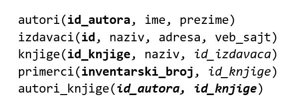

Упити се пишу и покрећу када се кликне *New Query* након што се покрене систем *SQL Server* и кликне на креирану базу *Biblioteka_knjige* у прозору *Object Explorer*. Фајл са упитима *SQLQuery1.sql* може, а и не мора да се сачува.

Након што се унесе једна команда, кликне се на дугме **Execute**. Уколико се у простору за писање команди налази више њих, потребно је обележити ону коју желимо да покренемо. Ако имате више база података, обавезно проверите да ли је поред овог дугмета назив базе у којој желите да вршите упите. 

.. image:: ../../_images/slika_116b.jpg
    :width: 400
    :align: center

.. questionnote::

    1. Књига са називом „Veb-programiranje“ је веома тражена и библиотека жели да набави још примерака те књиге. Да би библиотека послала наруџбеницу, потребни су јој подаци о издавачу.  

**Задатак:** Написати упит којим се приказују назив, адреса и адреса веб-сајта издавача књиге са називом „Veb-programirenje“.  

::

    SELECT adresa, veb_sajt
    FROM knjige JOIN izdavaci ON (knjige.id_izdavaca=izdavaci.id)
    WHERE knjige.naziv = 'Veb programiranje'

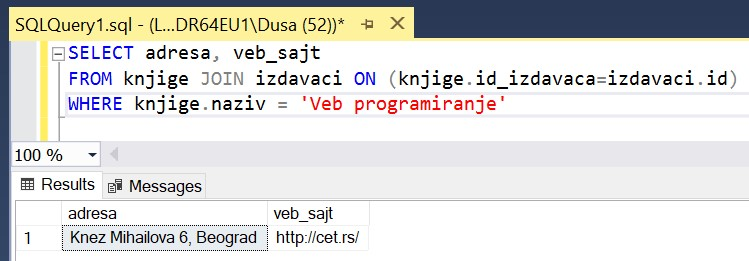

Подаци који су нам потребни се налазе у две табеле. Сви подаци које приказујемо су у табели *izdavaci*, а селекцију радимо по услову који се односи на податак који се налази у табели *knjige*. Ове две табеле су повезане паром колона, страни кључ у једној табели показује на примарни кључ у другој табели. 

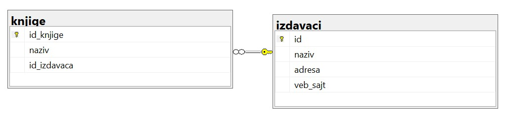

У делу FROM упита је потребно ове табеле спојити управо по вредностима комбинација: страни кључ и одговарајући примарни кључ, тј. примарни кључ на који страни кључ показује. За идентификациони број књиге једног примерка треба у табели *knjige* да пронађемо која је то књига. 

Када наводимо табеле у делу FROM, редослед није битан, као што није битан ни када наводимо колоне у изразу у којем поредимо вредности по једнакости у делу ON. Тако ће следећи упити заправо бити идентични упиту који смо претходно написали. 

::

    SELECT adresa, veb_sajt
    ROM izdavaci JOIN knjige ON (knjige.id_izdavaca=izdavaci.id)
    WHERE knjige.naziv = 'Veb programiranje'

    SELECT adresa, veb_sajt
    FROM knjige JOIN izdavaci ON (izdavaci.id=knjige.id_izdavaca) 
    WHERE knjige.naziv = 'Veb programiranje'

.. questionnote::

    2. Библиотека је у процесу набавке нових примерака књига издавачке куће СЕТ. Тренутно се размишља да се најстарији набављени примерци књига ове издавачке куће повуку из употребе и раскњиже. Анализом примерака који се налазе у библиотеци је установљено да је примерак са инвентарским бројем 13005 у добром стању и релативно скоро набављен, па је потребно проценити стање раније набављених примерака. Раније набављени примерци имају мањи инвентарски број. 

**Задатак 1:** Написати упит којим се приказују инвентарски бројеви примерака и називи књига у издању издавачке куће СЕТ чији је инвентарски број мањи од 13005.

::

    SELECT inventarski_broj, knjige.naziv
    FROM primerci JOIN knjige ON (primerci.id_knjige=knjige.id_knjige)
    JOIN izdavaci ON (knjige.id_izdavaca=izdavaci.id)
    WHERE izdavaci.naziv='CET' AND inventarski_broj<13005

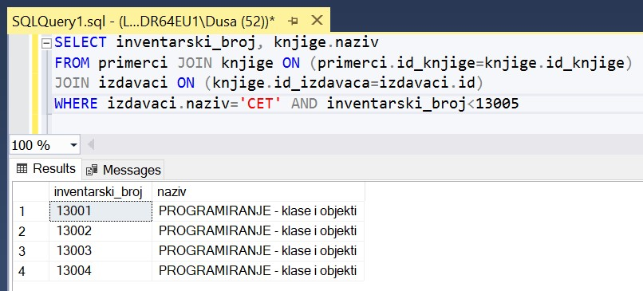

.. questionnote::
    3. Неколико чланова библиотеке се истог дана распитивало за књигу са називом „PROGRAMIRANJE – klase i objekti“. Потребно је проверити да ли постоји довољан број примерака ове књиге. 

.. infonote::

    НАПОМЕНА: На основу овог захтева има смисла формулисати два различита задатка.

**Задатак 1:** Написати упит којим се приказују инвентарски бројеви књига са називом „PROGRAMIRANJE – klase i objekti“.  

:: 

    SELECT inventarski_broj
    FROM primerci JOIN knjige ON (primerci.id_knjige=knjige.id_knjige)
    WHERE naziv = 'PROGRAMIRANJE - klase i objekti'

    SELECT inventarski_broj
    FROM primerci 
    WHERE id_knjige = (SELECT id_knjige FROM knjige 
    WHERE naziv = 'PROGRAMIRANJE - klase i objekti')

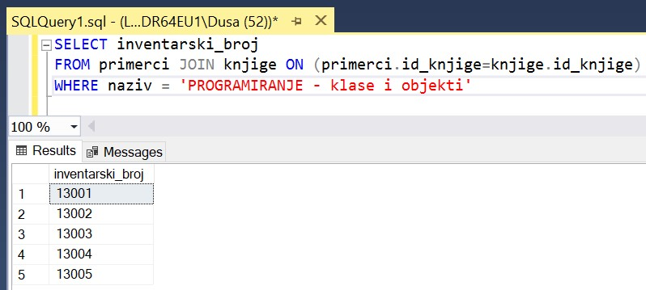

**Задатак 2:** Написати упит којим се приказује број примерака књига са називом „PROGRAMIRANJE – klase i objekti“.  

::

    SELECT COUNT(inventarski_broj)
    FROM primerci JOIN knjige ON (primerci.id_knjige=knjige.id_knjige)
    WHERE naziv = 'PROGRAMIRANJE - klase i objekti'

    SELECT COUNT(*)
    FROM primerci JOIN knjige ON (primerci.id_knjige=knjige.id_knjige)
    WHERE naziv = 'PROGRAMIRANJE - klase i objekti'

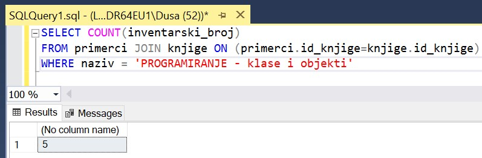

.. questionnote::

    4. Библиотека размишља да набави још примерака књига награђиваног аутора Марка Видојковића. Да би донели одлуку о новим набавкама, прво је потребно да провере стање са примерцима књига које већ имају од овог писца. 

.. infonote::

    НАПОМЕНА: На основу овог захтева има смисла формулисати неколико различитих задатка. 

**Задатак 1:** Написати упит којим се приказују инвентарски бројеви примерака и називи књига аутора Марка Видојковића.

::

    SELECT inventarski_broj, naziv
    FROM primerci JOIN knjige ON (primerci.id_knjige=knjige.id_knjige)
    JOIN autori_knjige ON (autori_knjige.id_knjige=knjige.id_knjige)
    JOIN autori ON (autori_knjige.id_autora=autori.id_autora)
    WHERE ime = 'Marko' AND prezime = 'Vidojkovic'

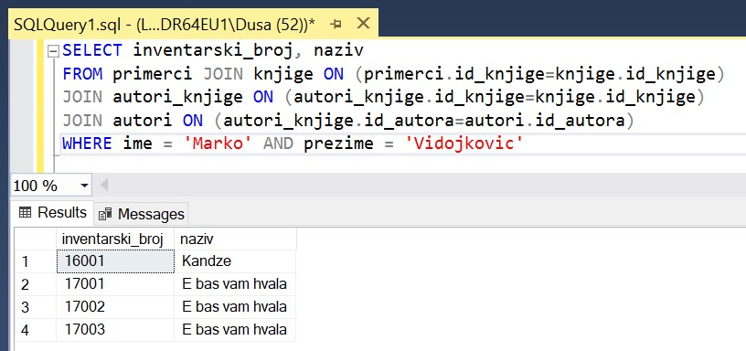

**Задатак 2:** Написати упит којим се приказује укупан број примерака књига аутора Марка Видојковића

::

    SELECT COUNT(inventarski_broj)
    FROM primerci JOIN knjige ON (primerci.id_knjige=knjige.id_knjige)
    JOIN autori_knjige ON (autori_knjige.id_knjige=knjige.id_knjige)
    JOIN autori ON (autori_knjige.id_autora=autori.id_autora)
    WHERE ime = 'Marko' AND prezime = 'Vidojkovic'

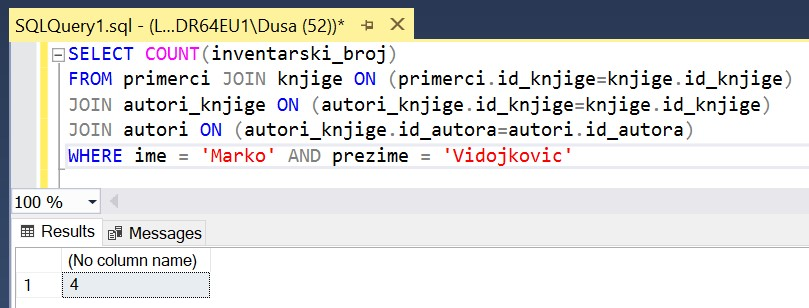

**Задатак 3:** Написати упит којим се приказује број примерака сваке од књига аутора Марка Видојковића.

::

    SELECT COUNT(inventarski_broj), naziv
    FROM primerci JOIN knjige ON (primerci.id_knjige=knjige.id_knjige)
    JOIN autori_knjige ON (autori_knjige.id_knjige=knjige.id_knjige)
    JOIN autori ON (autori_knjige.id_autora=autori.id_autora)
    WHERE ime = 'Marko' AND prezime = 'Vidojkovic'
    GROUP BY naziv

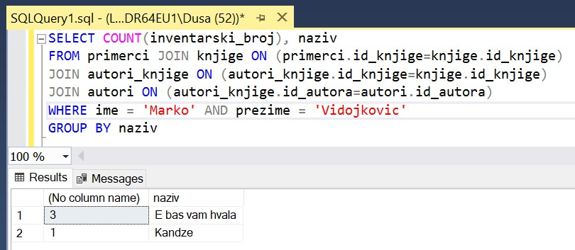

**Задатак 4:** Написати упит којим се приказују називи књига аутора Марка Видојковића од којих имамо само по један примерак у библиотеци.

::

    SELECT COUNT(inventarski_broj), naziv
    FROM primerci JOIN knjige ON (primerci.id_knjige=knjige.id_knjige)
    JOIN autori_knjige ON (autori_knjige.id_knjige=knjige.id_knjige)
    JOIN autori ON (autori_knjige.id_autora=autori.id_autora)
    WHERE ime = 'Marko' AND prezime = 'Vidojkovic'
    GROUP BY naziv
    HAVING COUNT(inventarski_broj) = 1

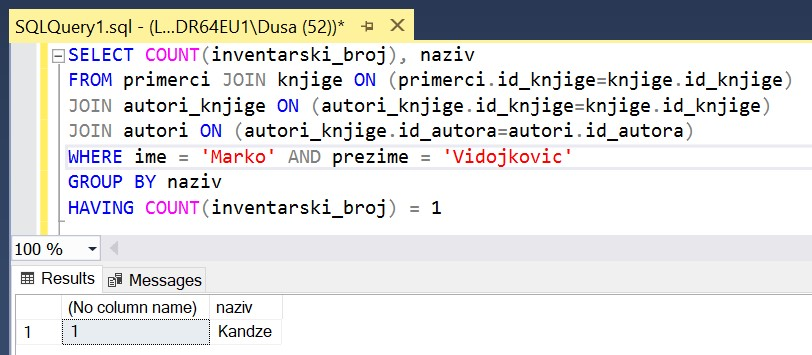

.. questionnote::

    5. У оквиру сарадње библиотеке и Завода за уџбенике планирано је да се ауторима који су писали за ову издавачку кућу уруче захвалнице и симболични поклони. 

**Задатак:** Написати упит којим се, без понављања, приказују аутори који су писали за издавачку кућу Завод за уџбенике.  

:: 

    SELECT DISTINCT ime, prezime 
    FROM knjige JOIN autori_knjige ON (autori_knjige.id_knjige=knjige.id_knjige)
    JOIN autori ON (autori_knjige.id_autora=autori.id_autora)
    JOIN izdavaci ON (knjige.id_izdavaca=izdavaci.id)
    WHERE izdavaci.naziv = 'Zavod za udzbenike'

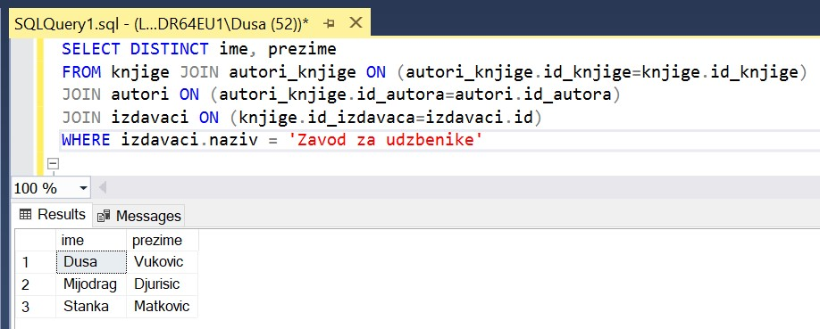

.. questionnote::

    6. Члан библиотеке је заинтересован да позајми још неку књигу од аутора који су написали уџбеник са називом „Racunarstvo i informatika za 4. razred gimnazije'“.

**Задатак:** Написати упит којим се, без понављања, приказују књиге које су написали аутори уџбеника са називом „Racunarstvo i informatika za 4. razred gimnazije“.

::

    SELECT DISTINCT naziv 
    FROM knjige JOIN autori_knjige ON (autori_knjige.id_knjige=knjige.id_knjige)
    WHERE id_autora IN (SELECT id_autora FROM
    knjige JOIN autori_knjige ON (autori_knjige.id_knjige=knjige.id_knjige)
    WHERE naziv = 'Racunarstvo i informatika za 4. razred gimnazije')

    SELECT DISTINCT naziv 
    FROM knjige JOIN autori_knjige ON (autori_knjige.id_knjige=knjige.id_knjige)
    WHERE id_autora = ANY (SELECT id_autora FROM
    knjige JOIN autori_knjige ON (autori_knjige.id_knjige=knjige.id_knjige)
    WHERE naziv = 'Racunarstvo i informatika za 4. razred gimnazije')

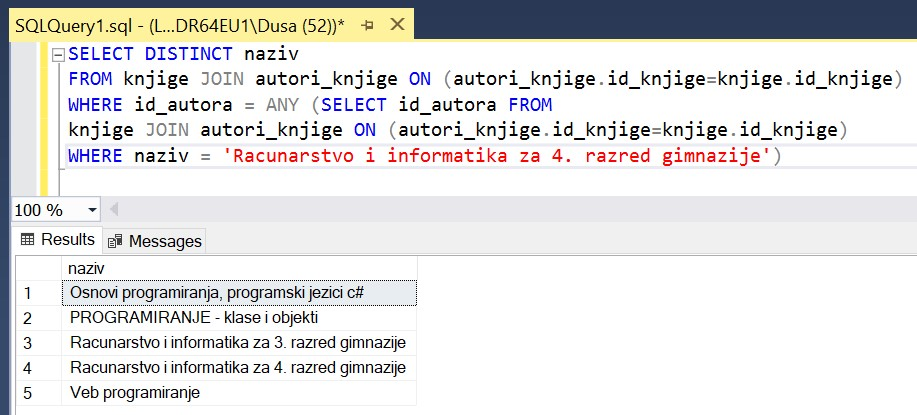

Има смисла да у приказу резултата изоставимо уџбеник са називом „Racunarstvo i informatika za 4. razred gimnazije“ зато што нас вероватно интересују друге књиге које су написали аутори овог уџбеника. Проширићемо део WHERE са условом да се прикажу само уџбеници чији је назив различит од „Racunarstvo i informatika za 4. razred gimnazije“.

::

    SELECT DISTINCT naziv 
    FROM knjige JOIN autori_knjige ON (autori_knjige.id_knjige=knjige.id_knjige)
    WHERE id_autora IN (SELECT id_autora FROM
    knjige JOIN autori_knjige ON (autori_knjige.id_knjige=knjige.id_knjige)
    WHERE naziv = 'Racunarstvo i informatika za 4. razred gimnazije')
    AND naziv != 'Racunarstvo i informatika za 4. razred gimnazije'
