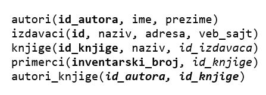
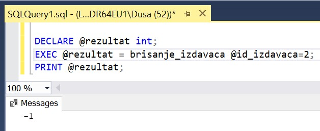
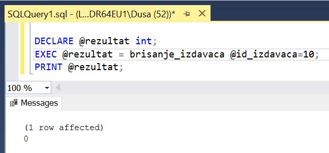

Процедуре и команде UPDATE и DELETE
===================================

.. suggestionnote::

    
    Видели смо како се креирају процедуре помоћу којих можемо да унесемо податке у базу. Унутар процедура могу да се користе и команде за измену и брисање података.  

    Погледаћемо неколико једноставних примера. 

Сви приказани примери су у вези са табелама које чине део базе података за библиотеку. Следи списак свих табела са колонама. Примарни кључеви су истакнути болд, а страни италик. 

Узмимо, на пример, да желимо да креирамо процедуру која ће да нам омогући да изменимо адресу веб-сајта издавача уколико је то потребно. Можда нисмо имали адресу веб-сајта када смо унели издавача у базу први пут, а можда је издавач променио веб-сајт. 

Типови података параметара су исти као типови података одговарајућих колона. 

::

    CREATE PROCEDURE izmena_veb_sajta 
    @izdavac varchar(40), @novi_sajt varchar(50)
    AS
        UPDATE izdavaci
        SET veb_sajt = @novi_sajt
        WHERE naziv = @izdavac

Након што се покрене програмски код тако што се кликне на дугме Execute, процедура може да се позове за конкретне вредности. Када смо додали књигу новог издавача, није у базу уписана и адреса његовог веб-сајта, па позивом креиране процедуре можемо да извршимо измену у том реду. Вредности које се наводе у позиву процедуре ће се употребити у извршавању команде UPDATE која се налази у процедури. 

::

    EXEC izmena_veb_sajta @izdavac='LOM', @novi_sajt='https://lombooks.com/'

На овај начин смо написали програмски код који се прилагођава различитим потребама и не морамо сваки пут, за измену адресе веб-сајта различитих издавача, да пишемо посебне UPDATE команде. 

Следећи пут можемо процедуру да позовемо за другог издавача. 

::

    EXEC izmena_veb_sajta @izdavac='Zavod za udzbenike', 
    @novi_sajt='https://www.knjizara.zavod.co.rs/udzbenici/udzbenici-za-srednju/'

Погледајмо и један пример са командом DELETE. Уколико је библиотека проценила да неку књигу више не жели да има у понуди, зато што уопште није тражена и потребно је место за друге књиге, можемо да обришемо књигу из базе. Уклањање књиге треба да прати и уклањање свих њених примерака. 

За параметар процедуре има смисла да користимо назив књиге. У том случају, потребно је да унутар процедуре декларишемо променљиву *@id_knjige* и потребан нам је упит SELECT којим у ту променљиву уписујемо идентификациони број књиге. Овај идентификациони број нам треба да бисмо могли да обришемо све примерке те књиге. 

::

    SELECT @id_knjige = id_knjige FROM knjige 
    WHERE naziv = @naziv_knjige;

За одређену књигу највероватније имамо и ред или редове у табели autori_knjige којима је повезујемо са аутором или ауторима, па и те редове треба да обришемо. 

Следи комплетан код процедуре која на основу назива књиге брише књигу из базе и све њене примерке. 

::

    CREATE PROCEDURE brisanje_knjige @naziv_knjige varchar(50)
    AS
        DECLARE @id_knjige int;
        SELECT @id_knjige = id_knjige FROM knjige 
        WHERE naziv = @naziv_knjige;
        DELETE FROM primerci
        WHERE id_knjige = @id_knjige;
        DELETE FROM autori_knjige
        WHERE id_knjige = @id_knjige;
        DELETE FROM knjige
        WHERE id_knjige = @id_knjige;

Можемо да напишемо и решење које не захтева помоћну променљиву *@id_knjige*, али у том случају на два места морамо да користимо подупит. Уколико желите да пробате следећи код, потребно је да обришете претходну процедуру, или да је измените када изаберете ставку *Modify* са менија који се појави када се кликне десни тастер миша над већ креираном процедуром.

::

    CREATE PROCEDURE brisanje_knjige @naziv_knjige varchar(50)
    AS
        DELETE FROM primerci
        WHERE id_knjige = (SELECT id_knjige FROM knjige 
            WHERE naziv = @naziv_knjige);
        DELETE FROM autori_knjige
        WHERE id_knjige = (SELECT id_knjige FROM knjige 
            WHERE naziv = @naziv_knjige);
        DELETE FROM knjige
        WHERE naziv = @naziv_knjige;

.. infonote::

    НАПОМЕНА: Не морате да извршите следећу команду да не бисте непотребно обрисали податке из базе. 

Процедуру можемо да позовемо на следећи начин. 

::

    EXEC brisanje_knjige @naziv_knjige='Osnovi programiranja, programski jezici c#';

У овом примеру треба обратити пажњу на један детаљ. Следећа команда ће радити само уколико имамо само једну књигу са траженим називом. У том случају ће се исправно попунити вредност у променљивој *@id_knjige* и биће постављена на идентификациони број баш те једне књиге. 

::

    SELECT @id_knjige = id_knjige FROM knjige WHERE naziv = @naziv_knjige;

Ако има више књига са истим називом, на пример, имамо више књига Рачунарство и информатика за 4. разред гимназије, које су све уџбеници за исти предмет али од различитих издавача, овај програмски код неће радити. То и има смисла, зато што ми сигурно, када уклањамо једну књигу из библиотеке, не желимо да уклонимо и све примерке неке друге књиге која се зове исто. 

Следећа процедура ће сигурно радити, али за њено позивање морамо тачно да знамо идентификациони број књиге коју бришемо заједно са свим њеним примерцима. 

::

    CREATE PROCEDURE brisanje_knjige_id @id_knjige int
    AS
        DELETE FROM primerci
        WHERE id_knjige = @id_knjige;
        DELETE FROM autori_knjige
        WHERE id_knjige = @id_knjige;
        DELETE FROM knjige
        WHERE id_knjige = @id_knjige;

Ову процедуру можемо да позовемо на следећи начин. 

::

    EXEC brisanje_knjige_id @id_knjige=321;

Процедуру можемо да дорадимо тако да прикаже поруку о броју примерака који је обрисан, односно одговарајућу поруку уколико нисмо имали примерке те књиге у библиотеци. 

::

    CREATE PROCEDURE brisanje_knjige_id @id_knjige int
    AS
        DECLARE @broj_primeraka int;
        SELECT @broj_primeraka = COUNT(*) FROM primerci
        WHERE id_knjige = @id_knjige;
        DELETE FROM primerci
        WHERE id_knjige = @id_knjige;
        DELETE FROM autori_knjige
        WHERE id_knjige = @id_knjige;
        DELETE FROM knjige
        WHERE id_knjige = @id_knjige;
        IF @broj_primeraka=0
            PRINT 'Nije bilo primeraka ove knjige u biblioteci';
        ELSE 
            PRINT 'Broj obrisanih primeraka: '+ CAST(@broj_primeraka AS VARCHAR(10));

Постоје ситуације у којима је неопходно да прво проверимо да ли уопште можемо да дозволимо брисање. На пример, желимо да обришемо податке о издавачу, али у библиотеци имамо књиге тог издавача и нема смисла да га обришемо. Ову ситуацију је могуће решити на различите начине. Један од начина је да напишемо процедуру за брисање и да у оквиру те процедуре проверимо да ли је брисање могуће или не, и да прикажемо одговарајућу поруку.

Комплетан програмски код за проверу да ли има књига и брисање издавача стављамо у TRY блок. Ако има књига тог издавача, брисање не може да се догоди и враћамо -1 као вредност грешке. Ако нема књига, извршавамо брисање и враћамо нулу са значењем да није било грешака. У CATCH блоку враћамо програму у којем се ова процедура позива број грешке, тј. ERROR_NUMBER.

::

    CREATE PROCEDURE brisanje_izdavaca @id_izdavaca int
    AS
    --provera da li ima knjiga tog izdavaca u bazi
    BEGIN TRY
    IF EXISTS (SELECT id_knjige FROM knjige 
            WHERE id_izdavaca=@id_izdavaca)
    BEGIN
        RETURN -1;
    END
    ELSE
    --nema knjiga tog izdavaca, moze da se brise
        BEGIN
            DELETE FROM izdavaci 
            WHERE id=@id_izdavaca;
            RETURN 0;
        END
    END TRY
    BEGIN CATCH
        --greska prilikom brisanja
        RETURN ERROR_NUMBER();
    END CATCH

Ако позовемо процедуру за издавача са идентификационим бројем 2 чије књиге имамо у библиотеци, видећемо да није дошло до брисања и у прозору *Messages* ће бити приказан број грешке. 

::

    DECLARE @rezultat int;
    EXEC @rezultat = brisanje_izdavaca @id_izdavaca=2;
    PRINT @rezultat;

Можемо у базу да додамо новог издавача без додавања књига тог издавача. 

::

    INSERT INTO izdavaci
    VALUES (10, 'Kreativni centar', null, null)

Ако сада позовемо процедуру за новододатог издавача чијих књига нема у библиотеци, у прозору *Messages* ће бити приказана порука да је дошло до промене стања у бази у једном реду, односно обрисан је један ред, и да није било грешке, тј. биће приказана нула као број грешке. 

::

    DECLARE @rezultat int;
    EXEC @rezultat = brisanje_izdavaca @id_izdavaca=10;
    PRINT @rezultat;

