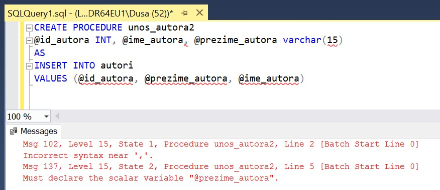
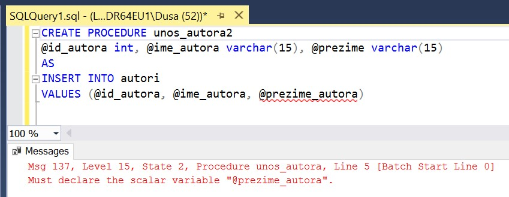
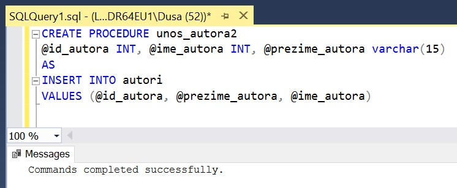
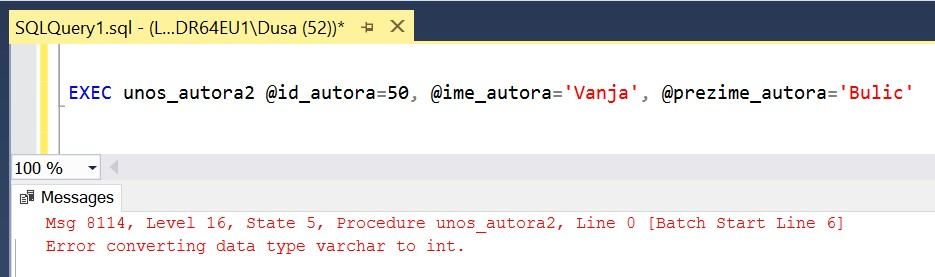
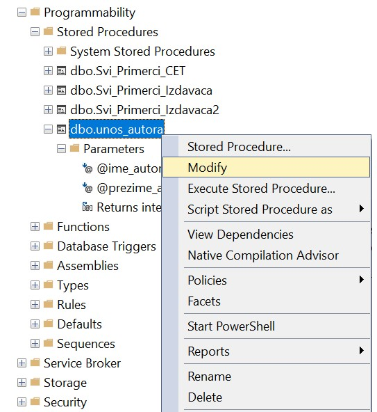
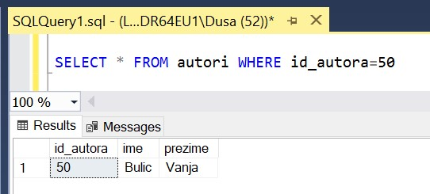

Процедуре и тестирање програма
==============================

.. suggestionnote::

    Док програмирамо, могуће су разне грешке. Важно је да наш програм проради и да ради тачно оно што је у плану. Да бисмо били сигурни, потребно је да тестирамо сваки програм који напишемо и да отклонимо све грешке и недостатке уколико видимо да их има. 

Сви приказани примери су у вези са табелом *autori* која је део базе података за библиотеку. Програмски код, као и команде језика *SQL*, пише се и покреће када се кликне *New Query* након што се покрене систем *SQL Server* и кликне на креирану базу *Biblioteka_knjige* у прозору *Object Explorer*. Фајл са упитима *SQLQuery1.sql* може, а и не мора да се сачува.

Након што се унесе програмски код, кликне се на дугме **Execute**. Уколико се у простору за писање команди налази више блокова кода, потребно је обележити онај који желимо да покренемо. Ако имате више база података, обавезно проверите да ли је поред овог дугмета назив базе у којој желите да покрећете програме. 

.. image:: ../../_images/slika_510a.jpg
    :width: 350
    :align: center

Вратимо се на пример процедуре за унос података о аутору. Док пишемо процедуру, може да се догоди да нешто изоставимо или погрешно напишемо. На пример, у следећем блоку програмског кода недостаје тип податка код другог параметра. 

::

    CREATE PROCEDURE unos_autora2
    @id_autora INT, @ime_autora, @prezime_autora varchar(15)
    AS
    INSERT INTO autori
    VALUES (@id_autora, @prezime_autora, @ime_autora)

Ако у програмском коду постоје грешке овог типа, када кликнемо на дугме Execute, програмски код се неће успешно извршити и добићемо поруку о грешци. 

Није ретко, посебно када пишемо програме који су дугачки, да грешимо приликом писања. У следећем коду на једном месту пише *@prezime*, а на другом *@prezime_autora*, а сигурно смо мислили на исту ствар. 

::

    CREATE PROCEDURE unos_autora2
    @id_autora int, @ime_autora varchar(15), @prezime varchar(15)
    AS
    INSERT INTO autori
    VALUES (@id_autora, @ime_autora, @prezime_autora)

Ни овај програмски код се неће успешно извршити и можемо у прозору *Messages* да прочитамо поруку која нас информише о грешци. Порука нам увек скрене пажњу у ком делу програмског кода треба да тражимо грешку и често садржи и добар предлог шта треба да урадимо да грешке не би било. 

Када програмирамо, неке грешке које направимо нису одмах видљиве. Узмимо, на пример, следећи програмски код. 

::

    CREATE PROCEDURE unos_autora2
    @id_autora INT, @ime_autora INT, @prezime_autora varchar(15)
    AS
    INSERT INTO autori
    VALUES (@id_autora, @prezime_autora, @ime_autora)

Креирање процедуре ће бити успешно. 

Тек када покушамо да позовемо процедуру и унесемо податке о новом аутору, приказује се порука да постоји грешка. 

::

    EXEC unos_autora2 @id_autora=50, @ime_autora='Vanja', @prezime_autora='Bulic'

Приликом креирања процедуре је написано да је тип података INT за *@ime_autora*, и наравно да променљива не може да садржи име Вања. 

Програмски код процедуре може да се измени и да се исправи грешка када изаберемо ставку *Modify* са менија који се појави када кликнемо десни тастер миша над процедуром у прозору *Object Explorer*. Након што се унесу измене, важно је да се поново кликне на дугме *Execute* да би измене остале сачуване у систему. Измењену процедуру, наравно, треба поново тестирати.  

Постоје ситуације у којима нас систем неће упозорити на грешку ни у једном кораку, а грешка постоји. Погледајмо програмски код следеће процедуре. Он се успешно извршава и процедура се креира и остаје сачувана у систему. 

::

    CREATE PROCEDURE unos_autora3
        @id_autora int, @ime_autora varchar(15), @prezime_autora varchar(15)
        AS
        INSERT INTO autori
        VALUES (@id_autora, @prezime_autora, @ime_autora)

Команда која позива процедуру се такође успешно извршава и не добијамо никакву поруку о грешци. 

::

    EXEC unos_autora3 @id_autora=50, @ime_autora='Vanja', @prezime_autora='Bulic'

Тек када проверимо податке који су унети, можемо да видимо да је презиме унето у колону *ime*, а име у колону *prezime*. 

::

    SELECT * FROM autori WHERE id_autora=50

Програмски код процедуре треба да се измени и да се исправи грешка, а из табеле треба обрисати ред са погрешним подацима.  

::

    DELETE FROM autori WHERE id_autora=50

Видели смо неке примере грешака на малој процедури. Програмски кодови које пишемо су често веома дугачки и могуће су разне грешке. Сваки пут је важно да се програм добро тестира и да проверимо да ли ради тачно оно што треба да ради. 

