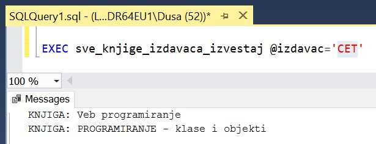
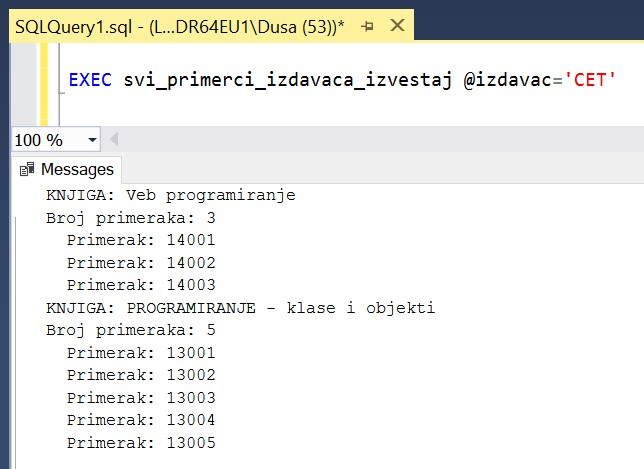
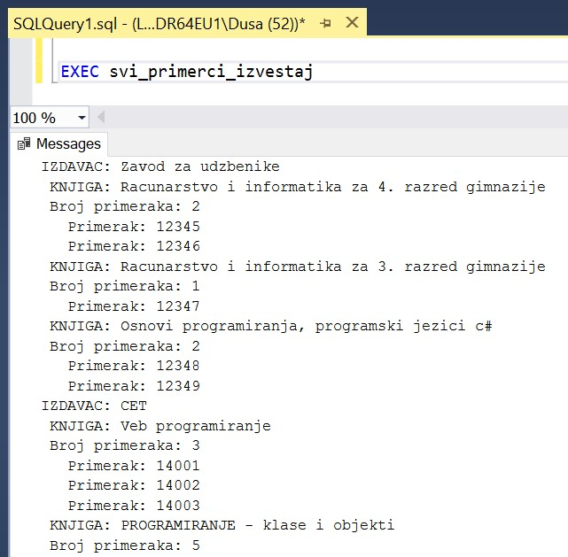

Процедуре и курсор за упит SELECT
=================================

.. suggestionnote::

        
    Већ смо видели једно могуће програмерско решење када библиотека жели да провери колико има примерака књига неког издавача да би размотрили да ли да набављају још књига. Процедуре имају и друге могућности. Можемо, на пример, за сваку књигу прво да прикажемо број примерака, а затим да излистамо њене примерке уколико их имамо у бази. Да бисмо могли ово да постигнемо, потребни су нам курсори (енг. *сursor*). 

    Следи другачије решење истог проблема за који смо већ писали процедуру, али са објашњењем како се користе курсори. 

Сви приказани примери су у вези са табелама које чине део базе података за библиотеку. Следи списак свих табела са колонама. Примарни кључеви су истакнути болд, а страни италик. 

.. image:: ../../_images/slika_512a.jpg
    :width: 600
    :align: center

Програмски код, као и команде језика *SQL*, пише се и покреће када се кликне *New Query* након што се покрене систем *SQL Server* и кликне на креирану базу *Biblioteka_knjige* у прозору *Object Explorer*. Фајл са упитима *SQLQuery1.sql* може, а и не мора да се сачува.

Након што се унесе програмски код, кликне се на дугме **Execute**. Уколико се у простору за писање команди налази више блокова кода, потребно је обележити онај који желимо да покренемо. Ако имате више база података, обавезно проверите да ли је поред овог дугмета назив базе у којој желите да покрећете програме. 

.. image:: ../../_images/slika_510a.jpg
    :width: 600
    :align: center

Написаћемо другачију процедуру која такође може да се користи у ситуацији када библиотека жели да провери колико има примерака књига неког издавача како би размотрили да ли да набављају још књига тог издавача. За сваку књигу ћемо прво да прикажемо број примерака, а затим да излистамо њене примерке уколико их имамо у бази.

Ако желимо да прођемо појединачно ред по ред кроз више редова које враћа неки упит, неопходно је да користимо **курсор**. У овом примеру нам прво треба курсор који ће редом да обради једну по једну књигу изабраног издавача. 

Курсор се декларише тако што му се додели назив и веже се за упит SELECT који најчешће враћа више редова. 

::

    DECLARE kursor_knjige CURSOR FOR 
    SELECT knjige.naziv FROM
    knjige JOIN izdavaci ON (knjige.id_izdavaca=izdavaci.id)
    WHERE izdavaci.naziv = @izdavac;

Уз курсор је важно декларисати и променљиве које ће нам служити да у њих учитамо вредности из табеле на које курсор показује. Како овај упит враћа само назив књиге, довољна нам је једна променљива која је истог типа као одговарајућа колона у табели knjige. 

::

    DECLARE @naziv VARCHAR(50);

Да бисмо радили са курсором, неопходни су следећи кораци након декларације:

1. курсор се отвори,
2. прочитамо један ред у променљиву   коју смо декларисали,
3. у циклусу се помоћу курсора чита један по један ред док се не прочитају сви редови резултата одговарајућег SELECT упита,
4. курсор се затвори и ослободи се меморија.

Следе команде којима то постижемо.

::

    --otvaranje kursora i citanje prvog reda
    OPEN kursor_knjige;
    FETCH NEXT FROM kursor_knjige INTO @naziv;

    --ciklus se izvrsava dokle god nema greske pri citanju
    WHILE @@FETCH_STATUS = 0  
    BEGIN  
        --mozemo da prikazemo podatak koji smo procitali
        PRINT 'KNJIGA: '+@naziv;
        
        --OSTALE KOMANDE U CIKLUSU

        --citanje narednog reda 
        FETCH NEXT FROM kursor_knjige INTO @naziv;
    END

    --zatvaranje kursora i oslobadjanje memorije
    CLOSE kursor_knjige;
    DEALLOCATE kursor_knjige;

Овај програмски код ћемо спаковати у процедуру *sve_knjige_izdavaca_izvestaj*. Када се покрене, процедура остаје запамћена у систему.

::

    CREATE PROCEDURE sve_knjige_izdavaca_izvestaj @izdavac varchar(40)
    AS
    DECLARE kursor_knjige CURSOR FOR 
    SELECT knjige.naziv FROM
    knjige JOIN izdavaci ON (knjige.id_izdavaca=izdavaci.id)
    WHERE izdavaci.naziv = @izdavac;
    DECLARE @naziv VARCHAR(50);

    OPEN kursor_knjige;
    FETCH NEXT FROM kursor_knjige INTO @naziv;

    WHILE @@FETCH_STATUS = 0  
    BEGIN  
        PRINT 'KNJIGA: '+@naziv;
        FETCH NEXT FROM kursor_knjige INTO @naziv;
    END
    CLOSE kursor_knjige;
    DEALLOCATE kursor_knjige;

Након што се покрене овај програмски код кликом на дугме Execute, процедура остаје сачувана у систему и можемо да је позовемо командом EXEC. На следећој слици се види резултат када покренемо процедуру за једног издавача. 

Можемо сада да напишемо процедуру *svi_primerci_izdavaca_izvestaj* коју смо планирали са списком свих примерака. Како у нашем примеру за сваку књигу желимо да прикажемо све примерке, можемо да искористимо комплетан програмски код који смо већ написали унутар претходне процедуре и да у циклусу додамо још један курсор, који ће за једну књигу да излиста све примерке. Пре циклуса можемо да додамо и упит SELECT, којим ћемо да узмемо број примерака, а ако књига нема примерке, нећемо ни улазити у циклус и нећемо креирати други курсор.

Овај други курсор користи променљиву *@naziv* да би се издвојили само примерци књиге са тим називом. 

::

    DECLARE kursor_primerci CURSOR FOR
    SELECT inventarski_broj
    FROM primerci JOIN knjige ON (primerci.id_knjige=knjige.id_knjige)
    WHERE naziv=@naziv;

Уз овај курсор треба декларисати и променљиву за инвентарски број који прочитамо из базе. Следи комплетан програмски код процедуре. Након покретања програмског кода, процедура остаје запамћена у бази. 

::

    CREATE PROCEDURE svi_primerci_izdavaca_izvestaj @izdavac varchar(40)
    AS
    DECLARE kursor_knjige CURSOR FOR 
    SELECT knjige.naziv FROM
    knjige JOIN izdavaci ON (knjige.id_izdavaca=izdavaci.id)
    WHERE izdavaci.naziv = @izdavac;
    DECLARE @naziv VARCHAR(50);

    OPEN kursor_knjige;
    FETCH NEXT FROM kursor_knjige INTO @naziv;

    WHILE @@FETCH_STATUS = 0  
    BEGIN  
        PRINT 'KNJIGA: '+@naziv;

        DECLARE @broj_primeraka INT;
        SELECT @broj_primeraka = COUNT(*)
        FROM primerci JOIN knjige ON (primerci.id_knjige=knjige.id_knjige)
        WHERE naziv=@naziv;

        PRINT 'Broj primeraka: '+ CAST(@broj_primeraka AS VARCHAR(10));

        IF @broj_primeraka>0
            BEGIN
                DECLARE kursor_primerci CURSOR FOR
                SELECT inventarski_broj
                FROM primerci JOIN knjige ON (primerci.id_knjige=knjige.id_knjige)
                WHERE naziv=@naziv;
                DECLARE @inventarski_broj INT;
                
                OPEN kursor_primerci;
                FETCH NEXT FROM kursor_primerci INTO @inventarski_broj;

                WHILE @@FETCH_STATUS = 0  
                BEGIN
                    PRINT '  Primerak: '+CAST(@inventarski_broj AS VARCHAR(10));
                    FETCH NEXT FROM kursor_primerci INTO @inventarski_broj;
                END;
                CLOSE kursor_primerci;
                DEALLOCATE kursor_primerci;
            END 

        FETCH NEXT FROM kursor_knjige INTO @naziv;
    END
    CLOSE kursor_knjige;
    DEALLOCATE kursor_knjige;

Када покренемо процедуру за једног издавача, добијамо прегледан списак свих његових књига и свих примерака. 

::

    EXEC svi_primerci_izdavaca_izvestaj @izdavac='CET'

Уколико библиотеци повремено, на пример, једном годишње, треба комплетан извештај о свим примерцима свих књига свих издавача, можемо да направимо и такву процедуру. Ова процедура није ефикасна зато што је кубне сложености. Поред тога, у бази податка са веома великом количином података се процедура можда неће успешно ни извршити уколико се не дода ограничење броја редова који се узимају, било опцијом TOP или неком другом опцијом.

::

    CREATE PROCEDURE svi_primerci_izvestaj
    AS
    DECLARE kursor_izdavaci CURSOR FOR
    SELECT naziv FROM izdavaci;
    DECLARE @izdavac VARCHAR(40);

    OPEN kursor_izdavaci;
    FETCH NEXT FROM kursor_izdavaci INTO @izdavac;

    WHILE @@FETCH_STATUS = 0  
    BEGIN  
        PRINT 'IZDAVAC: '+@izdavac;

        DECLARE kursor_knjige CURSOR FOR 
        SELECT knjige.naziv FROM
        knjige JOIN izdavaci ON (knjige.id_izdavaca=izdavaci.id)
        WHERE izdavaci.naziv = @izdavac;
        DECLARE @naziv VARCHAR(50);

        OPEN kursor_knjige;
        FETCH NEXT FROM kursor_knjige INTO @naziv;

        WHILE @@FETCH_STATUS = 0  
        BEGIN  
            PRINT ' KNJIGA: '+@naziv;

            DECLARE @broj_primeraka INT;
            SELECT @broj_primeraka = COUNT(*)
            FROM primerci JOIN knjige ON (primerci.id_knjige=knjige.id_knjige)
            WHERE naziv=@naziv;

            PRINT ' Broj primeraka: '+ CAST(@broj_primeraka AS VARCHAR(10));

            IF @broj_primeraka>0
            BEGIN
                DECLARE kursor_primerci CURSOR FOR
                SELECT inventarski_broj
                FROM primerci JOIN knjige ON (primerci.id_knjige=knjige.id_knjige)
                WHERE naziv=@naziv;
                DECLARE @inventarski_broj INT;
            
                OPEN kursor_primerci;
                FETCH NEXT FROM kursor_primerci INTO @inventarski_broj;

                WHILE @@FETCH_STATUS = 0  
                BEGIN
                PRINT '   Primerak: '+CAST(@inventarski_broj AS VARCHAR(10));
                FETCH NEXT FROM kursor_primerci INTO @inventarski_broj;
                END;
                CLOSE kursor_primerci;
                DEALLOCATE kursor_primerci;
            END 

        FETCH NEXT FROM kursor_knjige INTO @naziv;
    END
    CLOSE kursor_knjige;
    DEALLOCATE kursor_knjige;

    FETCH NEXT FROM kursor_izdavaci INTO @izdavac;
    END
    CLOSE kursor_izdavaci;
    DEALLOCATE kursor_izdavaci;

.. infonote::

    ВАЖНО: Увек треба имати у виду да се TOP, или нека друга опција за ограничавање броја редова који се узимају, обавезно користи у већим базама података. 

Када се програмски код покрене, процедура остаје сачувана у бази података. По потреби може да се покрене. 

::

    EXEC svi_primerci_izvestaj

На следећој слици се види део резултата. 

