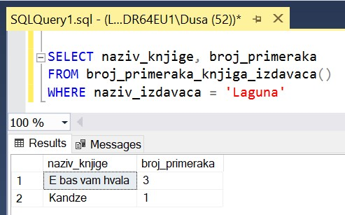

Функције и упит SELECT
======================

.. suggestionnote::

    До сада смо видели примере процедура. Постоји још једна врста именованих блокова програмског кода који остају сачувани у бази података и позивају се по потреби, и то су **функције**. Функције се разликују од процедура зато што увек враћају неку вредност. 

Детаљно објашњење формирања упита SELECT који пишемо као део функција је дато раније у материјалима и по потреби је могуће вратити се на тај део да би се додатно разумело како смо дошли до комплетног решења. 

Сви приказани примери су у вези са табелама које чине део базе података за библиотеку. Следи списак свих табела са колонама. Примарни кључеви су истакнути болд, а страни италик. 

.. image:: ../../_images/slika_512a.jpg
    :width: 600
    :align: center

Програмски код, као и команде језика *SQL*, пише се и покреће када се кликне *New Query* након што се покрене систем *SQL Server* и кликне на креирану базу *Biblioteka_knjige* у прозору *Object Explorer*. Фајл са упитима *SQLQuery1.sql* може, а и не мора да се сачува.

Након што се унесе програмски код, кликне се на дугме **Execute**. Уколико се у простору за писање команди налази више блокова кода, потребно је обележити онај који желимо да покренемо. Ако имате више база података, обавезно проверите да ли је поред овог дугмета назив базе у којој желите да покрећете програме. 

.. image:: ../../_images/slika_510a.jpg
    :width: 600
    :align: center

Креираћемо функцију коју можемо да употребимо у ситуацији када библиотека жели да провери колико има примерака књига неког издавача. Централни део програма је управо упит којим се приказује број примерака књига. Погледаћемо како изгледа овај упит за једног конкретног издавача. 

::

    SELECT COUNT(inventarski_broj)
    FROM primerci JOIN knjige ON (primerci.id_knjige=knjige.id_knjige)
    JOIN izdavaci ON (knjige.id_izdavaca=izdavaci.id)
    WHERE izdavaci.naziv = 'CET'

Функција која ће садржати овај упит враћа цео број и мора да има помоћну променљиву у којoj ћемо привремено сачувати број примерака који прочитамо из базе. Параметре, у овом случају један параметар за назив издавача, стављамо у заграде. Цело тело функције пишемо између BEGIN и END. 

::

    CREATE FUNCTION broj_primeraka_izdavaca (@izdavac VARCHAR(40))
    RETURNS INT
    AS
    BEGIN
        DECLARE @broj_primeraka INT;
        SELECT @broj_primeraka = COUNT(inventarski_broj)
        FROM primerci JOIN knjige ON (primerci.id_knjige=knjige.id_knjige)
        JOIN izdavaci ON (knjige.id_izdavaca=izdavaci.id)
        WHERE izdavaci.naziv = @izdavac;
        RETURN @broj_primeraka;
    END

Након што се покрене овај програмски код, функција остаје сачувана у систему. Како функција враћа један број, она спада у групу скаларних функција (енг. *scalar-valued functions*).

Функције се другачије позивају од процедура. Како функција враћа једну вредност, може директно да се употреби у наредби PRINT и да се та вредност прикаже у прозору *Messages*. Унутар СУБП-а имамо много већ готових и доступних функција. Једну од њих, функцију COUNT, управо смо и употребили. Због тога је важно да се при позиву функције коју смо ми креирали, обавезно наведе назив шеме испред назива функције. То исто може да се уради и у позиву процедуре, али није неопходно. Шема је тренутни простор у којем се ради и у којем се налазе све табеле и сви остали објекти релационе базе података. У овом случају је назив шеме *dbo*. 

::

    PRINT dbo.broj_primeraka_izdavaca('CET')

Функција може да се позове и тако што се вредност коју враћа додели некој променљивој коју декларишемо, а затим вредност те променљиве можемо да испишемо. 

::

    DECLARE @broj INT = dbo.broj_primeraka_izdavaca('CET');
    PRINT @broj;

На следећој слици можемо да видимо резултат рада програма који смо написали и у којем се позива функција. 

Функцију коју смо креирали можемо да позовемо за све издаваче и у програмском коду са курсором. Можемо да креирамо курсор који се везује за упит SELECT који враћа само назив издавача, као што смо имали у неким претходним примерима, а можемо да помоћу упита узмемо и прикажемо све податке о издавачу. У том случају треба да декларишемо онолико променљивих колико има колона у упиту SELECT. Променљиве могу да се зову и другачије, а могу да се зову и исто као колоне само што наравно имају знак @ на почетку. 

::

    DECLARE kursor_izdavaci CURSOR FOR
    SELECT * FROM izdavaci;
    DECLARE @id INT;
    DECLARE @naziv VARCHAR(40);
    DECLARE @adresa VARCHAR(50);
    DECLARE @veb_sajt VARCHAR(50);

    OPEN kursor_izdavaci;
    FETCH NEXT FROM kursor_izdavaci INTO @id, @naziv, @adresa, @veb_sajt;

    WHILE @@FETCH_STATUS = 0  
    BEGIN  
    PRINT 'IZDAVAC: ' + @naziv;
        PRINT '  id = ' + CAST(@id AS VARCHAR(10));
        IF @adresa IS NOT NULL 
            PRINT '  Adresa: ' + @adresa;
        IF @veb_sajt IS NOT NULL 
            PRINT '  Veb sajt: ' + @veb_sajt;
        PRINT '  Broj primeraka: ' + CAST(dbo.broj_primeraka_izdavaca(@naziv) AS VARCHAR(10));
        FETCH NEXT FROM kursor_izdavaci INTO @id, @naziv, @adresa, @veb_sajt;
    END

    CLOSE kursor_izdavaci;
    DEALLOCATE kursor_izdavaci;

Када се кликне се на дугме *Execute*, у прозору *Messages* се приказује комплетан списак. Употребили смо наредбу гранања да се не приказују редови вишка уколико немамо унету адресу или веб-сајт неког издавача.  

Постоји још једна врста функција које можемо да креирамо. То су функције које враћају табеле (енг. *table-valued functions*).

За исти проблем којим смо се већ бавили можемо као решење да напишемо функцију која ће за једног издавача да формира и врати табелу у којој се налазе подаци о свим примерцима књига тог издавача. 

::

    CREATE FUNCTION spisak_primeraka_izdavaca (@izdavac VARCHAR(40))
    RETURNS TABLE
    AS
    RETURN SELECT inventarski_broj, knjige.naziv
    FROM primerci JOIN knjige ON (primerci.id_knjige=knjige.id_knjige)
    JOIN izdavaci ON (knjige.id_izdavaca=izdavaci.id)
    WHERE izdavaci.naziv = @izdavac;

Након што се покрене овај програмски код, функција остаје сачувана у систему. Функцију која враћа табелу можемо да употребимо у упиту SELECT. 

::

    SELECT *
    FROM spisak_primeraka_izdavaca('Zavod za udzbenike')

На следећој слици може да се види како изгледа резултат који добијемо након што употребимо функцију за једног издавача. 

Када приликом креирања табеле унутар функције имамо позиве групних функција или узимамо колоне са истим називом из различитих табела, потребно је да дамо нове називе колонама, као у примеру који следи. Написаћемо функцију која формира и враћа табелу у којој имамо за сваког издавача и сваку његову књигу број примерака. 

::

    CREATE FUNCTION broj_primeraka_knjiga_izdavaca()
    RETURNS TABLE
    AS
    RETURN SELECT izdavaci.naziv AS naziv_izdavaca, 
    knjige.naziv AS naziv_knjige, COUNT(inventarski_broj) AS broj_primeraka
    FROM primerci JOIN knjige ON (primerci.id_knjige=knjige.id_knjige)
    JOIN izdavaci ON (knjige.id_izdavaca=izdavaci.id)
    GROUP BY izdavaci.naziv, knjige.naziv;

Након што се покрене овај програмски код, функција остаје сачувана у систему и можемо да је употребимо у упиту SELECT. 

::

    SELECT *
    FROM broj_primeraka_knjiga_izdavaca()

Резултат овог упита може да се види на следећој слици. Иако ова функција нема параметре, заграде су обавезне и код креирања и код позива. 

Исту функцију можемо да употребимо и у неком другом упиту. Можемо, на пример, да издвојимо књиге са бројем примерака који имамо у библиотеци само за једног издавача. 

::

    SELECT naziv_knjige, broj_primeraka
    FROM broj_primeraka_knjiga_izdavaca()
    WHERE naziv_izdavaca = 'Laguna'

Резултат овог упита може да се види на следећој слици.

