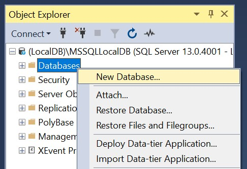

Систем за управљање базама података
===================================

.. suggestionnote::

    Постоји више програма који нуде могућности креирања база података и рада са њима. Набројаћемо овде укратко најважније и биће описано оно што им је заједничко. У једном од алата ћемо детаљно проћи практично процес креирања базе података за коју смо већ припремили пројекат, тј. логички модел. 

    Приказани пример базе података за библиотеку ћемо касније употребити тако што ћемо креирати програме у којима ћемо јој приступати. 

    Алат **Microsoft SQL Server Management Studio** може бесплатно да се преузме са следеће адресе:

    https://docs.microsoft.com/en-us/sql/ssms/download-sql-server-management-studio-ssms

Софтверски систем помоћу кога се формира и користи база података назива се **систем за управљање базама података**, скраћено **СУБП** (енгл. *database management system*, скраћено *DBMS*). Најпознатији системи за управљање базама података су:

- *Oracle Database*,
- *MySql*,
- *Microsoft SQL Server*,
- *PostgreSQL*,
- *IBM DB2*,
- *Redis*,
- *SQLite* итд.

Иако видимо да постоје различити системи различитих произвођача, основни принципи рада у њима су веома слични и током овог курса ћемо се држати онога што је заједничко и са мањим изменама применљиво у свим системима. 

Системи за управљање базама података својим корисницима пружају све услуге рада са подацима. Корисници су најчешће други програми, тј. апликације (на пример, пословне, мобилне или веб-апликације), али и појединци који приступају подацима у облику у коме су подаци записани у бази (на пример, стручњаци за анализу података који у неким случајевима непосредно прегледају и користе податке из базе). Могућ је и сценарио у којем неколико СУБП-ова међусобно комуницирају, тј. један СУБП приступа подацима из другог СУБП-а.

Системи за управљање се брину о смештању података тако да обезбеде:

- могућност што ефикаснијег приступа тим подацима у циљу њихове анализе, обраде и ажурирања,
- интегритет тих података (спречавају настанак грешака, попут смештања неконзистентних и некоректних података),
- могућност истовременог коришћења података од стране већег броја корисника,
- могућност заштите приступа подацима и слично.

Корисници база комуницирају са СУБП-ом коришћењем специјализованих језика у којима формулишу захтеве (тзв. **упите**) на које СУБП одговара. Такви језици се називају **упитним језицима**, а најпознатији и најраспрострањенији упитни језик је SQL (енгл. *structured query language*).

СУБП уводи поделу посла између програмера који праве сам СУБП и програмера који праве апликације (апликативни програмери). То значи да апликативни програмер упите формулише на апстрактном нивоу и не мора да зна све детаље о томе како СУБП те податке држи у меморији и датотекама. Апликативни програмер не мора да се бави детаљима ефикасног смештања података и алгоритмима приступа подацима, јер је СУБП тај који на основу упита одређује најефикаснији начин да се одређен упит изврши и да апликација добије податке које је захтевала.

Упитни језици су **декларативни**, што значи да се само описује који су подаци потребни, а СУБП је тај који аутоматски одређује како је најбоље доћи до тих података.

Модеран СУБП може да чува огромне количине података тако да великом броју корисника омогући практично истовремено коришћење тих података, често коришћењем разнородних рачунарских система. На пример, централизовани електронски дневник на нивоу целе Србије чува податке о стотинама хиљада ученика и милионима њихових оцена тако да хиљаде наставника, ученика и родитеља имају практично тренутни приступ жељеним подацима са својих рачунара, мобилних телефона, таблета и слично.

Употребом алата **SQL Server Management Studio** креираћемо базу података која може да се посматра као део базе података за библиотеку у којој се складиште подаци о свим примерцима књига које се налазе у библиотеци.

Кликнути десни тастер миша над **Databases** у прозору *Object Explorer* и изабрати *New Database...*

Унети назив нове базе података и кликнути дугме OK.

.. infonote::

    НАПОМЕНА: Уколико си у трећем разреду креирао базу података за библиотеку вероватно је већ имаш на рачунару и важно је да се назив ове нове, мање базе, разликује. Као што смо већ рекли, кроз овај мањи пример обнављамо најважније о релационим базама података. 

Новокреирана база података се појавила на списку у прозору *Object Explorer*.

Кликнути дугме *New Query* испод главног падајућег менија. Обратити пажњу на назив базе података доле лево у односу на дугме *New Query*. Уколико већ постоји више база података у овом алату зато што је раније коришћен, потребно је изабрати новокреирану. 

Прво извршити све **CREATE TABLE** команде, једну по једну.

.. infonote::

    **ВАЖНО: Редослед је битан!** Пре креирања табеле која има страни кључ, неопходно је креирати табелу на коју она показује. 

Све команде могу да се истовремено прекопирају, али се свака појединачно прво означи мишем и за сваку означену команду се кликне *Execute*, као што је приказано на следећој слици. 

Након сваке успешно извршене команде појави се одговарајућа порука.

.. image:: ../../_images/slika_108f.jpg
    :width: 600
    :align: center

Након што се свака команда изврши, све табеле ће остати сачуване у бази података за даљу употребу. Фајл *SQLQuery1.sql* може, а и не мора да се сачува.

Следе све CREATE TABLE команде за табеле базе података за библиотеку. 

::

    CREATE TABLE autori
    ( id_autora INT PRIMARY KEY, 
    ime VARCHAR(15) NOT NULL, 
    prezime VARCHAR(15) NOT NULL )

    CREATE TABLE izdavaci
    ( id INT PRIMARY KEY, 
    naziv VARCHAR(40) NOT NULL UNIQUE, 
    adresa VARCHAR(50), 
    veb_sajt VARCHAR(50) UNIQUE)

    CREATE TABLE knjige
    ( id_knjige INT PRIMARY KEY, 
    naziv VARCHAR(50) NOT NULL, 
    id_izdavaca INT NOT NULL REFERENCES izdavaci(id) )

    CREATE TABLE primerci
    ( inventarski_broj INT PRIMARY KEY, 
    id_knjige INT NOT NULL REFERENCES knjige(id_knjige) )

    CREATE TABLE autori_knjige
    (id_autora INT REFERENCES autori(id_autora),
    id_knjige INT REFERENCES knjige(id_knjige), 
    PRIMARY KEY (id_autora, id_knjige) )

Након што су све табеле креиране, појављују се на списку у прозору *Object Explorer*. Уколико се не виде, потребно је кликнути *Refresh*. 
