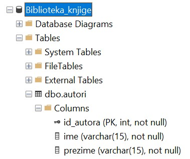
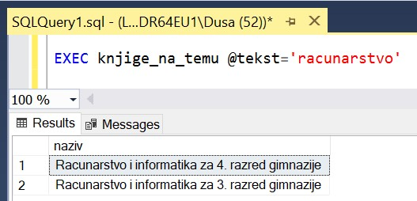
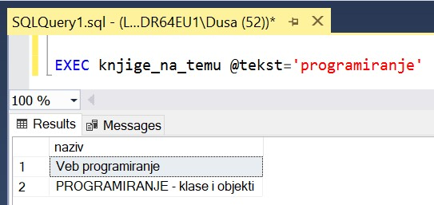
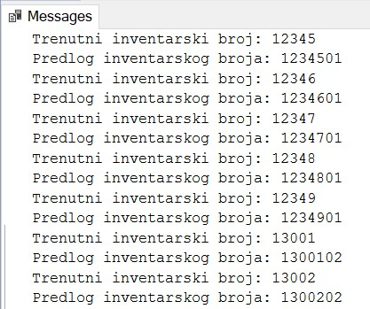

Процедуре и функције са упитом SELECT из једне табеле - задаци
==============================================================

.. suggestionnote::

    Следе примери проблема који се решавају помоћу упита SELECT. Посебно ћемо обратити пажњу на реалне животне ситуације у којима нам је важно да брзо и поуздано обрадимо податке који су сачувани у бази, и како од тих ситуација формирамо конкретан задатак који се решава писањем упита.  

    У примерима који следе, у упиту који је део програма нема спајања табела, тј. подаци се узимају из по једне табеле. 

    Детаљно објашњење формирања упита SELECT који пишемо као део процедуре или функције је дато раније у материјалима и по потреби је могуће вратити се на тај део да би се додатно разумело како смо дошли до комплетног решења. 

Сви приказани примери су у вези са табелама које чине део базе података за библиотеку. Следи списак свих табела са колонама. Примарни кључеви су истакнути болд, а страни италик. 

.. image:: ../../_images/slika_512a.jpg
    :width: 600
    :align: center

Програмски код, као и команде језика *SQL*, пише се и покреће када се кликне *New Query* након што се покрене систем *SQL Server* и кликне на креирану базу *Biblioteka_knjige* у прозору *Object Explorer*. Фајл са упитима *SQLQuery1.sql* може, а и не мора да се сачува.

Након што се унесе програмски код, кликне се на дугме **Execute**. Уколико се у простору за писање команди налази више блокова кода, потребно је обележити онај који желимо да покренемо. Ако имате више база података, обавезно проверите да ли је поред овог дугмета назив базе у којој желите да покрећете програме. 

.. image:: ../../_images/slika_510a.jpg
    :width: 600
    :align: center

.. questionnote::

    1. Библиотеци је потребан списак свих аутора чије књиге поседује. Ради лакшег прегледања списка, важно је да списак буде уређен абецедно.  

**Задатак**: Написати процедуру или функцију која приказује имена и презимена аутора, уређено абецедно по презимену, а ако имају исто презиме, по имену. Написати програмски код у којем се позива написана процедура или функција. 

Прво формирамо упит који је централни део решења. Овај упит враћа више редова зато што у библиотеци сигурно имамо много књига, па самим тим имамо и податке о свим ауторима који су написали те књиге. 

::

    SELECT ime, prezime
    FROM autori
    ORDER BY prezime, ime

Процедуру можемо да креирамо на два различита начина. Прво ћемо написати процедуру која у себи садржи само овај упит и нема параметре. 

::

    CREATE PROCEDURE svi_autori
    AS
    SELECT ime, prezime
    FROM autori
    ORDER BY prezime, ime

Након што се покрене овај програмски код кликом на дугме *Execute*, процедура остаје сачувана у систему и можемо да је позовемо командом EXEC. 

::

    EXEC svi_autori

Други начин је да креирамо процедуру која ће имати курсор који ће ићи редом кроз списак аутора и приказивати њихова имена помоћу команде PRINT. 

Када у решењу имамо курсор, потребно је да имамо и променљиве у које ћемо учитати податке из базе. У овом случају су нам потребне две променљиве које редом одговарају колонама *ime* и *prezime* из табеле *autori*. У прозору *Object Explorer* можемо да проверимо који је тип података ових колона да би променљиве биле истог типа. На следећој слици видимо да су обе колоне типа VARCHAR(15).

Следи комплетан код процедуре у којој користимо курсор кроз следеће кораке:

1. декларишемо курсор и две променљиве,
2. курсор се отвори,
3. прочитамо један ред у променљиве које смо декларисали,
4. у циклусу се помоћу курсора чита један по један ред док се не прочитају сви редови резултата одговарајућег SELECT упита, а вредности које смо прочитали из једног реда се приказују помоћу команде PRINT,
5. курсор се затвори и ослободи се меморија.

::

    CREATE PROCEDURE svi_autori2
    AS
    DECLARE kursor_autori CURSOR FOR
    SELECT ime, prezime FROM autori
    ORDER BY prezime, ime;
    DECLARE @ime VARCHAR(15);
    DECLARE @prezime VARCHAR(15);

    OPEN kursor_autori;
    FETCH NEXT FROM kursor_autori INTO @ime, @prezime;

    WHILE @@FETCH_STATUS = 0  
    BEGIN  
        PRINT @ime+' '+@prezime;
        FETCH NEXT FROM kursor_autori INTO @ime, @prezime;
    END

    CLOSE kursor_autori;
    DEALLOCATE kursor_autori;

Након што се покрене овај програмски код кликом на дугме *Execute*, процедура остаје сачувана у систему и можемо да је позовемо командом EXEC. 

::

    EXEC svi_autori2

Како упит који је централни део решења враћа више редова, има смисла написати функцију која враћа табелу. Унутар функције није дозвољено да се користи ORDER BY, па ћемо сортирање списка урадити у упиту у којем позивамо функцију. 

::

    CREATE FUNCTION svi_autori3()
    RETURNS TABLE
    AS
    RETURN SELECT ime, prezime
    FROM autori;

Након што се покрене овај програмски код, функција остаје сачувана у систему. Функцију која враћа табелу можемо да употребимо у упиту SELECT. 

::
    SELECT * FROM svi_autori3()
    ORDER BY prezime, ime

.. questionnote::

    2. Библиотека повремено планира набавке још књига различитих издавачких кућа. Када планирају једну одређену набавку књига једног издавача, да би могли да пошаљу наруџбеницу, потребна им је адреса те издавачке куће.  

**Задатак**: Написати процедуру или функцију која приказује адресу издавачке куће са датим називом. Написати програмски код у којем се позива написана процедура или функција. 

Прво формирамо упит који је централни део решења за једну конкретну издавачку кућу. 

::

    SELECT adresa
    FROM izdavaci
    WHERE naziv = 'CET'

Сетимо се програмског кода за креирање табеле *izdavaci*. 

::

    CREATE TABLE izdavaci
    ( id INT PRIMARY KEY, 
    naziv VARCHAR(40) NOT NULL UNIQUE, 
    adresa VARCHAR(50), 
    veb_sajt VARCHAR(50) UNIQUE)

Како су вредности у колони *naziv* јединствене, зато што не постоје две издавачке куће са истим називом, упит који је централни део решења враћа податак из тачно једног реда. То значи да када пишемо процедуру, сигурно не треба да користимо курсор и наредбу циклуса зато што курсор користимо само када имамо више редова кроз које треба да прођемо један по један. Ово такође значи да када креирамо функцију, та функција ће бити скаларна, тј. неће враћати табелу, него једну вредност, и то управо текстуални податак који садржи адресу траженог издавача. 

Написаћемо прво процедуру са једним параметром који је назив издавача. У њој је довољно да имамо једну променљиву *@adresa* и да упитом SELECT у њу упишемо адресу коју ћемо затим исписати командом PRINT. 

::

    CREATE PROCEDURE adresa_izdavaca @naziv VARCHAR(40)
    AS
        DECLARE @adresa VARCHAR(50);
        SELECT @adresa = adresa
        FROM izdavaci 
        WHERE naziv = @naziv;
        PRINT @adresa;

Након што се покрене овај програмски код кликом на дугме *Execute*, процедура остаје сачувана у систему и можемо да је позовемо командом EXEC за конкретног издавача. 

::

    EXEC adresa_izdavaca @naziv='CET'

Иста процедура може, наравно, да се по потреби позове за другог издавача. 

::

    EXEC adresa_izdavaca @naziv='Zavod za udzbenike'

Могли смо да креирамо и процедуру која враћа табеларни резултат. 

::

    CREATE PROCEDURE adresa_izdavaca2 @naziv VARCHAR(40)
    AS
        SELECT adresa
        FROM izdavaci 
        WHERE naziv = @naziv;

Након што се покрене овај програмски код кликом на дугме *Execute*, процедура остаје сачувана у систему и можемо да је позовемо командом EXEC за конкретног издавача. 

Следи програмски код функције. 

::

    CREATE FUNCTION adresa_izdavaca3(@naziv VARCHAR(40))
    RETURNS VARCHAR(50)
    AS
    BEGIN
        DECLARE @adresa VARCHAR(50);
        SELECT @adresa = adresa
        FROM izdavaci 
        WHERE naziv = @naziv;
        RETURN @adresa;
    END

Након што се покрене овај програмски код, функција остаје сачувана у систему. Функцију можемо да позовемо у команди PRINT и да тако испишемо резултат који нам функција врати за конкретног издавача. 

::

    PRINT dbo.adresa_izdavaca3('CET')

.. questionnote::

    3. Члан је дошао у библиотеку и жели да узме неку књигу из рачунарства. Не зна тачан назив књиге која му треба, па пита библиотекара које све књиге имају на тему рачунарства.  

**Задатак:** Написати процедуру или функцију која приказује називе књига који у називу садрже реч „racunarstvo“. Написати програмски код у којем се позива написана процедура или функција. 

Као и претходни примери, задатак може да се реши на више начина. Приказаћемо једно могуће решење. 

::

    CREATE PROCEDURE knjige_na_temu_racunarstva
    AS
        SELECT naziv
        FROM knjige
        WHERE naziv LIKE 'Racunarstvo%' OR naziv LIKE '%racunarstvo%'

Након што се покрене овај програмски код, процедура остаје сачувана у систему и можемо да је позовемо командом EXEC. 

::

    EXEC knjige_na_temu_racunarstva

Ова процедура има веома уску примену. Боље решење је написати процедуру са једним параметром текстуалног типа, која претражује све наслове књига и враћа оне који садрже дату реч. Шаблон који користи оператор LIKE формирамо тако што налепимо специјални знак % испред и иза датог текста. 

::

    CREATE PROCEDURE knjige_na_temu @tekst VARCHAR(50)
    AS
        SELECT naziv
        FROM knjige
        WHERE naziv LIKE '%'+@tekst+'%'

Након што се покрене овај програмски код, процедура остаје сачувана у систему и можемо да је позовемо командом EXEC за различите речи. 

Следећи позив одговара почетном задатку да се издвоје наслови који у себи садрже реч „racunarstvo“. 

::

    EXEC knjige_na_temu @tekst='racunarstvo'

Уколико члан библиотеке жели неку књигу из програмирања, процедура може да се позове тако да се издвоје сви наслови који у себи садрже реч „programiranje“. 

::

    EXEC knjige_na_temu @tekst='programiranje'

.. questionnote::

    4. Библиотека жели да допуни своју базу података и унесе адресе и веб-сајтове за све издавачке куће са којима сарађује, па је важно да се провери који им подаци недостају да би знали које издавачке куће да контактирају да би набавили потребне податке. 

**Задатак**: Написати процедуру или функцију која приказује називе издавача за које немамо унету адресу или адресу веб-сајта. Написати програмски код у којем се позива написана процедура или функција.

Као и претходни примери, задатак може да се реши на више начина. Приказаћемо једно могуће решење. 

::

    CREATE FUNCTION nedostaje_podatak_o_izdavacu()
    RETURNS TABLE
    AS
        RETURN SELECT naziv
        FROM izdavaci
        WHERE adresa IS NULL OR veb_sajt IS NULL;

Након што се покрене овај програмски код, функција остаје сачувана у систему. Функцију која враћа табелу можемо да употребимо у упиту SELECT. 

::

    SELECT * FROM nedostaje_podatak_o_izdavacu()

.. questionnote::

    5. Потребно је да се измене инвентарски бројеви књига тако да садрже више цифара што ће омогућити да се њима обележи већи број књига. Да би се задржао систем обележавања који већ постоји, основна идеја је да се постојећи инвентарски бројеви само мало измене. Један од предлога је да се на крај сваког примерка књиге неког издавача дода идентификациони број издавача. Пре него што се финално усвоји предлог и измене идентификациони бројеви постојећих књига, библиотека жели да види како би та измена изгледала. 

**Задатак**: Написати процедуру или функцију која приказује како би изгледали нови идентификациони бројеви примерака књига након што би се на крај сваког додао идентификациони број његовог издавача. Идентификациони број издавача има највише две цифре. Написати програмски код у којем се позива написана процедура или функција.

У решењу ћемо креирати курсор који ће ићи ред по ред кроз списак свих примерака. За један примерак ћемо помоћу упита SELECT пронаћи идентификациони број издавача тог примерка. У променљивој *@novi_broj* ћемо формирати предлог новог броја за тај примерак тако што ћемо тренутни инвентарски број помножити са 100 и додати идентификациони број издавача. 

::

    CREATE PROCEDURE novi_inventarski_brojevi
    AS
        DECLARE primerci_kursor CURSOR FOR
        SELECT inventarski_broj FROM primerci;
        DECLARE @inventarski_broj INT;

    OPEN primerci_kursor;
    FETCH NEXT FROM primerci_kursor INTO @inventarski_broj;

    WHILE @@FETCH_STATUS=0
    BEGIN
        DECLARE @id_izdavaca INT;
        SELECT @id_izdavaca = id_izdavaca
        FROM primerci JOIN knjige ON (primerci.id_knjige=knjige.id_knjige)
        WHERE inventarski_broj=@inventarski_broj;

        PRINT 'Trenutni inventarski broj: '+CAST(@inventarski_broj AS VARCHAR);
        DECLARE @novi_broj INT = @inventarski_broj*100+@id_izdavaca;
        PRINT 'Predlog inventarskog broja: '+CAST(@novi_broj AS VARCHAR);

        FETCH NEXT FROM primerci_kursor INTO @inventarski_broj;
    END

    CLOSE primerci_kursor;
    DEALLOCATE primerci_kursor;

Након што се покрене овај програмски код, процедура остаје сачувана у систему и можемо да је позовемо командом EXEC. 

::

    EXEC novi_inventarski_brojevi

На следећој слици може да се види део резултата који добијемо када покренемо процедуру. 

