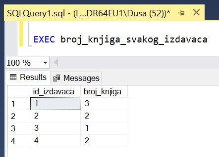
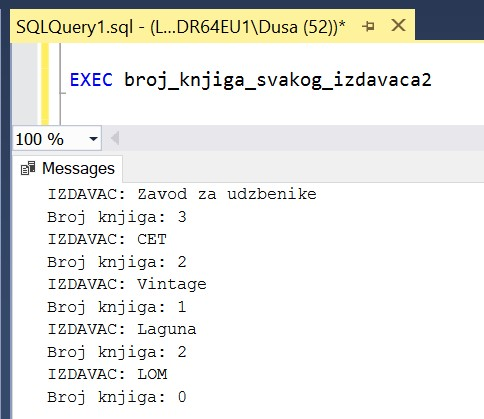
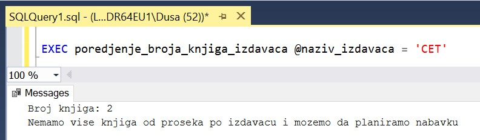
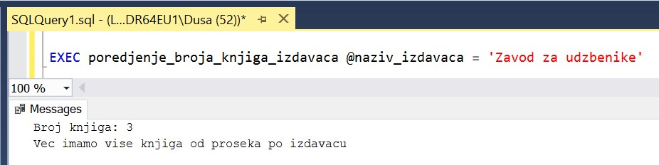

Процедуре и функције са упитом и групним функцијама - задаци
============================================================

.. suggestionnote::

    У упитима се често користе групне функције и таквим упитима смо већ посветили посебну пажњу. Када пишемо процедуре и функције, често имамо прилику да решавању проблема приступимо и на другачији начин и то ћемо илустровати кроз различите задатке. 

    У примерима који следе нема спајања табела, тј. подаци се узимају из по једне табеле. 

    Детаљно објашњење формирања упита SELECT који пишемо као део процедуре или функције је дато раније у материјалима и по потреби је могуће вратити се на тај део да би се додатно разумело како смо дошли до комплетног решења. 

Сви приказани примери су у вези са табелама које чине део базе података за библиотеку. Следи списак свих табела са колонама. Примарни кључеви су истакнути болд, а страни италик. 

.. image:: ../../_images/slika_512a.jpg
    :width: 400
    :align: center

Програмски код, као и команде језика *SQL*, пише се и покреће када се кликне *New Query* након што се покрене систем *SQL Server* и кликне на креирану базу *Biblioteka_knjige* у прозору *Object Explorer*. Фајл са упитима *SQLQuery1.sql* може, а и не мора да се сачува.

Након што се унесе програмски код, кликне се на дугме **Execute**. Уколико се у простору за писање команди налази више блокова кода, потребно је обележити онај који желимо да покренемо. Ако имате више база података, обавезно проверите да ли је поред овог дугмета назив базе у којој желите да покрећете програме. 

.. image:: ../../_images/slika_510a.jpg
    :width: 350
    :align: center

.. infonote::

    У тексту сваког задатка који следи пише да је потребно да се напише процедура или функција. Потребно је проценити када је добро да се користи процедура, а када функција. Неки задаци су и решени на више различитих начина да би могла да се упореде различита решења. За разлику од процедура, функције увек враћају неку вредност. Функција која враћа табелу је јако слична процедури, али постоји разлика у начину употребе. 
    
.. questionnote::

    Књиге издавача СЕТ са идентификационим бројем 2 су много тражене и библиотека жели да провери да ли има довољно наслова овог издавача у понуди. 

.. infonote::

    На основу овог захтева има смисла формулисати неколико различитих задатка. 

**Задатак 1**: Написати процедуру или функцију која приказује називe књига издавача чији је назив дат. Написати програмски код у којем се позива написана процедура или функција. 

Како се назив издавача и назив књиге налазе у две различите табеле, уколико бисмо задатак решавали само писањем упита SELECT, било би неопходно да користимо спајање табела. Међутим, када пишемо процедуру или функцију, имамо и друге опције и можемо да напишемо више команди од којих свака узима податке из тачно по једне табеле. 

Написаћемо процедуру. Првим упитом узимамо идентификациони број издавача и уписујемо га у променљиву *@id_izdavaca*. Ту променљиву користимо у другом упиту да добијемо списак књига тог издавача. 

::

    CREATE PROCEDURE sve_knjige_izdavaca @naziv_izdavaca VARCHAR(40)
    AS
        DECLARE @id_izdavaca INT;
        SELECT @id_izdavaca = id FROM izdavaci
        WHERE naziv = @naziv_izdavaca;
        SELECT naziv
        FROM knjige
        WHERE id_izdavaca = @id_izdavaca;

Након што се покрене овај програмски код, процедура остаје сачувана у систему и можемо да је позовемо командом EXEC. 

::

    EXEC sve_knjige_izdavaca @naziv_izdavaca='CET'

Овај пример нема групну функцију, али нам служи да проверимо резултат рада наредног програма зато што можемо да приметимо у резултату да постоје две књиге овог издавача: „Veb programiranje “ и „PROGRAMIRANJE – klase i objekti“. 

Процедура може, наравно, да се по потреби позове и за неког другог издавача. 

**Задатак 2**: Написати процедуру или функцију која приказује број књига издавача чији је назив дат. Написати програмски код у којем се позива написана процедура или функција.

За овај задатак највише има смисла написати скаларну функцију која враћа број. 

::

    CREATE FUNCTION broj_knjiga_izdavaca (@naziv_izdavaca VARCHAR(40))
    RETURNS INT
    AS
    BEGIN
        DECLARE @id_izdavaca INT;
        SELECT @id_izdavaca = id FROM izdavaci
        WHERE naziv = @naziv_izdavaca;
        DECLARE @broj_knjiga INT;
        SELECT @broj_knjiga = COUNT(knjige.naziv)
        FROM knjige
        WHERE id_izdavaca = @id_izdavaca;
        RETURN @broj_knjiga;
    END

Након што се покрене овај програмски код, функција остаје сачувана у систему. Функцију можемо да позовемо у команди PRINT и да тако испишемо резултат који нам функција врати за конкретног издавача. 

::

    PRINT dbo.broj_knjiga_izdavaca('CET')

Као резултат добијамо број 2, што управо одговара списку књига који смо добили у претходном задатку. 

**Задатак 3**: Написати процедуру или функцију која за сваког издавача приказује број књига. Написати програмски код у којем се позива написана процедура или функција.

Када се реши овај проблем, може да се види и број књига издавача који нас интересује, али и да се тај број упореди са бројем књига које имамо од других издавача. Том анализом можемо већ да проценимо да ли имамо одговарајуће већи број књига траженог издавача и у којој мери тај број можемо да повећамо. 

Погледајмо упит који смо раније користили да решимо овај проблем.

::

    SELECT id_izdavaca, COUNT(id_knjige)
    FROM knjige
    GROUP BY id_izdavaca

Можемо да напишемо једноставну процедуру у којој је садржан овај упит. Без спајања табела можемо да прикажемо само идентификациони број издавача.

::

    CREATE PROCEDURE broj_knjiga_svakog_izdavaca
    AS
    SELECT id_izdavaca, COUNT(id_knjige) AS broj_knjiga
    FROM knjige
    GROUP BY id_izdavaca

Након што се покрене овај програмски код, процедура остаје сачувана у систему и можемо да је позовемо командом EXEC. 

::

    EXEC broj_knjiga_svakog_izdavaca

Када пишемо процедуру, имамо више опција и задатак можемо да решимо и на другачији начин. Креираћемо курсор којим ћемо проћи кроз списак свих издавача, а за сваког ћемо упитом добити број његових књига. 

::

    CREATE PROCEDURE broj_knjiga_svakog_izdavaca2
    AS
    DECLARE kursor_izdavaci CURSOR FOR
    SELECT id, naziv FROM izdavaci;
    DECLARE @id_izdavaca INT;
    DECLARE @naziv_izdavaca VARCHAR(40);

    OPEN kursor_izdavaci;
    FETCH NEXT FROM kursor_izdavaci 
    INTO @id_izdavaca, @naziv_izdavaca;

    WHILE @@FETCH_STATUS=0
    BEGIN
        PRINT 'IZDAVAC: ' + @naziv_izdavaca;
        DECLARE @broj_knjiga INT;
        SELECT @broj_knjiga = COUNT(id_knjige)
        FROM knjige WHERE id_izdavaca = @id_izdavaca;
        PRINT 'Broj knjiga: ' + CAST(@broj_knjiga AS VARCHAR);
        FETCH NEXT FROM kursor_izdavaci 
        INTO @id_izdavaca, @naziv_izdavaca;
    END
    CLOSE kursor_izdavaci;
    DEALLOCATE kursor_izdavaci;

Након што се покрене овај програмски код, процедура остаје сачувана у систему и можемо да је позовемо командом EXEC. 

::

    EXEC broj_knjiga_svakog_izdavaca2

Унутар циклуса смо имали упит SELECT којим смо узимали број књига једног издавача.

::

    SELECT @broj_knjiga = COUNT(id_knjige)
    FROM knjige WHERE id_izdavaca = @id_izdavaca;

Како већ имамо функцију која ово ради, на овом месту смо уместо упита могли да имамо позив креиране функције. Функција узима назив издавача.

::

    @broj_knjiga = dbo.broj_knjiga_izdavaca(@naziv_izdavaca);

Можемо и да напишемо процедуру која ће за једног издавача који нас интересује да упореди број примерака књига са просечним бројем примерака који имамо за сваког издавача. 

Најједноставније решење би било да укупан број књига поделимо са бројем издавача. Ова рачуница, међутим, нам можда неће дати добре информације зато што можда имамо у табели *izdavaci* податке о многим издавачима чије књиге немамо тренутно у понуди у библиотеци. Боље је да прођемо кроз списак свих издавача, па за оне издаваче за које имамо књиге увећамо неки бројач и саберемо књиге које имамо. На тај начин ћемо заиста видети просек књига по издавачима, али узимајући у обзир само оне издаваче чије књиге имамо у библиотеци. 

::

    CREATE PROCEDURE poredjenje_broja_knjiga_izdavaca @naziv_izdavaca VARCHAR(40)
    AS
    DECLARE @id_izdavaca INT;
    DECLARE @broj_knjiga INT;
    DECLARE kursor_izdavaci CURSOR FOR
    SELECT id FROM izdavaci;
    DECLARE @prosecan_broj INT = 0;
    DECLARE @broj_izdavaca INT = 0;

    OPEN kursor_izdavaci;
    FETCH NEXT FROM kursor_izdavaci 
    INTO @id_izdavaca;

    WHILE @@FETCH_STATUS=0
    BEGIN
        SELECT @broj_knjiga = COUNT(id_knjige)
        FROM knjige WHERE id_izdavaca = @id_izdavaca;
        --samo ukoliko neki izdavac ima knjige
        --uvecavamo prosecan broj i prebrojavamo ga
        IF @broj_knjiga>0
        BEGIN
            SELECT @prosecan_broj = @prosecan_broj + @broj_knjiga;
            SELECT @broj_izdavaca = @broj_izdavaca + 1;
        END
        FETCH NEXT FROM kursor_izdavaci 
        INTO @id_izdavaca;
    END
    CLOSE kursor_izdavaci;
    DEALLOCATE kursor_izdavaci;

    --prosecan broj knjiga po izdavacu za izdavace cije knjige imamo
    SELECT @prosecan_broj = @prosecan_broj / @broj_izdavaca;

    --broj knjiga izdavaca koji nas interesuje
    SELECT @id_izdavaca = id
    FROM izdavaci WHERE naziv = @naziv_izdavaca;
    SELECT @broj_knjiga = COUNT(id_knjige)
    FROM knjige WHERE id_izdavaca = @id_izdavaca;
    PRINT 'Broj knjiga: ' + CAST(@broj_knjiga AS VARCHAR);

    IF @broj_knjiga > @prosecan_broj 
        PRINT 'Vec imamo vise knjiga od proseka po izdavacu';
    ELSE 
        PRINT 'Nemamo vise knjiga od proseka po izdavacu i mozemo da planiramo nabavku';

Након што се покрене овај програмски код, процедура остаје сачувана у систему и можемо да је позовемо командом EXEC. 

::

    EXEC poredjenje_broja_knjiga_izdavaca @naziv_izdavaca = 'CET'

Ако покренемо процедуру за неког другог издавача, добићемо другачији резултат. 

::

    EXEC poredjenje_broja_knjiga_izdavaca @naziv_izdavaca = 'Zavod za udzbenike'
    

