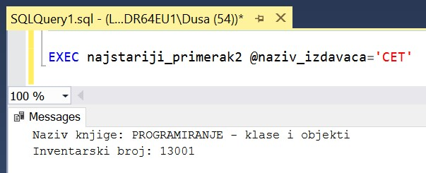

Процедуре и функције са упитом SELECT са спајањем табела - задаци
=================================================================

.. suggestionnote::

    Иако смо видели како је у процедури или функцији могуће употребити неколико упита од којих сваки узима податке из тачно по једне табеле да бисмо пронашли повезане податке који су распоређени у неколико различитих табела, ипак је веома важно и чешће ћемо користити упите у којима се табеле спајају.

    У примерима који следе има спајања табела, тј. подаци се узимају из по две или више повезаних табела.

    Детаљно објашњење формирања упита SELECT који пишемо као део процедуре или функције је дато раније у материјалима и по потреби је могуће вратити се на тај део да би се додатно разумело како смо дошли до комплетног решења. 

Сви приказани примери су у вези са табелама које чине део базе података за библиотеку. Следи списак свих табела са колонама. Примарни кључеви су истакнути болд, а страни италик. 

.. image:: ../../_images/slika_512a.jpg
    :width: 600
    :align: center

Програмски код, као и команде језика *SQL*, пише се и покреће када се кликне *New Query* након што се покрене систем *SQL Server* и кликне на креирану базу *Biblioteka_knjige* у прозору *Object Explorer*. Фајл са упитима *SQLQuery1.sql* може, а и не мора да се сачува.

Након што се унесе програмски код, кликне се на дугме **Execute**. Уколико се у простору за писање команди налази више блокова кода, потребно је обележити онај који желимо да покренемо. Ако имате више база података, обавезно проверите да ли је поред овог дугмета назив базе у којој желите да покрећете програме. 

.. image:: ../../_images/slika_510a.jpg
    :width: 350
    :align: center

.. questionnote::

    1. Књига са називом „Veb programiranje “ је много тражена и библиотека жели да набави још примерака те књиге. Да би библиотека послала наруџбеницу, потребни су јој подаци о издавачу.  

**Задатак:** Написати процедуру или функцију која приказује назив, адресу и адресу веб-сајта издавача књиге чији је назив дат. Написати програмски код у којем се позива написана процедура или функција.

Прво формирамо упит који је централни део решења за конкретну књигу. 

::

    SELECT izdavaci.naziv, adresa, veb_sajt
    FROM knjige JOIN izdavaci ON (knjige.id_izdavaca=izdavaci.id)
    WHERE knjige.naziv = 'Veb programiranje'

У упиту смо могли да користимо и кратке називе за табеле ради краћег записа целог упита. Ово увек може да се примењује иако је у материјалима највећи број примера решен са пуним називима табела. 

::

    SELECT i.naziv, adresa, veb_sajt
    FROM knjige k JOIN izdavaci i ON (k.id_izdavaca=i.id)
    WHERE k.naziv = 'Veb programiranje'

Написаћемо прво процедуру са једним параметром који је назив књиге. Библиотека сигурно у виду има тачно једну књигу и упит који је централни део решења највероватније враћа податак из тачно једног реда. То значи да када пишемо процедуру, свакако не треба да користимо курсор и наредбу циклуса зато што курсор користимо само када имамо више редова кроз које треба да прођемо један по један.

У њој треба да имамо три променљиве и упит којим ћемо у њих уписати тражене податке које ћемо затим исписати помоћу команде PRINT. 

::

    CREATE PROCEDURE podaci_o_izdavacu_knjige @naziv_knjige VARCHAR(50)
    AS
    DECLARE @naziv_izdavaca VARCHAR(40);
    DECLARE @adresa_izdavaca VARCHAR(50);
    DECLARE @veb_sajt_izdavaca VARCHAR(50);
    SELECT @naziv_izdavaca = izdavaci.naziv,
    @adresa_izdavaca = adresa, 
    @veb_sajt_izdavaca = veb_sajt
    FROM knjige JOIN izdavaci ON (knjige.id_izdavaca=izdavaci.id)
    WHERE knjige.naziv = @naziv_knjige;
    PRINT 'IZDAVAC: ' + @naziv_izdavaca;
    PRINT 'Adresa: ' + @adresa_izdavaca;
    PRINT 'Veb-sajt: ' + @veb_sajt_izdavaca;

Након што се покрене овај програмски код, процедура остаје сачувана у систему и можемо да је позовемо командом EXEC. 

::

    EXEC podaci_o_izdavacu_knjige @naziv_knjige='Veb programiranje'

Процедура коју смо написали је применљива у више ситуација. Кад год библиотека планира набавку још примерака неке књиге, процедура се покрене за ту књигу.  

::

    EXEC podaci_o_izdavacu_knjige @naziv_knjige='Kandze'

Писали смо процедуру под претпоставком да имамо тачно једну књигу датог назива. Ово је у већини случајева тачно, али не увек. На пример, можемо да имамо две књиге са називом „Racunarstvo i informatika za 4. razred gimnazije“, које су обе уџбеници за исти предмет, али различитих издавача. Јасно је да употреба курсора не долази у обзир зато што библиотека сигурно има у виду тачно једну књигу, али ми можемо да поправимо програмски код тако да прикаже поруку уколико је дошло до ретке ситуације у којој имамо две или више књига са истим називом. 

Програмски код процедуре може да се измени када изаберемо ставку *Modify* са менија који се појави када кликнемо десни тастер миша над процедуром у прозору *Object Explorer*. Следи допуњени програмски код. Након што се унесу измене, обавезно мора да се кликне на дугме *Execute*.

::

    CREATE PROCEDURE podaci_o_izdavacu_knjige @naziv_knjige VARCHAR(50)
    AS
    DECLARE @broj_knjiga INT;
    SELECT @broj_knjiga = COUNT(*) FROM knjige
    WHERE naziv = @naziv_knjige;

    IF @broj_knjiga=0
     PRINT 'Nema knjige sa tim nazivom';
    ELSE IF @broj_knjiga>1
     PRINT 'Ima vise knjiga sa tim nazivom';
    ELSE
    BEGIN
        DECLARE @naziv_izdavaca VARCHAR(40);
        DECLARE @adresa_izdavaca VARCHAR(50);
        DECLARE @veb_sajt_izdavaca VARCHAR(50);
        SELECT @naziv_izdavaca = izdavaci.naziv,
        @adresa_izdavaca = adresa, 
        @veb_sajt_izdavaca = veb_sajt
        FROM knjige JOIN izdavaci ON (knjige.id_izdavaca=izdavaci.id)
        WHERE knjige.naziv = @naziv_knjige;
        PRINT 'IZDAVAC: ' + @naziv_izdavaca;
        PRINT 'Adresa: ' + @adresa_izdavaca;
        PRINT 'Veb-sajt: ' + @veb_sajt_izdavaca;
    END

.. questionnote::

    2. Библиотека је у процесу набавке нових примерака књига издавачке куће СЕТ. Тренутно се размишља да се најстарије набављени примерци књига ове издавачке куће повуку из употребе и раскњиже. Инвентарски бројеви се додељују редом како се примерци набављају, тако да примерак који је раније набављен има мањи инвентарски број. 

**Задатак**: Написати процедуру или функцију која приказује назив књиге и инвентарски број најстарије набављеног примерака књиге у издању издавачке куће чији је назив дат. Написати програмски код у којем се позива написана процедура или функција.

Можемо да креирамо процедуру у којој ћемо написати упит SELECT који има подупит. Подупит враћа најмањи инвентарски број неког примерка књиге датог издавача. Спољашњи упит издваја тај инвентарски број и назив књиге. 

::

    CREATE PROCEDURE najstariji_primerak @naziv_izdavaca VARCHAR(40)
    AS
    SELECT knjige.naziv, inventarski_broj 
    FROM primerci JOIN knjige ON (primerci.id_knjige=knjige.id_knjige)
    WHERE inventarski_broj = (SELECT MIN(inventarski_broj) 
    FROM primerci JOIN knjige ON (primerci.id_knjige=knjige.id_knjige)
    JOIN izdavaci ON (knjige.id_izdavaca=izdavaci.id)
    WHERE izdavaci.naziv = @naziv_izdavaca)

Након што се покрене овај програмски код, процедура остаје сачувана у систему и можемо да је позовемо командом EXEC. 

::

    EXEC najstariji_primerak @naziv_izdavaca='CET'

Процедура коју смо написали је применљива у више ситуација. Кад год библиотека планира набавку још примерака књига неког издавача, процедура се покрене за тог издавача и видимо који је најстарији примерак књиге коју имамо да би се проценило да ли може да се повуче из употребе.  

::

    EXEC podaci_o_izdavacu_knjige @naziv_knjige='Zavod za udzbenike'

Могли смо да креирамо и процедуру која користи два упита, чиме избегавамо потребу да се користи упит са подупитом. У овој варијанти процедуре су нам потребне и две променљиве у које уписујемо податке које упитима прочитамо из базе. Како је инвентарски број примарни кључ, постоји само један примерак са најмањим инвентарским бројем, тако да у овом решењу није потребна употреба курсора. 

::

    CREATE PROCEDURE najstariji_primerak2 @naziv_izdavaca VARCHAR(40)
    AS
    DECLARE @najmanji_inventarski_broj INT;
    SELECT @najmanji_inventarski_broj = MIN(inventarski_broj) 
    FROM primerci JOIN knjige ON (primerci.id_knjige=knjige.id_knjige)
    JOIN izdavaci ON (knjige.id_izdavaca=izdavaci.id)
    WHERE izdavaci.naziv = @naziv_izdavaca;

    DECLARE @naziv_knjige VARCHAR(50);
    SELECT @naziv_knjige = knjige.naziv
    FROM primerci JOIN knjige ON (primerci.id_knjige=knjige.id_knjige)
    WHERE inventarski_broj = @najmanji_inventarski_broj; 

    PRINT 'Naziv knjige: ' + @naziv_knjige;
    PRINT 'Inventarski broj: ' + CAST(@najmanji_inventarski_broj AS VARCHAR)

Након што се покрене овај програмски код, процедура остаје сачувана у систему и можемо да је позовемо командом EXEC. 

::

    EXEC najstariji_primerak2 @naziv_izdavaca='CET'

За овај задатак је имало смисла и да напишемо скаларну функцију која враћа најмањи инвентарски број за неког издавача. 

::

    CREATE FUNCTION najmanji_inventarski_broj (@naziv_izdavaca VARCHAR(40))
    RETURNS INT
    AS
    BEGIN
        DECLARE @broj INT;
        SELECT @broj = MIN(inventarski_broj) 
        FROM primerci JOIN knjige ON (primerci.id_knjige=knjige.id_knjige)
        JOIN izdavaci ON (knjige.id_izdavaca=izdavaci.id)
        WHERE izdavaci.naziv = @naziv_izdavaca;
        RETURN @broj;
    END

Након што се покрене овај програмски код, функција остаје сачувана у систему. Функцију можемо да тестирамо у команди PRINT. 

::
    
    PRINT dbo.najmanji_inventarski_broj('CET')

Можемо да изменимо претходну процедуру тако да у њој позовемо управо креирану функцију. Програмски код процедуре може да се измени када изаберемо ставку *Modify* са менија који се појави када кликнемо десни тастер миша над процедуром у прозору *Object Explorer*. Следи измењени програмски код. Након што се унесу измене, обавезно мора да се кликне на дугме *Execute*.

::

    CREATE PROCEDURE najstariji_primerak2 @naziv_izdavaca VARCHAR(40)
    AS
    DECLARE @najmanji_inventarski_broj INT;
    SELECT @najmanji_inventarski_broj = dbo.najmanji_inventarski_broj(@naziv_izdavaca);

    DECLARE @naziv_knjige VARCHAR(50);
    SELECT @naziv_knjige = knjige.naziv
    FROM primerci JOIN knjige ON (primerci.id_knjige=knjige.id_knjige)
    WHERE inventarski_broj = @najmanji_inventarski_broj; 

    PRINT 'Naziv knjige: ' + @naziv_knjige;
    PRINT 'Inventarski broj: ' + CAST(@najmanji_inventarski_broj AS VARCHAR)

.. questionnote::

    3. Неколико чланова библиотеке се истог дана распитивало за књигу са називом „PROGRAMIRANJE – klase i objekti“. Потребно је проверити да ли постоји довољан број примерака ове књиге. 

.. infonote::

    НАПОМЕНА: На основу овог захтева има смисла формулисати два различита задатка. 

**Задатак 1**: Написати процедуру или функцију која приказује инвентарске бројеве књига са датим називом. Написати програмски код у којем се позива написана процедура или функција.

Задатак може да се реши на неколико начина. Написаћемо једноставну процедуру. 

::

    CREATE PROCEDURE primeci_knjige @naziv_knjige VARCHAR(50)
    AS
    SELECT inventarski_broj
    FROM primerci JOIN knjige ON (primerci.id_knjige=knjige.id_knjige)
    WHERE naziv = @naziv_knjige

Након што се покрене овај програмски код, процедура остаје сачувана у систему и можемо да је позовемо командом EXEC. 

::

    EXEC primeci_knjige
    @naziv_knjige='PROGRAMIRANJE - klase i objekti'

Процедура коју смо написали може да се користи више пута. Кад год имамо ситуацију а више чланова тражи исту књигу, библиотека може да провери да ли постоји довољан број примерака. 

::

    EXEC primeci_knjige
    @naziv_knjige='Veb programiranje'

**Задатак 2**: Написати процедуру или функцију која приказује број примерака књига са датим називом. Написати програмски код у којем се позива написана процедура или функција.

За овај задатак има највише смисла да напишемо скаларну функцију која враћа број. 

::

    CREATE FUNCTION broj_primeraka_knjige (@naziv_knjige VARCHAR(50))
    RETURNS INT
    AS 
    BEGIN
        DECLARE @broj INT;
        SELECT @broj = COUNT(inventarski_broj)
        FROM primerci JOIN knjige ON (primerci.id_knjige=knjige.id_knjige)
        WHERE naziv = @naziv_knjige;
        RETURN @broj;
    END

Након што се покрене овај програмски код, функција остаје сачувана у систему. Функцију можемо да позовемо у команди PRINT за конкретну књигу.

::

    PRINT dbo.broj_primeraka_knjige('PROGRAMIRANJE - klase i objekti')

.. questionnote::

    4. Библиотека размишља да набави још примерака књига награђиваног аутора Марка Видојковића. Да би донели одлуку о новим набавкама, прво је потребно да провере стање са примерцима књига које већ имају од овог писца. 

.. infonote::

    НАПОМЕНА: На основу овог захтева има смисла формулисати неколико различитих задатка. 

**Задатак 1**: Написати процедуру или функцију која приказује инвентарске бројеве примерака и називе књига аутора датог имена и презимена. Написати програмски код у којем се позива написана процедура или функција.

Овај задатак може да се реши на више начина. Како сигурно има више примерака књига једног аутора у библиотеци, упит који је централни део решења враћа више редова. Приказаћемо решење са курсором. 

::

    CREATE PROCEDURE primerci_knjiga_autora @ime VARCHAR(15), @prezime VARCHAR(15)
    AS
        DECLARE kursor_primerci CURSOR FOR SELECT inventarski_broj, naziv
        FROM primerci JOIN knjige ON (primerci.id_knjige=knjige.id_knjige)
        JOIN autori_knjige ON (autori_knjige.id_knjige=knjige.id_knjige)
        JOIN autori ON (autori_knjige.id_autora=autori.id_autora)
        WHERE ime = @ime AND prezime = @prezime;
        DECLARE @inventarski_broj INT;
        DECLARE @naziv VARCHAR(50);

    OPEN kursor_primerci;
    FETCH NEXT FROM kursor_primerci INTO @inventarski_broj, @naziv;

    WHILE @@FETCH_STATUS=0
    BEGIN
        PRINT 'Knjiga: '+@naziv;
        PRINT 'Inventarski broj: ' + CAST(@inventarski_broj AS VARCHAR);
        FETCH NEXT FROM kursor_primerci INTO @inventarski_broj, @naziv;
    END
    CLOSE kursor_primerci;
    DEALLOCATE kursor_primerci;

Након што се покрене овај програмски код, процедура остаје сачувана у систему и можемо да је позовемо командом EXEC. 

::
    
    EXEC primerci_knjiga_autora @ime='Marko', @prezime='Vidojkovic'

Процедуру смо могли и другачије да организујемо, тако да за сваку књигу прикажемо све примерке. У том случају бисмо користили два курсора и циклус у циклусу. 

**Задатак 2**: Написати процедуру или функцију која приказује укупан број примерака књига аутора датог имена и презимена. Написати програмски код у којем се позива написана процедура или функција.

За овај задатак има највише смисла да напишемо скаларну функцију која враћа број. 

::

    CREATE FUNCTION broj_primeraka_autora (@ime VARCHAR(15), @prezime VARCHAR(15))
    RETURNS INT
    AS 
    BEGIN
        DECLARE @broj INT;
        SELECT @broj = COUNT(inventarski_broj)
        FROM primerci JOIN knjige ON (primerci.id_knjige=knjige.id_knjige)
        JOIN autori_knjige ON (autori_knjige.id_knjige=knjige.id_knjige)
        JOIN autori ON (autori_knjige.id_autora=autori.id_autora)
        WHERE ime = @ime AND prezime = @prezime
        RETURN @broj;
    END

Након што се покрене овај програмски код, функција остаје сачувана у систему. Функцију можемо да позовемо у команди PRINT за конкретног аутора.

::

    PRINT dbo.broj_primeraka_autora('Marko', 'Vidojkovic')

**Задатак 3**: Написати процедуру или функцију која приказује број примерака сваке књига аутора датог имена и презимена. Написати програмски код у којем се позива написана процедура или функција.

Задатак може да се реши на више начина. Написаћемо функцију која враћа табелу. Обратити пажњу да се у упиту користи резултат групне функције и да треба да дамо назив тој колони. 

::

    CREATE FUNCTION broj_primeraka_po_knjizi_autora (@ime VARCHAR(15), @prezime VARCHAR(15))
    RETURNS TABLE
    AS
    RETURN SELECT COUNT(inventarski_broj) AS broj_primeraka, naziv
    FROM primerci JOIN knjige ON (primerci.id_knjige=knjige.id_knjige)
    JOIN autori_knjige ON (autori_knjige.id_knjige=knjige.id_knjige)
    JOIN autori ON (autori_knjige.id_autora=autori.id_autora)
    WHERE ime = @ime AND prezime = @prezime
    GROUP BY naziv

Након што се покрене овај програмски код, функција остаје сачувана у систему. Функцију која враћа табелу можемо да употребимо у упиту SELECT. 

::

    SELECT * FROM dbo.broj_primeraka_po_knjizi_autora('Marko', 'Vidojkovic')

**Задатак 4**: Написати процедуру или функцију која приказује називе књига аутора датог имена и презимена од којих имамо само по један примерак у библиотеци. Написати програмски код у којем се позива написана процедура или функција.

Задатак може да се реши на више начина. Написаћемо једноставну процедуру. 

::

    CREATE PROCEDURE knjige_jedan_primerak_autora @ime VARCHAR(15), @prezime VARCHAR(15)
    AS
    SELECT naziv
    FROM primerci JOIN knjige ON (primerci.id_knjige=knjige.id_knjige)
    JOIN autori_knjige ON (autori_knjige.id_knjige=knjige.id_knjige)
    JOIN autori ON (autori_knjige.id_autora=autori.id_autora)
    WHERE ime = @ime AND prezime = @prezime
    GROUP BY naziv 
    HAVING COUNT(inventarski_broj) = 1

Након што се покрене овај програмски код, процедура остаје сачувана у систему и можемо да је позовемо командом EXEC. 

::

    EXEC knjige_jedan_primerak_autora @ime='Marko', @prezime='Vidojkovic'

.. questionnote::

    5. Члан библиотеке је заинтересован да позајми још неку књигу од аутора који су написали уџбеник са називом „Racunarstvo i informatika za 4. razred gimnazije'“. 

**Задатак**: Написати процедуру или функцију која, без понављања, приказује све књиге које су писали аутори књиге са датим називом.

Задатак може да се реши на више начина. Написаћемо једноставну процедуру. 

::

    CREATE PROCEDURE isti_autori @naziv_knjige VARCHAR(50)
    AS
    SELECT DISTINCT naziv 
    FROM knjige JOIN autori_knjige ON (autori_knjige.id_knjige=knjige.id_knjige)
    WHERE id_autora IN (SELECT id_autora FROM
    knjige JOIN autori_knjige ON (autori_knjige.id_knjige=knjige.id_knjige)
    WHERE naziv = @naziv_knjige)
    AND naziv != @naziv_knjige 

Након што се покрене овај програмски код, процедура остаје сачувана у систему и можемо да је позовемо командом EXEC. 

::
    
    EXEC isti_autori @naziv_knjige='Racunarstvo i informatika za 4. razred gimnazije'

