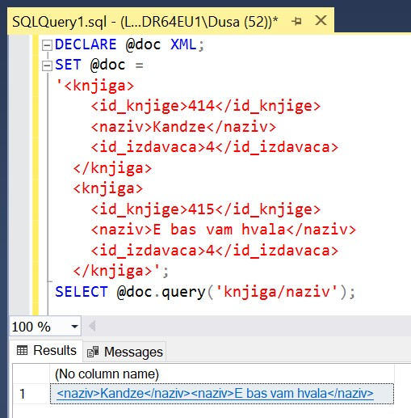

Формат XML
==========

.. suggestionnote::

        
    Често постоји потреба за разменом информација са другим системима. Формат XML је широко распрострањен и одавно у употреби управо за размену података између различитих оперативних система, база података и програмских платформи. Он је, у суштини, обичан текстуални документ и то омогућава да може да буде било где прочитан и употребљен. 

    Систем *SQL Server* има уграђену потпуну подршку за рад са XML форматом организације података. Као илустрацију ћемо показати неколико опција. 

Програмски код, као и команде језика *SQL*, пише се и покреће када се кликне *New Query* након што се покрене систем *SQL Server* и кликне на креирану базу *Biblioteka_knjige* у прозору *Object Explorer*. Фајл са упитима *SQLQuery1.sql* може, а и не мора да се сачува.

Након што се унесе програмски код, кликне се на дугме **Execute**. Уколико се у простору за писање команди налази више блокова кода, потребно је обележити онај који желимо да покренемо. Ако имате више база података, обавезно проверите да ли је поред овог дугмета назив базе у којој желите да покрећете програме. 

.. image:: ../../_images/slika_510a.jpg
    :width: 350
    :align: center

Следећим упитом можемо да добијемо XML фајл у којем се налази комплетан садржај једне табеле. 

::

    SELECT *
    FROM knjige 
    FOR XML RAW ('knjiga'), ROOT('spisak_knjiga'), ELEMENTS

Након што покренемо овај упит, комплетан XML фајл добијамо у једном пољу и можемо да га пребацимо у неки едитор, као што је на пример програм *Notepad*.

::

    <spisak_knjiga> 
    <knjiga>
        <id_knjige>111</id_knjige>
        <naziv>Racunarstvo i informatika za 4. razred gimnazije</naziv>
        <id_izdavaca>1</id_izdavaca>
    </knjiga>
    <knjiga>
        <id_knjige>222</id_knjige>
        <naziv>Racunarstvo i informatika za 3. razred gimnazije</naziv>
        <id_izdavaca>1</id_izdavaca>
    </knjiga>
    <knjiga>
        <id_knjige>321</id_knjige>
        <naziv>Osnovi programiranja, programski jezici c#</naziv>
        <id_izdavaca>1</id_izdavaca>
    </knjiga>
    <knjiga>
        <id_knjige>323</id_knjige>
        <naziv>Veb programiranje</naziv>
        <id_izdavaca>2</id_izdavaca>
    </knjiga>
    <knjiga>
        <id_knjige>414</id_knjige>
        <naziv>Kandze</naziv>
        <id_izdavaca>4</id_izdavaca>
    </knjiga>
    <knjiga>
        <id_knjige>415</id_knjige>
        <naziv>E bas vam hvala</naziv>
        <id_izdavaca>4</id_izdavaca>
    </knjiga>
    <knjiga>
        <id_knjige>555</id_knjige>
        <naziv>PROGRAMIRANJE - klase i objekti</naziv>
        <id_izdavaca>2</id_izdavaca>
    </knjiga>
    <knjiga>
        <id_knjige>999</id_knjige>
        <naziv>The Examined Life</naziv>
        <id_izdavaca>3</id_izdavaca>
    </knjiga>
    </spisak_knjiga>

Формат XML користи ознаке или тагове (енг. *tag*), којима описујемо податке које чувамо. Сами подаци се уписују између отвореног и затвореног тага. Тако је, на пример, назив књиге „E, bas   vam hvala“ наведен између отвореног тага *<naziv>* и затвореног тага *</naziv>*. 

За сваку књигу чувамо идентификациони број, назив књиге и идентификациони број издавача. У упиту SELECT смо навели да се подаци који се читају из табеле организују у елементе са називом *knjiga*, који су обележени отвореним  тагом *<knjiga>* и одговарајућим затвореним тагом *</knjiga>*. Следи део XML фајла који се односи на једну књигу. 

::
    
    <knjiga>
        <id_knjige>415</id_knjige>
        <naziv>E bas vam hvala</naziv>
        <id_izdavaca>4</id_izdavaca>
    </knjiga>

На почетку фајла мора да се налази један отворен таг који се односи на почетак целог документа и који има одговарајући затворен таг на самом крају. У упиту SELECT смо дали назив *spisak_knjiga* за тај таг, односно корен (енг. *root*).

Тагови могу да имају атрибуте. Атрибути служе да се неке ствари додатно објасне. Могуће је да подаци које читамо из базе буду уписани као вредности атрибута. Уколико то желимо да постигнемо, из упита који смо малопре покренули треба да уклонимо реч **ELEMENTS**. 

::

    SELECT *
    FROM knjige 
    FOR XML RAW ('Knjiga'), ROOT('Spisak_knjiga')

Фајл у XML формату који смо сада добили изгледа другачије. У случају када нема садржаја између отвореног и затвореног тага, могуће је користити таг који је истовремено и отворен и затворен. У овом случају је то таг *<knjiga/>*. Сваки овај таг има своје атрибуте који су набројани пре косе црте. 

::

    <spisak_knjiga>
        <knjiga id_knjige="111" 
    naziv="Racunarstvo i informatika za 4. razred gimnazije" id_izdavaca="1"/>
        <knjiga id_knjige="222" 
    naziv="Racunarstvo i informatika za 3. razred gimnazije" id_izdavaca="1"/>
        <knjiga id_knjige="321" 
    naziv="Osnovi programiranja, programski jezici c#" id_izdavaca="1"/>
        <knjiga id_knjige="323" naziv="Veb programiranje" id_izdavaca="2"/>
        <knjiga id_knjige="414" naziv="Kandze" id_izdavaca="4"/>
        <knjiga id_knjige="415" naziv="E bas vam hvala" id_izdavaca="4"/>
        <knjiga id_knjige="555" naziv="PROGRAMIRANJE - klase i objekti" id_izdavaca="2"/>
        <knjiga id_knjige="999" naziv="The Examined Life" id_izdavaca="3"/>
    </spisak_knjiga>

На овај начин смо податке из базе података припремили у фајлу који може да чита и користи неки други систем. 

Постоји могућност и да се упити директно извршавају над XML документом. 

::

    DECLARE @doc XML;
    SET @doc = 
    '<knjiga>
        <id_knjige>414</id_knjige>
        <naziv>Kandze</naziv>
        <id_izdavaca>4</id_izdavaca>
    </knjiga>
    <knjiga>
        <id_knjige>415</id_knjige>
        <naziv>E bas vam hvala</naziv>
        <id_izdavaca>4</id_izdavaca>
    </knjiga>';
    SELECT @doc;

Овај једноставан упит ће у једном пољу вратити цео XML. Постоји могућност и да проберемо податке за приказ. 

::

    DECLARE @doc XML;
    SET @doc = 
    '<knjiga>
        <id_knjige>414</id_knjige>
        <naziv>Kandze</naziv>
        <id_izdavaca>4</id_izdavaca>
    </knjiga>
    <knjiga>
        <id_knjige>415</id_knjige>
        <naziv>E bas vam hvala</naziv>
        <id_izdavaca>4</id_izdavaca>
    </knjiga>';
    SELECT @doc.query('knjiga/naziv');

Када се покрене овај програмски код, добијамо само називе књига. 

::

    <naziv>Kandze</naziv>
    <naziv>E bas vam hvala</naziv>

