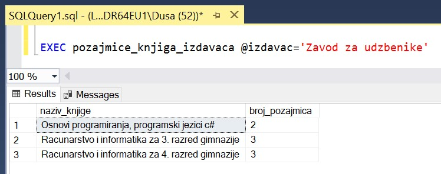
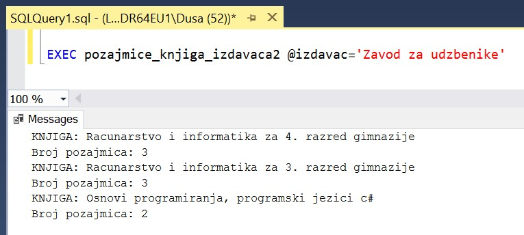
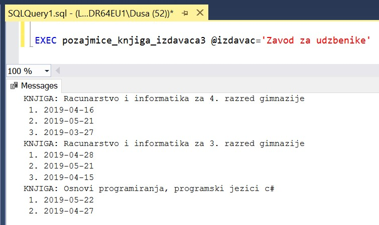
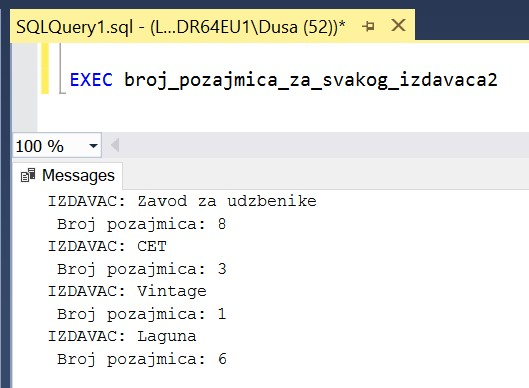

База података за библиотеку - Процедуре, функције и поређење различитих решења
==============================================================================

.. suggestionnote::

    Често исти проблем можемо да решимо на више различитих начина. Постоје ситуације када неки одређени приступ има више смисла од неког другог. 

    Кроз неколико примера који следе ћемо анализирати и упоредити различита решења. У решењима можемо да користимо скаларну функцију, функцију која враћа табелу, процедуру која приказује табелу или процедуру која користи курсоре. 

Програмски код, као и команде језика SQL, пише се и покреће када се кликне *New Query* након што се покрене систем *SQL Server* и кликне на креирану базу *Biblioteka* у прозору *Object Explorer*. Фајл са упитима *SQLQuery1.sql* може, а и не мора да се сачува.

Након што се унесе програмски код, кликне се на дугме *Execute*. Уколико се у простору за писање команди налази више блокова кода, потребно је обележити онај који желимо да покренемо. Ако имате више база података, обавезно проверите да ли је поред овог дугмета назив базе у којој желите да покрећете програме.  

.. image:: ../../_images/slika_521a.jpg
    :width: 350
    :align: center

Сви приказани задаци су у вези са табелама које чине базу података за библиотеку. Следи списак свих табела са колонама. Примарни кључеви су истакнути болд, а страни италик. 

.. image:: ../../_images/slika_521b.jpg
    :width: 780
    :align: center

Вратимо се на пример да библиотека разматра да наручи још књига Завода за уџбенике. Да би донели ту одлуку, потребно је да се види колико су књиге овог издавача тражене. 

Као што смо видели раније у материјалима, на основу овог захтева можемо да формирамо више задатака. 

**Задатак 1**: Приказати укупан број позајмице књига датог издавача. 

Упит којим смо решили овај задатак за једног конкретног издавача.

::

    SELECT COUNT(*)
    FROM pozajmice JOIN primerci 
    ON (pozajmice.inventarski_broj=primerci.inventarski_broj)
    JOIN knjige ON (primerci.id_knjige=knjige.id_knjige)
    JOIN izdavaci ON (knjige.id_izdavaca=izdavaci.id)
    WHERE izdavaci.naziv='Zavod za udzbenike'

За овај проблем има највише смисла написати скаларну функцију која враћа број. 

::

    CREATE FUNCTION broj_pozajmica_izdavaca (@izdavac VARCHAR(40))
    RETURNS INT
    AS
    BEGIN
        DECLARE @broj INT;
        SELECT @broj = COUNT(*)
        FROM pozajmice JOIN primerci 
        ON (pozajmice.inventarski_broj=primerci.inventarski_broj)
        JOIN knjige ON (primerci.id_knjige=knjige.id_knjige)
        JOIN izdavaci ON (knjige.id_izdavaca=izdavaci.id)
        WHERE izdavaci.naziv = @izdavac;
        RETURN @broj;
    END

Следи позив функције. 

::

    PRINT dbo.broj_pozajmica_izdavaca ('Zavod za udzbenike')

Кад год библиотека размишља о набавци књига неког издавача, може да се позове ова функција која је сачувана у систему. На пример, можемо да је позовемо за издавача са називом CET.

::

    PRINT dbo.broj_pozajmica_izdavaca ('CET')

**Задатак 2**: Приказати број позајмица сваке књиге датог издавача. 

Овај извештај нам даје више података од претходног, зато што имамо јасан преглед и које књиге ове издавачке куће су тражене. 

Упит којим смо решили овај задатак за једног конкретног издавача.

::

    SELECT knjige.naziv, COUNT(*)
    FROM pozajmice JOIN primerci 
    ON (pozajmice.inventarski_broj=primerci.inventarski_broj)
    JOIN knjige ON (primerci.id_knjige=knjige.id_knjige)
    JOIN izdavaci ON (knjige.id_izdavaca=izdavaci.id)
    WHERE izdavaci.naziv='Zavod za udzbenike'
    GROUP BY knjige.naziv

Прво решење може да буде процедура у којој се користи креирани упит. Процедура остаје запамћена у систему и има један параметар, тако да ће моћи да се позове по потреби за различите издаваче.  

::

    CREATE PROCEDURE pozajmice_knjiga_izdavaca @izdavac VARCHAR(40)
    AS
    SELECT knjige.naziv AS naziv_knjige, COUNT(*) AS broj_pozajmica
    FROM pozajmice JOIN primerci 
    ON (pozajmice.inventarski_broj=primerci.inventarski_broj)
    JOIN knjige ON (primerci.id_knjige=knjige.id_knjige)
    JOIN izdavaci ON (knjige.id_izdavaca=izdavaci.id)
    WHERE izdavaci.naziv=@izdavac
    GROUP BY knjige.naziv

Позив процедуре за једног издавача.

::

    EXEC pozajmice_knjiga_izdavaca @izdavac='Zavod za udzbenike'

Кад год библиотека размишља о набавци књига неког издавача, може да се позове ова процедура која је сачувана у систему. На пример, можемо да је позовемо за издавача са називом CET. 

::

    EXEC pozajmice_knjiga_izdavaca @izdavac='CET'

Друго решење може да буде процедура са курсором која нам обезбеђује прегледнији извештај. 

::

    CREATE PROCEDURE pozajmice_knjiga_izdavaca2 @izdavac VARCHAR(40)
    AS
    DECLARE kursor_knjige CURSOR FOR
    SELECT knjige.naziv AS naziv_knjige
    FROM knjige JOIN izdavaci ON (knjige.id_izdavaca=izdavaci.id)
    WHERE izdavaci.naziv=@izdavac;
    DECLARE @naziv_knjige VARCHAR(50);

    OPEN kursor_knjige;
    FETCH NEXT FROM kursor_knjige 
    INTO @naziv_knjige;

    WHILE @@FETCH_STATUS=0
    BEGIN
        PRINT 'KNJIGA: '+@naziv_knjige;
        DECLARE @broj INT;
        SELECT @broj = COUNT(*) FROM
        pozajmice JOIN primerci 
        ON (pozajmice.inventarski_broj=primerci.inventarski_broj)
        JOIN knjige ON (primerci.id_knjige=knjige.id_knjige)
        WHERE naziv = @naziv_knjige;
        PRINT 'Broj pozajmica: '+CAST(@broj AS VARCHAR);

        FETCH NEXT FROM kursor_knjige 
        INTO @naziv_knjige;
    END;
    CLOSE kursor_knjige;
    DEALLOCATE kursor_knjige;

Следи позив ове процедуре.

::

    EXEC pozajmice_knjiga_izdavaca2 @izdavac='Zavod za udzbenike'

Треће решење би било додатно проширење процедуре коју смо малопре видели. Када имамо на располагању и рад са курсорима, можемо за сваку књигу, не само да прикажемо број позајмица, већ и да прикажемо све позајмице. Користићемо још један курсор тако да се за сваку књигу прикаже списак датума позајмица. Приликом рада са тим курсором користићемо и променљиву *@broj* да редом обележавамо позајмице. Овај бројач се постави на један за сваку књигу и увећава се унутар циклуса за сваку позајмицу те књиге. 

::

    CREATE PROCEDURE pozajmice_knjiga_izdavaca3 @izdavac VARCHAR(40)
    AS
    DECLARE kursor_knjige CURSOR FOR
    SELECT knjige.naziv AS naziv_knjige
    FROM knjige JOIN izdavaci ON (knjige.id_izdavaca=izdavaci.id)
    WHERE izdavaci.naziv=@izdavac;
    DECLARE @naziv_knjige VARCHAR(50);

    OPEN kursor_knjige;
    FETCH NEXT FROM kursor_knjige 
    INTO @naziv_knjige;

    WHILE @@FETCH_STATUS=0
    BEGIN
        PRINT 'KNJIGA: '+@naziv_knjige;

        DECLARE kursor_pozajmice CURSOR FOR
        SELECT datum_uzimanja FROM
        pozajmice JOIN primerci 
        ON (pozajmice.inventarski_broj=primerci.inventarski_broj)
        JOIN knjige ON (primerci.id_knjige=knjige.id_knjige)
        WHERE naziv = @naziv_knjige;
        DECLARE @datum_uzimanja DATE;

        OPEN kursor_pozajmice;
        FETCH NEXT FROM kursor_pozajmice 
        INTO @datum_uzimanja;
        DECLARE @broj INT = 0;
        WHILE @@FETCH_STATUS=0
        BEGIN
            SELECT @broj = @broj + 1;
            PRINT ' '+CAST(@broj AS VARCHAR)+'. '+CAST(@datum_uzimanja AS VARCHAR);
            FETCH NEXT FROM kursor_pozajmice 
            INTO @datum_uzimanja;
        END
        CLOSE kursor_pozajmice;
        DEALLOCATE kursor_pozajmice;

        FETCH NEXT FROM kursor_knjige 
        INTO @naziv_knjige;
    END;
    CLOSE kursor_knjige;
    DEALLOCATE kursor_knjige;

Следи позив процедуре.

EXEC pozajmice_knjiga_izdavaca3 @izdavac='Zavod za udzbenike'

**Задатак 3**: Приказати за сваког издавача укупан број позајмица његових књига. 

Овај извештај можемо да употребимо тако да видимо како стоји потражња књига Завода за уџбенике у односу на књиге других издавача. 

Упит којим смо решили овај задатак.

::

    SELECT izdavaci.naziv, COUNT(*)
    FROM pozajmice JOIN primerci 
    ON (pozajmice.inventarski_broj=primerci.inventarski_broj)
    JOIN knjige ON (primerci.id_knjige=knjige.id_knjige)
    JOIN izdavaci ON (knjige.id_izdavaca=izdavaci.id)
    GROUP BY izdavaci.naziv

Већ смо креирали и имамо сачувану у систему скаларну функцију која враћа број позајмица једног издавача. 

Прво решење је процедура у којој позивамо већ креирану функцију. 

::

    CREATE PROCEDURE broj_pozajmica_za_svakog_izdavaca
    AS
    SELECT izdavaci.naziv, 
    dbo.broj_pozajmica_izdavaca(izdavaci.naziv) AS broj_pozajmica
    FROM izdavaci;

Следи позив процедуре.

::

    EXEC broj_pozajmica_za_svakog_izdavaca

Друго решење може да буде процедура са курсором у којој такође позивамо ову функцију. 

::

    CREATE PROCEDURE broj_pozajmica_za_svakog_izdavaca2
    AS
    DECLARE kursor_izdavaci CURSOR FOR
    SELECT naziv FROM izdavaci;
    DECLARE @naziv VARCHAR(40);

    OPEN kursor_izdavaci;
    FETCH NEXT FROM kursor_izdavaci
    INTO @naziv;

    WHILE @@FETCH_STATUS=0
    BEGIN
        PRINT 'IZDAVAC: '+@naziv;
        DECLARE @broj INT = dbo.broj_pozajmica_izdavaca(@naziv);
        PRINT ' Broj pozajmica: '+CAST(@broj AS VARCHAR);

        FETCH NEXT FROM kursor_izdavaci
        INTO @naziv;
    END

    CLOSE kursor_izdavaci;
    DEALLOCATE kursor_izdavaci;

Следи позив процедуре.

::

    EXEC broj_pozajmica_za_svakog_izdavaca2

Треће решење би било додатно проширење процедуре коју смо малопре видели. Када имамо на располагању и рад са курсорима, можемо за сваког издавача, не само да прикажемо број позајмица, већ и да прикажемо све позајмице. Користићемо још један курсор тако да се за сваког издавача прикаже списак датума позајмица. 

::

    CREATE PROCEDURE broj_pozajmica_za_svakog_izdavaca3
    AS
    DECLARE kursor_izdavaci CURSOR FOR
    SELECT naziv FROM izdavaci;
    DECLARE @naziv VARCHAR(40);

    OPEN kursor_izdavaci;
    FETCH NEXT FROM kursor_izdavaci
    INTO @naziv;

    WHILE @@FETCH_STATUS=0
    BEGIN
        PRINT 'IZDAVAC: '+@naziv;
        
        DECLARE kursor_pozajmice CURSOR FOR
        SELECT datum_uzimanja FROM pozajmice JOIN primerci 
        ON (pozajmice.inventarski_broj=primerci.inventarski_broj)
        JOIN knjige ON (primerci.id_knjige=knjige.id_knjige)
        JOIN izdavaci ON (knjige.id_izdavaca=izdavaci.id)
        WHERE izdavaci.naziv = @naziv;
        DECLARE @datum_uzimanja DATE;

        OPEN kursor_pozajmice;
        FETCH NEXT FROM kursor_pozajmice INTO @datum_uzimanja;
        WHILE @@FETCH_STATUS=0
        BEGIN
            PRINT ' '+CAST(@datum_uzimanja AS VARCHAR);
            FETCH NEXT FROM kursor_pozajmice INTO @datum_uzimanja;
        END;
        CLOSE kursor_pozajmice;
        DEALLOCATE kursor_pozajmice;

        FETCH NEXT FROM kursor_izdavaci
        INTO @naziv;
    END

    CLOSE kursor_izdavaci;
    DEALLOCATE kursor_izdavaci;

Следи позив процедуре.

::

    EXEC broj_pozajmica_za_svakog_izdavaca3

**Задатак 4**: Приказати издавачке куће чије се књиге често позајмљују из библиотеке, тј. чији је број позајмица већи од три. 

У смислу почетног проблема од којег смо кренули, овај извештај може да послужи тако што ћемо видети да ли се издавачка кућа Завод за уџбенике, чије књиге размишљамо да набавимо, налази на списку издавачких кућа чије су књиге изузетно тражене или не. 

Упит којим смо решили овај задатак.

::

    SELECT izdavaci.naziv, COUNT(*)
    FROM pozajmice JOIN primerci 
    ON (pozajmice.inventarski_broj=primerci.inventarski_broj)
    JOIN knjige ON (primerci.id_knjige=knjige.id_knjige)
    JOIN izdavaci ON (knjige.id_izdavaca=izdavaci.id)
    GROUP BY izdavaci.naziv
    HAVING COUNT(*)>3

Можемо да креирамо процедуру која позива раније креирану функцију. 

::

    CREATE PROCEDURE izdavaci_sa_vise_pozajmica
    AS
    SELECT izdavaci.naziv, 
    dbo.broj_pozajmica_izdavaca(izdavaci.naziv) AS broj_pozajmica
    FROM izdavaci
    WHERE dbo.broj_pozajmica_izdavaca(izdavaci.naziv)>3

Следи позив процедуре.

::

    EXEC izdavaci_sa_vise_pozajmica

Када погледамо овај задатак, видимо да је имало смисла да за претходни задатак креирамо функцију која враћа табелу. 

::

    CREATE FUNCTION broj_pozajmica_za_svakog_izdavaca4 ()
    RETURNS TABLE
    AS
    RETURN SELECT izdavaci.naziv, 
    dbo.broj_pozajmica_izdavaca(izdavaci.naziv) AS broj_pozajmica
    FROM izdavaci;

Када имамо овакву функцију, можемо да је употребимо у различитим упитима и да додатно анализирамо скуп података које враћа. 

Уколико желимо издаваче са више од три позајмице, тај услов ћемо навести у упиту. 

::

    SELECT * FROM broj_pozajmica_za_svakog_izdavaca4()
    WHERE broj_pozajmica>3

Уколико можда желимо да подигнемо границу, и додатно проберемо издаваче према броју позајмица, можемо да покренемо други упит. 

::

    SELECT * FROM broj_pozajmica_za_svakog_izdavaca4()
    WHERE broj_pozajmica>7

Функцију у упиту можемо да употребимо и тако да издвојимо издавачке куће за којима не постоји велика потражња у библиотеци. 

::

    SELECT * FROM broj_pozajmica_za_svakog_izdavaca4()
    WHERE broj_pozajmica<3
