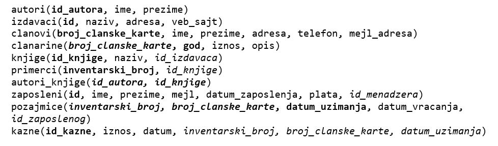
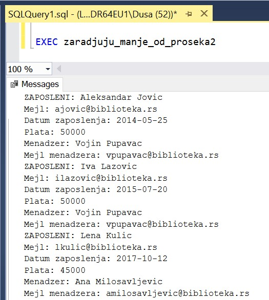

Процедуре, функције и поређење различитих решења
================================================

.. suggestionnote::

    Кроз искуство у програмирању се стиче и вештина да се препозна који начин решавања је најбоље  применити у некој конкретној ситуацију. Искуство долази кроз рад на великом броју задатака. 

Решити следеће задатке писањем процедуре или функције и програмског кода у којем се креирана процедура или функција позива. 

Програмски код, као и команде језика SQL, пише се и покреће када се кликне *New Query* након што се покрене систем *SQL Server* и кликне на креирану базу *Biblioteka* у прозору *Object Explorer*. Фајл са упитима *SQLQuery1.sql* може, а и не мора да се сачува.

Након што се унесе програмски код, кликне се на дугме *Execute*. Уколико се у простору за писање команди налази више блокова кода, потребно је обележити онај који желимо да покренемо. Ако имате више база података, обавезно проверите да ли је поред овог дугмета назив базе у којој желите да покрећете програме.  

Сви приказани задаци су у вези са табелама које чине базу података за библиотеку. Следи списак свих табела са колонама. Примарни кључеви су истакнути болд, а страни италик. 

.. questionnote::

    1. Наредног месеца ће бити повећање плата запослених у библиотеци за све оне којима је плата тренутно мања од просечне плате свих запослених. Потребан је списак особа које очекује повећање да би се обавиле административне припреме.  

**Задатак**: Приказати податке о запосленима који зарађују мање од просека.

Упит којим смо решили овај задатак.

::

    SELECT * FROM zaposleni
    WHERE plata < (SELECT AVG(plata) FROM zaposleni)

Прво решење може да буде функција која враћа табелу. 

::

    CREATE FUNCTION zaradjuju_manje_od_proseka()
    RETURNS TABLE
    AS 
    RETURN SELECT * FROM zaposleni
    WHERE plata < (SELECT AVG(plata) FROM zaposleni)

Следи позив функције. 

::

    SELECT * FROM zaradjuju_manje_od_proseka()

Када имамо овакву функцију сачувану у систему, можемо додатно, по потреби, да у упиту анализирамо податке које враћа. Позиви функције. 

На пример, уколико желимо да пошаљемо обавештење запосленима који ће добити повишицу, можемо да издвојимо њихове адресе електронске поште. 

::

    SELECT mejl FROM zaradjuju_manje_od_proseka()

Можемо, на пример, да додатно анализирамо списак оних који ће добити повећање плате и да узмемо у обзир колико дуго раде. Најчешће веће повећање очекује оне који дуже раде. 

::

    SELECT prezime, datum_zaposlenja FROM zaradjuju_manje_od_proseka()

Као друго решење можемо да креирамо процедуру са курсором. Процедуру можемо да напишемо тако да извештај буде прегледан и детаљан, па чак и да укључи и неке податке о менаџеру запосленог, а не само његов идентификациони број. 

::

    CREATE PROCEDURE zaradjuju_manje_od_proseka2
    AS
    DECLARE @prosek INT;
    SELECT @prosek = AVG(plata) FROM zaposleni;

    DECLARE kursor_zaposleni CURSOR FOR
    SELECT ime, prezime, mejl, datum_zaposlenja, plata, id_menadzera
    FROM zaposleni WHERE plata<@prosek;
    DECLARE @ime VARCHAR(15);
    DECLARE @prezime VARCHAR(15);
    DECLARE @mejl VARCHAR(50);
    DECLARE @datum_zaposlenja DATE;
    DECLARE @plata INT;
    DECLARE @id_menadzera INT;

    OPEN kursor_zaposleni;
    FETCH NEXT FROM kursor_zaposleni
    INTO @ime, @prezime, @mejl, @datum_zaposlenja, 
    @plata, @id_menadzera;

    WHILE @@FETCH_STATUS=0
    BEGIN
        PRINT 'ZAPOSLENI: '+@ime+' '+@prezime;
        PRINT 'Mejl: '+@mejl;
        PRINT 'Datum zaposlenja: '+CAST(@datum_zaposlenja AS VARCHAR);
        PRINT 'Plata: '+CAST(@plata AS VARCHAR);

        --podaci o menadzeru
        DECLARE @ime_menadzera VARCHAR(15);
        DECLARE @prezime_menadzera VARCHAR(15);
        DECLARE @mejl_menadzera VARCHAR(50);
        SELECT @ime_menadzera=ime, @prezime_menadzera=prezime, 
        @mejl_menadzera=mejl FROM zaposleni
        WHERE id = @id_menadzera;
        PRINT 'Menadzer: '+@ime_menadzera+' '+@prezime_menadzera;
        PRINT 'Mejl menadzera: '+@mejl_menadzera;
        
        FETCH NEXT FROM kursor_zaposleni
        INTO @ime, @prezime, @mejl, @datum_zaposlenja, 
        @plata, @id_menadzera;
    END

    CLOSE kursor_zaposleni;
    DEALLOCATE kursor_zaposleni;

Следи позив процедуре и слика на којој се види део резултата.

::

    EXEC zaradjuju_manje_od_proseka2

.. questionnote::

    2. Члан библиотеке је питао за препоруку. Интересује га која је књига и од које издавачке куће тражена најскорије. 

**Задатак**: Приказати назив издавача и назив књиге која је издата током последње, тј. најновије позајмице. 

Упит којим смо решили овај задатак.

::

    SELECT knjige.naziv "Knjiga", izdavaci.naziv "Izdavac"
    FROM pozajmice JOIN primerci ON (pozajmice.inventarski_broj=primerci.inventarski_broj)
    JOIN knjige ON (primerci.id_knjige=knjige.id_knjige)
    JOIN izdavaci ON (knjige.id_izdavaca=izdavaci.id)
    WHERE datum_uzimanja = (SELECT MAX(datum_uzimanja) FROM pozajmice)

Можемо да креирамо процедуру. 

::

    CREATE PROCEDURE najskorije_pozajmljena_knjiga
    AS
    SELECT knjige.naziv AS knjiga, izdavaci.naziv AS izdavac
    FROM pozajmice JOIN primerci ON (pozajmice.inventarski_broj=primerci.inventarski_broj)
    JOIN knjige ON (primerci.id_knjige=knjige.id_knjige)
    JOIN izdavaci ON (knjige.id_izdavaca=izdavaci.id)
    WHERE datum_uzimanja = (SELECT MAX(datum_uzimanja) FROM pozajmice)

Следи позив процедуре. Процедура остаје запамћена у систему и може да се позове сваки пут када неки члан дође у библиотеку и тражи препоруку. 

::

    EXEC najskorije_pozajmljena_knjiga

.. questionnote::

    3. Члан библиотеке Милица Зорановић је дошла у библиотеку и пита за препоруку за неку књигу. Библиотекарка је одлучила да извуче списак књига које су читали други чланови библиотеке који су читали бар неку од књига које је читала и Милица, тј. неки избор књига других чланова библиотеке чији се укус бар делимично поклапа са Миличиним. Милица онда са тог списка може да изабере неки од наслова који јој се допадне. 

**Задатак 1**: Приказати без понављања чланове библиотеке који су прочитали бар једну књигу коју је прочитао и члан датог имена и презимена.  

Овај извештај је део решења којим долазимо до списка књига које би библиотекарка могла да препоручи неком члану. 

Упит којим смо решили овај задатак.

::

    SELECT DISTINCT ime+' '+prezime
    FROM clanovi JOIN pozajmice ON (pozajmice.broj_clanske_karte=clanovi.broj_clanske_karte)
    JOIN primerci ON (pozajmice.inventarski_broj=primerci.inventarski_broj)
    WHERE id_knjige =ANY (
    SELECT id_knjige
    FROM clanovi JOIN pozajmice ON (pozajmice.broj_clanske_karte=clanovi.broj_clanske_karte)
    JOIN primerci ON (pozajmice.inventarski_broj=primerci.inventarski_broj)
    WHERE ime='Milica' AND prezime='Zoranovic' )
    AND ime!='Milica' AND prezime!='Zoranovic'

Можемо да креирамо процедуру која има као параметре име и презиме члана, и која у себи садржи комплетан упит. 

::

    CREATE PROCEDURE clanovi_sa_slicnim_interesovanjem
    @ime VARCHAR(15), @prezime VARCHAR(15)
    AS
    SELECT DISTINCT ime+' '+prezime
    FROM clanovi JOIN pozajmice ON (pozajmice.broj_clanske_karte=clanovi.broj_clanske_karte)
    JOIN primerci ON (pozajmice.inventarski_broj=primerci.inventarski_broj)
    WHERE id_knjige =ANY (
    SELECT id_knjige
    FROM clanovi JOIN pozajmice ON (pozajmice.broj_clanske_karte=clanovi.broj_clanske_karte)
    JOIN primerci ON (pozajmice.inventarski_broj=primerci.inventarski_broj)
    WHERE ime=@ime AND prezime=@prezime)
    AND ime!=@ime AND prezime!=@prezime

Следи позив процедуре за једног члана. По потреби, процедура може да се позове за било ког члана који дође у библиотеку и пита за препоруку. 

::

    EXEC clanovi_sa_slicnim_interesovanjem @ime='Milica', @prezime='Zoranovic'

**Задатак 2**: Написати упит којим се приказује без понављања списак свих књига које су читали чланови библиотеке који су прочитали бар једну књигу коју је прочитала и Милица Зорановић. 

Упит којим смо решили овај задатак је директно у целости укључен у функцију коју ћемо креирати.

::

    CREATE FUNCTION preporuke_knjiga (@ime VARCHAR(15), @prezime VARCHAR(15))
    RETURNS TABLE
    AS
    RETURN SELECT DISTINCT knjige.naziv 
    FROM clanovi JOIN pozajmice 
    ON (pozajmice.broj_clanske_karte=clanovi.broj_clanske_karte)
    JOIN primerci ON (pozajmice.inventarski_broj=primerci.inventarski_broj)
    JOIN knjige ON (primerci.id_knjige=knjige.id_knjige)
    WHERE ime+' '+prezime IN ( SELECT DISTINCT ime+' '+prezime
    FROM clanovi JOIN pozajmice 
    ON (pozajmice.broj_clanske_karte=clanovi.broj_clanske_karte)
    JOIN primerci ON (pozajmice.inventarski_broj=primerci.inventarski_broj)
    WHERE id_knjige =ANY (
    SELECT id_knjige
    FROM clanovi JOIN pozajmice 
    ON (pozajmice.broj_clanske_karte=clanovi.broj_clanske_karte)
    JOIN primerci ON (pozajmice.inventarski_broj=primerci.inventarski_broj)
    WHERE ime=@ime AND prezime=@prezime )
    AND ime!=@ime AND prezime!=@prezime)

Следи позив функције. 

::

    SELECT * FROM preporuke_knjiga ('Milica', 'Zoranovic')

У овом задатку је највише имало смисла да креирамо функцију која враћа табелу зато што можемо да је позивамо на различите начине и да тако додатно филтрирамо списак предлога књига који смо добили. 

На пример, Милица жели неку књигу из области рачунарства, а да ју је читао неко ко има сличан избор књига као и она. 

::

    SELECT * FROM preporuke_knjiga ('Milica', 'Zoranovic')
    WHERE naziv LIKE '%racunarstvo%'

У следећем упиту се из списка предложених књига издвајају оне, ако постоје, које је објавила одређена издавачка кућа. 

::

    SELECT * FROM preporuke_knjiga ('Milica', 'Zoranovic')
    WHERE naziv IN (SELECT knjige.naziv
    FROM knjige JOIN izdavaci
    ON (knjige.id_izdavaca=izdavaci.id) 
    WHERE izdavaci.naziv='CET')

У следећем упиту се из списка предложених књига издвајају оне, ако постоје, које је написао одређени писац.  

::

    SELECT * FROM preporuke_knjiga ('Milica', 'Zoranovic')
    WHERE naziv IN (SELECT knjige.naziv
    FROM knjige JOIN autori_knjige
    ON (autori_knjige.id_knjige=knjige.id_knjige)
    JOIN autori ON (autori_knjige.id_autora=autori.id_autora) 
    WHERE ime='Marko' AND prezime='Vidojkovic')

Кад год неки члан пита за препоруку, може да се позове ова функција која је сачувана у систему. На пример, можемо да је позовемо за члана Оливеру Стошић.

::

    SELECT * FROM preporuke_knjiga ('Olivera', 'Stosic')

