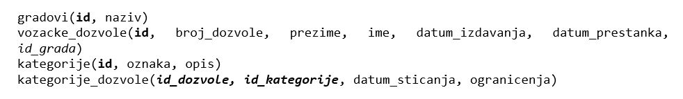

База података за возачке дозвлоле - процедуре и функције са упитом SELECT - вежбање
====================================================================================

Решити следеће задатке писањем процедуре или функције и програмског кода у којем се креирана процедура или функција позива. 

Приликом решавања задатака, погледајте претходно решене примере. Након што решите неки задатак па желите да проверите да ли је решење добро или видите да не можете да га решите, можете да погледате решење које ће се приказати након што кликнете на дугме. 

Детаљно објашњење формирања упита SELECT који треба да буде део процедуре или функције је дато раније у материјалима и по потреби је могуће вратити се на тај део као помоћ у писању комплетног решења. 

Програмски код, као и команде језика *SQL*, пише се и покреће када се кликне *New Query* након што се покрене систем *SQL Serve*r и кликне на креирану базу *Izdate_dozvole* у прозору *Object Explorer*. Фајл са упитима *SQLQuery1.sql* може, а и не мора да се сачува.

Након што се унесе програмски код, кликне се на дугме *Execute*. Уколико се у простору за писање команди налази више блокова кода, потребно је обележити онај који желимо да покренемо. Ако имате више база података, обавезно проверите да ли је поред овог дугмета назив базе у којој желите да покрећете програме.  

Сви приказани задаци су у вези са табелама које чине базу података за евиденцију издатих возачких дозвола. Следи списак свих табела са колонама. Примарни кључеви су истакнути болд, а страни италик. 

.. questionnote::

    1. Приказати име и презиме особе чији је број возачке дозволе дат.  

.. reveal:: pitanje_531a
    :showtitle: Прикажи решење
    :hidetitle: Сакриј решење

    Процедура. 

    ::

        CREATE PROCEDURE osoba_kojoj_pripada_dozvola(@broj_dozvole CHAR(9))
        AS
        SELECT ime, prezime
        FROM vozacke_dozvole 
        WHERE broj_dozvole=@broj_dozvole

    Позив процедуре. 

    ::

        EXEC osoba_kojoj_pripada_dozvola @broj_dozvole='000123175'

    .. image:: ../../_images/slika_531c.jpg
        :width: 600
        :align: center

.. questionnote::

    2. Приказати податке о возачким дозволама које обухватају категорију са датом ознаком, као и датум када су стечене.  

.. reveal:: pitanje_531b
    :showtitle: Прикажи решење
    :hidetitle: Сакриј решење

    Функција. 

    ::

        CREATE FUNCTION dozvole_odredjene_kategorije (@oznaka VARCHAR(3))
        RETURNS TABLE
        AS
        RETURN SELECT vd.broj_dozvole, vd.prezime, vd.ime, vd.datum_izdavanja, 
        vd.datum_prestanka, kd.datum_sticanja
        FROM vozacke_dozvole vd
        JOIN kategorije_dozvole kd ON (kd.id_dozvole=vd.id)
        JOIN kategorije k ON (kd.id_kategorije=k.id)
        WHERE k.oznaka = @oznaka;

    Позив функције. 

    ::

        SELECT * FROM dozvole_odredjene_kategorije('B')

    Други позив функције. 

    ::

        SELECT datum_prestanka FROM dozvole_odredjene_kategorije('B')
        ORDER BY datum_prestanka

.. questionnote::

    3. Приказати податке о свим категоријама на дозволи са датим бројем.   

.. reveal:: pitanje_531c
    :showtitle: Прикажи решење
    :hidetitle: Сакриј решење

    Процедура. 

    ::

        CREATE PROCEDURE oznake_na_dozvoli @broj_dozvole VARCHAR(9)
        AS
        SELECT oznaka
        FROM vozacke_dozvole vd JOIN kategorije_dozvole kd
        ON (kd.id_dozvole=vd.id)
        JOIN kategorije k ON (kd.id_kategorije=k.id)
        WHERE broj_dozvole = @broj_dozvole;

    Позив процедуре. 

    ::

        EXEC oznake_na_dozvoli @broj_dozvole='001560375'

.. questionnote::

    4. Приказати све категорије које су стечене пре одређеног датума. Резултат уредити по ознаци категорије. Приказати име и презиме особе и датум стицања категорије.

     

.. reveal:: pitanje_531d
    :showtitle: Прикажи решење
    :hidetitle: Сакриј решење

    Упит којим смо раније решили овај задатак даје табеларни приказ података. 

    ::

        SELECT oznaka, ime, prezime, datum_sticanja
        FROM kategorije JOIN kategorije_dozvole
        ON (kategorije_dozvole.id_kategorije=kategorije.id)
        JOIN vozacke_dozvole ON (kategorije_dozvole.id_dozvole=vozacke_dozvole.id)
        WHERE datum_sticanja<'2020-01-01'
        ORDER BY oznaka

    Можемо да креирамо процедуру са курсорима која ће приказати тражене податке лепо уређене по категоријама. 

    ::

        CREATE PROCEDURE kategorije_stecene_pre_datuma @datum DATE
        AS
        --izdvajamo kategorije koje su stecene pre datog datuma
        DECLARE kursor_kategorije CURSOR FOR
        SELECT DISTINCT id, oznaka
        FROM kategorije_dozvole JOIN kategorije
        ON (kategorije_dozvole.id_kategorije=kategorije.id)
        WHERE datum_sticanja<@datum;
        DECLARE @id INT;
        DECLARE @oznaka VARCHAR(3);

        OPEN kursor_kategorije;
        FETCH NEXT FROM kursor_kategorije INTO @id, @oznaka;

        WHILE @@FETCH_STATUS=0
        BEGIN
            PRINT 'OZNAKA: '+@oznaka;

            --sve osobe koje su odredjenu oznaku 
            --stekle pre datog datuma
            DECLARE kursor_osobe CURSOR FOR
            SELECT ime, prezime, datum_sticanja
            FROM kategorije_dozvole JOIN vozacke_dozvole 
            ON (kategorije_dozvole.id_dozvole=vozacke_dozvole.id) 
            WHERE datum_sticanja<@datum AND id_kategorije=@id;
            DECLARE @ime VARCHAR(32);
            DECLARE @prezime VARCHAR(32);
            DECLARE @datum_sticanja DATE;

            OPEN kursor_osobe;
            FETCH NEXT FROM kursor_osobe 
            INTO @ime, @prezime, @datum_sticanja;
            WHILE @@FETCH_STATUS=0
            BEGIN
                PRINT ' Osoba: '+@ime+' '+@prezime;
                PRINT ' Datum sticanja: '+CAST(@datum_sticanja AS VARCHAR);
                FETCH NEXT FROM kursor_osobe 
                INTO @ime, @prezime, @datum_sticanja;
            END;
            CLOSE kursor_osobe;
            DEALLOCATE kursor_osobe;

            FETCH NEXT FROM kursor_kategorije INTO @id, @oznaka;
        END

        CLOSE kursor_kategorije;
        DEALLOCATE kursor_kategorije;

    Позив процедуре. 

    ::
        
        EXEC kategorije_stecene_pre_datuma @datum='2020-01-01'

.. questionnote::

    5. Приказати списак различитих категорија (ознака) за које имамо издате возачке дозволе у датом граду.

.. reveal:: pitanje_531e
    :showtitle: Прикажи решење
    :hidetitle: Сакриј решење

    Процедура. 

    ::

        CREATE PROCEDURE spisak_oznaka_u_gradu @grad VARCHAR(32)
        AS
        SELECT DISTINCT oznaka
        FROM kategorije JOIN kategorije_dozvole
        ON (kategorije_dozvole.id_kategorije=kategorije.id)
        JOIN vozacke_dozvole ON (kategorije_dozvole.id_dozvole=vozacke_dozvole.id)
        JOIN gradovi ON (vozacke_dozvole.id_grada=gradovi.id)
        WHERE gradovi.naziv=@grad;

    Позив процедуре. 

    ::

        EXEC spisak_oznaka_u_gradu @grad='BEOGRAD'

.. questionnote::

    6. Приказати број различитих категорија (ознака) за које имамо издате возачке дозволе у датом граду.

.. reveal:: pitanje_531f
    :showtitle: Прикажи решење
    :hidetitle: Сакриј решење

    Функција. 

    ::

        CREATE FUNCTION broj_oznaka_u_gradu (@grad VARCHAR(32))
        RETURNS INT
        AS
        BEGIN
            DECLARE @broj INT;
            SELECT @broj = COUNT(DISTINCT oznaka)
            FROM kategorije JOIN kategorije_dozvole
            ON (kategorije_dozvole.id_kategorije=kategorije.id)
            JOIN vozacke_dozvole ON (kategorije_dozvole.id_dozvole=vozacke_dozvole.id)
            JOIN gradovi ON (vozacke_dozvole.id_grada=gradovi.id)
            WHERE gradovi.naziv=@grad;
            RETURN @broj;
        END;

    Позив функције. 

    ::

        PRINT dbo.broj_oznaka_u_gradu('BEOGRAD')

.. questionnote::

    7. Приказати за сваку возачку дозволу број категорија које покрива. 

.. reveal:: pitanje_531g
    :showtitle: Прикажи решење
    :hidetitle: Сакриј решење

    Функција која враћа табелу. 

    ::

        CREATE FUNCTION broj_kategorija_po_dozvoli()
        RETURNS TABLE
        AS
        RETURN SELECT broj_dozvole, COUNT(id_kategorije) AS broj_kategorija
        FROM kategorije_dozvole
        JOIN vozacke_dozvole ON (kategorije_dozvole.id_dozvole=vozacke_dozvole.id)
        GROUP BY broj_dozvole

    Позив функције. 

    ::

        SELECT * FROM  broj_kategorija_po_dozvoli()

        
.. questionnote::

    8. Приказати возачке дозволе које покривају више категорија. 

.. reveal:: pitanje_531h
    :showtitle: Прикажи решење
    :hidetitle: Сакриј решење

    Већ смо за претходни задатак креирали функцију коју можемо да позовемо тако да се прикажу возачке дозволе које покривају више категорија. 

    ::

        SELECT * FROM  broj_kategorija_po_dozvoli()
        WHERE broj_kategorija>1

.. questionnote::

    9. Приказати за сваку возачку дозволу све категорије које покрива. 

.. reveal:: pitanje_531i
    :showtitle: Прикажи решење
    :hidetitle: Сакриј решење

    Процедура.

    ::

        CREATE PROCEDURE sve_dozvole_i_kategorije
        AS
        DECLARE kursor_dozvole CURSOR FOR
        SELECT id, broj_dozvole, ime, prezime
        FROM vozacke_dozvole;
        DECLARE @id_dozvole INT;
        DECLARE @broj_dozvole CHAR(9);
        DECLARE @ime VARCHAR(32);
        DECLARE @prezime VARCHAR(32);

        OPEN kursor_dozvole;
        FETCH NEXT FROM kursor_dozvole
        INTO @id_dozvole, @broj_dozvole, @ime, @prezime;

        WHILE @@FETCH_STATUS=0
        BEGIN
            PRINT 'DOZVOLA: '+@broj_dozvole;
            PRINT @ime+' '+@prezime;

            DECLARE kursor_kategorije CURSOR FOR
            SELECT oznaka FROM kategorije JOIN kategorije_dozvole 
            ON (kategorije_dozvole.id_kategorije=kategorije.id)
            WHERE id_dozvole=@id_dozvole;
            DECLARE @oznaka VARCHAR(3);

            OPEN kursor_kategorije;
            FETCH NEXT FROM kursor_kategorije 
            INTO @oznaka;
            WHILE @@FETCH_STATUS=0
            BEGIN
                PRINT '  '+@oznaka;
                FETCH NEXT FROM kursor_kategorije 
                INTO @oznaka;
            END;
            CLOSE kursor_kategorije;
            DEALLOCATE kursor_kategorije;

            FETCH NEXT FROM kursor_dozvole
            INTO @id_dozvole, @broj_dozvole, @ime, @prezime;
        END

        CLOSE kursor_dozvole;
        DEALLOCATE kursor_dozvole;

    Позив процедуре. 

    ::

        EXEC sve_dozvole_i_kategorije

