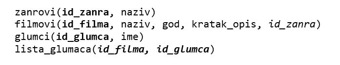

База података за филмове - процедуре и функције са упитом SELECT - вежбање
===========================================================================

Решити следеће задатке писањем процедуре или функције и програмског кода у којем се креирана процедура или функција позива. 

Приликом решавања задатака, погледајте претходно решене примере. Након што решите неки задатак па желите да проверите да ли је решење добро или видите да не можете да га решите, можете да погледате решење које ће се приказати након што кликнете на дугме. 

Детаљно објашњење формирања упита SELECT који треба да буде део процедуре или функције је дато раније у материјалима и по потреби је могуће вратити се на тај део као помоћ у писању комплетног решења. 

Програмски код, као и команде језика *SQL*, пише се и покреће када се кликне *New Query* након што се покрене систем *SQL Server* и кликне на креирану базу *Kolekcija_filmova* у прозору *Object Explorer*. Фајл са упитима *SQLQuery1.sql* може, а и не мора да се сачува.

Након што се унесе програмски код, кликне се на дугме **Execute**. Уколико се у простору за писање команди налази више блокова кода, потребно је обележити онај који желимо да покренемо. Ако имате више база података, обавезно проверите да ли је поред овог дугмета назив базе у којој желите да покрећете програме.  

Сви приказани задаци су у вези са табелама које чине базу података за колекцију филмова. Следи списак свих табела са колонама. Примарни кључеви су истакнути болд, а страни италик. 

.. questionnote::

    1. Приказати годину када је снимљен филм са датим називом.

.. reveal:: pitanje_541a
    :showtitle: Прикажи решење
    :hidetitle: Сакриј решење

    Функција. 

    ::

        CREATE FUNCTION godina (@naziv_filma VARCHAR(100))
        RETURNS INT
        AS
        BEGIN
        DECLARE @god INT;
        SELECT @god = god FROM filmovi
        WHERE naziv=@naziv_filma;
        RETURN @god;
        END

    Позив функције. 

    ::

        PRINT dbo.godina('Indiana Jones')

.. questionnote::

    2. Приказати називе свих филмова који спадају у дати жанр. 

.. reveal:: pitanje_541b
    :showtitle: Прикажи решење
    :hidetitle: Сакриј решење

    Процедура. 

    ::

        CREATE PROCEDURE filmovi_zanra @naziv_zanra VARCHAR(20)
        AS
        SELECT filmovi.naziv 
        FROM filmovi JOIN zanrovi ON (filmovi.id_zanra=zanrovi.id_zanra)
        WHERE zanrovi.naziv=@naziv_zanra;

    Позив процедуре. 

    ::

        EXEC filmovi_zanra @naziv_zanra='fantastika'

.. questionnote::

    3. Приказати називе филмова у којима глуми дати глумац. Списак уредити по називу филма. 

.. reveal:: pitanje_541c
    :showtitle: Прикажи решење
    :hidetitle: Сакриј решење

    Процедура. 

    ::

        CREATE PROCEDURE filmovi_glumca @ime VARCHAR(50)
        AS
        SELECT  naziv 
        FROM filmovi JOIN lista_glumaca 
        ON (lista_glumaca.id_filma=filmovi.id_filma)
        JOIN glumci ON (lista_glumaca.id_glumca=glumci.id_glumca) 
        WHERE ime=@ime ORDER BY naziv;

    Позив процедуре. 

    ::

        EXEC filmovi_glumca @ime='Harrison Ford'

.. questionnote::

    4. Приказати број филмова у којима глуми дати глумац.

.. reveal:: pitanje_541d
    :showtitle: Прикажи решење
    :hidetitle: Сакриј решење

    Функције. 

    ::

        CREATE FUNCTION broj_filmova_glumca (@ime VARCHAR(50))
        RETURNS INT
        AS
        BEGIN
            DECLARE @broj INT;
            SELECT @broj = COUNT(naziv) 
            FROM filmovi JOIN lista_glumaca 
            ON (lista_glumaca.id_filma=filmovi.id_filma)
            JOIN glumci ON (lista_glumaca.id_glumca=glumci.id_glumca) 
            WHERE ime=@ime;
            RETURN @broj;
        END

    Позив функције. 

    ::

        PRINT dbo.broj_filmova_glumca('Harrison Ford')

.. questionnote::

    5. Приказати за сваког глумца број филмова у којима глуми.

.. reveal:: pitanje_541e
    :showtitle: Прикажи решење
    :hidetitle: Сакриј решење

    Функција која враћа табелу. 

    ::

        CREATE FUNCTION broj_filmova_svakog_glumca()
        RETURNS TABLE
        AS
        RETURN SELECT ime, COUNT(id_filma) broj_filmova
        FROM lista_glumaca JOIN glumci 
        ON (lista_glumaca.id_glumca=glumci.id_glumca) 
        GROUP BY ime;

    Позив функције. 

    ::
        
        SELECT * FROM  broj_filmova_svakog_glumca()

.. questionnote::

    6. Приказати само глумце који глуме у више филмова које имамо у колекцији.

.. reveal:: pitanje_541f
    :showtitle: Прикажи решење
    :hidetitle: Сакриј решење

    Већ смо за претходни задатак креирали функцију коју можемо да позовемо тако да се прикажу само глумци који глуме у више филмова које имамо у колекцији. 

    ::

        SELECT * FROM  broj_filmova_svakog_glumca()
        WHERE broj_filmova>1

.. questionnote::

    7. Приказати за сваког глумца називе филмова у којима је глумио. 

.. reveal:: pitanje_541g
    :showtitle: Прикажи решење
    :hidetitle: Сакриј решење

    Процедура. 

    ::

        CREATE PROCEDURE svi_glumci_filmovi
        AS
        DECLARE kursor_glumci CURSOR FOR
        SELECT id_glumca, ime
        FROM glumci;
        DECLARE @id_glumca INT;
        DECLARE @ime VARCHAR(50);

        OPEN kursor_glumci;
        FETCH NEXT FROM kursor_glumci
        INTO @id_glumca, @ime;

        WHILE @@FETCH_STATUS=0
            BEGIN
            PRINT 'GLUMAC: '+@ime;

            DECLARE kursor_filmovi CURSOR FOR
            SELECT naziv FROM lista_glumaca JOIN
            filmovi ON (lista_glumaca.id_filma=filmovi.id_filma)
            WHERE id_glumca=@id_glumca;
            DECLARE @naziv VARCHAR(100);

            OPEN kursor_filmovi;
            FETCH NEXT FROM kursor_filmovi INTO @naziv;
            WHILE @@FETCH_STATUS=0
            BEGIN
                PRINT ' '+@naziv;
                FETCH NEXT FROM kursor_filmovi INTO @naziv;
            END;
            CLOSE kursor_filmovi;
            DEALLOCATE kursor_filmovi;

            FETCH NEXT FROM kursor_glumci
            INTO @id_glumca, @ime;
        END

        CLOSE kursor_glumci;
        DEALLOCATE kursor_glumci;

    Позив процедуре. 
    
    ::

        EXEC svi_glumci_filmovi

.. questionnote::

    8. Приказати различите жанрове у којима је глумио дати глумац. 

.. reveal:: pitanje_541h
    :showtitle: Прикажи решење
    :hidetitle: Сакриј решење

    Функција. 

    ::

        CREATE FUNCTION broj_zanrova_glumca (@ime VARCHAR(50))
        RETURNS INT
        AS
        BEGIN
            DECLARE @broj INT;
            SELECT @broj = COUNT(DISTINCT id_zanra) 
            FROM filmovi JOIN lista_glumaca 
            ON (lista_glumaca.id_filma=filmovi.id_filma)
            JOIN glumci ON (lista_glumaca.id_glumca=glumci.id_glumca) 
            WHERE ime=@ime;
            RETURN @broj;
        END

    Позив функције. 

    ::

        PRINT dbo.broj_zanrova_glumca('Harrison Ford')

.. questionnote::

    9. Приказати глумце који су глумили у бар једном филму заједно са датим глумцем. 

.. reveal:: pitanje_541i
    :showtitle: Прикажи решење
    :hidetitle: Сакриј решење

    Процедура. 

    ::

        CREATE PROCEDURE glume_u_istim_filmovima @ime VARCHAR(50)
        AS
        SELECT  DISTINCT ime 
        FROM lista_glumaca JOIN glumci 
        ON (lista_glumaca.id_glumca=glumci.id_glumca) 
        WHERE id_filma IN (SELECT id_filma 
            FROM lista_glumaca JOIN glumci 
            ON (lista_glumaca.id_glumca=glumci.id_glumca) 
            WHERE ime=@ime
        )
        AND ime!=@ime;

    Позив процедуре. 

    ::

        EXEC glume_u_istim_filmovima @ime='Harrison Ford'

