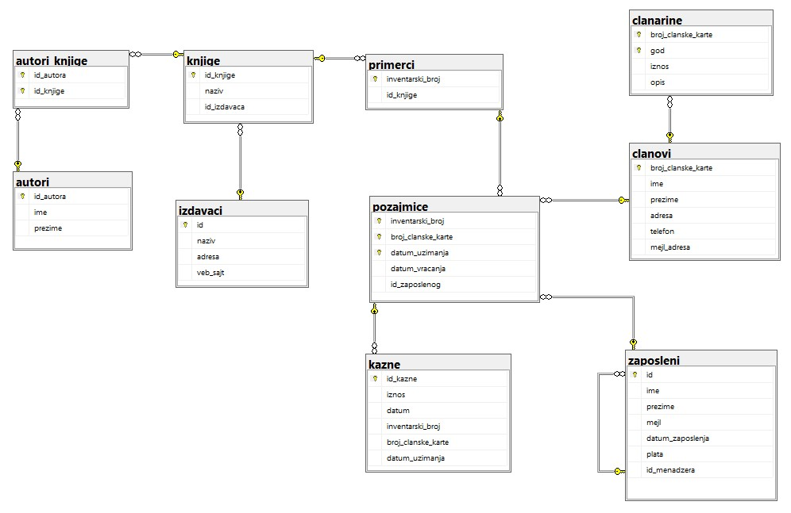
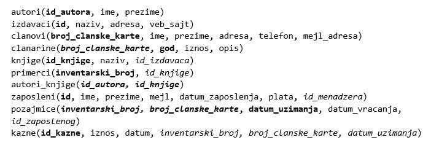

Упит SELECT са спајањем табела
==============================

.. suggestionnote::

    Већ смо на примеру дела базе података за библиотеку видели како повезујемо табеле у упиту SELECT. Подаци које видимо на корицама неке књиге, као што су назив књиге и основни подаци о издавачу и аутору или ауторима, чувају се у неколико различитих табела: knjige, autori и izdavaci. Повезивањем табела у упиту можемо да извучемо одговарајуће податке из више табела, тако да можемо да, на пример, видимо ко је аутор једне конкретне књиге и ко је издавач те исте књиге.

    У примерима који следе има спајања табела, тј. подаци се узимају из по две или више повезаних табела.

    Приказани примери могу да буду садржани, у виду угњеждених упита, у програмима помоћу којих приступамо бази података. Касније у материјалима ћемо неке од њих и употребити унутар програмског кода писаног другим програмским језиком. 

Сви приказани задаци су у вези са табелама које чине базу података за библиотеку. На следећој слици је приказан дијаграм креиране базе података. 

Сви приказани задаци су у вези са табелама које чине базу података за библиотеку. На следећој слици је приказан дијаграм креиране базе података. 

Упити се пишу и покрећу када се кликне *New Query *након што се покрене систем *SQL Server* и кликне на креирану базу *Biblioteka* у прозору *Object Explorer*. Фајл са упитима *SQLQuery1.sql* може, а и не мора да се сачува.

Након што се унесе једна команда, кликне се на дугме **Execute**. Уколико се у простору за писање команди налази више њих, потребно је обележити ону коју желимо да покренемо. Ако имате више база података, обавезно проверите да ли је поред овог дугмета назив базе у којој желите да вршите упите.

.. image:: ../../_images/slika_122c.jpg
    :width: 400
    :align: center

.. questionnote::

    1. Разматра се могућност да се уведу одређена ограничења члановима библиотеке који нередовно враћају књиге. Једна од мера би можда била да се њима не издају ретке књиге које су често тражене, а драстичнија мера би могла да подразумева и укидање чланства. Да би се на добар начин донела одлука, библиотека је одлучила да пажљиво проучи списак чланова који касне са враћањем књига и због тога плаћају казне да би се видело колико има таквих чланова и да ли има неких међу њима који се баш истичу. 

**Задатак:** Написати упит којим се приказују имена и презимена чланова, уз датуме и износе плаћених казни. Списак уредити по члановима, тако да све казне једног члана буду приказане једна испод друге. 

Подаци који су нам потребни се налазе у табелама *clanovi* и *kazne*. Заједничко за ове табеле је колона *broj_clanske_karte* по којој можемо да их повежемо. 

Када у табелама које спајамо постоји само једна колона са неким називом, није неопходно да додајемо назив табеле испред назива колоне. Међутим, када у табелама које спајамо имамо колоне са истим називом, као што су, у овом случају, колоне са називом *broj_clanske_karte* у табелама *clanovi *и *kazne*, неопходно је да додамо назив табеле испред назива одговарајуће колоне на сваком месту на којем користимо број чланске карте. 

::

    SELECT ime, prezime, datum, iznos
    FROM kazne JOIN clanovi
    ON (kazne.broj_clanske_karte=clanovi.broj_clanske_karte)
    ORDER BY clanovi.broj_clanske_karte

.. questionnote::

    2. У току месеца маја је акција и библиотека поклања по једну књигу својим верним члановима који тог месеца дођу да позајме књиге. Тренутно је у библиотеку дошла Милица Зорановић и библиотекар жели да провери како изгледа њена историја чланства, тј. да ли је већ дужи низ година члан библиотеке. 

**Задатак:** Написати упит којим се приказује списак година када је Оливера Стошић била члан библиотеке, тј. за које је платилра чланарину.  

Име и презиме члана се налази у табели *clanovi*, а година када је плаћена чланарина се налази у табели *clanarine*. Заједничко за ове табеле је колона *broj_clanske_karte* по којем можемо да их повежемо. 

::

    SELECT god
    FROM clanarine JOIN clanovi
    ON (clanarine.broj_clanske_karte=clanovi.broj_clanske_karte)
    WHERE ime='Milica' AND prezime='Zoranovic'

Да претрага не буде осетљива на велика и мала слова, може да се употреби једна од функција UPPER или LOWER. 

::

    SELECT god
    FROM clanarine JOIN clanovi
    ON (clanarine.broj_clanske_karte=clanovi.broj_clanske_karte)
    WHERE UPPER(ime)='MILICA' AND UPPER(prezime)='ZORANOVIC'

.. questionnote::

    3. Библиотека разматра да наручи још књига Завода за уџбенике. Да би донели ту одлуку, потребно је да се види колико су књиге овог издавача тражене. 

**Задатак:** Написати упит којим се приказују датум узимања и назив књиге за све позајмице књига чији је издавач Завод за уџбенике. 

У овом примеру је потребно спојити више  табела зато што морамо да видимо које књиге постоје од тог издавача и када су примерци тих књига позајмљивани из библиотеке. 

::

    SELECT datum_uzimanja, knjige.naziv
    FROM pozajmice JOIN primerci ON (pozajmice.inventarski_broj=primerci.inventarski_broj)
    JOIN knjige ON (primerci.id_knjige=knjige.id_knjige)
    JOIN izdavaci ON (knjige.id_izdavaca=izdavaci.id)
    WHERE izdavaci.naziv='Zavod za udzbenike'

.. questionnote::

    4. Члан библиотеке Милица Зорановић је дошла у библиотеку да позајми књигу, али нема идеју шта би следеће читала. Библиотекар је предложио да крену од списка аутора чије је књиге већ позајмљивала, па да виде да ли би Милица читала још неку од књига тих аутора. 

**Задатак:** Написати упит којим се, без понављања, приказују имена и презимена аутора чије је књиге читала Милица Зорановић. 

Баз обзира на то што се у задатку спомињу само члан и аутори, табеле које чувају податке о ауторима и члановима у овом примеру је потребно спојити зато што морамо да видимо које књиге постоје од тог издавача и када су примерци тих књига позајмљивани из библиотеке. 

::

    SELECT DISTINCT autori.ime, autori.prezime 
    FROM pozajmice JOIN clanovi ON (pozajmice.broj_clanske_karte=clanovi.broj_clanske_karte)
    JOIN primerci ON (pozajmice.inventarski_broj=primerci.inventarski_broj)
    JOIN knjige ON (primerci.id_knjige=knjige.id_knjige)
    JOIN autori_knjige ON (autori_knjige.id_knjige=knjige.id_knjige)
    JOIN autori ON (autori_knjige.id_autora=autori.id_autora)
    WHERE clanovi.ime='Milica' AND clanovi.prezime='Zoranovic'

Ради краћег записа упита можемо да користимо кратке називе за табеле. Ти кратки називи могу да буду једно или неколико слова. Овај кратак назив се наведе након размака после пуног назива табеле. 

::

    SELECT DISTINCT a.ime, a.prezime 
    FROM pozajmice po JOIN clanovi c ON (po.broj_clanske_karte=c.broj_clanske_karte)
    JOIN primerci pr ON (po.inventarski_broj=pr.inventarski_broj)
    JOIN knjige k ON (pr.id_knjige=k.id_knjige)
    JOIN autori_knjige ak ON (ak.id_knjige=k.id_knjige)
    JOIN autori a ON (ak.id_autora=a.id_autora)
    WHERE c.ime='Milica' AND c.prezime='Zoranovic'

.. questionnote::

    5. Библиотека организује прославу за своје запослене и позивнице планира да пошаље имејлом, али са различитим текстом за различите тимове. Ради слања позивница потребан је списак имејл адреса по тимовима. 

**Задатак:** Написати упит којим се приказују имејл адреса запосленог и имејл адреса његовог менаџера. Списак уредити по менаџерима, па унутар истог тима по запосленима. 

Ови подаци, имејл адреса менаџера и имејл адреса запосленог, налазе се у истој табели која има страни кључ *id_manadzera*, који показује на примарни кључ исте табеле *id*. 

У овој ситуацији је обавезна употреба кратких назива табела који се користе само у упиту. У упиту ћемо симулирати ситуацију као да имамо две табеле: једну из које читамо податке о запосленом, и другу из које читамо податке о његовом менаџеру. 

::

    SELECT z.mejl "Zaposleni", m.mejl "Menadzer"
    FROM zaposleni z JOIN zaposleni m ON (z.id_menadzera=m.id)
    ORDER BY m.mejl, z.mejl

.. image:: ../../_images/slika_124d.jpg
    :width: 600
    :align: center

Како постоји запослени који нема менаџера, он неће бити приказан на овом списку. Уколико нам треба и његова имејл адреса, потребно је да укључимо спољно спајање. Када имамо спољно спајање, приказују се и подаци из једне од табела који немају свог пара у другој табели. Табела са подацима о запосленом је са леве стране у односу на реч JOIN па је потребно лево спољно спајање да бисмо добили и запослене без менаџера. Постоје и десно и пуно спољно спајање, RIGHT OUTER и FULL OUTER, па и они могу по потреби да се користе у другим задацима. 

:: 

    SELECT z.mejl "Zaposleni", m.mejl "Menadzer"
    FROM zaposleni z LEFT OUTER JOIN zaposleni m ON (z.id_menadzera=m.id)
    ORDER BY m.mejl, z.mejl

