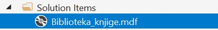

Програм са угњежђеним упитом и групним фунцкијама - вежбање
===========================================================

Решити следеће задатке писањем програма у развојном окружењу *Visual Studio Community* и употребом програмског језика C#. 

Приликом решавања задатака, погледајте претходно решене примере. Након што решите неки задатак па желите да проверите да ли је решење добро или видите да не можете да га решите, погледајте решење које ће се приказати након што кликнете на дугме. 

Детаљно објашњење формирања упита SELECT који треба да буде део програма је дато раније у материјалима и по потреби је могуће вратити се на тај део као помоћ у писању комплетног решења. 

Сви приказани задаци су у вези са табелама које чине део базе података за библиотеку. Следи списак свих табела са колонама. Примарни кључеви су истакнути болд, а страни италик. 

.. image:: ../../_images/slika_310a.jpg
    :width: 540
    :align: center

Када се покрене развојно окружење *Visual Studio Community*, потребно је да се креира нови пројекат избором опције *Create a new project*. Изабрани језик треба да буде С#, а врста пројекта *Windows Forms App*, апликација са графичким коирсничким интерфејсом. 

У следећем кораку је потребно да се пројекат именује и да се изабере локација на којој ће се пројекат чувати. Може да остане и предложена локација. Кликнути на дугме *Create* и прелазимо у простор за креирање апликације, тј. програма. 

Први корак је додавање раније креиране базе података новом пројекту. У прозору *Solution Explorer* је потребно да се кликне десни тастер миша над називом пројекта, а затим да се изабере *Add/Existing Item...* са менија који се појави. База података коју смо креирали се већ налази на рачунару и потребно је пронаћи и изабрати фајл *Biblioteka_knjige.mdf* у којем је сачувана. Тачна локација може да се провери у систему *SQL Server Management Studio* у којем смо креирали базу. 

Класе које су нам потребне за читање података из базе и њихов приказ у програму се налазе у именском простору *System.Data.SqlClient* који није аутоматски укључен у нови пројекат. Потребно је да додамо следећи ред на врх документа са програмским кодом. 

.. code-block:: Csharp

    using System.Data.SqlClient;

Приликом писања програма потребно је да се употреби конекциони стринг који је формиран у ранијим примерима, а односи се на повезивање програма на базу података *Biblioteka_knjige.mdf*. У решењима задатака стоји *KONEKCIONI_STRING* на местима где се очекује конекциони стринг.  

.. questionnote::

    **Задатак 1:** Написати програм који приказује број аутора књиге са датим идентификационим бројем. 

.. reveal:: pitanje_311a
    :showtitle: Прикажи решење
    :hidetitle: Сакриј решење

    .. code-block:: Csharp

        private void button1_Click(object sender, EventArgs e)
        {
            string conText = KONEKCIONI_STRING;
            int id = Convert.ToInt32(textBox1.Text);
            string cmd;
            cmd = "SELECT COUNT(id_autora) " +
                "FROM autori_knjige WHERE id_knjige = " + id;
            SqlDataAdapter da = new SqlDataAdapter(cmd, conText);
            DataTable dt = new DataTable();
            da.Fill(dt);
            dataGridView1.DataSource = dt;
        }

.. questionnote::

    **Задатак 2**: Написати програм који приказује за сваког аутора број књига. Довољно је приказати идентификациони број аутора.  

.. reveal:: pitanje_311b
    :showtitle: Прикажи решење
    :hidetitle: Сакриј решење

    .. code-block:: Csharp

        private void button1_Click(object sender, EventArgs e)
        {
            string conText = KONEKCIONI_STRING;
            string cmd;
            cmd = "SELECT id_autora autor, COUNT(id_knjige) broj_knjiga " +
                "FROM autori_knjige GROUP BY id_autora";
            SqlDataAdapter da = new SqlDataAdapter(cmd, conText);
            DataTable dt = new DataTable();
            da.Fill(dt);
            dataGridView1.DataSource = dt;
        }

.. questionnote::

    **Задатак 3**: Написати програм који приказује број књига издавача са датим идентификационим бројем.

.. reveal:: pitanje_311c
    :showtitle: Прикажи решење
    :hidetitle: Сакриј решење

    .. code-block:: Csharp

        private void button1_Click(object sender, EventArgs e)
        {
            string conText = KONEKCIONI_STRING;
            int id = Convert.ToInt32(textBox1.Text);
            string cmd;
            cmd = "SELECT COUNT(id_knjige) " +
                "FROM knjige WHERE id_izdavaca = " + id;
            SqlDataAdapter da = new SqlDataAdapter(cmd, conText);
            DataTable dt = new DataTable();
            da.Fill(dt);
            dataGridView1.DataSource = dt;
        }

.. questionnote::

    **Задатак 4**: Написати програм који за сваког издавача приказује број књига. 

.. reveal:: pitanje_311d
    :showtitle: Прикажи решење
    :hidetitle: Сакриј решење

    .. code-block::

        private void button1_Click(object sender, EventArgs e)
        {
            string conText = KONEKCIONI_STRING;
            string cmd;
            cmd = "SELECT id_izdavaca autor, COUNT(id_knjige) broj_knjiga " +
                "FROM knjige GROUP BY id_izdavaca";
            SqlDataAdapter da = new SqlDataAdapter(cmd, conText);
            DataTable dt = new DataTable();
            da.Fill(dt);
            dataGridView1.DataSource = dt;
        }
