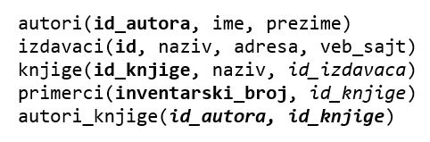

Програм са угнежђеним упитом SELECT са спајањем табела - вежбање
================================================================

Решити следеће задатке писањем програма у развојном окружењу *Visual Studio Community* и употребом програмског језика C#. 

Приликом решавања задатака, погледајте претходно решене примере. Након што решите неки задатак па желите да проверите да ли је решење добро или видите да не можете да га решите, можете да погледате решење које ће се приказати након што кликнете на дугме. 

Детаљно објашњење формирања упита SELECT који треба да буде део програма је објашњен раније у материјалима и по потреби је могуће вратити се на тај део као помоћ у писању комплетног решења. 

Сви приказани задаци су у вези са табелама које чине део базе података за библиотеку. Следи списак свих табела са колонама. Примарни кључеви су истакнути болд, а страни италик. 

Када се покрене развојно окружење *Visual Studio Community*, потребно је да се креира нови пројекат избором опције *Create a new project*. Изабрани језик треба да буде С#, а врста пројекта *Windows Forms App*, апликација са графичким коирсничким интерфејсом. 

У следећем кораку је потребно да се пројекат именује и да се изабере локација на којој ће се пројекат чувати. Може да остане и предложена локација. Кликнути на дугме *Create* и прелазимо у простор за креирање апликације, тј. програма. 

Први корак је додавање раније креиране базе података новом пројекту. У прозору *Solution Explorer* је потребно да се кликне десни тастер миша над називом пројекта, а затим да се изабере *Add/Existing Item...* са менија који се појави. База података коју смо креирали се већ налази на рачунару и потребно је пронаћи и изабрати фајл *Biblioteka_knjige.mdf* у којем је сачувана. Тачна локација може да се провери у систему *SQL Server Management Studio* у којем смо креирали базу. 

.. image:: ../../_images/slika_37a.jpg
    :width: 780
    :align: center

Класе које су нам потребне за читање података из базе и њихов приказ у програму се налазе у именском простору *System.Data.SqlClient* који није аутоматски укључен у нови пројекат. Потребно је да додамо следећи ред на врх документа са програмским кодом. 

.. code-block:: Csharp

    using System.Data.SqlClient;

Приликом писања програма, потребно је да се употреби конекциони стринг који је формиран у ранијим примерима, а односи се на повезивање програма на базу података *Biblioteka_knjige.mdf*. У решењима задатака стоји *KONEKCIONI_STRING* на местима где се очекује конекциони стринг.  

.. questionnote::

    1. Књига са називом „Veb programarenje“ је много тражена и библиотека жели да набави још примерака те књиге. Да би библиотека послала наруџбеницу, потребни су јој подаци о издавачу.  

**Задатак:** Написати програм који приказује назив, адресу и адресу веб-сајта издавача књиге чији је назив дат.

.. reveal:: pitanje_312a
    :showtitle: Прикажи решење
    :hidetitle: Сакриј решење

    .. code-block:: Csharp

        private void button1_Click(object sender, EventArgs e)
        {
            string conText = KONEKCIONI_STRING;
            string naziv_knjige = textBox1.Text;
            string cmd;
            cmd = "SELECT i.naziv, adresa, veb_sajt " +
                "FROM knjige k JOIN izdavaci i ON(k.id_izdavaca = i.id) " +
                "WHERE k.naziv = '" + naziv_knjige + "'";
            SqlDataAdapter da = new SqlDataAdapter(cmd, conText);
            DataTable dt = new DataTable();
            da.Fill(dt);
            dataGridView1.DataSource = dt;
        }
    
    .. image:: ../../_images/slika_312a.jpg
        :width: 780
        :align: center

.. questionnote::

    2. Библиотека је у процесу набавке нових примерака књига издавачке куће СЕТ. Тренутно се размишља да се најстарије набављени примерци књига ове издавачке куће повуку из употребе и раскњиже. Инвентарски бројеви се додељују редом како се примерци набављају, тако да мањи инвентарски број има примерак који се раније набављен. 

**Задатак:** Написати програм која приказује назив књиге и инвентарски број најстарије набављеног примерака књиге у издању издавачке куће чији је назив дат. 

.. reveal:: pitanje_312b
    :showtitle: Прикажи решење
    :hidetitle: Сакриј решење

    .. code-block:: Csharp

        private void button1_Click(object sender, EventArgs e)
        {
            string conText = KONEKCIONI_STRING;
            string naziv_izdavaca = textBox1.Text;
            string cmd;
            cmd = "SELECT knjige.naziv, inventarski_broj " +
                "FROM primerci JOIN knjige " +
                "ON(primerci.id_knjige = knjige.id_knjige) " +
                "WHERE inventarski_broj = (SELECT MIN(inventarski_broj) " +
                "FROM primerci JOIN knjige " +
                "ON(primerci.id_knjige = knjige.id_knjige) " +
                "JOIN izdavaci ON(knjige.id_izdavaca = izdavaci.id) " +
                "WHERE izdavaci.naziv = '" + naziv_izdavaca + "')";
            SqlDataAdapter da = new SqlDataAdapter(cmd, conText);
            DataTable dt = new DataTable();
            da.Fill(dt);
            dataGridView1.DataSource = dt;
        }

.. questionnote::

    3. Неколико чланова библиотеке се истог дана распитивало за књигу са називом „PROGRAMIRANJE – klase i objekti“. Потребно је проверити да ли постоји довољан број примерака ове књиге. 

.. infonote::

    **НАПОМЕНА:** На основу овог захтева има смисла формулисати два различита задатка. 

**Задатак 1:** Написати програм који приказује инвентарске бројеве књига са датим називом. 

.. reveal:: pitanje_312c
    :showtitle: Прикажи решење
    :hidetitle: Сакриј решење

    .. code-block:: Csharp

        private void button1_Click(object sender, EventArgs e)
        {
            string conText = KONEKCIONI_STRING;
            string naziv_knjige = textBox1.Text;
            string cmd;
            cmd = "SELECT inventarski_broj " +
                "FROM primerci JOIN knjige " +
                "ON(primerci.id_knjige = knjige.id_knjige) " +
                "WHERE naziv = '" + naziv_knjige + "'";
            SqlDataAdapter da = new SqlDataAdapter(cmd, conText);
            DataTable dt = new DataTable();
            da.Fill(dt);
            dataGridView1.DataSource = dt;
        }

**Задатак 2:** Написати програм који приказује број примерака књига са датим називом.

.. reveal:: pitanje_312d
    :showtitle: Прикажи решење
    :hidetitle: Сакриј решење

    .. code-block:: Csharp

        private void button1_Click(object sender, EventArgs e)
        {
            string conText = KONEKCIONI_STRING;
            string naziv_knjige = textBox1.Text;
            string cmd;
            cmd = "SELECT COUNT(inventarski_broj) " +
                "FROM primerci JOIN knjige " +
                "ON(primerci.id_knjige = knjige.id_knjige) " +
                "WHERE naziv = '" + naziv_knjige + "'";
            SqlDataAdapter da = new SqlDataAdapter(cmd, conText);
            DataTable dt = new DataTable();
            da.Fill(dt);
            dataGridView1.DataSource = dt;
        }

.. questionnote::

    4. Библиотека размишља да набави још примерака књига награђиваног аутора Марка Видојковића. Да би донели одлуку о новим набавкама, прво је потребно да провере стање са примерцима књига које већ имају од овог писца. 

.. infonote::
    
    **НАПОМЕНА**: На основу овог захтева има смисла формулисати неколико различитих задатка. 

**Задатак 1**: Написати програм који приказује инвентарске бројеве примерака и називе књига аутора датог имена и презимена. 

.. reveal:: pitanje_312e
    :showtitle: Прикажи решење
    :hidetitle: Сакриј решење

    .. code-block:: Csharp

        private void button1_Click(object sender, EventArgs e)
        {
            string conText = KONEKCIONI_STRING;
            string ime = textBox1.Text;
            string prezime = textBox2.Text;
            string cmd;
            cmd = "SELECT inventarski_broj, naziv " +
                "FROM primerci JOIN knjige " +
                "ON(primerci.id_knjige = knjige.id_knjige) " +
                "JOIN autori_knjige " +
                "ON(autori_knjige.id_knjige = knjige.id_knjige) " +
                "JOIN autori ON(autori_knjige.id_autora = autori.id_autora) " +
                "WHERE ime = '" + ime + "' " +
                "AND prezime = '" + prezime + "'";
            SqlDataAdapter da = new SqlDataAdapter(cmd, conText);
            DataTable dt = new DataTable();
            da.Fill(dt);
            dataGridView1.DataSource = dt;
        }

    .. image:: ../../_images/slika_312a.jpg
        :width: 780
        :align: center

**Задатак 2**: Написати програм који приказује укупан број примерака књига аутора датог имена и презимена. 

.. reveal:: pitanje_312f
    :showtitle: Прикажи решење
    :hidetitle: Сакриј решење

    .. code-block:: Csharp

        private void button1_Click(object sender, EventArgs e)
        {
            string conText = KONEKCIONI_STRING;
            string ime = textBox1.Text;
            string prezime = textBox2.Text;
            string cmd;
            cmd = "SELECT COUNT(inventarski_broj)  " +
                "FROM primerci JOIN knjige " +
                "ON(primerci.id_knjige = knjige.id_knjige) " +
                "JOIN autori_knjige " +
                "ON(autori_knjige.id_knjige = knjige.id_knjige) " +
                "JOIN autori ON(autori_knjige.id_autora = autori.id_autora) " +
                "WHERE ime = '" + ime + "' " +
                "AND prezime = '" + prezime + "'";
            SqlDataAdapter da = new SqlDataAdapter(cmd, conText);
            DataTable dt = new DataTable();
            da.Fill(dt);
            dataGridView1.DataSource = dt;
        }

**Задатак 3**: Написати програм који приказује број примерака сваке књига аутора датог имена и презимена. 

.. reveal:: pitanje_312g
    :showtitle: Прикажи решење
    :hidetitle: Сакриј решење

    .. code-block:: Csharp

        private void button1_Click(object sender, EventArgs e)
        {
            string conText = KONEKCIONI_STRING;
            string ime = textBox1.Text;
            string prezime = textBox2.Text;
            string cmd;
            cmd = "SELECT naziv, COUNT(inventarski_broj)  " +
                "FROM primerci JOIN knjige " +
                "ON(primerci.id_knjige = knjige.id_knjige) " +
                "JOIN autori_knjige " +
                "ON(autori_knjige.id_knjige = knjige.id_knjige) " +
                "JOIN autori ON(autori_knjige.id_autora = autori.id_autora) " +
                "WHERE ime = '" + ime + "' " +
                "AND prezime = '" + prezime + "' " +
                "GROUP BY naziv";
            SqlDataAdapter da = new SqlDataAdapter(cmd, conText);
            DataTable dt = new DataTable();
            da.Fill(dt);
            dataGridView1.DataSource = dt;
        }

**Задатак 4**: Написати програм који приказује називе књига аутора датог имена и презимена од којих имамо само по један примерак у библиотеци. 

.. reveal:: pitanje_312h
    :showtitle: Прикажи решење
    :hidetitle: Сакриј решење

    .. code-block:: Csharp

                private void button1_Click(object sender, EventArgs e)
        {
            string conText = KONEKCIONI_STRING;
            string ime = textBox1.Text;
            string prezime = textBox2.Text;
            string cmd;
            cmd = "SELECT naziv, COUNT(inventarski_broj)  " +
                "FROM primerci JOIN knjige " +
                "ON(primerci.id_knjige = knjige.id_knjige) " +
                "JOIN autori_knjige " +
                "ON(autori_knjige.id_knjige = knjige.id_knjige) " +
                "JOIN autori ON(autori_knjige.id_autora = autori.id_autora) " +
                "WHERE ime = '" + ime + "' " +
                "AND prezime = '" + prezime + "' " +
                "GROUP BY naziv " +
                "HAVING COUNT(inventarski_broj) = 1";
            SqlDataAdapter da = new SqlDataAdapter(cmd, conText);
            DataTable dt = new DataTable();
            da.Fill(dt);
            dataGridView1.DataSource = dt;
        }

.. questionnote::

    5. Члан библиотеке је заинтересован да позајми још неку књигу од аутора који су написали уџбеник са називом „Racunarstvo i informatika za 4. razred gimnazije'“.

**Задатак:** Написати програм који, без понављања, приказује све књиге које су писали аутори књиге са датим називом.

.. reveal:: pitanje_312i
    :showtitle: Прикажи решење
    :hidetitle: Сакриј решење

    .. code-block:: Csharp

                private void button1_Click(object sender, EventArgs e)
        {
            string conText = KONEKCIONI_STRING;
            string naziv_knjige = textBox1.Text;
            string cmd;
            cmd = "SELECT DISTINCT naziv " +
                "FROM knjige JOIN autori_knjige " +
                "ON(autori_knjige.id_knjige = knjige.id_knjige)" +
                "WHERE id_autora IN (SELECT id_autora FROM " +
                "knjige JOIN autori_knjige " +
                "ON(autori_knjige.id_knjige = knjige.id_knjige)" +
                "WHERE naziv = '" + naziv_knjige + "')" +
                "AND naziv != '" + naziv_knjige + "'";
            SqlDataAdapter da = new SqlDataAdapter(cmd, conText);
            DataTable dt = new DataTable();
            da.Fill(dt);
            dataGridView1.DataSource = dt;
        }
