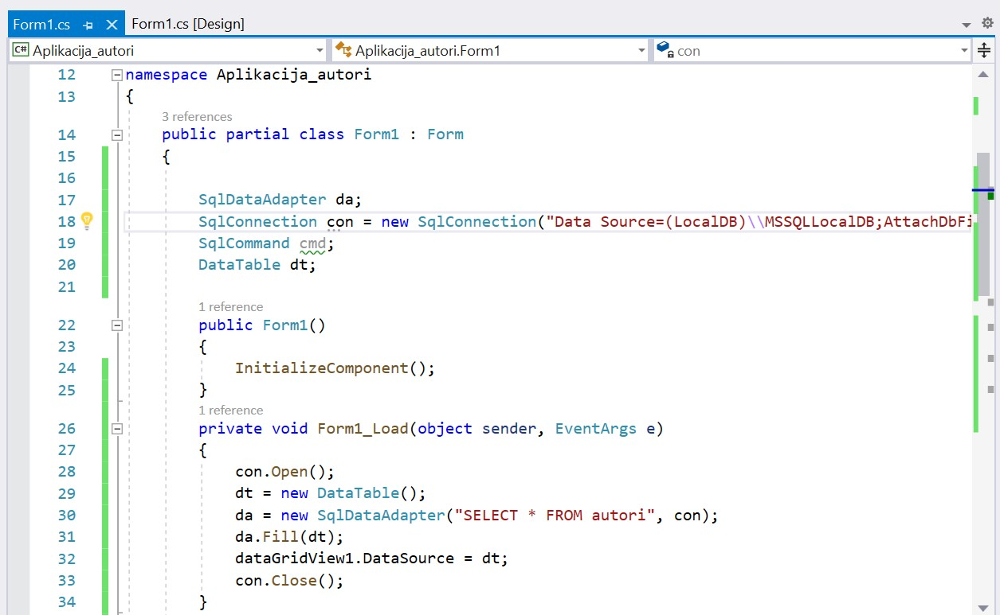
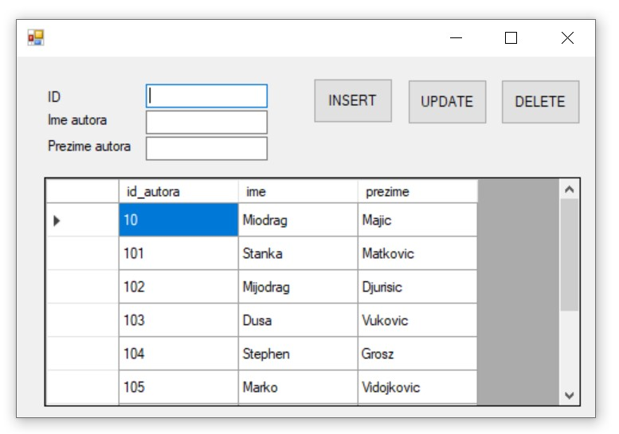
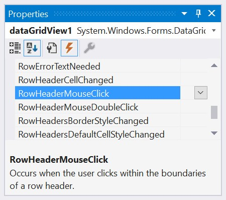
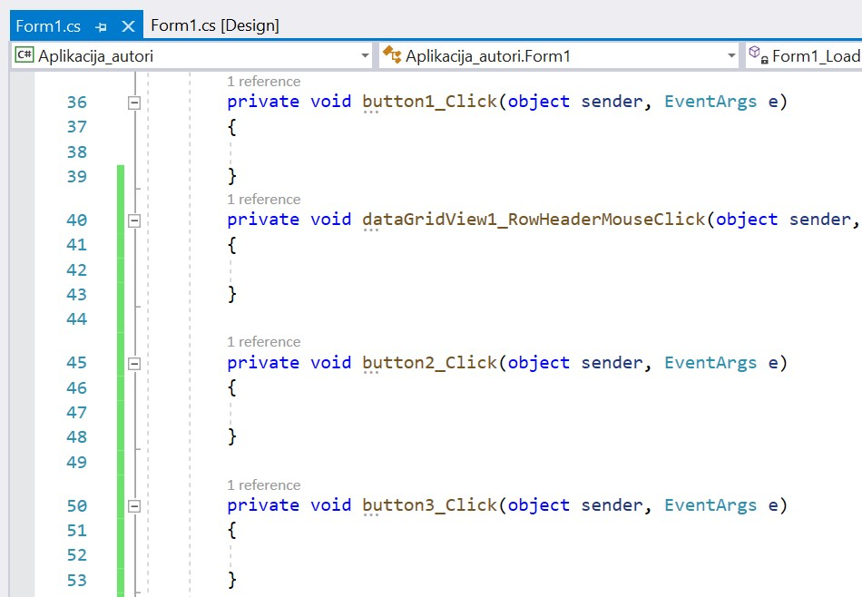
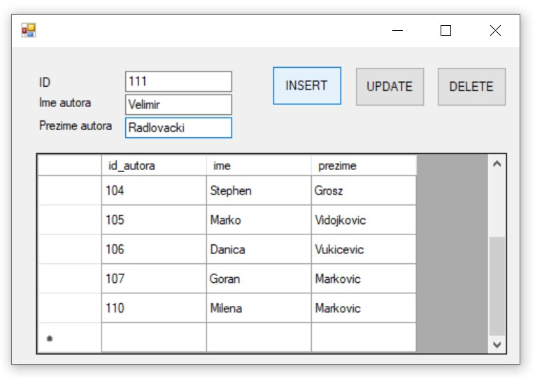
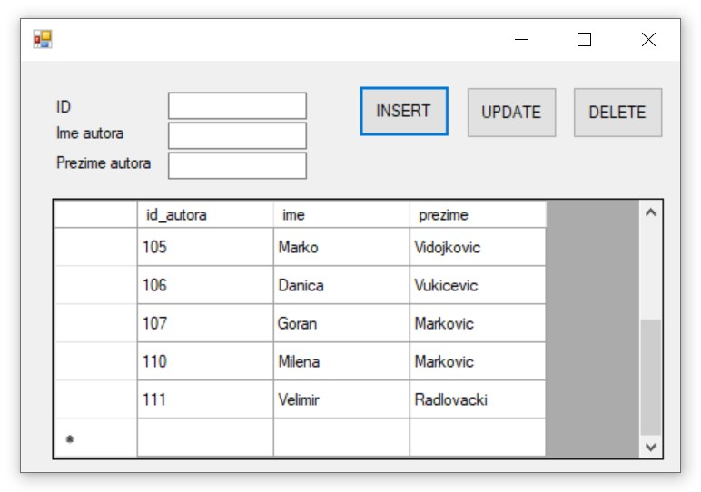
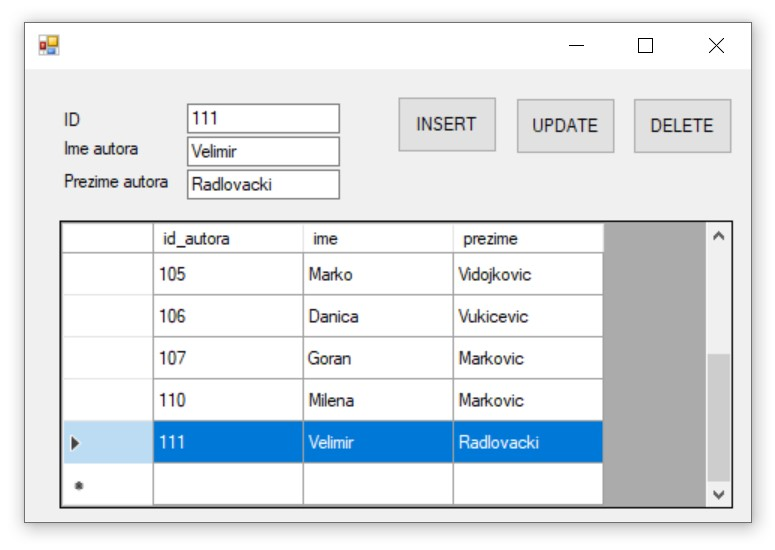
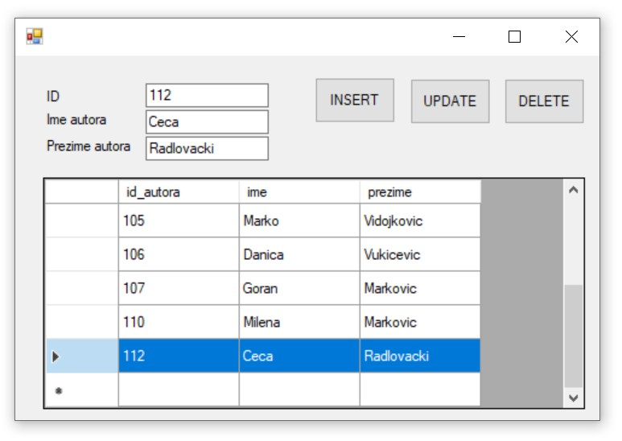
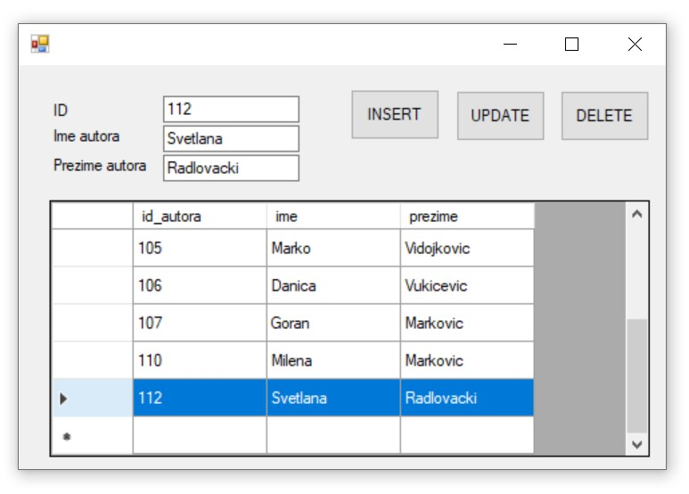

Програм са угнежђеним командама INSERT, UPDATE, и DELETE
========================================================

.. suggestionnote::

    Видели смо како се креирају програми са угњежденим упитом SELECT. Унутар програма могу да се користе и команде за унос, измену и брисање података.  

    Креираћемо програм у којем можемо да уносимо, мењамо и бришемо податке из табеле *autori*. 

Када се покрене развојно окружење *Visual Studio Community*, потребно је да се креира нови пројекат избором опције *Create a new project*. Изабрани језик треба да буде С#, а врста пројекта *Windows Forms App*, апликација са графичким коирсничким интерфејсом. 

Пројекту треба да додамо базу података. У прозору *Solution Explorer* је потребно да се кликне десни тастер миша над називом пројекта, а затим да се изабере *Add/Existing Item...* са менија који се појави. База података коју смо креирали се већ налази на рачунару и потребно је пронаћи и изабрати фајл *Biblioteka_knjige.mdf* у којем је сачувана. Тачна локација може да се провери у систему *SQL Server Management Studio* у којем смо креирали базу. 

За приказ резултата позива процедуре из релационе базе података ћемо користити контролу *DataGridView* коју можемо да превучемо из прозора *Toolbox*. Потребна су нам и три поља за унос података о аутору, идентификациони број, име и презиме, као и три дугмета за унос, измену и брисање. 

Класе које су нам потребне за читање података из базе и њихов приказ у програму се налазе у именском простору *System.Data.SqlClient* који није аутоматски укључен у нови пројекат. Потребно је да додамо следећи ред на врх документа са програмским кодом. 

.. code-block:: Csharp

    using System.Data.SqlClient;

Приликом писања програма, потребно је да се употреби конекциони стринг који је формиран у ранијим примерима, а односи се на повезивање програма на базу података *Biblioteka_knjige.mdf*. У решењу задатака стоји *KONEKCIONI_STRING* на месту где се очекује конекциони стринг.  

Приликом покретања програма, у *DataGridView* ће се учитати табела из базе података. Двоструки клик било где на дизајн апликације, а ван контрола које смо поставили, даје оквир за писање реакције на догађај *Form1_Load* где наводимо наредбе које ће се извршити при самом покретању програма. Ван догађаја, тако да можемо да их користимо на више места у програму, ћемо декларисати објекте класа *SqlDataAdapter*, *SqlConnection*, *SqlCommand* и *DataTable*. На следећој слици се види програмски код који је потребан да се приликом покретања програма прикаже садржај целе табеле. 

Све је спремно да се покрене апликација кликом на дугме *Start* и да се тестира прва опција коју смо испрограмирали. На следећој слици може да се види покренут програм. 

Програм можемо да зауставимо тако што затворимо прозор у којем је покренут и вратимо се у развојно окружење. Како приказ садржаја табеле желимо да позовемо сваки пут када се догоди нека измена са подацима, програмски код који пише унутар догађаја *Form1_Load*, можемо да издвојимо у засебну методу коју ћемо позивати на неколико места. Следи измењени програмски код. 

.. code-block:: Csharp

    private void PrikaziTabelu()
        {
            con.Open();
            dt = new DataTable();
            da = new SqlDataAdapter("SELECT * FROM autori", con);
            da.Fill(dt);
            dataGridView1.DataSource = dt;
            con.Close();
        }

        private void Form1_Load(object sender, EventArgs e)
        {
            PrikaziTabelu();
        }

Програмираћемо реакције на догађај када се кликне на дугме. Потребно је да се вратимо на картицу *Form1.cs [Design]* и да урадимо двоклик на дугме. Поступак поновимо и за преостала два дугмета. Поред тога, потребан нам је догађај када корисник програма обележи један ред. У прозору *Properties* проверимо да је изабран објекта *dataGridView1*, а затим кликнемо на муњу, па урадимо двоструки клик десно од назива догађаја *RowHeaderMouseClick*. 

Имамо спреман оквир за писање програмског кода. 

Следи програмски код са угњежденом командом INSERT.

.. code-block:: Csharp

    private void button1_Click(object sender, EventArgs e)
        {
            if (textBox1.Text != "" && textBox2.Text != "" && textBox3.Text != "")
            {
                cmd = new SqlCommand("INSERT INTO autori " +
                    "VALUES(@id, @ime, @prezime)", con);
                con.Open();
                cmd.Parameters.AddWithValue("@id", textBox1.Text);
                cmd.Parameters.AddWithValue("@ime", textBox2.Text);
                cmd.Parameters.AddWithValue("@prezime", textBox3.Text);
                cmd.ExecuteNonQuery();
                con.Close();
                PrikaziTabelu();
                textBox1.Text = "";
                textBox2.Text = "";
                textBox3.Text = "";
            }
            else
                MessageBox.Show("Popunite sva tri polja za unos!");
        }

Можемо да апликацију покренемо кликом на дугме *Start* и да се тестирамо опцију уноса. На следећој слици може да се види покренут програм. Унећемо аутора Велимира Радловачког.  

Након што се кликне на дугме, може да се види да је Велимир Радловачки сада у табели *autori*. 

Програм ћемо да зауставимо и да се вратимо у развојно окружење. Следи програмски код са угњежденом командом DELETE. Да би знали ког аутора бришемо, потребно је да прочитамо податке из реда који је корисник обележио. Посебно нам је значајан идентификациони број. 

.. code-block:: Csharp

        int id = 0;
            private void dataGridView1_RowHeaderMouseClick(...)
            {
                id = 
    Convert.ToInt32(dataGridView1.Rows[e.RowIndex].Cells[0].Value.ToString());
                textBox1.Text = id.ToString();
                textBox2.Text = dataGridView1.Rows[e.RowIndex].Cells[1].Value.ToString();
                textBox3.Text = dataGridView1.Rows[e.RowIndex].Cells[2].Value.ToString();
            }

            private void button3_Click(object sender, EventArgs e)
            {
                if (id != 0)
                {
                    cmd = new SqlCommand("DELETE FROM autori WHERE id_autora=@id", con);
                    con.Open();
                    cmd.Parameters.AddWithValue("@id", id);
                    cmd.ExecuteNonQuery();
                    con.Close();
                    PrikaziTabelu();
                    textBox1.Text = "";
                    textBox2.Text = "";
                    textBox3.Text = "";
                }
                else
                    MessageBox.Show("Oznacite red koji zelite da obrisete!");
            }

Можемо да апликацију покренемо кликом на дугме Start и да се тестирамо опцију брисања.

Програм ћемо да зауставимо и да се вратимо у развојно окружење. Следи програмски код са угњежденом командом UPDATE.

.. code-block:: Csharp

            private void button2_Click(object sender, EventArgs e)
        {
            if (textBox1.Text != "" && textBox2.Text != "" && textBox3.Text != "")
            {
                cmd = new SqlCommand("UPDATE autori " +
                "SET id_autora=@id, ime=@ime, prezime=@prezime " +
                "WHERE id_autora=@id", con);
                con.Open();
                cmd.Parameters.AddWithValue("@id", textBox1.Text);
                cmd.Parameters.AddWithValue("@ime", textBox2.Text);
                cmd.Parameters.AddWithValue("@prezime", textBox3.Text);
                cmd.ExecuteNonQuery();
                con.Close();
                PrikaziTabelu();
                textBox1.Text = "";
                textBox2.Text = "";
                textBox3.Text = "";
            }
            else
                MessageBox.Show("Oznacite red koji zelite da izmenite!");
        }

Можемо да апликацију покренемо кликом на дугме Start и да се тестирамо опцију измене података. Рецимо да је, на пример, у базу података унет аутор Цеца Радловачки, али не желимо да у бази чувамо надимак, него пуно име. 

Када се означи Цеца Радловачки, у пољима за унос текста може да се унесе измењено име Светлана које ће бити сачувано у бази након клика на дугме за измену. 

Унутар програмског кода смо директно користили угњеждене команде INSERT, UPDATE и DELETE. Могли смо и да позивамо процедуре које имамо сачуване у бази података за унос, измену и брисање. 