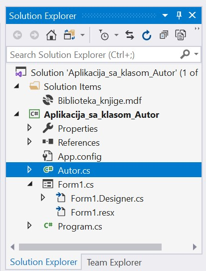
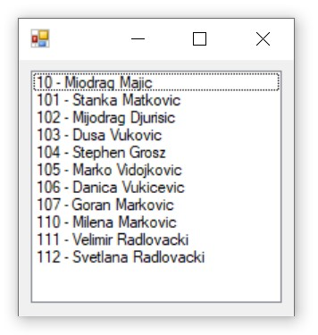
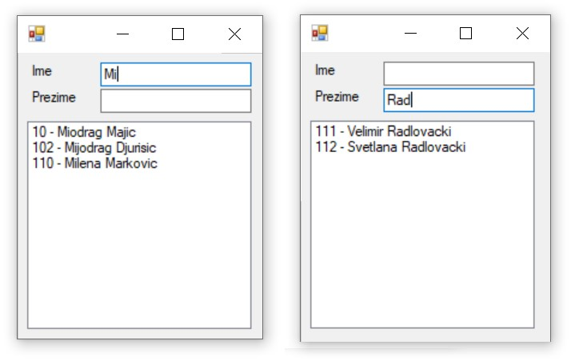
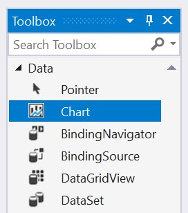
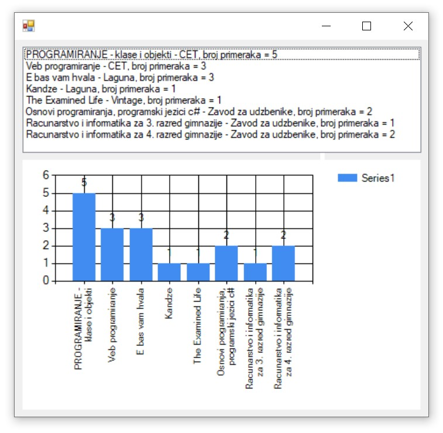

Програм са класом
=================

.. suggestionnote::

    Комплетан програм најчешће има развијене класе и користи различите структуре података. Податке из базе можемо да учитамо у објекте класа које креирамо. Следе примери како се пишу такви програми. 

    Многе од задатака који следе касније током овог поглавља можете да решите и на овај начин. Могуће је објединити и више једноставнијих задатака у већи пројекат који ће имати више класа које ће одговарати структури релационе базе. За креирање таквих великих пројеката је потребно да се примени стечено знање Објектно оријентисаног програмирања из трећег разреда гимназије за ученике са посебним способностима за рачунарство и информатику:

    - `Објектно оријентисано програмирање за трећи разред специјализованих ИТ одељења <https://petlja.org/kurs/11202>`_

Написаћемо програм који приказује садржај табеле *autori* употребом објеката класе *Autor* коју ћемо да напишемо. 

Када се покрене развојно окружење *Visual Studio Community*, потребно је да се креира нови пројекат избором опције *Create a new project*. Изабрани језик треба да буде С#, а врста пројекта *Windows Forms App*, апликација са графичким корисничким интерфејсом. 

Пројекту треба да додамо базу података. У прозору *Solution Explorer* је потребно да се кликне десни тастер миша над називом пројекта, а затим да се изабере *Add/Existing Item...* са менија који се појави. База података коју смо креирали се већ налази на рачунару и потребно је пронаћи и изабрати фајл *Biblioteka_knjige.mdf* у којем је сачувана. Тачна локација може да се провери у систему *SQL Server Management Studio* у којем смо креирали базу. 

Програму додајемо нову класу тако што изаберемо* Add/New Item...* са менија који се појави када се у прозору *Solution Explorer* кликне десни тастер миша над називом C# програма испод назива пројекта. 

Класа *Autor* ће имати три приватна атрибута који редом одговарају идентификационом броју, имену и презимену. Сваки од ових приватних атрибута ће имати јавно својство које има само методу *get* и којом се дозвољава читање, али не и измена одговарајућег атрибута. Конструктор ће креирати објекат на основу садржаја једног реда. Поред тога ћемо имати и методу за приказ објекта. Ово је најједноставнији облик класе. Класа, за неке сложеније пројекте, ће сигурно имати још метода. 

.. code-block:: Csharp

    class Autor
    {
        private int id_autora;
        private string ime;
        private string prezime;

        public int Id_autora
        {
            get { return id_autora; }
        }

        public string Ime
        {
            get { return ime; }
        }

        public string Prezime
        {
            get { return prezime; }
        }

        public Autor(DataRow dr)
        {
            this.id_autora = (int)dr["id_autora"];
            this.ime = (string)dr["ime"];
            this.prezime = (string)dr["prezime"];
        }

        public override string ToString()
        {
            return String.Format("{0} - {1} {2}", 
                this.id_autora, this.ime, this.prezime);
        }
    }

У програму ћемо формирати листу и њен садржај ћемо приказати у контроли *ListBox*, коју можемо да превучемо из прозора *Toolbox*. 

Класе које су нам потребне за читање података из базе и њихов приказ у програму се налазе у именском простору *System.Data.SqlClient*, који није аутоматски укључен у нови пројекат. Потребно је да додамо следећи ред на врх документа са програмским кодом. 

.. code-block:: Csharp

    using System.Data.SqlClient;

Приликом писања програма потребно је да се употреби конекциони стринг који је формиран у ранијим примерима, а односи се на повезивање програма на базу података *Biblioteka_knjige.mdf*. 

Следи комплетан програмски код. 

.. code-block:: Csharp

    private void Form1_Load(object sender, EventArgs e)
        {
            SqlConnection con = new SqlConnection(KONEKCIONI_STRING);
            string cmdText = "SELECT * FROM autori";

            SqlCommand cmd = new SqlCommand(cmdText, con);
            SqlDataAdapter da = new SqlDataAdapter(cmd);
            DataTable dt = new DataTable();
            cmd.Connection.Open();
            da.Fill(dt);
            cmd.Connection.Close();

            List<Autor> lista = new List<Autor>();
            foreach (DataRow dr in dt.Rows)
                lista.Add(new Autor(dr));

            foreach (Autor autor in lista)
                listBox1.Items.Add(autor.ToString());
        }

Све је спремно да се покрене апликација кликом на дугме *Start* и да се тестира прва опција коју смо испрограмирали. На следећој слици се види покренут програм. 

Програм можемо да зауставимо тако што затворимо прозор у којем је покренут и вратимо се у развојно окружење. Можемо да додамо два поља за унос текста тако да имамо могућност да претражујемо списак по имену или по презимену. Података нема много и цео садржај табеле можемо да учитамо у листу. Претрага листе је ефикаснија од поновног читања базе за свако име или презиме које нам треба. 

.. infonote::

    Података у бази има често много више него што може да се учита у програм, тако да треба користити неке од опција које ограничавају број редова које узимамо из базе. 

Следи комплетан програмски код. 

.. code-block:: Csharp

    List<Autor> lista;

        private void Form1_Load(object sender, EventArgs e)
        {
            SqlConnection con = new SqlConnection(KONEKCIONI_STRING);
            string cmdText = "SELECT * FROM autori";

            SqlCommand cmd = new SqlCommand(cmdText, con);
            SqlDataAdapter da = new SqlDataAdapter(cmd);
            DataTable dt = new DataTable();
            cmd.Connection.Open();
            da.Fill(dt);
            cmd.Connection.Close();

            lista = new List<Autor>();
            foreach (DataRow dr in dt.Rows)
                lista.Add(new Autor(dr));

            foreach (Autor autor in lista)
                listBox1.Items.Add(autor.ToString());
        }

        private void textBox1_TextChanged(object sender, EventArgs e)
        {
            textBox2.Text = String.Empty;

            if (textBox1.Text != String.Empty)
            {
                listBox1.Items.Clear();
                foreach (Autor autor in lista)
                    if (autor.Ime.StartsWith(textBox1.Text))
                        listBox1.Items.Add(autor.ToString());
            }
        }

        private void textBox2_TextChanged(object sender, EventArgs e)
        {
            textBox1.Text = String.Empty;

            if (textBox2.Text != String.Empty)
            {
                listBox1.Items.Clear();
                foreach (Autor autor in lista)
                    if (autor.Prezime.StartsWith(textBox2.Text))
                        listBox1.Items.Add(autor.ToString());
            }
        }

На следећој слици се види како можемо да претражујемо списак након што покренемо апликацију кликом на дугме *Start*.

Креираћемо нови програм у којем ћемо направити класу Knjiga. У објекте ове класе ћемо угњежденим упитом учитати податке из неколико табела. Свака књига има назив, назив издавача и број примерака. 

.. code-block:: Csharp

    class Knjiga
    {
        private string naziv;
        private string izdavac;
        private int brojPrimeraka;

        public string Naziv
        {
            get { return naziv; }
        }

        public string Izdavac
        {
            get { return izdavac; }
        }

        public int BrojPrimeraka
        {
            get { return brojPrimeraka; }
        }

        public Knjiga(DataRow dr)
        {
            this.naziv = (string)dr["naziv_knjige"];
            this.izdavac = (string)dr["naziv_izdavaca"];
            this.brojPrimeraka = (int)dr["broj_primeraka"];
        }

        public override string ToString()
        {
            return String.Format("{0} - {1}, broj primeraka = {2}",
                this.naziv, this.izdavac, this.brojPrimeraka);
        }
    }

У апликацији ћемо приказати списак књига. Користићемо и објекат класе *Chart* да прикажемо графикон на којем се виде књиге и бројеви примерака. 

Следи комплетан програмски код решења. 

.. code-block:: Csharp

    private void Form1_Load(object sender, EventArgs e)
        {
            SqlConnection con = new SqlConnection(KONEKCIONI_STRING);
            string cmdText = "SELECT knjige.naziv naziv_knjige, " +
                "izdavaci.naziv naziv_izdavaca, " +
                "COUNT(inventarski_broj) broj_primeraka " +
                "FROM primerci JOIN knjige " +
                "ON(primerci.id_knjige=knjige.id_knjige) " +
                "JOIN izdavaci " +
                "ON(knjige.id_izdavaca=izdavaci.id)" +
                "GROUP BY knjige.naziv, izdavaci.naziv";

            SqlCommand cmd = new SqlCommand(cmdText, con);
            SqlDataAdapter da = new SqlDataAdapter(cmd);
            DataTable dt = new DataTable();
            cmd.Connection.Open();
            da.Fill(dt);
            cmd.Connection.Close();

            List<Knjiga> lista = new List<Knjiga>();
            foreach (DataRow dr in dt.Rows)
                lista.Add(new Knjiga(dr));

            foreach (Knjiga knjiga in lista)
                listBox1.Items.Add(knjiga.ToString());

            chart1.DataSource = dt;
            chart1.Series["Series1"].XValueMember = "naziv_knjige";
            chart1.Series["Series1"].YValueMembers = "broj_primeraka";
            chart1.Series["Series1"].IsValueShownAsLabel = true;
        }

На следећој слици  се види како ради програм након што га покренемо кликом на дугме *Start*.

