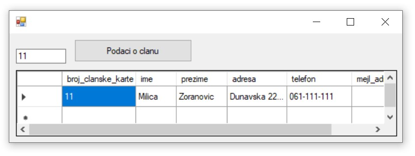

База података за библиотеку - програм са угнежђеним упитом SELECT из једне табеле - задаци
==========================================================================================

.. suggestionnote::

    На делу базе података за библиотеку смо видели како се у програму користи угњежден упит SELECT. Следи још задатака у којима се користи комплетна база података за библиотеку са већим бројем табела. Сви задаци ће бити решени писањем програма у развојном окружењу Visual Studio Community и употребом програмског језика C#. 

    У свим примерима, у упиту који је део програма нема спајања табела, тј. подаци се узимају из по једне табеле. 

    Детаљно објашњење формирања упита SELECT који пишемо као део процедуре или функције је објашњен раније у материјалима и по потреби је могуће вратити се на тај део да би се додатно разумело како смо дошли до комплетног решења. 

Сви приказани задаци су у вези са табелама које чине базу података за библиотеку. Следи списак свих табела са колонама. Примарни кључеви су истакнути болд, а страни италик. 

.. image:: ../../_images/slika_316a.jpg
    :width: 780
    :align: center

Када се покрене развојно окружење *Visual Studio Community*, потребно је да се креира нови пројекат избором опције *Create a new project*. Изабрани језик треба да буде C#, а врста пројекта *Windows Forms App*, апликација са графичким корисничким интерфејсом. 

Када се креира нови пројекат, први корак је додавање раније креиране базе података. У прозору *Solution Explorer* је потребно да се кликне десни тастер миша над називом пројекта, а затим да се изабере *Add/Existing Item...* са менија који се појави. База података коју смо креирали се већ налази на рачунару и потребно је пронаћи и изабрати фајл *Biblioteka.mdf* у којем је сачувана. Тачна локација може да се провери у систему *SQL Server Management Studio* у којем смо креирали базу. 

.. image:: ../../_images/slika_316b.jpg
    :width: 780
    :align: center

Приликом писања програма, потребно је да се употреби конекциони стринг, а односи се на повезивање програма на базу података *Biblioteka.mdf*. У решењима задатака стоји *KONEKCIONI_STRING* на местима где се очекује конекциони стринг. 

Можемо прво да креирамо једну једноставну апликацију и да у том процесу формирамо и конекциони стринг који ћемо надаље користити. 

За приказ садржаја табеле из релационе базе података је најбоље да се користи контрола *DataGridView* коју можемо да превучемо из прозора *Toolbox* у наш програм. 

За *DataGridView* је неопходно је да изаберемо податке који ће бити приказани у оквиру њега. У горњем десном углу постоји мала стрелица која води до падајућег менија *Choose Data Source*. Са падајућег менија изабрати *Add Project Data Source...* У наредна два корака изабрати *Database* и *Dataset*. 

Следећи корак је веома значајан зато што се формира конекција са базом података. Након што се кликне на дугме *New Connection...*, потребно је да се изабере опција *Microsoft SQL Server Database File*, а затим и да се на рачунару пронађе и дода фајл који садржи базу података. Када се изабере фајл, значајно је да се штиклира опција која приказује конекциони стринг (енг. *connection string*). Тај стринг треба негде запамтити ради употребе у примерима који следе. 

.. infonote::

    **ВАЖНО**: Стринг који добијете неће бити идентичан овоме који је овде приказан. Значајно је да запамтите конекциони стринг који ви добијете на вашем рачунару за вашу базу података. Тај стринг ће се користити у свим наредним програмима које креирамо и који се повезују на ову базу података. 

Стринг је потребно мало прилагодити. На почетак и крај се додају наводници. Наводници у средини, на почетку и крају назива фајла са путањом се бришу. Испред сваке обрнуте косе црте треба додати још по једну, зато што је то посебан карактер. 

Следи пример сређеног конекционог стринга на основу добијеног. 

.. code-block::

    "Data Source=(LocalDB)\\MSSQLLocalDB;
    AttachDbFilename=
    C:\\Users\\Dusa\\Documents\\SQL Server Management Studio\\Biblioteka.mdf;
    Integrated Security=True;Connect Timeout=30"

У последњем кораку је потребно изабрати жељену табелу са списка свих објеката који се налазе у бази података на коју смо се повезали. 

Апликација се покреће кликом на дугме *Start* и можемо да тестирамо како ради.

У задацима који следе, податке из базе ћемо читати помоћу наредби. Класе које су нам потребне за читање података и њихов приказ у програму се налазе у именском простору *System.Data.SqlClient* који није аутоматски укључен у нови пројекат. Потребно је да додамо следећи ред на врх документа са програмским кодом

.. code-block:: Csharp

    using System.Data.SqlClient;

.. questionnote::

    1. Библиотека планира да умањи износ за плаћање казне за оне који плате казну у најкраћем року. Пре него што обавести чланове библиотеке о новом правилу, потребно је да се анализирају до садашње плаћене казне да би се што боље проценило како би се у будућности одразило умењење износа казне на појединачне случајеве. 

**Задатак**: Приказати број чланске карте члана коме је издата казна, датум плаћања казне, износ казне и како би изгледао износ казне умањен за дати проценат. 

.. code-block:: Csharp

    private void button1_Click(object sender, EventArgs e)
        {
            string conText = KONEKCIONI_STRING;
            double procenat = double.Parse(textBox1.Text);
            procenat = (100 - procenat) / 100;
            string cmd;
            cmd = "SELECT broj_clanske_karte, datum, " +
                "iznos, iznos * " + procenat + " umanjen_iznos " +
                "FROM kazne";
            SqlDataAdapter da = new SqlDataAdapter(cmd, conText);
            DataTable dt = new DataTable();
            da.Fill(dt);
            dataGridView1.DataSource = dt;
        }

.. image:: ../../_images/slika_316f.jpg
    :width: 780
    :align: center

.. questionnote::

    2. Поштени проналазач је изгубљену чланску карту са бројем 11 донео у библиотеку. Да би могли да је врате члану, потребне су његове контакт информације. 

**Задатак:** Приказати све податке о члану са датим бројем чланске карте.

.. code-block:: Csharp

    private void button1_Click(object sender, EventArgs e)
        {
            string conText = KONEKCIONI_STRING;
            int broj = int.Parse(textBox1.Text);
            string cmd;
            cmd = "SELECT * FROM clanovi " +
                "WHERE broj_clanske_karte = " + broj;
            SqlDataAdapter da = new SqlDataAdapter(cmd, conText);
            DataTable dt = new DataTable();
            da.Fill(dt);
            dataGridView1.DataSource = dt;
        }

.. questionnote::

    3. Члан Оливера Стошић је дошла у библиотеку након што је изгубила чланску карту. Библиотека треба да јој изда дупликат па је потребно да се провери који је био број њене чланске карте. 

**Задатак:** Приказати број чланске карте члана датог имена и презимена.

.. code-block:: Csharp

    private void button1_Click(object sender, EventArgs e)
        {
            string conText = KONEKCIONI_STRING;
            string ime = textBox1.Text;
            string prezime = textBox2.Text;
            string cmd;
            cmd = "SELECT broj_clanske_karte FROM clanovi " +
                "WHERE ime = '" + ime + "' " +
                "AND prezime = '" + prezime + "'";
            SqlDataAdapter da = new SqlDataAdapter(cmd, conText);
            DataTable dt = new DataTable();
            da.Fill(dt);
            dataGridView1.DataSource = dt;
        }

Други начин је да се позове функција коју смо креирали и која је сачувана у бази података. Да се подсетимо како изгледа скаларна функција која враћа број чланске карте. У овом случају изглед апликације може да се разликује. Није нам потребан *DataGridView* за приказ резултата.

::

    CREATE FUNCTION broj_clanske_karte_clana (@ime VARCHAR(15), @prezime VARCHAR(15))
    RETURNS INT
    AS
        BEGIN
        DECLARE @broj INT;
        SELECT @broj = broj_clanske_karte FROM clanovi
        WHERE ime=@ime AND prezime=@prezime;
        RETURN @broj;
    END

Програмски код.

.. code-block:: Csharp

       private void button1_Click(object sender, EventArgs e)
        {
            string conText = KONEKCIONI_STRING;
            SqlConnection con = new SqlConnection(conText);
            string cmdText;
            cmdText = "SELECT dbo.broj_clanske_karte_clana('" + textBox1.Text + 
                "', '"+ textBox2.Text + "')";
            SqlCommand cmd = new SqlCommand(cmdText, con);
            con.Open();
            int broj = Convert.ToInt32(cmd.ExecuteScalar());
            textBox3.Text = broj.ToString();
        }

.. questionnote::

    4. Ради лакше комуникације, библиотека је одлучила да креира посебне мејл адресе за све чланове. 

**Задатак:** Приказати новоформиране мејл адресе свих чланова. Мејл адреса се формира од прва два слова имена, прва три слова презимена и наставка *@biblioteka23.rs* за све чланове. Цела мејл адреса се састоји од малих слова. 

.. code-block::

            private void button1_Click(object sender, EventArgs e)
        {
            string conText = KONEKCIONI_STRING;
            string cmd;
            cmd = "SELECT LOWER(SUBSTRING(ime, 1, 2)+SUBSTRING(prezime, 1, 3))+" +
                "'@biblioteka23.rs' AS nova_mejl_adresa FROM clanovi";
            SqlDataAdapter da = new SqlDataAdapter(cmd, conText);
            DataTable dt = new DataTable();
            da.Fill(dt);
            dataGridView1.DataSource = dt;
        }

.. questionnote::

    5. Још увек нису креиране нове мејл адресе за све чланове библиотеке, а у плану је да се мејлом пошаље неко важно обавештење. Потребно је прво проверити да ли имамо мејл адресе свих чланова. 

**Задатак:** Приказати податке о члановима: број чланске карте, презиме и мејл адреса. Уколико члан нема унету мејл адресу, приказати „Nema mejl adresu“.  

.. code-block::

    private void button1_Click(object sender, EventArgs e)
        {
            string conText = KONEKCIONI_STRING;
            string cmd;
            cmd = "SELECT broj_clanske_karte, " +
                "prezime, ISNULL(mejl_adresa, 'Nema mejl adresu') " +
                "FROM clanovi";
            SqlDataAdapter da = new SqlDataAdapter(cmd, conText);
            DataTable dt = new DataTable();
            da.Fill(dt);
            dataGridView1.DataSource = dt;
        }

.. questionnote::

    6. Библиотеци је потребан извештај о свим примерцима књига који су тренутно издати. На почетку извештаја је важно да се прикажу књиге које су дуже време код чланова библиотеке.  

**Задатак:** Приказати инвентарске бројеве примерака књига који су тренутно издати и датуме узимања из библиотеке. Списак уредити по датуму узимања.  

.. code-block:: Csharp

    private void button1_Click(object sender, EventArgs e)
        {
            string conText = KONEKCIONI_STRING;
            string cmd;
            cmd = "SELECT inventarski_broj, datum_uzimanja " +
                "FROM pozajmice " +
                "WHERE datum_vracanja IS NULL " +
                "ORDER BY datum_uzimanja";
            SqlDataAdapter da = new SqlDataAdapter(cmd, conText);
            DataTable dt = new DataTable();
            da.Fill(dt);
            dataGridView1.DataSource = dt;
        }

Други начин је да се позове процедура коју смо креирали и која је сачувана у бази података. Да се подсетимо како изгледа процедура.

::

    CREATE PROCEDURE izdate_knjige
    AS
    SELECT inventarski_broj, datum_uzimanja FROM pozajmice
    WHERE datum_vracanja IS NULL
    ORDER BY datum_uzimanja

Програмски код.

.. code-block:: Csharp

    private void button1_Click(object sender, EventArgs e)
        {
            SqlConnection con = new SqlConnection(KONEKCIONI_STRING);
            SqlDataAdapter da = new SqlDataAdapter();
            SqlCommand cmd = new SqlCommand("dbo.izdate_knjige", con);
            cmd.CommandType = CommandType.StoredProcedure;
            da.SelectCommand = cmd;
            DataTable dt = new DataTable();
            da.Fill(dt);
            dataGridView1.DataSource = dt;
        }

.. questionnote::

    7. Члан библиотеке са својом чланском картом чији је број 33 је дошао да позајми неке књиге. Пре него што му библиотека изда нове књиге, потребно је да се провери да ли члан тренутно држи неке књиге код себе. 

**Задатак:** Приказати датуме узимања и инвентарске бројеви књига које се тренутно налазе код члана са датим бројем чланске карте. 

.. code-block:: Csharp

    private void button1_Click(object sender, EventArgs e)
        {
            string conText = KONEKCIONI_STRING;
            string cmd;
            int broj = int.Parse(textBox1.Text);
            cmd = "SELECT inventarski_broj, datum_uzimanja " +
                "FROM pozajmice " +
                "WHERE datum_vracanja IS NULL " +
                "AND broj_clanske_karte = " + broj;
            SqlDataAdapter da = new SqlDataAdapter(cmd, conText);
            DataTable dt = new DataTable();
            da.Fill(dt);
            dataGridView1.DataSource = dt;
        }

Други начин је да се позове функција коју смо креирали и која је сачувана у бази података. Да се подсетимо како изгледа функција која враћа табелу.

::

    CREATE FUNCTION zaduzene_knjige_clana (@broj_clanske_karte INT)
    RETURNS TABLE
    AS
    RETURN SELECT datum_uzimanja, inventarski_broj
    FROM pozajmice
    WHERE broj_clanske_karte=@broj_clanske_karte 
    AND datum_vracanja IS NULL

Програмски код.

.. code-block:: Csharp

    private void button1_Click(object sender, EventArgs e)
        {
            string conText = KONEKCIONI_STRING;
            string cmd;
            int broj = int.Parse(textBox1.Text);
            cmd = "SELECT * FROM zaduzene_knjige_clana(" + broj + ")";
            SqlDataAdapter da = new SqlDataAdapter(cmd, conText);
            DataTable dt = new DataTable();
            da.Fill(dt);
            dataGridView1.DataSource = dt;
        }

.. questionnote::

    8. Библиотека жели да понуди посебне погодности код плаћања чланарине и резервације књига за чланове који често позајмљују књиге и који књиге враћају у року. У библиотеку је дошао члан са бројем чланске карте 11 и библиотекар жели да провери да ли овај члан испуњава услов да добије погодности. Приликом одлучивања посматрају се на првом месту скорије активности члана, тј. скорије позајмице.  

**Задатак:** Приказати све позајмице члана са датим бројем чланске карте. Приказати инвентарски број, датум узимања и датум враћања сортиран према датуму узимања тако да прво буду приказане скорије позајмице. Уколико члан има више позајмица истог дана, сортирати по датуму враћања. Уколико су књиге позајмљене истог дана и враћене истог дана, сортирати по инвентарском броју.  

.. code-block:: Csharp

            private void button1_Click(object sender, EventArgs e)
        {
            string conText = KONEKCIONI_STRING;
            string cmd;
            int broj = int.Parse(textBox1.Text);
            cmd = "SELECT inventarski_broj, datum_uzimanja, datum_vracanja " +
                "FROM pozajmice WHERE broj_clanske_karte = " + broj + 
                "ORDER BY datum_uzimanja DESC, " +
                "datum_vracanja DESC, inventarski_broj";
            SqlDataAdapter da = new SqlDataAdapter(cmd, conText);
            DataTable dt = new DataTable();
            da.Fill(dt);
            dataGridView1.DataSource = dt;
        }

Други начин је да се позове процедура коју смо креирали и која је сачувана у бази података. Да се подсетимо како изгледа процедура.

::

    CREATE PROCEDURE sve_pozajmice_clana @broj_clanske_karte INT
    AS
    SELECT inventarski_broj, datum_uzimanja, datum_vracanja
    FROM pozajmice
    WHERE broj_clanske_karte=@broj_clanske_karte
    ORDER BY datum_uzimanja DESC, datum_vracanja DESC, inventarski_broj

Програмски код.

.. code-block::

            private void button1_Click(object sender, EventArgs e)
        {
            SqlConnection con = new SqlConnection(KONEKCIONI_STRING);
            SqlDataAdapter da = new SqlDataAdapter();
            SqlCommand cmd = new SqlCommand("dbo.sve_pozajmice_clana ", con);
            cmd.CommandType = CommandType.StoredProcedure;
            int broj = int.Parse(textBox1.Text);
            SqlParameter param = new SqlParameter("@broj_clanske_karte", broj);
            param.Direction = ParameterDirection.Input;
            param.DbType = DbType.String;
            cmd.Parameters.Add(param);
            da.SelectCommand = cmd;
            DataTable dt = new DataTable();
            da.Fill(dt);
            dataGridView1.DataSource = dt;
        }
