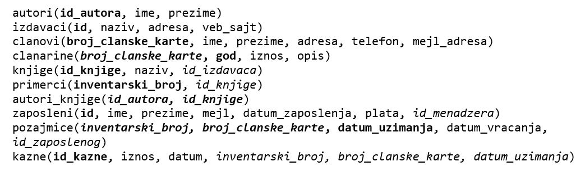
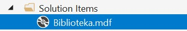

База података за библиотеку - програм са угнежђеним упитом SELECT - вежбање
===========================================================================

Решити следеће задатке писањем програма у развојном окружењу *Visual Studio Community* и употребом програмског језика C#. 

Приликом решавања задатака, погледајте претходно решене примере. Након што решите неки задатак па желите да проверите да ли је решење добро или видите да не можете да га решите, можете да погледате решење које ће се приказати након што кликнете на дугме. 

Детаљно објашњење формирања упита SELECT који треба да буде део програма је објашњен раније у материјалима и по потреби је могуће вратити се на тај део као помоћ у писању комплетног решења. 

Сви приказани задаци су у вези са табелама које чине базу података за библиотеку. Следи списак свих табела са колонама. Примарни кључеви су истакнути болд, а страни италик. 

Када се покрене развојно окружење *Visual Studio Community*, потребно је да се креира нови пројекат избором опције *Create a new project*. Изабрани језик треба да буде C#, а врста пројекта *Windows Forms App*, апликација са графичким корисничким интерфејсом. 

Када се креира нови пројекат, први корак је додавање раније креиране базе података. У прозору *Solution Explorer* је потребно да се кликне десни тастер миша над називом пројекта, а затим да се изабере *Add/Existing Item...* са менија који се појави. База података коју смо креирали се већ налази на рачунару и потребно је пронаћи и изабрати фајл *Biblioteka.mdf* у којем је сачувана. Тачна локација може да се провери у систему *SQL Server Management Studio* у којем смо креирали базу. 

Класе које су нам потребне за читање података из базе и њихов приказ у програму се налазе у именском простору *System.Data.SqlClient* који није аутоматски укључен у нови пројекат. Потребно је да додамо следећи ред на врх документа са програмским кодом. 

.. code-block:: Csharp

    using System.Data.SqlClient;

Приликом писања програма, потребно је да се употреби конекциони стринг који је формиран у ранијим примерима, а односи се на повезивање програма на базу података *Biblioteka.mdf*. У решењима задатака стоји *KONEKCIONI_STRING* на местима где се очекује конекциони стринг.  

.. questionnote::

    1. Разматра се могућност да се уведу одређена ограничења члановима библиотеке који нередовно враћају књиге. Једна од мера би можда била да се њима не издају ретке књиге које су често тражене, а драстичнија мера би могла да подразумева и укидање чланства. Да би се на добар начин донела одлука, библиотека је одлучила да пажљиво проучи списак чланова који касне са враћањем књига и због тога плаћају казне да би се видело колико има таквих чланова и да ли има неких међу њима који се баш истичу. 

**Задатак 1:** Приказати имена и презимена чланова, уз датуме и износе плаћених казни. Списак уредити по члановима, тако да све казне једног члана буду приказане једна испод друге. 

.. reveal:: pitanje_317a
    :showtitle: Прикажи решење
    :hidetitle: Сакриј решење

    .. code-block:: Csharp

                private void button1_Click(object sender, EventArgs e)
        {
            string conText = KONEKCIONI_STRING;
            string cmd;
            cmd = "SELECT ime, prezime, datum, iznos " +
                "FROM kazne JOIN clanovi " +
                "ON(kazne.broj_clanske_karte=clanovi.broj_clanske_karte) " +
                "ORDER BY prezime, ime";
            SqlDataAdapter da = new SqlDataAdapter(cmd, conText);
            DataTable dt = new DataTable();
            da.Fill(dt);
            dataGridView1.DataSource = dt;
        }

**Задатак 2:** Приказати број до сада плаћених казни и укупан износ.

.. reveal:: pitanje_317b
    :showtitle: Прикажи решење
    :hidetitle: Сакриј решење

    .. code-block:: Csharp

        private void button1_Click(object sender, EventArgs e)
        {
            string conText = KONEKCIONI_STRING;
            string cmd;
            cmd = "SELECT COUNT(*) broj_kazni, " +
                "SUM(iznos) ukupan_iznos " +
                "FROM kazne";
            SqlDataAdapter da = new SqlDataAdapter(cmd, conText);
            DataTable dt = new DataTable();
            da.Fill(dt);
            dataGridView1.DataSource = dt;
        }

**Задатак 3**: Приказати број чланова који су до сада каснили са враћањем књига и због тога плаћали казне. 

.. reveal:: pitanje_317c
    :showtitle: Прикажи решење
    :hidetitle: Сакриј решење

    .. code-block:: Csharp

        private void button1_Click(object sender, EventArgs e)
        {
            string conText = KONEKCIONI_STRING;
            string cmd;
            cmd = "SELECT COUNT(DISTINCT broj_clanske_karte) " +
                "FROM kazne";
            SqlDataAdapter da = new SqlDataAdapter(cmd, conText);
            DataTable dt = new DataTable();
            da.Fill(dt);
            dataGridView1.DataSource = dt;
        }

**Задатак 4**: Приказати имена и презимена чланова, уз број плаћених казни. Списак уредити по члановима.

.. reveal:: pitanje_317d
    :showtitle: Прикажи решење
    :hidetitle: Сакриј решење

    .. code-block:: Csharp

        private void button1_Click(object sender, EventArgs e)
        {
            string conText = KONEKCIONI_STRING;
            string cmd;
            cmd = "SELECT ime, prezime, COUNT(*) " +
                "FROM kazne JOIN clanovi " +
                "ON(kazne.broj_clanske_karte = clanovi.broj_clanske_karte) " +
                "GROUP BY ime, prezime " +
                "ORDER BY ime, prezime";
            SqlDataAdapter da = new SqlDataAdapter(cmd, conText);
            DataTable dt = new DataTable();
            da.Fill(dt);
            dataGridView1.DataSource = dt;
        }

**Задатак 5:** Приказати имена и презимена чланова, уз број плаћених казни, који имају више од једне плаћене казне.

.. reveal:: pitanje_317e
    :showtitle: Прикажи решење
    :hidetitle: Сакриј решење

    .. code-block:: Csharp

        private void button1_Click(object sender, EventArgs e)
        {
            string conText = KONEKCIONI_STRING;
            string cmd;
            cmd = "SELECT ime, prezime, COUNT(*) " +
                "FROM kazne JOIN clanovi " +
                "ON(kazne.broj_clanske_karte = clanovi.broj_clanske_karte) " +
                "GROUP BY ime, prezime " +
                "HAVING COUNT(*)>1 " +
                "ORDER BY ime, prezime";
            SqlDataAdapter da = new SqlDataAdapter(cmd, conText);
            DataTable dt = new DataTable();
            da.Fill(dt);
            dataGridView1.DataSource = dt;
        }

**Задатак 6:** Приказати име и презиме члана који је платио највећи износ казне до сада. 

Под претпоставком да висина износа казне зависи од броја дана колико се каснило са враћањем књиге, решење овог упита може да издвоји члана или чланове са неодговорним понашањем. 

.. reveal:: pitanje_317f
    :showtitle: Прикажи решење
    :hidetitle: Сакриј решење

    .. code-block:: Csharp

                private void button1_Click(object sender, EventArgs e)
        {
            string conText = KONEKCIONI_STRING;
            string cmd;
            cmd = "SELECT DISTINCT ime, prezime " +
                "FROM kazne JOIN clanovi " +
                "ON(kazne.broj_clanske_karte = clanovi.broj_clanske_karte) " +
                "WHERE iznos = (SELECT MAX(iznos) FROM kazne)";
            SqlDataAdapter da = new SqlDataAdapter(cmd, conText);
            DataTable dt = new DataTable();
            da.Fill(dt);
            dataGridView1.DataSource = dt;
        }

.. questionnote::

    2. У току месеца маја је акција и библиотека поклања по једну књигу својим верним члановима који тог месеца дођу да позајме књиге. Тренутно је у библиотеку дошла Милица Зорановић и библиотекар жели да провери како изгледа њена историја чланства, тј. да ли је већ дужи низ година члан библиотеке. 

**Задатак 1:** Приказати списак година када је члан датог имена и презимена био члан библиотеке, тј. за које је платио чланарину.  

.. reveal:: pitanje_317g
    :showtitle: Прикажи решење
    :hidetitle: Сакриј решење

    .. code-block:: Csharp

        private void button1_Click(object sender, EventArgs e)
        {
            string conText = KONEKCIONI_STRING;
            string cmd;
            string ime = textBox1.Text;
            string prezime = textBox2.Text;
            cmd = "SELECT god " +
                "FROM clanarine JOIN clanovi " +
                "ON(clanarine.broj_clanske_karte = clanovi.broj_clanske_karte) " +
                "WHERE ime='" + ime + "' " +
                "AND prezime='" + prezime + "'";
            SqlDataAdapter da = new SqlDataAdapter(cmd, conText);
            DataTable dt = new DataTable();
            da.Fill(dt);
            dataGridView1.DataSource = dt;
        }

**Задатак 2:** Приказати број година када је члан датог имена и презимена био члан библиотеке, тј. за које је платио чланарину.  

.. reveal:: pitanje_317h
    :showtitle: Прикажи решење
    :hidetitle: Сакриј решење

    .. code-block:: Csharp

        private void button1_Click(object sender, EventArgs e)
        {
            string conText = KONEKCIONI_STRING;
            string cmd;
            string ime = textBox1.Text;
            string prezime = textBox2.Text;
            cmd = "SELECT COUNT(god) " +
                "FROM clanarine JOIN clanovi " +
                "ON(clanarine.broj_clanske_karte = clanovi.broj_clanske_karte) " +
                "WHERE ime='" + ime + "' " +
                "AND prezime='" + prezime + "'";
            SqlDataAdapter da = new SqlDataAdapter(cmd, conText);
            DataTable dt = new DataTable();
            da.Fill(dt);
            dataGridView1.DataSource = dt;
        }

.. questionnote::

    3. Библиотека разматра да наручи још књига Завода за уџбенике. Да би донели ту одлуку, потребно је да се види колико су књиге овог издавача тражене. 

**Задатак:** Приказати датуме узимања и називе књиге за све позајмице књига датог издавача. 

.. reveal:: pitanje_317i
    :showtitle: Прикажи решење
    :hidetitle: Сакриј решење

    .. code-block:: Csharp

                private void button1_Click(object sender, EventArgs e)
        {
            string conText = KONEKCIONI_STRING;
            string cmd;
            string izdavac = textBox1.Text;
            cmd = "SELECT datum_uzimanja, knjige.naziv " +
                "FROM pozajmice JOIN primerci " +
                "ON(pozajmice.inventarski_broj = primerci.inventarski_broj) " +
                "JOIN knjige ON(primerci.id_knjige = knjige.id_knjige) " +
                "JOIN izdavaci ON(knjige.id_izdavaca = izdavaci.id) " +
                "WHERE izdavaci.naziv = '" + izdavac + "'";
            SqlDataAdapter da = new SqlDataAdapter(cmd, conText);
            DataTable dt = new DataTable();
            da.Fill(dt);
            dataGridView1.DataSource = dt;
        }

.. questionnote::

    4. Члан библиотеке Милица Зорановић је дошла у библиотеку да позајми неку књигу, али нема идеју шта би следеће читала. Библиотекар је предложио да крену од списка аутора чије је књиге већ позајмљивала, па да виде да ли би Милица читала још неку од књига неког од тих аутора. 

**Задатак:** Приказати без понављања имена и презимена аутора чије је књиге читао члан датог имена и презимена. 

.. reveal:: pitanje_317j
    :showtitle: Прикажи решење
    :hidetitle: Сакриј решење

    .. code-block:: Csharp

        private void button1_Click(object sender, EventArgs e)
        {
            string conText = KONEKCIONI_STRING;
            string cmd;
            string ime = textBox1.Text;
            string prezime = textBox2.Text;
            cmd = "SELECT DISTINCT a.ime, a.prezime " +
                "FROM pozajmice po JOIN clanovi c " +
                "ON(po.broj_clanske_karte = c.broj_clanske_karte) " +
                "JOIN primerci pr ON(po.inventarski_broj= pr.inventarski_broj) " +
                "JOIN knjige k ON(pr.id_knjige= k.id_knjige) " +
                "JOIN autori_knjige ak ON(ak.id_knjige= k.id_knjige) " +
                "JOIN autori a ON(ak.id_autora= a.id_autora) " +
                "WHERE c.ime = '" + ime + "' AND c.prezime = '" + prezime + "'";
            SqlDataAdapter da = new SqlDataAdapter(cmd, conText);
            DataTable dt = new DataTable();
            da.Fill(dt);
            dataGridView1.DataSource = dt;
        }

.. questionnote::

    5. Библиотека организује прославу за своје запослене и позивнице планира да пошаље мејлом, али са различитим текстом за различите тимове. Ради слања позивница, потребан је списак мејл адреса по тимовима. 

**Задатак:** Написати упит којим се приказују мејл адреса запосленог и мејл адреса његовог менаџера. Списак уредити по менаџерима, па унутар истог тима по запосленима. 

.. reveal:: pitanje_317k
    :showtitle: Прикажи решење
    :hidetitle: Сакриј решење

    .. code-block:: Csharp

                private void button1_Click(object sender, EventArgs e)
        {
            string conText = KONEKCIONI_STRING;
            string cmd;
            cmd = "SELECT z.mejl zaposleni, m.mejl menadzer " +
                "FROM zaposleni z LEFT OUTER JOIN zaposleni m " +
                "ON(z.id_menadzera = m.id) " +
                "ORDER BY m.mejl, z.mejl";
            SqlDataAdapter da = new SqlDataAdapter(cmd, conText);
            DataTable dt = new DataTable();
            da.Fill(dt);
            dataGridView1.DataSource = dt;
        } 

.. questionnote::

    6. Тренутно се размишља о корекцији износа за чланарине и корекцији попуста у ситуацијама где се остварује попуст на чланарину. Да би се донела добра одлука, потребно је проучити како се кретао износ просечне чланарине до сада. 

**Задатак:** Написати упит којим се приказује просечна висина чланарине за сваку годину. 

.. reveal:: pitanje_317l
    :showtitle: Прикажи решење
    :hidetitle: Сакриј решење

    .. code-block:: Csharp

                private void button1_Click(object sender, EventArgs e)
        {
            string conText = KONEKCIONI_STRING;
            string cmd;
            cmd = "SELECT god, AVG(iznos) " +
                "FROM clanarine " +
                "GROUP BY god";
            SqlDataAdapter da = new SqlDataAdapter(cmd, conText);
            DataTable dt = new DataTable();
            da.Fill(dt);
            dataGridView1.DataSource = dt;
        }
