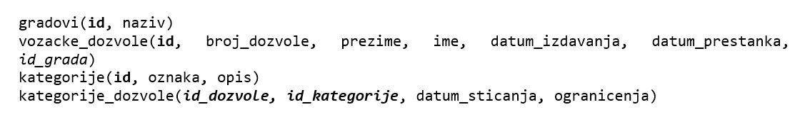
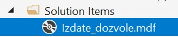
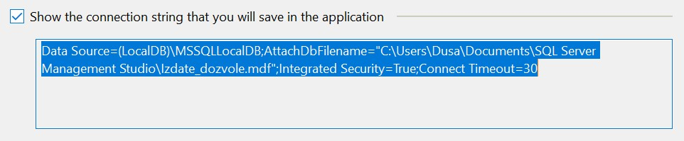
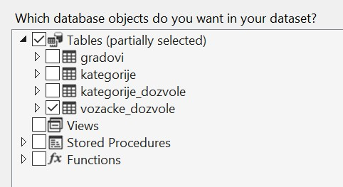
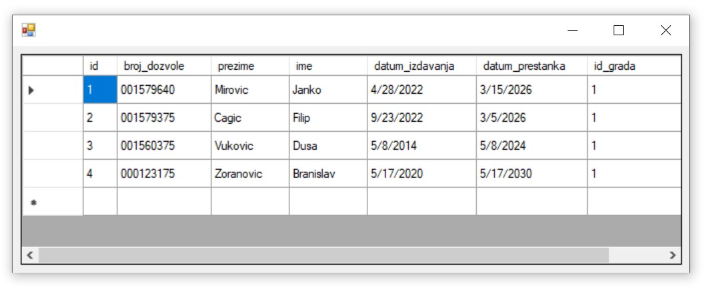

База података за возачке дозволе - програм са угнежђеним упитом SELECT - вежбање
================================================================================

Решити следеће задатке писањем програма у развојном окружењу *Visual Studio Community* и употребом програмског језика C#. 

Приликом решавања задатака, погледајте претходно решене примере. Након што решите неки задатак па желите да проверите да ли је решење добро или видите да не можете да га решите, можете да погледате решење које ће се приказати након што кликнете на дугме. 

Детаљно објашњење формирања упита SELECT који треба да буде део програма је објашњен раније у материјалима и по потреби је могуће вратити се на тај део као помоћ у писању комплетног решења. 

Сви приказани задаци су у вези са табелама које чине базу података за евиденцију издатих возачких дозвола. Следи списак свих табела са колонама. Примарни кључеви су истакнути болд, а страни италик. 

Када се покрене развојно окружење *Visual Studio Community*, потребно је да се креира нови пројекат избором опције *Create a new project*. Изабрани језик треба да буде С#, а врста пројекта *Windows Forms App*, апликација са графичким корисничким интерфејсом. 

Када се креира нови пројекат, први корак је додавање раније креиране базе података. У прозору *Solution Explorer* је потребно да се кликне десни тастер миша над називом пројекта, а затим да се изабере *Add/Existing Item...* са менија који се појави. База података коју смо креирали се већ налази на рачунару и потребно је пронаћи и изабрати фајл *Izdate_dozvole.mdf* у којем је сачувана. Тачна локација може да се провери у систему *SQL Server Management Studio* у којем смо креирали базу. 

Приликом писања програма, потребно је да се употреби конекциони стринг, а односи се на повезивање програма на базу података *Izdate_dozvole.mdf*. У решењима задатака стоји *KONEKCIONI_STRING* на местима где се очекује конекциони стринг. 

Можемо прво да креирамо једну једноставну апликацију и да у том процесу формирамо и конекциони стринг који ћемо надаље користити. 

За приказ садржаја табеле из релационе базе података је најбоље да се користи контрола *DataGridView* коју можемо да превучемо из прозора *Toolbox* у наш програм. 

За *DataGridView* је неопходно је да изаберемо податке који ће бити приказани у оквиру њега. У горњем десном углу постоји мала стрелица која води до падајућег менија *Choose Data Source*. Са падајућег менија изабрати *Add Project Data Source...* У наредна два корака изабрати *Database* и *Dataset*. 

Следећи корак је веома значајан зато што се формира конекција са базом података. Након што се кликне на дугме *New Connection...*, потребно је да се изабере опција *Microsoft SQL Server Database File*, а затим и да се на рачунару пронађе и дода фајл који садржи базу података. Када се изабере фајл, значајно је да се штиклира опција која приказује конекциони стринг (енг. *connection string*). Тај стринг треба негде запамтити ради употребе у примерима који следе. 

.. infonote::

    Стринг који добијете неће бити идентичан овоме који је овде приказан. Значајно је да запамтите конекциони стринг који ви добијете на вашем рачунару за вашу базу података. Тај стринг ће се користити у свим наредним програмима које креирамо и који се повезују на ову базу података. 

Стринг је потребно мало прилагодити. На почетак и крај се додају наводници. Наводници у средини, на почетку и крају назива фајла са путањом се бришу. Испред сваке обрнуте косе црте треба додати још по једну, зато што је то посебан карактер. 

Следи пример сређеног конекционог стринга на основу добијеног. 

.. code-block::

    "Data Source=(LocalDB)\\MSSQLLocalDB;
    AttachDbFilename=
    C:\\Users\\Dusa\\Documents\\SQL Server Management Studio\\Izdate_dozvole.mdf;
    Integrated Security=True;Connect Timeout=30"

У последњем кораку је потребно изабрати жељену табелу са списка свих објеката који се налазе у бази података на коју смо се повезали. 

Апликација се покреће кликом на дугме *Start* и можемо да тестирамо како ради.

У задацима који следе, податке из базе ћемо читати помоћу наредби. Класе које су нам потребне за читање података и њихов приказ у програму се налазе у именском простору System.Data.SqlClient који није аутоматски укључен у нови пројекат. Потребно је да додамо следећи ред на врх документа са програмским кодом. 

.. code-block:: Csharp

    using System.Data.SqlClient;

.. questionnote::

    1. Приказати име и презиме особе чији је број возачке дозволе дат.  

.. reveal:: pitanje_319a
    :showtitle: Прикажи решење
    :hidetitle: Сакриј решење

    .. code-block:: Csharp

        private void button1_Click(object sender, EventArgs e)
        {
            string conText = KONEKCIONI_STRING;
            string cmd;
            string broj = textBox1.Text;
            cmd = "SELECT ime, prezime " +
                "FROM vozacke_dozvole " +
                "WHERE broj_dozvole = '" + broj + "'";
            SqlDataAdapter da = new SqlDataAdapter(cmd, conText);
            DataTable dt = new DataTable();
            da.Fill(dt);
            dataGridView1.DataSource = dt;
        }

.. questionnote::

    2. Приказати податке о возачким дозволама које обухватају категорију са датом ознаком, као и датум када су је стекли.   

.. reveal:: pitanje_319b
    :showtitle: Прикажи решење
    :hidetitle: Сакриј решење

    .. code-block:: Csharp

        private void button1_Click(object sender, EventArgs e)
        {
            string conText = KONEKCIONI_STRING;
            string cmd;
            string oznaka = textBox1.Text;
            cmd = "SELECT vd.broj_dozvole, " +
                "vd.prezime, vd.ime, vd.datum_izdavanja, " +
                "vd.datum_prestanka, kd.datum_sticanja " +
                "FROM vozacke_dozvole vd " +
                "JOIN kategorije_dozvole kd " +
                "ON(kd.id_dozvole= vd.id) " +
                "JOIN kategorije k " +
                "ON(kd.id_kategorije= k.id) " +
                "WHERE k.oznaka = '" + oznaka + "'";
            SqlDataAdapter da = new SqlDataAdapter(cmd, conText);
            DataTable dt = new DataTable();
            da.Fill(dt);
            dataGridView1.DataSource = dt;
        }

.. questionnote::

    3. Приказати податке о свим категоријама на дозволи са датим бројем.   

.. reveal:: pitanje_319c
    :showtitle: Прикажи решење
    :hidetitle: Сакриј решење

    .. code-block:: Csharp

        private void button1_Click(object sender, EventArgs e)
        {
            string conText = KONEKCIONI_STRING;
            string cmd;
            string broj = textBox1.Text;
            cmd = "SELECT oznaka " +
                "FROM vozacke_dozvole vd " +
                "JOIN kategorije_dozvole kd " +
                "ON(kd.id_dozvole = vd.id) " +
                "JOIN kategorije k " +
                "ON(kd.id_kategorije= k.id) " +
                "WHERE broj_dozvole = '" + broj + "'";
            SqlDataAdapter da = new SqlDataAdapter(cmd, conText);
            DataTable dt = new DataTable();
            da.Fill(dt);
            dataGridView1.DataSource = dt;
        }

    .. image:: ../../_images/slika_319f.jpg
        :width: 450
        :align: center

.. questionnote::

    4. Приказати списак различитих категорија (ознака) за које имамо издате возачке дозволе у датом граду.

.. reveal:: pitanje_319d
    :showtitle: Прикажи решење
    :hidetitle: Сакриј решење

    .. code-block:: Csharp

         private void button1_Click(object sender, EventArgs e)
        {
            string conText = KONEKCIONI_STRING;
            string cmd;
            string grad = textBox1.Text;
            cmd = "SELECT DISTINCT oznaka " +
                "FROM kategorije JOIN kategorije_dozvole " +
                "ON(kategorije_dozvole.id_kategorije = kategorije.id) " +
                "JOIN vozacke_dozvole " +
                "ON(kategorije_dozvole.id_dozvole = vozacke_dozvole.id) " +
                "JOIN gradovi ON(vozacke_dozvole.id_grada = gradovi.id) " +
                "WHERE gradovi.naziv = '" + grad + "'";
            SqlDataAdapter da = new SqlDataAdapter(cmd, conText);
            DataTable dt = new DataTable();
            da.Fill(dt);
            dataGridView1.DataSource = dt;
        }

.. questionnote::

    5. Приказати број различитих категорија (ознака) за које имамо издате возачке дозволе у датом граду.

.. reveal:: pitanje_319e
    :showtitle: Прикажи решење
    :hidetitle: Сакриј решење

    .. code-block:: Csharp

        private void button1_Click(object sender, EventArgs e)
        {
            string conText = KONEKCIONI_STRING;
            string cmd;
            string grad = textBox1.Text;
            cmd = "SELECT COUNT(DISTINCT oznaka) " +
                "FROM kategorije JOIN kategorije_dozvole " +
                "ON(kategorije_dozvole.id_kategorije = kategorije.id) " +
                "JOIN vozacke_dozvole " +
                "ON(kategorije_dozvole.id_dozvole = vozacke_dozvole.id) " +
                "JOIN gradovi ON(vozacke_dozvole.id_grada = gradovi.id) " +
                "WHERE gradovi.naziv = '" + grad + "'";
            SqlDataAdapter da = new SqlDataAdapter(cmd, conText);
            DataTable dt = new DataTable();
            da.Fill(dt);
            dataGridView1.DataSource = dt;
        }

.. questionnote::

    6. Приказати за сваку возачку дозволу број категорија које покрива.

.. reveal:: pitanje_319f
    :showtitle: Прикажи решење
    :hidetitle: Сакриј решење

    .. code-block:: Csharp

                private void button1_Click(object sender, EventArgs e)
        {
            string conText = KONEKCIONI_STRING;
            string cmd;
            cmd = "SELECT broj_dozvole, " +
                "COUNT(id_kategorije) AS broj_kategorija " +
                "FROM kategorije_dozvole " +
                "JOIN vozacke_dozvole " +
                "ON(kategorije_dozvole.id_dozvole = vozacke_dozvole.id) " +
                "GROUP BY broj_dozvole";
            SqlDataAdapter da = new SqlDataAdapter(cmd, conText);
            DataTable dt = new DataTable();
            da.Fill(dt);
            dataGridView1.DataSource = dt;
        }

    Други начин је да се позове функција коју смо креирали и која је сачувана у бази података. Да се подсетимо како изгледа функција која враћа табелу

    ::

        CREATE FUNCTION broj_kategorija_po_dozvoli()
        RETURNS TABLE
        AS
        RETURN SELECT broj_dozvole, COUNT(id_kategorije) AS broj_kategorija
        FROM kategorije_dozvole
        JOIN vozacke_dozvole ON (kategorije_dozvole.id_dozvole=vozacke_dozvole.id)
        GROUP BY broj_dozvole

    Програмски код.

    .. code-block:: Csharp

        private void button1_Click(object sender, EventArgs e)
        {
            string conText = KONEKCIONI_STRING;
            string cmd;
            cmd = "SELECT * FROM  broj_kategorija_po_dozvoli()";
            SqlDataAdapter da = new SqlDataAdapter(cmd, conText);
            DataTable dt = new DataTable();
            da.Fill(dt);
            dataGridView1.DataSource = dt;
        }

.. questionnote::

    7. Приказати возачке дозволе које покривају више категорија.

.. reveal:: pitanje_319g
    :showtitle: Прикажи решење
    :hidetitle: Сакриј решење

    .. code-block:: Csharp

        private void button1_Click(object sender, EventArgs e)
        {
            string conText = KONEKCIONI_STRING;
            string cmd;
            cmd = "SELECT broj_dozvole, " +
                "COUNT(id_kategorije) AS broj_kategorija " +
                "FROM kategorije_dozvole " +
                "JOIN vozacke_dozvole " +
                "ON(kategorije_dozvole.id_dozvole = vozacke_dozvole.id) " +
                "GROUP BY broj_dozvole " +
                "HAVING COUNT(id_kategorije)>1";
            SqlDataAdapter da = new SqlDataAdapter(cmd, conText);
            DataTable dt = new DataTable();
            da.Fill(dt);
            dataGridView1.DataSource = dt;
        }

    Можемо и да употребимо исту функцију коју смо употребили у претходном задатку. 

    .. code-block:: Csharp

        private void button1_Click(object sender, EventArgs e)
        {
            string conText = KONEKCIONI_STRING;
            string cmd;
            cmd = "SELECT * FROM  broj_kategorija_po_dozvoli() " +
                "WHERE broj_kategorija>1";
            SqlDataAdapter da = new SqlDataAdapter(cmd, conText);
            DataTable dt = new DataTable();
            da.Fill(dt);
            dataGridView1.DataSource = dt;
        }

.. questionnote::

    8. Приказати податке о особи или особама које су стекле дату категорију пре особе датог имена и презимена.  

.. reveal:: pitanje_319h
    :showtitle: Прикажи решење
    :hidetitle: Сакриј решење

    .. code-block:: Csharp

        private void button1_Click(object sender, EventArgs e)
        {
            string conText = KONEKCIONI_STRING;
            string cmd;
            string ime = textBox1.Text;
            string prezime = textBox2.Text;
            string oznaka = textBox3.Text;
            cmd = "SELECT broj_dozvole, ime, prezime " +
                "FROM vozacke_dozvole JOIN kategorije_dozvole " +
                "ON(kategorije_dozvole.id_dozvole=vozacke_dozvole.id) " +
                "JOIN kategorije " +
                "ON(kategorije_dozvole.id_kategorije=kategorije.id) " +
                "WHERE oznaka = '" + oznaka + "' " +
                "AND datum_sticanja< (SELECT datum_sticanja " +
                "FROM vozacke_dozvole JOIN kategorije_dozvole " +
                "ON (kategorije_dozvole.id_dozvole=vozacke_dozvole.id) " +
                "JOIN kategorije " +
                "ON(kategorije_dozvole.id_kategorije=kategorije.id)" +
                "WHERE oznaka = '" + oznaka + "' " + 
                "AND ime = '"+ ime + "' " +
                "AND prezime = '" + prezime + "')";
            SqlDataAdapter da = new SqlDataAdapter(cmd, conText);
            DataTable dt = new DataTable();
            da.Fill(dt);
            dataGridView1.DataSource = dt;
        }

    Други начин је да се позове процедура коју смо креирали и која је сачувана у бази података. Да се подсетимо како изгледа процедура.

    ::

        CREATE PROCEDURE ranije_stecena_kategorija 
        @oznaka VARCHAR(3), @ime VARCHAR(32), @prezime VARCHAR(32)
        AS
        SELECT broj_dozvole, ime, prezime
        FROM vozacke_dozvole JOIN kategorije_dozvole
        ON (kategorije_dozvole.id_dozvole=vozacke_dozvole.id)
        JOIN kategorije ON (kategorije_dozvole.id_kategorije=kategorije.id)
        WHERE oznaka=@oznaka AND datum_sticanja < (SELECT datum_sticanja
        FROM vozacke_dozvole JOIN kategorije_dozvole
            ON (kategorije_dozvole.id_dozvole=vozacke_dozvole.id)
            JOIN kategorije ON (kategorije_dozvole.id_kategorije=kategorije.id)
            WHERE oznaka=@oznaka AND ime=@ime AND prezime=@prezime)

    Позив процедуре. 

    .. code-block:: Csharp

        private void button1_Click(object sender, EventArgs e)
        {
            SqlConnection con = new SqlConnection(KONEKCIONI_STRING);
            SqlDataAdapter da = new SqlDataAdapter();
            SqlCommand cmd = new SqlCommand("dbo.ranije_stecena_kategorija", con);
            cmd.CommandType = CommandType.StoredProcedure;
            SqlParameter param = new SqlParameter("@ime", textBox1.Text);
            param.Direction = ParameterDirection.Input;
            param.DbType = DbType.String;
            cmd.Parameters.Add(param);
            param = new SqlParameter("@prezime", textBox2.Text);
            param.Direction = ParameterDirection.Input;
            param.DbType = DbType.String;
            cmd.Parameters.Add(param);
            param = new SqlParameter("@oznaka", textBox3.Text);
            param.Direction = ParameterDirection.Input;
            param.DbType = DbType.String;
            cmd.Parameters.Add(param);
            da.SelectCommand = cmd;
            DataTable dt = new DataTable();
            da.Fill(dt);
            dataGridView1.DataSource = dt;
        }
