Писање програма у развојном окружењу Visual Studio
==================================================

.. suggestionnote::

    Базе података су увек део неког већег информационог система и приступа им се помоћу програма, тј. апликација за рачунаре и мобилне уређаје, који имају графички кориснички интерфејс. Важно је да видимо како се пишу такви програми. 

    Програми које ћемо креирати обрађују податке из база података па је неопходно да се темељно разуме концепт релационе базе и језик SQL, а посебно упит SELECT. У програмима ћемо приступати базама података које смо до сада креирали. 

    Постоји више програмских језика и развојних окружења у којима је могуће креирати програме који приступају бази података и омогућавају да се они складиште, користе и обрађују подаци. У овим материјалима је изабран програмски језик C# и развојно окружење **Visual Studio Community**, које може бесплатно да се преузме са следеће адресе:

    https://visualstudio.microsoft.com/vs/community/ 

    Постоји неколико предмета у гимназији за ученике са посебним способностима за рачунарство и информатику који се баве програмирањем и за детаљније упознавање са процесом креирања програма може да се приступи доступним курсевима на Петљи:

    - `Програмирање за први разред специјализованих ИТ одељења <https://petlja.org/kurs/369/>`_
    - `Програмирање за други разред специјализованих ИТ одељења <https://petlja.org/kurs/370/>`_
    - `Програмирање за трећи разред специјализованих ИТ одељења <https://petlja.org/kurs/7831>`_
    - `Објектно оријентисано програмирање за трећи разред специјализованих ИТ одељења <https://petlja.org/kurs/11202>`_

Програми се пишу у развојном окружењу *Visual Studio Community* и помоћу програмког језика C#. Сви приказани примери су у вези са табелама које чине део базе података за библиотеку. Следи списак свих табела са колонама. Примарни кључеви су истакнути болд, а страни италик. 

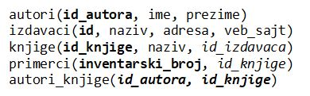

Када се покрене развојно окружење *Visual Studio Community*, потребно је да се креира нови пројекат избором опције *Create a new project*. 

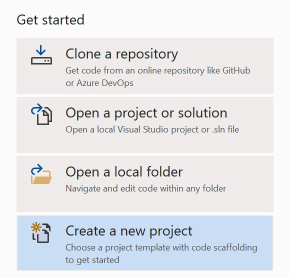

Изабрани језик треба да буде С#, а врста пројекта *Windows Forms App*, апликација са графичким корисничким интерфејсом. 

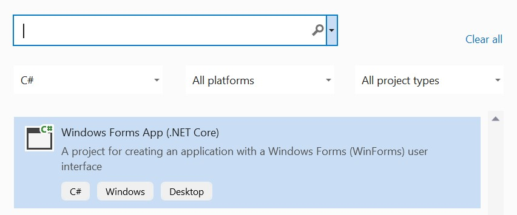

У следећем кораку је потребно да се пројекат именује и да се изабере локација на којој ће се пројекат чувати. Може да остане и предложена локација. Кликнути на дугме Create и прелазимо у простор за креирање апликације, тј. програма. 

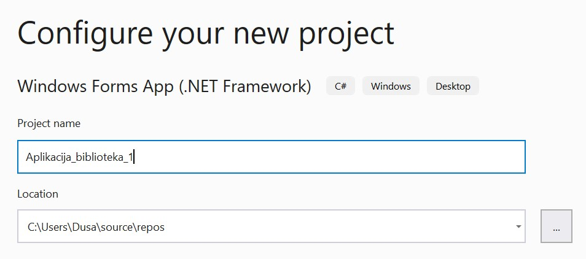

У централном делу окружења се појављује простор за рад на изгледу програма. Као помоћ у раду, било би добро да буду видљиви следећи помоћни прозори:

- *Toolbox*,
- *Solution Explorer*,
- *Properties*. 

Уколико неки од ових помоћних прозора није укључен, може да се дода помоћу падајућег менија View. Овај падајући мени се разликује од верзије до верзије, али увек садржи опције којима можемо да утичемо на то који су нам помоћни прозори доступни. 

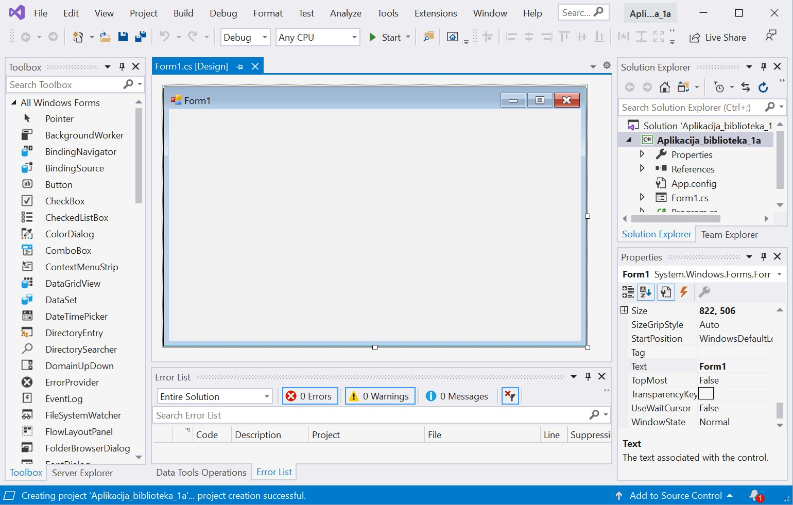

Први корак је додавање раније креиране базе података новом пројекту. У прозору *Solution Explorer* је потребно да се кликне десни тастер миша над називом пројекта, а затим да се изабере *Add/Existing Item...* са менија који се појави. 

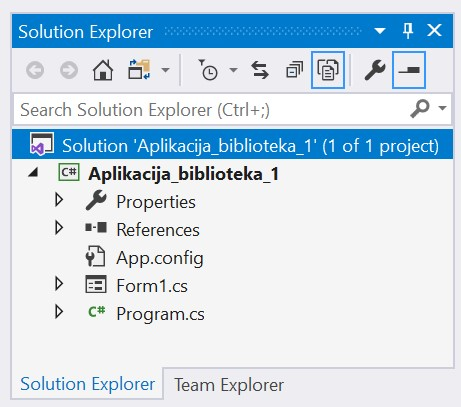

База података коју смо креирали се већ налази на рачунару и потребно је пронаћи и изабрати фајл у којем је сачувана. Тачна локација може да се провери у систему *SQL Server Management Studio* у којем смо креирали базу. База података има екстензију *mdf*. На следећој слици може да се види да је база података *Biblioteka_knjige.mdf* успешно додата у пројекат. 

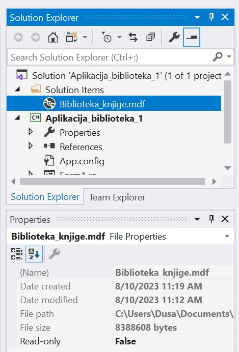

За приказ садржаја табеле из релационе базе података је најбоље да се користи контрола *DataGridView* коју можемо из прозора *Toolbox* да превучемо у наш програм. 

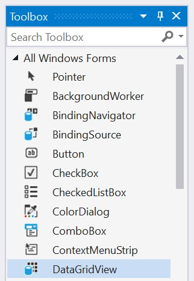

Када додамо објекат класе *DataGridView*, његов подразумевани назив је исти само са почетним малим словом и бројем један *dataGridView1*. Исто правило именовања важи и када додајемо у програм објекте других класа, на пример, класе *Button*. Редом како их додајемо, објекти класе *Button* ће добијати називе *button1*, *button2*, *button3*...

Неопходно је да изаберемо податке који ће бити приказани у програму у оквиру табеле *DataGridView*. У горњем десном углу постоји мала стрелица која води до падајућег менија *Choose Data Source*. Са падајућег менија изабрати *Add Project Data Source...*

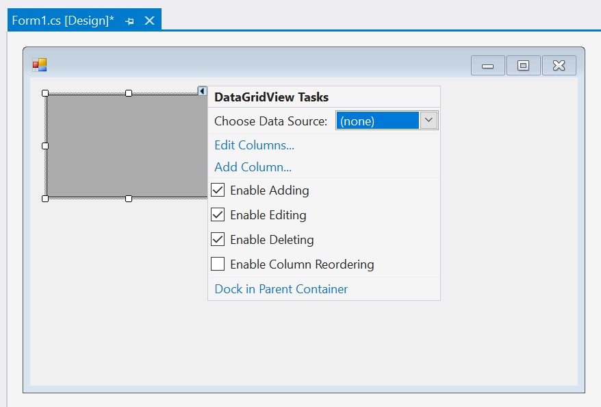

У наредна два корака изабрати *Database* и *Dataset*. 

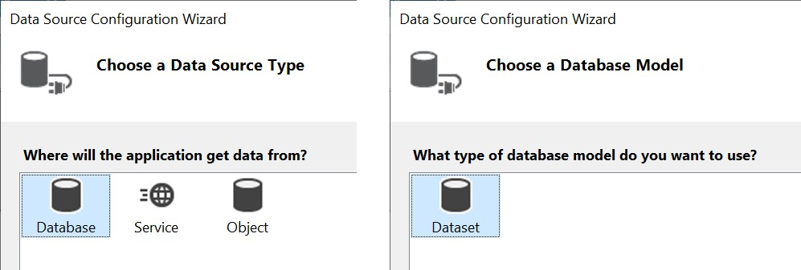

Следећи корак је веома значајан зато што се формира конекција са базом података. 

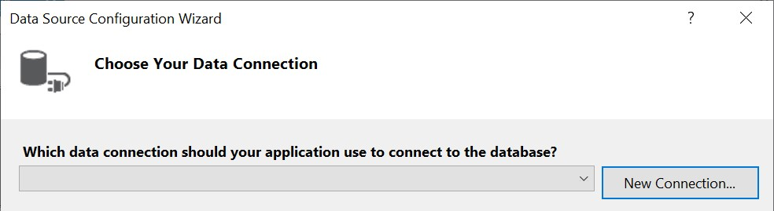

Након што се кликне на дугме *New Connection...*, потребно је да се изабере опција *Microsoft SQL Server Database File*, а затим и да се на рачунару пронађе и дода фајл који садржи базу података. 

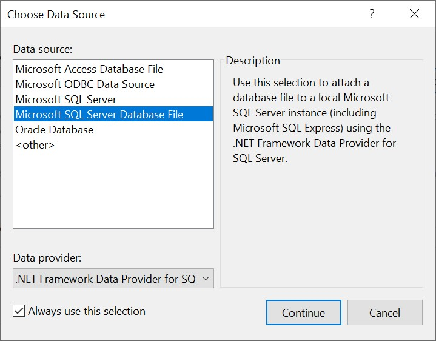

Када се изабере фајл, значајно је да се штиклира опција која приказује **конекциони стринг** (енг. *connection string*). Конекциони стринг садржи информације о извору података, у овом случају бази података, као и информације које су неопходне да програм може да се повеже на базу. 

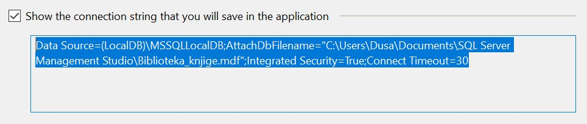

.. infonote::

    **ВАЖНО:** Стринг који добијете неће бити идентичан овоме који је овде приказан. Значајно је да запамтите конекциони стринг који ви добијете на вашем рачунару за вашу базу података. Тај стринг ће се користити у свим наредним програмима које креирамо и који се повезују на ову базу података. 

Стринг је потребно мало прилагодити. На почетак и крај се додају наводници. Наводници у средини, на почетку и крају назива фајла са путањом се бришу. Испред сваке обрнуте косе црте треба додати још по једну, зато што је то посебан карактер. 

::

    "Data Source=(LocalDB)\\MSSQLLocalDB;
    AttachDbFilename=C:\\Users\\Dusa\\Documents
    \\SQL Server Management Studio\\Biblioteka_knjige.mdf;
    Integrated Security=True;Connect Timeout=30"

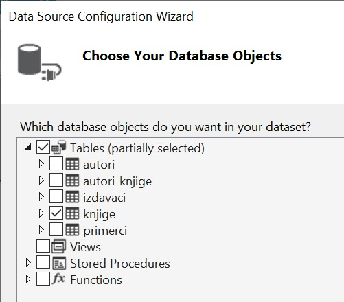

У наредном кораку је потребно изабрати табелу *knjige* са списка свих објеката који се налазе у бази података на коју смо се повезали. 

Контрола *DataGridView* је након свих ових корака повезана са табелом *knjige* и виде се заглавља колона ове табеле. 

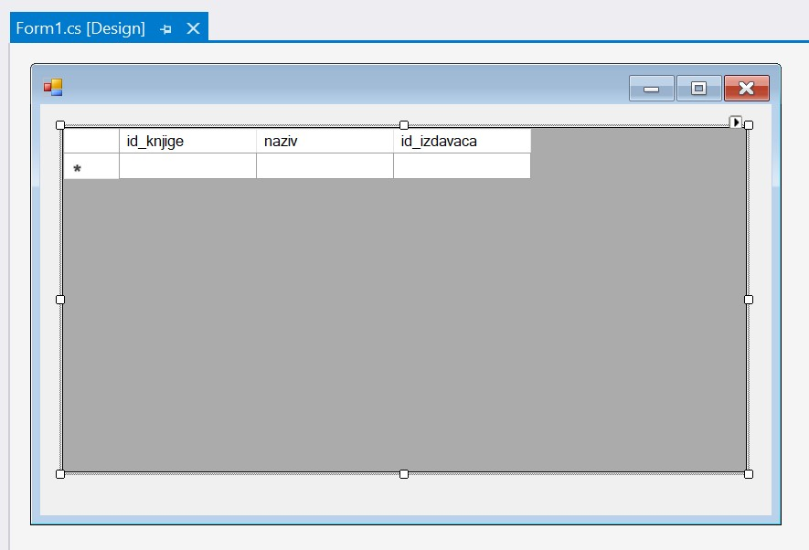

Све је спремно да се покрене апликација кликом на дугме *Start*. 

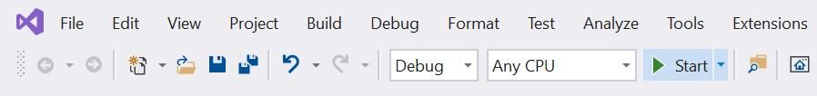

Када се покрене програм, приказује се комплетан садржај табеле из базе података. Оно што се види у програму је копија података из базе. 

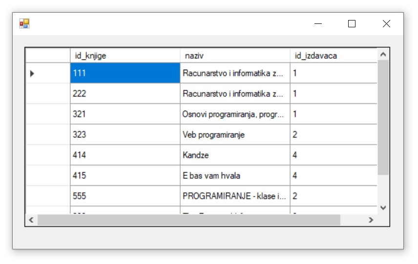