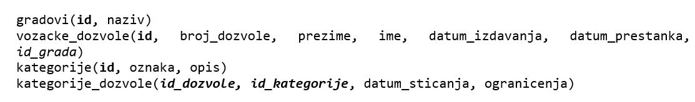

База података за возачке дозволе - програм са угнежђеним упитом - нерешени задаци
=================================================================================

Решити следеће задатке писањем програма у развојном окружењу *Visual Studio Community* и употребом програмског језика C#. Приликом решавања нерешених задатака, погледате претходно решене примере који узимају податке из исте базе. 

Тамо где има смисла, задатке решити на више начина и упоредити решења.

Креирати и један већи пројекат који ће у себи имати уграђено више различитих извештаја, односно решења више задатака који следе. 

Неке од задатака решити креирањем класа. Решења пажљиво испланирати и добро осмислити класе и употребу њихових објеката. За креирање таквих великих пројеката је потребно да се примени стечено знање Објектно оријентисаног програмирања из трећег разреда гимназије за ученике са посебним способностима за рачунарство и информатику.

Сви примери који следе обрађују податке из базе података за евиденцију издатих возачких дозвола. Следи списак свих табела са колонама. Примарни кључеви су истакнути болд, а страни италик. 

.. questionnote::

    1. Приказати датум до када важи и број возачке дозволе особе датог имена и презимена. Приликом тестирања програма нека особа буде Јанко Мировић.

.. questionnote::

    2. Приказати податке о свим категоријама на дозволи са датим бројем. Приликом тестирања програма нека број буде 001560375.   

.. questionnote::

    3. Омогућити додавање података о новој возачкој дозволи.  

.. questionnote::

    4. Приказати списак различитих градова у којима имамо издате возачке дозволе одређене категорије. Приликом тестирања програма нека категорија буде AM. 

.. questionnote::

    5. Приказати број различитих градова у којима имамо издате возачке дозволе одређене категорије. Приликом тестирања програма нека категорија буде AM. 

.. questionnote::

    6. Приказати за сваку категорију број издатих дозвола. 

.. questionnote::

    7. Приказати податке о особи или особама којима дозвола важи дуже од тренутно издате дозволе особи датог имена и презимена. Приликом тестирања програма нека дата особа дуе Бранислав Зорановић.

.. questionnote::

    8. Приказати све категорије за које није унет опис. 

.. questionnote::

    9. Омогућити измену податка о опису категорије. 
