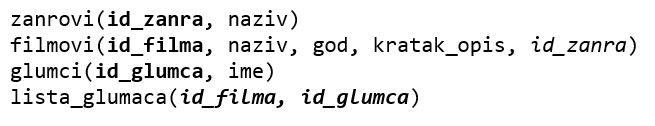
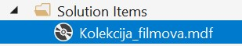
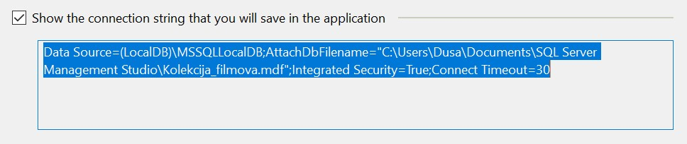
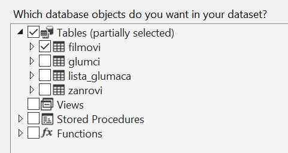
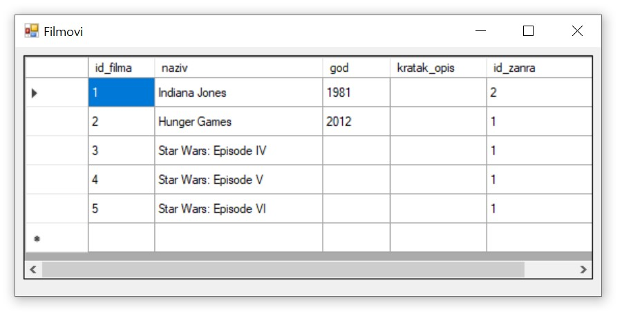

База података за филмове - програм са угнежђеним упитом SELECT - вежбање
========================================================================

Решити следеће задатке писањем програма у развојном окружењу *Visual Studio Community* и употребом програмског језика C#. 

Приликом решавања задатака, погледајте претходно решене примере. Након што решите неки задатак па желите да проверите да ли је решење добро или видите да не можете да га решите, погледајте решење које ће се приказати након што кликнете на дугме. 

Детаљно објашњење формирања упита SELECT који треба да буде део програма је дато раније у материјалима и по потреби је могуће вратити се на тај део као помоћ у писању комплетног решења. 

Сви приказани задаци су у вези са табелама које чине базу података за колекцију филмова. Следи списак свих табела са колонама. Примарни кључеви су истакнути болд, а страни италик. 

Када се покрене развојно окружење *Visual Studio Community*, потребно је да се креира нови пројекат избором опције *Create a new project*. Изабрани језик треба да буде С#, а врста пројекта *Windows Forms App*, апликација са графичким корисничким интерфејсом. 

Када се креира нови пројекат, први корак је додавање раније креиране базе података. У прозору *Solution Explorer* је потребно да се кликне десни тастер миша над називом пројекта, а затим да се изабере *Add/Existing Item...* са менија који се појави. База података коју смо креирали се већ налази на рачунару и потребно је пронаћи и изабрати фајл *Kolekcija_filmova.mdf* у којем је сачувана. Тачна локација може да се провери у систему *SQL Server Management Studio* у којем смо креирали базу. 

Приликом писања програма, потребно је да се употреби конекциони стринг, а односи се на повезивање програма на базу података *Kolekcija_filmova.mdf*. У решењима задатака стоји *KONEKCIONI_STRING* на местима где се очекује конекциони стринг. 

Можемо прво да креирамо једну једноставну апликацију и да у том процесу формирамо и конекциони стринг који ћемо надаље користити. 

За приказ садржаја табеле из релационе базе података је најбоље да се користи контрола* DataGridView* коју можемо да превучемо из прозора *Toolbox* у наш програм. 

За *DataGridView* неопходно је да изаберемо податке који ће бити приказани у оквиру њега. У горњем десном углу постоји мала стрелица која води до падајућег менија *Choose Data Source*. Са падајућег менија изабрати *Add Project Data Source...* У наредна два корака изабрати *Database* и *Dataset*. 

Следећи корак је веома значајан зато што се формира конекција са базом података. Након што се кликне на дугме *New Connection...*, потребно је да се изабере опција *Microsoft SQL Server Database File*, а затим и да се на рачунару пронађе и дода фајл који садржи базу података. Када се изабере фајл, значајно је да се штриклира опција која приказује конекциони стринг (енг. *connection string*). Тај стринг треба негде запамтити ради употребе у примерима који следе. 

.. infonote::

    Стринг који добијете неће бити идентичан овоме који је овде приказан. Значајно је да запамтите конекциони стринг који ви добијете на вашем рачунару за вашу базу података. Тај стринг ће се користити у свим наредним програмима које креирамо и који се повезују на ову базу података. 

Стринг је потребно мало прилагодити. На почетак и крај се додају наводници. Наводници у средини, на почетку и крају назива фајла са путањом се бришу. Испред сваке обрнуте косе црте треба додати још по једну, зато што је то посебан карактер. 

Следи пример сређеног конекционог стринга на основу добијеног. 

.. code-block::

    "Data Source=(LocalDB)\\MSSQLLocalDB;
    AttachDbFilename=
    C:\\Users\\Dusa\\Documents\\SQL Server Management Studio\\Kolekcija_filmova.mdf;
    Integrated Security=True;Connect Timeout=30"

У последњем кораку је потребно изабрати жељену табелу са списка свих објеката који се налазе у бази података на коју смо се повезали. 

Апликација се покреће кликом на дугме *Start* и можемо да тестирамо како ради.

У задацима који следе, податке из базе ћемо читати помоћу наредби. Класе које су нам потребне за читање података и њихов приказ у програму се налазе у именском простору System.Data.SqlClient који није аутоматски укључен у нови пројекат. Потребно је да додамо следећи ред на врх документа са програмским кодом. 

.. code-block:: Csharp

    using System.Data.SqlClient;

.. questionnote::

    1. Приказати годину када је снимљен филм са датим називом.

.. reveal:: pitanje_321a
    :showtitle: Прикажи решење
    :hidetitle: Сакриј решење

    .. code-block:: Csharp

                private void button1_Click(object sender, EventArgs e)
        {
            string conText = KONEKCIONI_STRING;
            string cmd;
            string naziv = textBox1.Text;
            cmd = "SELECT god FROM filmovi " +
                "WHERE naziv = '" + naziv +"'";
            SqlDataAdapter da = new SqlDataAdapter(cmd, conText);
            DataTable dt = new DataTable();
            da.Fill(dt);
            dataGridView1.DataSource = dt;
        }

    Други начин је да се позове функција коју смо креирали и која је сачувана у бази података. Да се подсетимо како изгледа скаларна функција која враћа број. У овом случају изглед апликације може да се разликује. Није нам потребан *DataGridView* за приказ резултата.

    ::

        CREATE FUNCTION godina (@naziv_filma VARCHAR(100))
        RETURNS INT
        AS
            BEGIN
            DECLARE @god INT;
            SELECT @god = god FROM filmovi
            WHERE naziv=@naziv_filma;
            RETURN @god;
        END

    Програмски код.

    .. code-block:: Csharp

        private void button1_Click(object sender, EventArgs e)
        {
            string conText = KONEKCIONI_STRING;
            SqlConnection con = new SqlConnection(conText);
            string cmdText;
            cmdText = "SELECT dbo.godina('" + textBox1.Text + "')";
            SqlCommand cmd = new SqlCommand(cmdText, con);
            con.Open();
            int broj = Convert.ToInt32(cmd.ExecuteScalar());
            textBox2.Text = broj.ToString();
        }

.. questionnote::

    2. Приказати називе свих филмова који спадају у дати жанр. 

.. reveal:: pitanje_321b
    :showtitle: Прикажи решење
    :hidetitle: Сакриј решење

    .. code-block:: Csharp

        private void button1_Click(object sender, EventArgs e)
        {    
             string conText = KONEKCIONI_STRING;
             string cmd;
             string zanr = textBox1.Text;
             cmd = "SELECT filmovi.naziv " +
                "FROM filmovi JOIN zanrovi " +
                "ON(filmovi.id_zanra = zanrovi.id_zanra) " +
                "WHERE zanrovi.naziv = '" + zanr +"'";
             SqlDataAdapter da = new SqlDataAdapter(cmd, conText);
             DataTable dt = new DataTable();
             da.Fill(dt);
             dataGridView1.DataSource = dt;
        }

    .. image:: ../../_images/slika_321f.jpg
        :width: 450
        :align: center

    Други начин је да се позове процедура коју смо креирали и која је сачувана у бази података. Да се подсетимо како изгледа процедура

    ::

        CREATE PROCEDURE filmovi_zanra @naziv_zanra VARCHAR(20)
        AS
        SELECT filmovi.naziv 
        FROM filmovi JOIN zanrovi ON (filmovi.id_zanra=zanrovi.id_zanra)
        WHERE zanrovi.naziv=@naziv_zanra;

    Програмски код.

    .. code-block:: Csharp

                private void button1_Click(object sender, EventArgs e)
        {
            SqlConnection con = new SqlConnection(KONEKCIONI_STRING);
            SqlDataAdapter da = new SqlDataAdapter();
            SqlCommand cmd = new SqlCommand("dbo.filmovi_zanra", con);
            cmd.CommandType = CommandType.StoredProcedure;
            SqlParameter param = new SqlParameter("@naziv_zanra", textBox1.Text);
            param.Direction = ParameterDirection.Input;
            param.DbType = DbType.String;
            cmd.Parameters.Add(param);
            da.SelectCommand = cmd;
            DataTable dt = new DataTable();
            da.Fill(dt);
            dataGridView1.DataSource = dt;
        }

.. questionnote::

    3. Приказати називе филмова у којима глуми дати глумац. Списак уредити по називу филма. 

.. reveal:: pitanje_321c
    :showtitle: Прикажи решење
    :hidetitle: Сакриј решење

    .. code-block:: Csharp

                private void button1_Click(object sender, EventArgs e)
        {
            string conText = KONEKCIONI_STRING;
            string cmd;
            string ime = textBox1.Text;
            cmd = "SELECT naziv " +
                "FROM filmovi JOIN lista_glumaca " +
                "ON(lista_glumaca.id_filma = filmovi.id_filma) " +
                "JOIN glumci ON(lista_glumaca.id_glumca = glumci.id_glumca) " +
                "WHERE ime = '" + ime + "' ORDER BY naziv";
            SqlDataAdapter da = new SqlDataAdapter(cmd, conText);
            DataTable dt = new DataTable();
            da.Fill(dt);
            dataGridView1.DataSource = dt;
        }

    .. image:: ../../_images/slika_321g.jpg
        :width: 450
        :align: center

.. questionnote::

    4. Приказати број филмова у којима глуми дати глумац.

.. reveal:: pitanje_321d
    :showtitle: Прикажи решење
    :hidetitle: Сакриј решење

    .. code-block:: Csharp

        private void button1_Click(object sender, EventArgs e)
        {
            string conText = KONEKCIONI_STRING;
            string cmd;
            string ime = textBox1.Text;
            cmd = "SELECT COUNT(naziv) " +
                "FROM filmovi JOIN lista_glumaca " +
                "ON(lista_glumaca.id_filma = filmovi.id_filma) " +
                "JOIN glumci ON(lista_glumaca.id_glumca = glumci.id_glumca) " +
                "WHERE ime = '" + ime + "'";
            SqlDataAdapter da = new SqlDataAdapter(cmd, conText);
            DataTable dt = new DataTable();
            da.Fill(dt);
            dataGridView1.DataSource = dt;
        }

.. questionnote::

    5. Приказати за сваког глумца број филмова у којима глуми.

.. reveal:: pitanje_321e
    :showtitle: Прикажи решење
    :hidetitle: Сакриј решење

    .. code-block:: Csharp

        private void button1_Click(object sender, EventArgs e)
        {
            string conText = KONEKCIONI_STRING;
            string cmd;
            cmd = "SELECT ime, COUNT(id_filma) broj_filmova " +
                "FROM lista_glumaca JOIN glumci " +
                "ON(lista_glumaca.id_glumca = glumci.id_glumca) " +
                "GROUP BY ime";
            SqlDataAdapter da = new SqlDataAdapter(cmd, conText);
            DataTable dt = new DataTable();
            da.Fill(dt);
            dataGridView1.DataSource = dt;
        }

    Други начин је да се позове функција коју смо креирали и која је сачувана у бази података. Да се подсетимо како изгледа функција која враћа табелу.

    ::

        CREATE FUNCTION broj_filmova_svakog_glumca()
        RETURNS TABLE
        AS
        RETURN SELECT ime, COUNT(id_filma) broj_filmova
        FROM lista_glumaca JOIN glumci 
        ON (lista_glumaca.id_glumca=glumci.id_glumca) 
        GROUP BY ime;

    Програмски код.

    .. code-block:: Csharp

        private void button1_Click(object sender, EventArgs e)
        {
            string conText = KONEKCIONI_STRING;
            string cmd;
            cmd = "SELECT * FROM broj_filmova_svakog_glumca()";
            SqlDataAdapter da = new SqlDataAdapter(cmd, conText);
            DataTable dt = new DataTable();
            da.Fill(dt);
            dataGridView1.DataSource = dt;
        }

.. questionnote::

    6. Приказати само глумце који глуме у више филмова које имамо у колекцији.

.. reveal:: pitanje_321f
    :showtitle: Прикажи решење
    :hidetitle: Сакриј решење

    Већ смо у претходном задатку користили функцију коју можемо да позовемо тако да се прикажу само глумци који глуме у више филмова које имамо у колекцији. 

    .. code-block:: Csharp

        private void button1_Click(object sender, EventArgs e)
        {
            string conText = KONEKCIONI_STRING;
            string cmd;
            cmd = "SELECT * FROM broj_filmova_svakog_glumca() " +
                "WHERE broj_filmova>1";
            SqlDataAdapter da = new SqlDataAdapter(cmd, conText);
            DataTable dt = new DataTable();
            da.Fill(dt);
            dataGridView1.DataSource = dt;
        }

.. questionnote::

    7. Приказати различите жанрове у којима је глумио дати глумац. 

.. reveal:: pitanje_321g
    :showtitle: Прикажи решење
    :hidetitle: Сакриј решење

    .. code-block:: Csharp

         private void button1_Click(object sender, EventArgs e)
        {
            string conText = KONEKCIONI_STRING;
            string cmd;
            string ime = textBox1.Text;
            cmd = "  SELECT COUNT(DISTINCT id_zanra) " +
                "FROM filmovi JOIN lista_glumaca " +
                "ON(lista_glumaca.id_filma = filmovi.id_filma) " +
                "JOIN glumci ON(lista_glumaca.id_glumca = glumci.id_glumca) " +
                "WHERE ime = '" + ime + "'";
            SqlDataAdapter da = new SqlDataAdapter(cmd, conText);
            DataTable dt = new DataTable();
            da.Fill(dt);
            dataGridView1.DataSource = dt;
        }

.. questionnote::

    8. Приказати глумце који су глумили у бар једном филму заједно са датим глумцем. 

.. reveal:: pitanje_321h
    :showtitle: Прикажи решење
    :hidetitle: Сакриј решење

    .. code-block:: Csharp

                private void button1_Click(object sender, EventArgs e)
        {
            string conText = KONEKCIONI_STRING;
            string cmd;
            string ime = textBox1.Text;
            cmd = "SELECT  DISTINCT ime " +
                "FROM lista_glumaca JOIN glumci " +
                "ON(lista_glumaca.id_glumca = glumci.id_glumca) " +
                "WHERE id_filma IN(SELECT id_filma " +
                "FROM lista_glumaca JOIN glumci " +
                "ON(lista_glumaca.id_glumca = glumci.id_glumca) " +
                "WHERE ime = '" + ime + "' ) " +
                "AND ime!= '" + ime + "'";
            SqlDataAdapter da = new SqlDataAdapter(cmd, conText);
            DataTable dt = new DataTable();
            da.Fill(dt);
            dataGridView1.DataSource = dt;
        }

    Други начин је да се позове процедура коју смо креирали и која је сачувана у бази података. Да се подсетимо како изгледа процедура.

    ::

        CREATE PROCEDURE glume_u_istim_filmovima @ime VARCHAR(50)
        AS
        SELECT  DISTINCT ime 
        FROM lista_glumaca JOIN glumci 
        ON (lista_glumaca.id_glumca=glumci.id_glumca) 
            WHERE id_filma IN (SELECT id_filma 
            FROM lista_glumaca JOIN glumci 
            ON (lista_glumaca.id_glumca=glumci.id_glumca) 
            WHERE ime=@ime
        )
        AND ime!=@ime;

    Програмски код. 

    .. code-block:: Csharp

        private void button1_Click(object sender, EventArgs e)
        {
            SqlConnection con = new SqlConnection(KONEKCIONI_STRING);
            SqlDataAdapter da = new SqlDataAdapter();
            SqlCommand cmd = new SqlCommand("dbo.glume_u_istim_filmovima ", con);
            cmd.CommandType = CommandType.StoredProcedure;
            SqlParameter param = new SqlParameter("@ime", textBox1.Text);
            param.Direction = ParameterDirection.Input;
            param.DbType = DbType.String;
            cmd.Parameters.Add(param);
            da.SelectCommand = cmd;
            DataTable dt = new DataTable();
            da.Fill(dt);
            dataGridView1.DataSource = dt;
        }
