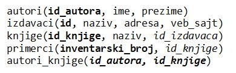

Писање програма у развојном окружењу Visual Studio - практичан рад
==================================================================

.. suggestionnote::

    Следи пример програма у којем се приказује комплетан садржај базе података *Biblioteka_knjige.mdf* у којој имамо пет табела и у којој се чувају подаци о књигама, примерцима, издавачима и ауторима. Ову базу смо креирали раније и детаљно смо са њом упознати.   

Програми се пишу у развојном окружењу *Visual Studio Community* и помоћу програмког језика C#. Сви приказани примери су у вези са табелама које чине део базе података за библиотеку. Следи списак свих табела са колонама. Примарни кључеви су истакнути болд, а страни италик. 

Када се покрене развојно окружење *Visual Studio Community*, потребно је да се креира нови пројекат избором опције *Create a new project*. Изабрани језик треба да буде С#, а врста пројекта *Windows Forms App*, апликација са графичким корисничким интерфејсом. 

У следећем кораку је потребно да се пројекат именује и да се изабере локација на којој ће се пројекат чувати. Може да остане и предложена локација. Кликнути на дугме Create и прелазимо у простор за креирање апликације, тј. програма. 

Први корак је додавање раније креиране базе података новом пројекту. У прозору *Solution Explorer* је потребно да се кликне десни тастер миша над називом пројекта, а затим да се изабере *Add/Existing Item...* са менија који се појави. База података коју смо креирали се већ налази на рачунару и потребно је пронаћи и изабрати фајл *Biblioteka_knjige.mdf* у којем је сачувана. Тачна локација може да се провери у систему *SQL Server Management Studio* у којем смо креирали базу. 

За приказ садржаја табеле из релационе базе података је најбоље да се користи контрола *DataGridView*. Како имамо пет табела, можемо да превучемо из прозора Toolbox пет ових контрола у наш програм, по једну за сваку табелу. Све можемо да их поређамо једну преко друге, а приказиваћемо само ону коју корисник програма изабере да види. 
 
Док радимо на дизајну апликације, у прозору *Properties* увек можемо да одређени *DataGridView* ставимо у фокус чак и ако смо их поређали један на други тако да се не виде сви истовремено.  

За сваки *DataGridView* неопходно је да изаберемо податке који ће бити приказани у оквиру њега. У горњем десном углу постоји мала стрелица која води до падајућег менија *Choose Data Source*. Са падајућег менија изабрати *Add Project Data Source...* У наредна два корака изабрати *Database* и *Dataset*. 

Следећи корак је веома значајан зато што се формира конекција са базом података. Уколико смо већ креирали апликацију која се повезује на ову базу података и означили смо да се сачува конекциони стринг, нећемо морати поново да га формирамо. 

Ако треба да се формира конекција, након што се кликне на дугме *New Connection...*, потребно је да се изабере опција *Microsoft SQL Server Database File*, а затим и да се на рачунару пронађе и дода фајл који садржи базу података. Када се изабере фајл, значајно је да се штиклира опција која приказује конекциони стринг (енг. *connection string*). Тај стринг треба негде запамтити ради употребе у примерима који следе. 

У последњем кораку је потребно изабрати жељену табелу са списка свих објеката који се налазе у бази података на коју смо се повезали. За сваки *DataGridView* изабрати другу табелу. 
Потребно је да додамо и још по једно дугме, контролни *Button*, за сваку табелу коју имамо. У прозору *Properties* изменимо својство *Text* за свако дугме тако да редом пишу називи табела. 

На следећој слици видимо готов дизајн апликације. 

Након што је завршен рад на дизајну и повезивању са базом података, остаје још да додамо програмски код којим ћемо одређени *DataGridView* приказивати кориснику, док ћемо остале сакривати. 

Када се уради двоструки клик на неки део површине апликације који није дугме или *DataGridView*, добијамо простор за писање команди које се извршавају када се апликација покрене. Видимо на следећој слици да је неки програмски код већ генерисан и то је управо код којим се у наш програм учитавају подаци из базе података. 

Потребно је да додамо, након ових наредби, а унутар простора за писање догађаја *Form1_Load*, следеће команде којима се крије свих пет објекта *DataGridView*.

::

    dataGridView1.Visible = false;
    dataGridView2.Visible = false;
    dataGridView3.Visible = false;
    dataGridView4.Visible = false;
    dataGridView5.Visible = false;

На следећој слици се види комплетан програмски код који се извршава приликом покретања програма. 

Потребно је да се вратимо на картицу *Form1.cs [Design]* и да урадимо двоклик на свако дугме, тако да добијемо простор за писање наредби које ће да се изврше када се кликне на одређено дугме. Унутар већ дефинисаног оквира реакције на догађај додајемо наредбе којима једну табелу приказујемо, док остале скривамо. 

Следи комплетан програмски код. 

.. code-block:: Csharp

    {
            dataGridView1.Visible = true;
            dataGridView2.Visible = false;
            dataGridView3.Visible = false;
            dataGridView4.Visible = false;
            dataGridView5.Visible = false;
        }

        private void button2_Click(object sender, EventArgs e)
        {
            dataGridView1.Visible = false;
            dataGridView2.Visible = true;
            dataGridView3.Visible = false;
            dataGridView4.Visible = false;
            dataGridView5.Visible = false;
        }

        private void button3_Click(object sender, EventArgs e)
        {
            dataGridView1.Visible = false;
            dataGridView2.Visible = false;
            dataGridView3.Visible = true;
            dataGridView4.Visible = false;
            dataGridView5.Visible = false;
        }

        private void button4_Click(object sender, EventArgs e)
        {
            dataGridView1.Visible = false;
            dataGridView2.Visible = false;
            dataGridView3.Visible = false;
            dataGridView4.Visible = true;
            dataGridView5.Visible = false;
        }

        private void button5_Click(object sender, EventArgs e)
        {
            dataGridView1.Visible = false;
            dataGridView2.Visible = false;
            dataGridView3.Visible = false;
            dataGridView4.Visible = false;
            dataGridView5.Visible = true;
        }

У прозору *Properties* може да се пронађе фајл *App.config* који је у *XML* формату и у којем може да се пронађе конекциони стринг.  

